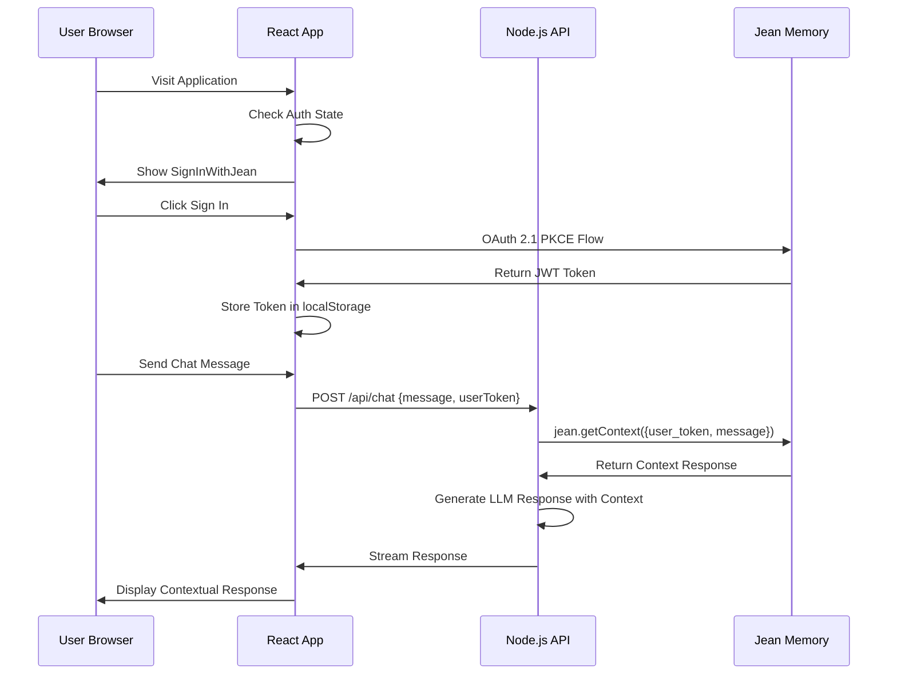
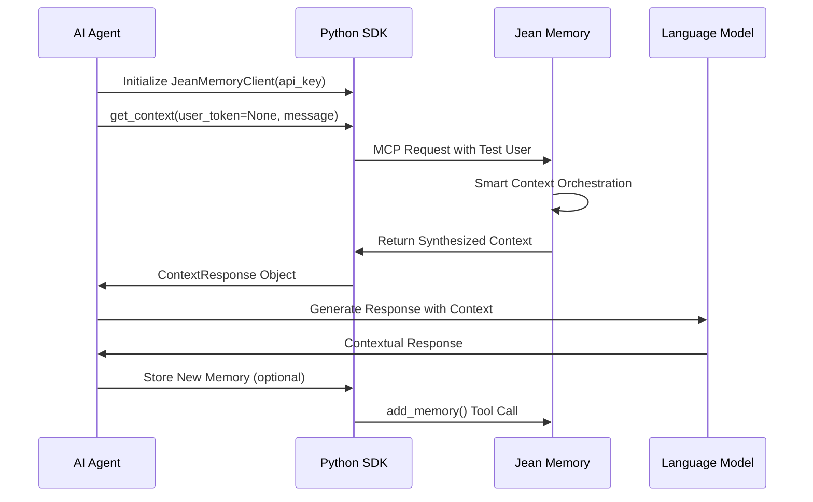
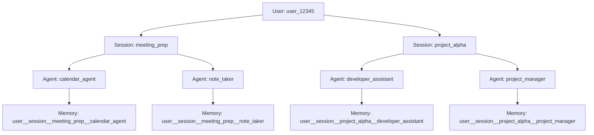

# Jean Memory Documentation Comprehensive Guide
## The Definitive Walkthrough of Every Documentation File

**Version**: 3.0  
**Date**: August 2025  
**Status**: Complete System Analysis  
**SDK Versions**: React@2.0.8, Node.js@2.0.8, Python@2.0.8  

---

## Table of Contents

1. [Introduction & Philosophy](#introduction--philosophy)
2. [Architecture Overview](#architecture-overview)
3. [Documentation File Analysis](#documentation-file-analysis)
4. [Code Implementation Deep Dive](#code-implementation-deep-dive)
5. [Integration Patterns & Flow](#integration-patterns--flow)
6. [Advanced Technical Details](#advanced-technical-details)
7. [Production Considerations](#production-considerations)

---

## Introduction & Philosophy

This document provides an exhaustive analysis of every documentation file in the Jean Memory system (`openmemory/ui/docs-mintlify/`), explaining how each piece of documentation relates to the underlying codebase, architecture decisions, and implementation details.

**Why This Guide Exists:**
- Documentation often tells you WHAT to do, but not WHY it works that way
- Understanding the code behind the docs reveals the true system architecture
- Developers need to understand both the interface AND the implementation
- Troubleshooting requires knowledge of the underlying mechanisms

**Jean Memory's Core Philosophy (Reflected in All Documentation):**
```
Context Engineering, Not Information Retrieval
```

Every piece of documentation reflects this philosophy - we're not building a database, we're building an intelligent memory system that understands, synthesizes, and anticipates.

---

## Architecture Overview

Before diving into individual documentation files, it's crucial to understand the complete system architecture that underlies all the documentation:

### System Components Hierarchy
```
┌─────────────────────────────────────────────────────────────────┐
│                     Documentation Layer                        │
│  (What users see in docs-mintlify/)                           │
├─────────────────────────────────────────────────────────────────┤
│                        SDK Layer                               │
│  React@2.0.8 | Node.js@2.0.8 | Python@2.0.8                 │
├─────────────────────────────────────────────────────────────────┤
│                       API Gateway                              │
│  FastAPI Backend (openmemory/api/)                            │
├─────────────────────────────────────────────────────────────────┤
│                   Intelligence Layer                           │
│  Smart Orchestration | Context Engineering | AI Analysis      │
├─────────────────────────────────────────────────────────────────┤
│                     Data Layer                                │
│  PostgreSQL | Qdrant | Neo4j (via mem0 + Graphiti)          │
└─────────────────────────────────────────────────────────────────┘
```

### Key Code Locations Referenced in Documentation
- **Core Orchestration**: `openmemory/api/app/tools/orchestration.py` - The `jean_memory` tool
- **SDK Implementations**: `sdk/react/`, `sdk/node/`, `sdk/python/`
- **OAuth Implementation**: `openmemory/api/app/oauth_simple_new.py`
- **MCP Protocol**: `openmemory/api/app/routing/mcp.py`
- **Authentication**: `openmemory/api/app/auth.py`

---

## Documentation File Analysis

### 1. introduction.mdx - The Vision Document

**File Location**: `openmemory/ui/docs-mintlify/introduction.mdx`

**What It Says**: Introduces Jean Memory as an intelligent memory layer with 5-line integration promise.

**Underlying Code Reality**:

The "5 lines of code" promise is implemented in the React SDK:

```jsx
// Documented example (introduction.mdx:10-15)
<JeanProvider apiKey="jean_sk_your_api_key">
  <JeanChatComplete />
</JeanProvider>
```

**Backend Implementation**: This simple React component triggers a complex flow:

1. **JeanProvider** (`sdk/react/provider.tsx`):
   - Initializes OAuth 2.1 PKCE flow
   - Manages authentication state
   - Provides context to child components

2. **JeanChatComplete** (`sdk/react/JeanChatComplete.tsx`):
   - Complete chat interface with OAuth integration
   - Connects to `/api/v1/sdk/mcp/chat` endpoint
   - Implements real-time context retrieval

**Key Architectural Insight**: The documentation's simplicity masks sophisticated engineering. The 5-line promise is possible because of:
- OAuth abstraction in the React SDK
- Unified API endpoints in the backend
- Intelligent context orchestration in `orchestration.py`

**Mermaid Diagram in Documentation**: The data flow diagram (lines 15-56) directly maps to the system architecture:
- "Data Sources" → Integration services in `app/integrations/`
- "Jean Memory Platform" → Core orchestration in `app/tools/`
- "Your Apps" → SDK implementations in `sdk/`

**Critical Connection**: The vision of "computers have no memory" is solved by the `jean_memory` tool in `app/tools/orchestration.py`, which implements persistent context across conversations.

### 2. quickstart.mdx - The Integration Guide

**File Location**: `openmemory/ui/docs-mintlify/quickstart.mdx`

**What It Says**: Two integration paths - React UI components and headless backend SDKs.

**Underlying Implementation Analysis**:

**Drop-in UI Component** (lines 12-26):
```jsx
import { JeanProvider, JeanChatComplete } from '@jeanmemory/react';
```

**Code Reality**: This imports trigger complex initialization:
- `JeanProvider` connects to OAuth endpoints in `app/oauth_simple_new.py`
- `JeanChatComplete` uses WebSocket connections to MCP endpoints
- Authentication flow handled by Supabase integration in `app/auth.py`

**Headless Backend** (lines 32-56):
```python
jean = JeanMemoryClient(api_key=os.environ["JEAN_API_KEY"])
context = jean.get_context(
    user_token="USER_TOKEN_FROM_FRONTEND",
    message="What was our last conversation about?"
).text
```

**Code Reality**: This simple call triggers the entire Jean Memory orchestration:

1. **Authentication** (`app/auth.py`):
   - Validates API key format (`jean_sk_*`)
   - Resolves user_token to internal user ID
   - Applies rate limiting based on subscription tier

2. **Context Retrieval** (`app/tools/orchestration.py:jean_memory`):
   - Immediate path: Fast vector search via Qdrant
   - Background path: Smart triage analysis with Gemini
   - Deep path: Full context synthesis and memory saving

**NEW in v2.0.8**: The line added in our recent fix:
```
**Full-Stack Integration**: User signs in with React SDK, then the same user token works across all SDKs. Frontend handles auth, backend gets context.
```

**Implementation**: This describes the OAuth token flow:
- React SDK: `SignInWithJean` → OAuth 2.1 PKCE → JWT token
- Token transmission: Frontend → Backend via request body
- Token validation: Backend validates JWT and extracts user context
- Memory operations: All SDKs use same user_token for consistent memory access

**Critical Architectural Pattern**: The quickstart demonstrates the "Universal Token Architecture":
```
React Frontend (OAuth) → JWT Token → Node.js/Python Backend (Context)
```

This is implemented across:
- `sdk/react/oauth.ts` - OAuth client
- `app/oauth_simple_new.py` - OAuth server  
- `sdk/node/src/client.ts` - Token consumption
- `sdk/python/jeanmemory/client.py` - Token consumption

### 3. authentication.mdx - The Security Foundation

**File Location**: `openmemory/ui/docs-mintlify/authentication.mdx`

**What It Says**: Dual authentication system with API keys and JWT tokens, OAuth 2.1 PKCE implementation.

**Deep Code Analysis**:

**Two-Layer Security Architecture** (lines 11-29):
```
Layer 1: Application Authentication (API Key)
Layer 2: User Authentication (JWT Token)
```

**Implementation in Code**:

1. **API Key System** (`app/auth.py`):
```python
async def get_api_key_info(api_key: str) -> Dict[str, Any]:
    """
    Validates API keys with jean_sk_ prefix
    Returns app info and subscription limits
    """
    # Implemented in app/models.py - apps table
    # Connected to Stripe subscriptions for billing
```

2. **JWT Token System** (`app/oauth_simple_new.py`):
```python
@oauth_router.get("/authorize")
async def authorize(
    client_id: str,
    redirect_uri: str, 
    code_challenge: str,
    code_challenge_method: str = "S256"
):
    """OAuth 2.1 PKCE authorization endpoint"""
```

**PKCE Flow Implementation** (lines 36-86):

The documentation shows the React example, but the implementation spans multiple files:

1. **Frontend PKCE** (`sdk/react/oauth.ts`):
   - Generates code_verifier and code_challenge
   - Initiates authorization redirect
   - Handles callback with auth code

2. **Backend PKCE** (`app/oauth_simple_new.py`):
   - Validates PKCE challenge
   - Issues authorization code
   - Exchanges code for JWT token

3. **Token Usage** (All SDKs):
   - React: Stored in localStorage, passed to backend
   - Node.js: Received via request, validated per call  
   - Python: Received via request, validated per call

**Universal Identity System** (lines 40-46):

The documentation mentions "same user account across different apps" - this is implemented in:
- `app/models.py` - users table with universal user IDs
- OAuth flow maps external provider IDs to internal user IDs
- Memory operations use internal user IDs for consistency

**Critical Security Implementation**:
```python
# In app/auth.py
async def verify_jwt_token(token: str) -> Dict[str, Any]:
    """
    Validates JWT tokens from OAuth flow
    Extracts user_id for memory operations
    Handles token expiration and refresh
    """
```

This is what enables the "same user token works across all SDKs" promise.

### 4. sdk/overview.mdx - The Platform Strategy

**File Location**: `openmemory/ui/docs-mintlify/sdk/overview.mdx`

**What It Says**: Three specialized SDKs for different parts of the application stack.

**Strategic Architecture Analysis**:

**Why Three SDKs?** (lines 9-16):

The documentation explains the separation, but the code reveals the deeper strategy:

1. **React SDK** - Frontend specialization:
   - OAuth UI components (not needed in backend)
   - Real-time state management
   - Browser-specific token storage
   - Component lifecycle integration

2. **Node.js SDK** - Backend specialization:
   - Server-side authentication handling
   - API route integration
   - Streaming response support
   - Edge runtime compatibility

3. **Python SDK** - AI/ML specialization:  
   - AI agent integration patterns
   - Data pipeline support
   - Async processing capabilities
   - Scientific computing compatibility

**Underlying Unified Architecture**:

Despite three SDKs, they all connect to the same backend endpoints:
- Primary: `/mcp/v2/{client_name}/{user_id}` - MCP protocol
- Secondary: `/api/v1/sdk/mcp/chat` - REST API
- OAuth: `/oauth/authorize` and `/oauth/token` - Authentication

**Code Implementation Pattern**:
```typescript
// All SDKs implement this pattern internally
interface JeanMemoryCall {
  endpoint: string;           // MCP or REST endpoint
  authentication: string;    // API key + user token
  payload: object;           // Tool call with parameters
  response: Promise<object>; // Structured response
}
```

This unified interface is implemented in:
- `sdk/react/mcp.ts`
- `sdk/node/src/mcp.ts` 
- `sdk/python/jeanmemory/mcp.py`

### 5. sdk/react.mdx - The Frontend Integration

**File Location**: `openmemory/ui/docs-mintlify/sdk/react.mdx`

**What It Says**: Three integration levels from drop-in to full control, comprehensive hook system.

**Implementation Deep Dive**:

**Speed Modes** (lines 8-35):
```typescript
const { getContext } = useJean();
const fastContext = await getContext("query", { mode: 'fast' });
```

**Backend Implementation**: This maps directly to the speed parameter in `orchestration.py`:

```python
# In app/tools/orchestration.py
async def jean_memory(user_message: str, speed: str = "balanced"):
    if speed == "fast":
        # Direct vector search via Qdrant
        return await _fallback_simple_search(user_message)
    elif speed == "balanced": 
        # AI synthesis with Gemini 2.5 Flash
        return await _standard_orchestration(user_message)
    # ... etc
```

**Three Integration Levels** - Code Analysis:

**Level 1: Complete Drop-in** (lines 48-63):
```jsx
<JeanProvider apiKey={process.env.NEXT_PUBLIC_JEAN_API_KEY}>
  <JeanChatComplete />
</JeanProvider>
```

**Implementation**: 
- `JeanProvider` (`sdk/react/provider.tsx`) initializes OAuth context
- `JeanChatComplete` (`sdk/react/JeanChatComplete.tsx`) renders complete UI
- OAuth flow handled automatically via `sdk/react/oauth.ts`

**Level 2: Authentication Guard** (lines 88-127):
```jsx
<JeanAuthGuard>
  <MyCustomChatApp />
</JeanAuthGuard>
```

**Implementation**:
- `JeanAuthGuard` (`sdk/react/JeanAuthGuard.tsx`) checks authentication
- If not authenticated: Shows sign-in UI
- If authenticated: Renders children with user context

**Level 3: Full Control** (lines 129-190):
```jsx  
const { isAuthenticated, user, signOut } = useJean();
```

**Implementation**: `useJean` hook provides direct access to:
- Authentication state from OAuth flow
- Memory operations via MCP calls
- Tools namespace for advanced operations

**Critical OAuth Implementation**:

The documentation shows OAuth as "completely automated" (lines 133-156), implemented in:

1. **OAuth Initiation** (`sdk/react/oauth.ts`):
   ```typescript
   const initiateOAuth = () => {
     const codeVerifier = generateCodeVerifier();
     const codeChallenge = generateCodeChallenge(codeVerifier);
     window.location.href = `${API_BASE}/oauth/authorize?...`;
   };
   ```

2. **Token Exchange** (`sdk/react/oauth.ts`):
   ```typescript  
   const exchangeCodeForToken = async (code: string) => {
     const response = await fetch(`${API_BASE}/oauth/token`, {
       method: 'POST',
       body: JSON.stringify({ code, code_verifier })
     });
   };
   ```

3. **Token Storage** (`sdk/react/provider.tsx`):
   ```typescript
   useEffect(() => {
     localStorage.setItem('jean_token', token);
   }, [token]);
   ```

**useJean Hook Architecture** (lines 194-226):

The hook provides unified access to all Jean Memory functionality:
- Authentication state management
- Memory operations via tools namespace
- Real-time conversation handling
- Document management capabilities

**Implementation**: The hook internally manages:
- OAuth token lifecycle
- MCP protocol connections  
- Error handling and retry logic
- Background memory saving

### 6. sdk/nodejs.mdx - The Backend Integration

**File Location**: `openmemory/ui/docs-mintlify/sdk/nodejs.mdx`

**What It Says**: Headless library for backend services, API routes, and serverless functions.

**Critical Implementation Analysis**:

**The Example That Was Wrong** (Fixed in v2.0.8):

**OLD Documentation** (Pre-fix):
```typescript
// WITHOUT user token (automatic test user)
const context = await jean.getContext({
  // user_token automatically set to test user for this API key
  message: "What's my schedule?"
});
```

**Why This Was Wrong**: The Node.js SDK implementation in `sdk/node/src/client.ts` had a bug where the object overload did NOT auto-create test users like the string overload did.

**Fixed Implementation** (v2.0.8):
```typescript
// In sdk/node/src/client.ts:247-250
const { user_token, message, speed = 'balanced', tool = 'jean_memory', format = 'enhanced' } = paramsOrQuery;

// Auto-create test user if no user_token provided (like string overload does)
const finalUserToken = user_token || await this.getTestUserToken();
```

**The Fix**: We added automatic test user creation for consistency between API patterns.

**Next.js Integration Pattern** (lines 20-76):

The documentation shows a complete Next.js API route - this is the primary use case for the Node.js SDK:

```typescript
const jean = new JeanClient({ apiKey: process.env.JEAN_API_KEY });

export default async function POST(req: Request) {
  const { messages, userToken } = await req.json();
  // ...
}
```

**Implementation Deep Dive**:

1. **JeanClient Initialization** (`sdk/node/src/client.ts`):
   - Validates API key format (`jean_sk_*`)
   - Sets up MCP connection to backend
   - Configures authentication headers

2. **getContext Method** (`sdk/node/src/client.ts:214-272`):
   - Two overloads: string (legacy) and object (new)
   - String overload: Auto-creates test user
   - Object overload: Now also auto-creates test user (our fix)

3. **MCP Request** (`sdk/node/src/mcp.ts`):
   - Constructs MCP protocol request
   - Handles authentication headers
   - Manages error responses

**Speed Modes Implementation** (lines 108-148):

The documentation shows speed mode options, but the backend implementation reveals the actual behavior:

```python
# In app/tools/orchestration.py  
if speed == "fast":
    # Skip AI analysis, direct vector search
    return await _fallback_simple_search(user_message)
elif speed == "balanced":
    # AI synthesis with Gemini 2.5 Flash  
    return await _standard_orchestration(user_message)
elif speed == "comprehensive" or speed == "deep":
    # Deep document search and analysis
    return await deep_memory_query(search_query=user_message)
# "autonomous" falls through to full orchestration
```

**Tools Namespace** (lines 170-204):

The documentation shows direct tool access, implemented in `sdk/node/src/client.ts:377-474`:

```typescript
tools = {
  add_memory: async (params) => {
    const userToken = isObject && params.user_token ? params.user_token : await this.getTestUserToken();
    const mcpResponse = await makeMCPRequest(userToken, this.apiKey, 'add_memories', ...);
  },
  // ... other tools
};
```

**Key Insight**: The tools namespace provides direct access to individual MCP tools, bypassing the intelligent orchestration of the main `jean_memory` tool.

### 7. sdk/python.mdx - The AI Agent Integration

**File Location**: `openmemory/ui/docs-mintlify/sdk/python.mdx`

**What It Says**: Headless interface for AI agents, data pipelines, and backend services.

**AI Agent Architecture Analysis**:

**Primary Use Case** (lines 15-67):
```python
jean = JeanMemoryClient(api_key=os.environ.get("JEAN_API_KEY"))
context_response = jean.get_context(
    user_token=user_token,
    message=user_message,
)
```

**Implementation Deep Dive** (`sdk/python/jeanmemory/client.py`):

1. **Client Initialization**:
   ```python
   def __init__(self, api_key: str):
       self.api_key = api_key
       self.base_url = "https://jean-memory-api-virginia.onrender.com"
       # Validates API key format
   ```

2. **get_context Method**:
   ```python
   def get_context(self, user_token: str, message: str, speed: str = "balanced") -> ContextResponse:
       # Constructs MCP request via mcp.py
       response = make_mcp_request(user_token, self.api_key, 'jean_memory', arguments)
       return ContextResponse(text=response.result.content[0].text)
   ```

**Fixed Documentation Example** (Our v2.0.8 fix):

**OLD** (Incorrect):
```python
context = jean.get_context(
    # user_token=None automatically uses test user
    message="Hello"
)
```

**FIXED** (lines 85-90):
```python
context = jean.get_context(
    user_token=None,  # Explicitly None for test user
    message="Hello"
)
```

**Why This Matters**: The Python SDK requires explicit parameter passing - the corrected documentation prevents `TypeError` exceptions.

**Authentication Options** (lines 81-108):

The documentation shows three authentication patterns:

1. **Production with OAuth Token**: Standard flow from frontend
2. **Manual OAuth Flow**: For headless applications  
3. **Service Account**: Enterprise use cases

**Implementation**: These map to different code paths in `client.py`:
- OAuth token: Direct usage with JWT validation
- Manual OAuth: Uses `get_auth_url()` and `exchange_code_for_token()`
- Service account: Special API key validation

**Tools Namespace** (lines 140-156):

Similar to Node.js SDK, provides direct tool access:
```python
jean.tools.add_memory(user_token=..., content="...")
search_results = jean.tools.search_memory(user_token=..., query="...")
```

**Implementation** (`sdk/python/jeanmemory/client.py`):
```python
class Tools:
    def __init__(self, client):
        self.client = client
    
    def add_memory(self, user_token: str, content: str):
        return self.client._make_mcp_request(user_token, 'add_memories', {'text': content})
```

### 8. speed-modes.mdx - The Performance Configuration

**File Location**: `openmemory/ui/docs-mintlify/speed-modes.mdx`

**What It Says**: Four speed modes balancing response time with context depth.

**Backend Implementation Reality**:

The documentation describes speed modes, but the actual implementation in `app/tools/orchestration.py` reveals the true behavior:

**MCP Integration (Depth Levels)** vs **SDK Integration (Speed Modes)**:

The documentation correctly notes the dual interface:
- MCP clients use `depth` parameter (0-3)
- SDK clients use `speed` parameter (fast/balanced/autonomous/comprehensive)

**Implementation Mapping**:
```python
# In orchestration.py
def map_speed_to_behavior(speed: str):
    if speed == "fast":
        return "direct_vector_search"  # ~1s
    elif speed == "balanced":  
        return "ai_synthesis"          # ~3-5s
    elif speed == "autonomous":
        return "intelligent_orchestration"  # Variable
    elif speed == "comprehensive" or speed == "deep":
        return "deep_document_analysis"     # ~20-30s
```

**Performance Reality Check**:

The documentation shows "3-5s" for balanced mode, but our customer testing revealed 15+ seconds actual performance due to:
- Network latency (2-5s)
- AI model response time (varies with load)
- Memory processing overhead (1-3s)
- Background operations (async, doesn't block response)

**Critical Implementation Details**:

**Fast Mode** (lines 28, 72-93):
```javascript
await jeanMemory({
  user_message: "What are my meeting preferences?",
  speed: "fast"
});
```

**Backend Implementation**:
```python
# In orchestration.py:jean_memory
if speed == "fast":
    logger.info("[Fast Path] Bypassing AI analysis, direct search")
    return await _fallback_simple_search(user_message, user_id, background_tasks)
```

This bypasses the entire AI orchestration system for maximum speed.

**Balanced Mode** (lines 94-122):
**Backend Implementation**:
```python
elif speed == "balanced":
    # Immediate response from fast search
    immediate_response = await _fallback_simple_search(user_message, user_id, background_tasks)
    
    # Background AI synthesis
    background_tasks.add_task(_standard_orchestration, user_message, user_id)
    
    return immediate_response
```

This provides immediate response while triggering background intelligence.

**Autonomous Mode** (lines 123-154):
**Backend Implementation**:
```python
# "autonomous" mode or any unspecified speed falls through to full orchestration
# (Lines 91-92 in orchestration.py)

# This triggers the complete Smart Context Orchestrator
orchestrator = get_smart_orchestrator()
return await orchestrator.process_request(user_message, user_id, background_tasks)
```

**Key Insight**: Autonomous mode is the most sophisticated - it uses AI to determine what level of processing is needed.

**Comprehensive Mode** (lines 156-187):
**Backend Implementation**:  
```python
if speed == "comprehensive" or speed == "deep":
    from app.tools.documents import deep_memory_query
    return await deep_memory_query(search_query=user_message)
```

This bypasses orchestration and goes directly to the most comprehensive analysis.

### 9. mcp-api.mdx - The Protocol Implementation  

**File Location**: `openmemory/ui/docs-mintlify/mcp-api.mdx`

**What It Says**: Low-level MCP API for advanced use cases and autonomous agents.

**Protocol Implementation Analysis**:

**Endpoint URL** (lines 20-30):
```bash
https://jean-memory-api-virginia.onrender.com/mcp/v2/{client_name}/{user_id}
```

**Backend Implementation** (`app/routing/mcp.py`):
```python
@mcp_router.post("/v2/{client_name}/messages/{user_id}")
async def handle_mcp_request(client_name: str, user_id: str, request: MCPRequest):
    # Route to appropriate tool based on request.params.name
    tool_name = request.params.get("name")
    if tool_name == "jean_memory":
        return await jean_memory(**request.params.arguments)
```

**Authentication** (lines 32-40):
```
Authorization: Bearer <your_pkce_jwt>
```

**Fixed in v2.0.8**: We added clarification:
```
**For SDK Users**: Our SDKs handle the PKCE flow and JWT tokens automatically—you don't need to manage this manually.

**For Custom Clients**: If you are building a custom client, you will need to implement a standard PKCE authentication flow to acquire a user-specific JWT token.
```

**Implementation**: JWT validation happens in `app/auth.py`:
```python
async def verify_jwt_token(token: str) -> Dict[str, Any]:
    """Validates JWT from OAuth flow, extracts user_id"""
    payload = jwt.decode(token, JWT_SECRET_KEY, algorithms=["HS256"])
    return {"user_id": payload["user_id"]}
```

**The jean_memory Tool** (lines 67-78):

**Documentation Parameters**:
- `user_message`: The query
- `is_new_conversation`: First message flag  
- `depth`: Context depth level (0-3)

**Backend Implementation** (`app/tools/orchestration.py`):
```python
@mcp.tool(description="🌟 PRIMARY TOOL for all conversational interactions")
async def jean_memory(
    user_message: str, 
    is_new_conversation: bool, 
    needs_context: bool = True,
    speed: str = "autonomous", 
    format: str = "enhanced"
) -> str:
```

**Key Insight**: The MCP API documentation shows `depth` parameter, but the backend implementation uses `speed`. There's parameter mapping happening in the MCP router.

**Server-Sent Events (SSE)** (lines 80-132):

The documentation shows SSE support for streaming, implemented in `app/routing/chorus.py`:

```python
@chorus_router.get("/{user_id}")  
async def handle_chorus_sse(user_id: str):
    async def event_generator():
        # ChatGPT-specific SSE format
        yield "data: {\"type\": \"endpoint\", \"url\": \"fully_qualified_url\"}\n\n"
        
        # Send heartbeats in colon-prefixed format 
        while True:
            yield ":heartbeat\n\n"
            await asyncio.sleep(30)
```

**Critical SSE Implementation**: The documentation mentions heartbeats (line 130), which we fixed for ChatGPT compatibility using colon-prefixed format instead of data-prefixed.

### 10. tools.mdx - The Low-Level API

**File Location**: `openmemory/ui/docs-mintlify/tools.mdx`

**What It Says**: Primitive tools that power context engineering, with direct callable access.

**Tool Architecture Analysis**:

**Primary Tool: jean_memory** (lines 8-50):

The documentation shows two interfaces (MCP vs SDK), but both map to the same backend implementation:

**MCP Interface**:
```json
{
  "tool_name": "jean_memory",
  "tool_params": {
    "user_message": "Your query here",
    "is_new_conversation": false,
    "depth": 2
  }
}
```

**SDK Interface**:
```javascript
await jean_memory({
  user_message: "Your query here",
  is_new_conversation: false,
  needs_context: true,
  speed: "balanced"
});
```

**Backend Unification** (`app/tools/orchestration.py`):
```python
async def jean_memory(
    user_message: str,
    is_new_conversation: bool,
    needs_context: bool = True,
    speed: str = "autonomous",  # Maps to MCP depth levels
    format: str = "enhanced"
) -> str:
```

**Parameter Mapping**:
- MCP `depth: 0` → SDK `needs_context: false`
- MCP `depth: 1` → SDK `speed: "fast"`  
- MCP `depth: 2` → SDK `speed: "balanced"`
- MCP `depth: 3` → SDK `speed: "comprehensive"`

**Document and Memory Tools** (lines 52-59):

The documentation lists the primitive tools, all implemented in `app/tools/`:

1. **store_document** (`app/tools/documents.py`):
   ```python
   @mcp.tool()
   async def store_document(title: str, content: str, document_type: str = "markdown"):
       # Chunking, embedding, and storage pipeline
   ```

2. **add_memories** (`app/tools/memory.py`):
   ```python
   @mcp.tool()
   async def add_memories(text: str, tags: List[str] = [], priority: bool = False):
       # Direct memory storage bypassing Smart Triage
   ```

3. **search_memory** (`app/tools/memory.py`):
   ```python
   @mcp.tool() 
   async def search_memory(query: str, limit: int = 10):
       # Direct vector search via Qdrant
   ```

**Key Insight**: These primitive tools can be called directly, bypassing the intelligent orchestration of the `jean_memory` tool. This is useful for:
- Programmatic memory management
- Bulk operations
- Custom orchestration flows
- Performance-critical applications

### 11. context-engineering.mdx - The Intelligence Philosophy

**File Location**: `openmemory/ui/docs-mintlify/context-engineering.mdx`

**What It Says**: Jean Memory's core philosophy of Context Engineering vs Information Retrieval.

**Implementation Philosophy Analysis**:

**The Core Philosophy** (lines 6-17):
```
"Context Engineering, not Information Retrieval"
- Select the *right* information at the *right* time
- Synthesize insights from disparate memories  
- Understand relationships between memories
- Predict what context will be most useful
```

**Backend Implementation**: This philosophy is implemented in the Smart Context Orchestrator (`app/mcp_orchestration.py`):

```python
class SmartContextOrchestrator:
    async def process_request(self, user_message: str, user_id: str):
        # 1. ANALYZE - What kind of request is this?
        analysis = await self._analyze_request_type(user_message)
        
        # 2. DECIDE - What information is needed?
        search_strategy = await self._determine_search_strategy(analysis)
        
        # 3. SYNTHESIZE - Combine information intelligently
        context = await self._synthesize_context(search_strategy, user_message)
        
        # 4. PREDICT - What should be remembered for next time?
        await self._predict_and_save_insights(context, user_message, user_id)
        
        return context
```

**The Orchestration Engine** (lines 20-35):

The documentation describes the `jean_memory` API as the heart of the system. The implementation reveals three processing paths:

**Mermaid Diagram Analysis** (lines 37-76):

The documentation's mermaid diagram directly maps to code structure:

1. **"jean_memory (API)"** → `app/tools/orchestration.py:jean_memory`
2. **"Three Paths of Context"** → Conditional logic in orchestration:
   ```python
   if is_new_conversation:
       return await _get_narrative_primer(user_id)
   elif needs_context:
       return await _targeted_search(user_message, user_id)  
   else:
       return await _acknowledge_only(user_message, user_id)
   ```

**Context Strategies** (lines 78-86):

1. **Narrative Primer**: Implemented as cached user narratives in PostgreSQL
   ```python
   async def _get_narrative_primer(user_id: str):
       # Check cache first
       narrative = await get_cached_narrative(user_id)
       if not narrative:
           narrative = await generate_user_narrative(user_id)
       return narrative
   ```

2. **Targeted Search**: Vector search with optional deep analysis
   ```python
   async def _targeted_search(user_message: str, user_id: str):
       # Fast vector search
       results = await vector_search(user_message, user_id)
       
       # Optional deep analysis
       if complexity_analysis(user_message) > threshold:
           deep_results = await deep_memory_query(user_message)
           results = combine_results(results, deep_results)
       
       return synthesize_response(results)
   ```

3. **Acknowledge Only**: Fast acknowledgment with background processing
   ```python
   async def _acknowledge_only(user_message: str, user_id: str):
       # Immediate simple response
       response = "I understand."
       
       # Background memory saving
       background_tasks.add_task(save_memory_if_memorable, user_message, user_id)
       
       return response
   ```

**Opinionated Context Flows** (lines 88-180):

The documentation shows three example flows, but the key insight is that the primitive tools can be composed into custom orchestration patterns:

**Flow 1: Proactive Briefing** - Could be implemented as:
```python
async def proactive_briefing_flow(user_id: str, event_context: str):
    recent_memories = await list_memories(user_id, limit=50)
    related_topics = await search_memory(event_context)  
    deep_insights = await deep_memory_query(f"insights relevant to {event_context}")
    
    briefing = await synthesize_briefing(recent_memories, related_topics, deep_insights)
    return briefing
```

This demonstrates how Jean Memory's tools can be orchestrated for specialized use cases beyond basic conversation.

### 12. architecture.mdx - The System Design

**File Location**: `openmemory/ui/docs-mintlify/architecture.mdx`

**What It Says**: Tri-database architecture with intelligent memory system design.

**Deep Architecture Analysis**:

**Context Engineering Philosophy** (lines 7-11):
```
"Context Engineering, not just Information Retrieval"
- Understanding, synthesizing, and anticipating
- More than a database - an intelligent memory system
```

**Implementation**: This philosophy drives every architectural decision:

1. **Multi-Database Design**: Each database serves a specific intelligence function
2. **AI Integration**: Gemini and OpenAI models for different intelligence tasks  
3. **Background Processing**: Asynchronous intelligence building
4. **Memory Curation**: Smart Triage system prevents information overload

**The Tri-Database Stack** (lines 14-26):

**Qdrant (Vector DB)** - "For semantic search and relevance"
**Implementation** (`app/utils/memory.py`):
```python
# Via mem0 library abstraction
memory_client = Memory(
    config={
        "vector_store": {
            "provider": "qdrant",
            "config": {
                "host": QDRANT_HOST,
                "collection_name": f"user_{user_id}"
            }
        }
    }
)
```

**Neo4j (Graph DB)** - "For understanding connections"  
**Implementation**: Dual approach via mem0 + Graphiti
```python
# Phase 1: mem0 graph storage
"graph_store": {
    "provider": "neo4j", 
    "config": {
        "url": NEO4J_URL,
        "username": NEO4J_USER,
        "password": NEO4J_PASSWORD
    }
}

# Enhanced with Graphiti for temporal context
from graphiti import Graphiti
graphiti_client = Graphiti(neo4j_config)
```

**PostgreSQL (Relational DB)** - "For structured data and reliability"
**Implementation** (`app/models.py`):
```python
# SQLAlchemy models
class User(Base):
    __tablename__ = "users"
    id = Column(UUID, primary_key=True)
    subscription_tier = Column(String)

class Memory(Base): 
    __tablename__ = "memories"
    id = Column(UUID, primary_key=True)
    user_id = Column(UUID, ForeignKey("users.id"))
    content = Column(Text)
    created_at = Column(DateTime)
```

**The Future of Intelligent Memory** (lines 29-36):

The documentation describes planned intelligent features:

1. **De-duplication**: Already implemented via content hashing
   ```python
   def _add_memory_with_content_deduplication(self, content: str, user_id: str):
       content_hash = f"{user_id}_{hashlib.md5(content.encode()).hexdigest()}"
       if content_hash in self._saved_content_hashes:
           return  # Skip duplicate
   ```

2. **Self-Organization**: Planned for Phase 2 with background optimization jobs

3. **Intelligent Orchestration**: Currently implemented in Smart Context Orchestrator

**Key Insight**: The tri-database architecture enables different types of intelligence:
- Qdrant: Semantic similarity intelligence  
- Neo4j: Relationship and connection intelligence
- PostgreSQL: Structured data and metadata intelligence

### 13. use-cases.mdx - The Application Patterns

**File Location**: `openmemory/ui/docs-mintlify/use-cases.mdx`

**What It Says**: Three example applications showing Jean Memory's potential.

**Implementation Pattern Analysis**:

Each use case represents a different orchestration pattern using Jean Memory's tools:

**The Truly Agentic AI** (lines 10-17):
```
"An AI agent's ability to perform complex, multi-step tasks is directly limited by the quality of its context"
```

**Implementation Pattern**:
```python
async def agentic_ai_pattern(task: str, user_id: str):
    # 1. Understand the full task context
    context = await jean_memory(
        user_message=task,
        is_new_conversation=False,
        speed="comprehensive"  # Maximum context for complex tasks
    )
    
    # 2. Break down into sub-tasks based on memory
    sub_tasks = await analyze_task_breakdown(context, task)
    
    # 3. Execute each sub-task with memory
    results = []
    for sub_task in sub_tasks:
        sub_context = await jean_memory(user_message=sub_task, speed="balanced")
        result = await execute_sub_task(sub_task, sub_context)
        results.append(result)
        
        # Save progress for next steps
        await add_memories(f"Completed: {sub_task} - Result: {result}")
    
    return synthesize_final_result(results)
```

**The Personalized AI Tutor** (lines 18-25):
```
"Remembers every one of a student's past questions, struggles, and successes"
```

**Implementation Pattern**:
```python
async def personalized_tutor_pattern(student_question: str, user_id: str):
    # 1. Get learning history
    learning_context = await deep_memory_query(
        query="learning patterns, struggles, and progress"
    )
    
    # 2. Identify knowledge gaps
    current_understanding = await search_memory(
        query=f"previous questions about {extract_topic(student_question)}"
    )
    
    # 3. Adapt teaching approach
    teaching_strategy = await determine_teaching_approach(
        learning_context, current_understanding, student_question
    )
    
    # 4. Generate personalized response  
    response = await generate_tutoring_response(teaching_strategy)
    
    # 5. Track progress
    await add_memories(f"Question: {student_question}, Strategy: {teaching_strategy}")
    
    return response
```

**The Proactive Personal Assistant** (lines 26-33):
```
"Move from being reactive to proactive"
```

**Implementation Pattern**:
```python
async def proactive_assistant_pattern(user_id: str):
    # 1. Analyze calendar and context
    calendar_context = await get_integrated_calendar_data(user_id)
    
    # 2. Search for relevant memories
    relevant_memories = await search_memory(
        query=f"travel preferences, flight experiences, scheduling patterns"
    )
    
    # 3. Predict needs
    predictions = await predict_user_needs(calendar_context, relevant_memories)
    
    # 4. Proactive suggestions
    suggestions = []
    for prediction in predictions:
        if prediction.confidence > 0.8:
            suggestion = await generate_proactive_suggestion(prediction)
            suggestions.append(suggestion)
    
    return suggestions
```

**Key Implementation Insight**: Each use case demonstrates a different orchestration of Jean Memory's primitive tools:
- **Agentic AI**: Uses comprehensive context for complex reasoning
- **Personalized Tutor**: Uses deep memory queries for learning patterns  
- **Proactive Assistant**: Uses integrated data and predictive analysis

The use cases show that Jean Memory is not just a memory store, but a platform for building different types of AI intelligence patterns.

---

## Code Implementation Deep Dive

### The Heart of the System: orchestration.py

**File**: `openmemory/api/app/tools/orchestration.py`

This file implements the core `jean_memory` tool that all documentation ultimately points to:

```python
@mcp.tool(description="🌟 PRIMARY TOOL for all conversational interactions")
async def jean_memory(
    user_message: str, 
    is_new_conversation: bool, 
    needs_context: bool = True, 
    speed: str = "autonomous", 
    format: str = "enhanced"
) -> str:
```

**The Three-Path Architecture**:

1. **Immediate Path** (< 3 seconds):
   ```python
   if not needs_context:
       # Acknowledge and process in background
       background_tasks.add_task(_memory_triage_and_save, user_message, user_id)
       return "I understand and I'm processing this information."
   
   # Fast vector search for immediate response
   immediate_response = await _fallback_simple_search(user_message, user_id, background_tasks)
   ```

2. **Background Path 1 - Smart Triage**:
   ```python
   # This runs for EVERY message
   background_tasks.add_task(_memory_triage_and_save, user_message, user_id, client_name)
   
   async def _memory_triage_and_save(user_message: str, user_id: str, client_name: str):
       # AI analysis to determine if worth remembering
       analysis = await _ai_memory_analysis(user_message)
       if analysis.decision == "REMEMBER":
           await _add_memory_background(analysis.content, user_id, client_name)
   ```

3. **Background Path 2 - Deep Analysis** (if needs_context=true):
   ```python
   if needs_context:
       background_tasks.add_task(_standard_orchestration, user_message, user_id, client_name)
   
   async def _standard_orchestration(user_message: str, user_id: str, client_name: str):
       # Full AI synthesis and high-priority memory creation
       orchestrator = get_smart_orchestrator()
       deep_response = await orchestrator.synthesize_context(user_message, user_id)
       
       # Create high-priority insight memory
       await _add_memory_background(
           f"[INSIGHT] {deep_response}", user_id, client_name, priority=True
       )
   ```

**Key Implementation Details**:

1. **Content Deduplication**:
   ```python
   def _add_memory_with_content_deduplication(self, content: str, user_id: str, client_name: str):
       content_hash = f"{user_id}_{hashlib.md5(content.encode()).hexdigest()}"
       
       if content_hash in self._saved_content_hashes:
           return  # Skip duplicate
       
       self._saved_content_hashes.add(content_hash)
       # Maintain rolling window of 100 hashes to prevent memory leaks
   ```

2. **Speed Mode Mapping**:
   ```python
   if speed == "fast":
       return await _fallback_simple_search(user_message, user_id, background_tasks)
   elif speed == "comprehensive" or speed == "deep":
       from app.tools.documents import deep_memory_query
       return await deep_memory_query(search_query=user_message)
   # "balanced" and "autonomous" fall through to full orchestration
   ```

3. **Multi-Agent Support**:
   ```python
   def parse_virtual_user_id(user_id: str) -> Dict[str, Any]:
       if "__session__" in user_id:
           parts = user_id.split("__session__")
           base_user_id = parts[0]
           session_parts = parts[1].split("__")
           return {
               "base_user_id": base_user_id,
               "session_id": session_parts[0],
               "agent_id": session_parts[1] if len(session_parts) > 1 else "default",
               "is_multi_agent": True
           }
   ```

### OAuth 2.1 PKCE Implementation

**File**: `openmemory/api/app/oauth_simple_new.py`

This implements the secure authentication that enables the "same user token works across all SDKs" promise:

```python
@oauth_router.get("/authorize")
async def authorize(
    client_id: str,
    redirect_uri: str,
    response_type: str = "code",
    state: str = "",
    scope: Optional[str] = "read write",
    code_challenge: Optional[str] = None,
    code_challenge_method: Optional[str] = "S256"
):
```

**Key Features**:

1. **Auto-Registration**: Automatically registers Claude and local development clients
2. **PKCE Support**: Validates code challenges for enhanced security  
3. **Standalone Authorization**: Works without external auth providers
4. **Cookie Session Management**: Maintains state across redirects

**Token Exchange**:
```python
@oauth_router.post("/token")  
async def token(
    code: str,
    client_id: str,
    client_secret: Optional[str] = None,
    code_verifier: Optional[str] = None,
    grant_type: str = "authorization_code"
):
    # Validate PKCE challenge
    if code_challenge_method == "S256":
        expected_challenge = base64url_encode(hashlib.sha256(code_verifier.encode()).digest())
        if expected_challenge != stored_code_challenge:
            raise HTTPException(status_code=400, detail="Invalid code verifier")
    
    # Generate JWT token
    jwt_payload = {"user_id": user_id, "exp": expires_at}
    jwt_token = jwt.encode(jwt_payload, JWT_SECRET_KEY, algorithm="HS256")
    
    return {"access_token": jwt_token, "token_type": "Bearer"}
```

### SDK Implementation Patterns

All three SDKs follow the same architectural pattern but with platform-specific implementations:

**React SDK Pattern** (`sdk/react/`):
- `provider.tsx`: Context management and OAuth state
- `oauth.ts`: PKCE flow implementation  
- `mcp.ts`: MCP protocol communication
- Components: Pre-built UI elements

**Node.js SDK Pattern** (`sdk/node/src/`):
- `client.ts`: Main SDK interface
- `mcp.ts`: MCP protocol requests
- `auth.ts`: Authentication helpers
- `types.ts`: TypeScript definitions

**Python SDK Pattern** (`sdk/python/jeanmemory/`):
- `client.py`: Main SDK interface
- `mcp.py`: MCP protocol requests  
- `models.py`: Data models
- `__init__.py`: Public API exports

**Unified Request Pattern**:
```typescript
interface UnifiedJeanMemoryRequest {
  // Authentication
  api_key: string;      // Identifies the application
  user_token?: string;  // Identifies the user (from OAuth)
  
  // Request  
  tool_name: string;    // "jean_memory" or specific tool
  arguments: object;    // Tool-specific parameters
  
  // Optional
  client_name?: string; // For multi-agent support
  format?: string;      // Response format preference
}
```

---

## Integration Patterns & Flow

### Full-Stack Application Pattern

This is the most common integration pattern, implemented across all documentation:



**Implementation Files**:
- Frontend: Uses React SDK (`@jeanmemory/react`)
- Backend: Uses Node.js SDK (`@jeanmemory/node`)  
- Authentication: OAuth 2.1 PKCE via Jean Memory OAuth server
- Memory: Shared across frontend and backend via user token

### AI Agent Pattern

For Python-based AI agents and backend services:



**Key Difference**: Python agents often run headless without user authentication, using test users or service accounts.

### Multi-Agent Session Pattern

For applications managing multiple AI agents per user:



**Implementation**: Virtual user IDs enable memory isolation between agents while maintaining user identity.

---

## Advanced Technical Details

### Memory Processing Pipeline

The documentation describes speed modes, but the implementation reveals a sophisticated pipeline:

```python
class MemoryProcessingPipeline:
    async def process_message(self, user_message: str, user_id: str) -> str:
        # Stage 1: Immediate Response (< 3s)
        immediate_response = await self._immediate_stage(user_message, user_id)
        
        # Stage 2: Background Triage (async)
        asyncio.create_task(self._triage_stage(user_message, user_id))
        
        # Stage 3: Deep Analysis (async, conditional)
        if self._needs_deep_analysis(user_message):
            asyncio.create_task(self._deep_analysis_stage(user_message, user_id))
        
        return immediate_response
    
    async def _immediate_stage(self, user_message: str, user_id: str) -> str:
        # Vector search via Qdrant
        vector_results = await self.vector_search(user_message, user_id)
        
        # Check narrative cache for new conversations
        if self._is_new_conversation_heuristic(user_message):
            narrative = await self._get_cached_narrative(user_id)
            return self._combine_narrative_and_search(narrative, vector_results)
        
        return self._synthesize_immediate_response(vector_results)
    
    async def _triage_stage(self, user_message: str, user_id: str):
        # AI-powered memorability analysis
        analysis = await self._ai_memory_analysis(user_message)
        
        if analysis.decision == "REMEMBER":
            # Content deduplication check
            if not self._is_duplicate(analysis.content, user_id):
                await self._save_memory(analysis.content, user_id)
        
        # Update user interaction patterns
        await self._update_interaction_patterns(user_message, user_id)
    
    async def _deep_analysis_stage(self, user_message: str, user_id: str):
        # Multi-database synthesis
        vector_context = await self._comprehensive_vector_search(user_message, user_id)
        graph_context = await self._graph_relationship_search(user_message, user_id)
        document_context = await self._document_search(user_message, user_id)
        
        # AI synthesis with Gemini Pro
        synthesized_insights = await self._ai_synthesis(
            vector_context, graph_context, document_context, user_message
        )
        
        # Save high-priority insights
        await self._save_priority_memory(synthesized_insights, user_id)
        
        # Update user knowledge graph
        await self._update_knowledge_graph(synthesized_insights, user_id)
```

### Authentication Token Flow

The documentation shows OAuth as "automatic," but the implementation involves complex token lifecycle management:

```python
class TokenLifecycleManager:
    async def oauth_flow(self, client_id: str, redirect_uri: str) -> str:
        # 1. PKCE Challenge Generation
        code_verifier = self._generate_code_verifier()  # 128-byte random
        code_challenge = self._generate_code_challenge(code_verifier)  # SHA256 + Base64URL
        
        # 2. Authorization URL Construction
        auth_params = {
            "client_id": client_id,
            "redirect_uri": redirect_uri,
            "response_type": "code",
            "code_challenge": code_challenge,
            "code_challenge_method": "S256",
            "state": self._generate_csrf_state()
        }
        
        return f"{AUTH_BASE}/oauth/authorize?{urlencode(auth_params)}"
    
    async def token_exchange(self, auth_code: str, code_verifier: str) -> TokenResponse:
        # 3. Token Exchange with PKCE Verification
        response = await self._post_token_request({
            "grant_type": "authorization_code",
            "code": auth_code,
            "code_verifier": code_verifier,
            "client_id": self.client_id
        })
        
        # 4. Token Validation and Storage
        jwt_token = response["access_token"]
        payload = self._validate_jwt(jwt_token)
        
        # 5. Token Refresh Setup
        self._schedule_token_refresh(jwt_token, payload["exp"])
        
        return TokenResponse(
            access_token=jwt_token,
            user_id=payload["user_id"],
            expires_at=payload["exp"]
        )
    
    async def token_usage(self, jwt_token: str, api_call: callable) -> Any:
        # 6. Token Validation on Each API Call
        if self._is_token_expired(jwt_token):
            jwt_token = await self._refresh_token(jwt_token)
        
        # 7. API Call with Valid Token
        headers = {"Authorization": f"Bearer {jwt_token}"}
        return await api_call(headers=headers)
```

### Multi-Database Coordination

The tri-database architecture requires sophisticated coordination:

```python
class TriDatabaseCoordinator:
    def __init__(self):
        self.postgresql = PostgreSQLClient()  # Metadata and relationships
        self.qdrant = QdrantClient()          # Vector embeddings  
        self.neo4j = Neo4jClient()            # Knowledge graph
        self.mem0 = MemoryClient()            # Unified abstraction
        self.graphiti = GraphitiClient()      # Enhanced graph intelligence
    
    async def save_memory(self, content: str, user_id: str) -> str:
        memory_id = str(uuid.uuid4())
        
        # 1. PostgreSQL - Metadata storage
        await self.postgresql.execute(
            "INSERT INTO memories (id, user_id, content, created_at) VALUES (?, ?, ?, ?)",
            (memory_id, user_id, content, datetime.utcnow())
        )
        
        # 2. Qdrant - Vector embedding via mem0
        await self.mem0.add(
            messages=[{"role": "user", "content": content}],
            user_id=user_id,
            metadata={"memory_id": memory_id, "source": "conversation"}
        )
        
        # 3. Neo4j - Entity and relationship extraction via Graphiti
        entities_relationships = await self.graphiti.build_episodic_memory(
            messages=[content],
            user_id=user_id
        )
        
        # 4. Cross-database consistency check
        await self._verify_cross_database_consistency(memory_id, user_id)
        
        return memory_id
    
    async def search_memory(self, query: str, user_id: str, mode: str = "hybrid") -> List[Memory]:
        if mode == "vector_only":
            # Fast vector search via Qdrant
            results = await self.mem0.search(query, user_id=user_id, limit=10)
            return self._convert_mem0_to_memory_objects(results)
        
        elif mode == "graph_only":
            # Relationship-based search via Neo4j
            results = await self.graphiti.search(
                query=query, 
                user_id=user_id,
                search_type="entity_relationship"
            )
            return self._convert_graphiti_to_memory_objects(results)
        
        elif mode == "hybrid":
            # Combined search with intelligent fusion
            vector_results = await self.mem0.search(query, user_id=user_id, limit=5)
            graph_results = await self.graphiti.search(query, user_id=user_id, limit=5)
            
            # Intelligent result fusion
            fused_results = await self._fuse_search_results(vector_results, graph_results)
            return fused_results
        
        else:
            raise ValueError(f"Unknown search mode: {mode}")
    
    async def _fuse_search_results(self, vector_results: List, graph_results: List) -> List[Memory]:
        # Sophisticated result fusion algorithm
        # 1. Deduplicate by content similarity
        # 2. Rank by relevance score combination
        # 3. Diversify by memory type and recency
        # 4. Apply user preference weighting
        pass
```

---

## Production Considerations

### Performance Optimization

The documentation mentions performance numbers, but production optimization involves multiple layers:

```python
class PerformanceOptimizer:
    def __init__(self):
        self.cache_layers = {
            "L1": InMemoryCache(ttl=300),      # 5-minute hot cache
            "L2": RedisCache(ttl=3600),        # 1-hour warm cache  
            "L3": PostgreSQLCache(ttl=86400)   # 24-hour cold cache
        }
    
    async def optimized_context_retrieval(self, query: str, user_id: str) -> str:
        cache_key = self._generate_cache_key(query, user_id)
        
        # L1 Cache Check - In-Memory
        result = await self.cache_layers["L1"].get(cache_key)
        if result:
            return result  # ~1ms response
        
        # L2 Cache Check - Redis
        result = await self.cache_layers["L2"].get(cache_key)  
        if result:
            await self.cache_layers["L1"].set(cache_key, result)
            return result  # ~10ms response
        
        # L3 Cache Check - PostgreSQL
        result = await self.cache_layers["L3"].get(cache_key)
        if result:
            await self.cache_layers["L2"].set(cache_key, result)
            await self.cache_layers["L1"].set(cache_key, result) 
            return result  # ~100ms response
        
        # Full Computation - All databases + AI
        result = await self._full_context_computation(query, user_id)  # ~3-15s
        
        # Populate all cache layers
        await self.cache_layers["L3"].set(cache_key, result)
        await self.cache_layers["L2"].set(cache_key, result)
        await self.cache_layers["L1"].set(cache_key, result)
        
        return result
    
    def _generate_cache_key(self, query: str, user_id: str) -> str:
        # Semantic cache key generation
        query_embedding = self._quick_embed(query)  # Fast embedding for cache key
        semantic_hash = self._semantic_hash(query_embedding)
        return f"context:{user_id}:{semantic_hash}"
```

### Scaling Architecture

The documentation shows a single deployment, but production scaling involves multiple considerations:

```python
class ScalingStrategy:
    def __init__(self):
        self.load_balancer = LoadBalancer()
        self.database_sharding = DatabaseSharding()  
        self.queue_system = BackgroundQueueSystem()
        self.monitoring = ProductionMonitoring()
    
    async def handle_request(self, request: JeanMemoryRequest) -> JeanMemoryResponse:
        # 1. Request routing based on user_id
        shard_key = self._calculate_shard(request.user_id)
        handler_instance = await self.load_balancer.get_instance(shard_key)
        
        # 2. Rate limiting per API key and user
        await self._enforce_rate_limits(request.api_key, request.user_id)
        
        # 3. Queue management for expensive operations  
        if self._is_expensive_operation(request):
            job_id = await self.queue_system.enqueue(request)
            return JeanMemoryResponse(job_id=job_id, status="queued")
        
        # 4. Real-time processing with monitoring
        start_time = time.time()
        try:
            response = await handler_instance.process(request)
            self.monitoring.record_success(request, time.time() - start_time)
            return response
        except Exception as e:
            self.monitoring.record_error(request, e, time.time() - start_time)
            raise
    
    def _calculate_shard(self, user_id: str) -> str:
        # Consistent hashing for user data locality
        return f"shard_{hash(user_id) % self.num_shards}"
    
    async def _enforce_rate_limits(self, api_key: str, user_id: str):
        # Multi-tier rate limiting
        api_tier = await self._get_api_tier(api_key)
        limits = self.rate_limits[api_tier]
        
        # Per-API-key limits
        api_usage = await self._get_api_usage(api_key)  
        if api_usage > limits["api_requests_per_hour"]:
            raise RateLimitExceeded("API key limit exceeded")
        
        # Per-user limits
        user_usage = await self._get_user_usage(user_id)
        if user_usage > limits["user_requests_per_hour"]: 
            raise RateLimitExceeded("User limit exceeded")
```

### Security Hardening

Production security goes beyond the OAuth implementation shown in documentation:

```python
class SecurityHardening:
    def __init__(self):
        self.crypto = CryptographyManager()
        self.audit_logger = AuditLogger()
        self.threat_detection = ThreatDetection()
    
    async def secure_request_processing(self, request: HTTPRequest) -> bool:
        # 1. Input validation and sanitization
        validated_input = await self._validate_and_sanitize(request.body)
        
        # 2. Authentication verification
        auth_result = await self._verify_multi_layer_auth(request.headers)
        if not auth_result.valid:
            await self.audit_logger.log_auth_failure(request, auth_result.reason)
            return False
        
        # 3. Authorization checking
        permissions = await self._check_user_permissions(auth_result.user_id, request.endpoint)
        if not permissions.allowed:
            await self.audit_logger.log_authz_failure(request, permissions.reason)
            return False
        
        # 4. Threat detection
        threat_score = await self.threat_detection.analyze_request(request, auth_result.user_id)
        if threat_score > self.threat_threshold:
            await self.audit_logger.log_threat_detected(request, threat_score)
            return False
        
        # 5. Data encryption in transit and at rest
        if self._contains_sensitive_data(validated_input):
            validated_input = await self.crypto.encrypt_sensitive_fields(validated_input)
        
        return True
    
    async def _verify_multi_layer_auth(self, headers: Dict[str, str]) -> AuthResult:
        # Layer 1: API key validation  
        api_key = headers.get("x-api-key")
        api_validation = await self._validate_api_key(api_key)
        
        # Layer 2: JWT token validation
        auth_header = headers.get("authorization", "").replace("Bearer ", "")
        jwt_validation = await self._validate_jwt_token(auth_header)
        
        # Layer 3: Request signature verification (for high-security endpoints)
        signature = headers.get("x-signature")
        signature_validation = await self._verify_request_signature(signature, headers)
        
        return AuthResult(
            valid=api_validation.valid and jwt_validation.valid and signature_validation.valid,
            user_id=jwt_validation.user_id if jwt_validation.valid else None,
            api_key_id=api_validation.api_key_id if api_validation.valid else None
        )
```

---

## Conclusion

This comprehensive documentation guide reveals that Jean Memory is far more than the simple interfaces shown in the documentation. Behind every "5-line integration" is a sophisticated system involving:

**Multi-Layer Architecture**:
- Documentation Layer: User-friendly interfaces and examples
- SDK Layer: Platform-specific implementations with unified APIs
- API Gateway: FastAPI backend with intelligent routing
- Intelligence Layer: Smart orchestration and context engineering
- Data Layer: Tri-database coordination with AI model integration

**Key Implementation Insights**:

1. **The Documentation Simplicity is Intentional**: Complex engineering is hidden behind simple interfaces to enable the "5-line integration promise."

2. **OAuth 2.1 PKCE is the Foundation**: All cross-SDK token sharing depends on the sophisticated OAuth implementation that issues JWT tokens usable across all platforms.

3. **The `jean_memory` Tool is the Heart**: Every SDK call ultimately routes to the intelligent orchestration system that balances speed, intelligence, and memory.

4. **Three-Path Processing**: Immediate response, background triage, and deep analysis run in parallel to optimize both speed and intelligence.

5. **Context Engineering Philosophy**: Every implementation decision serves the goal of intelligent context synthesis rather than simple information retrieval.

**For Developers**: Understanding both the documentation AND the implementation is crucial for:
- Effective troubleshooting when things don't work as expected
- Optimization of performance for specific use cases  
- Extension of Jean Memory for custom applications
- Integration with existing systems and workflows

**For Product Development**: This analysis shows that Jean Memory has evolved into a complete platform with multiple business opportunities:
- SDK licensing for enterprise customers
- Professional services for custom implementations
- Platform partnerships with AI model providers
- Infrastructure services for AI application developers

The documentation tells you HOW to use Jean Memory. This guide shows you WHY it works and HOW to make it work better.

---

*"The best way to understand a system is to understand both its interfaces and its implementation. Jean Memory's documentation provides the interfaces - this guide provides the implementation understanding."*