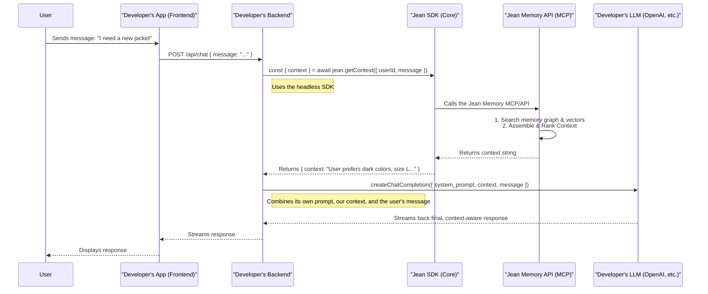

**Version:** 2.1 (Draft)
**Status:** Strategic Vision

## Part 1: Core Philosophy & Vision

Our goal is to build the infrastructure for computers to understand us. The Jean Connect SDK is the bridge that allows developers to embed this understanding into their applications. This document outlines the ideal design for this SDK, optimizing for developer experience, user trust, and architectural flexibility.

**Our Core Tenets:**
1.  **We are a Context Engine, Not a Chatbot:** Our primary function is to provide rich, relevant, and assembled context. We do not generate the final AI response. We empower the developer's chosen LLM with unparalleled user understanding.
2.  **Simplicity Through Modularity:** We will offer a powerful, headless core SDK for maximum flexibility and optional, pre-built UI components for maximum speed. Developers choose their level of integration.
3.  **User Trust is Paramount:** All user-facing interactions, especially authentication and data connection, must be transparent, secure, and user-controlled. We follow the principle of "Connect, Don't Collect."
4.  **Developer Experience is Our Product:** Our documentation will be beautiful, our APIs will be intuitive and industry-standard, and getting started should take minutes, not days.

---

## Part 2: The Ideal Message & Data Flow

This clarifies the flow of data from the end-user to the LLM, with Jean Memory acting as the critical context-enrichment step. This is the "headless" or "core" use case that our SDKs should prioritize.



This architecture ensures that Jean Memory does one thing and does it exceptionally well: **providing context.** The developer retains full control over their final prompt, their choice of LLM, and their user interface.

---

## Part 3: Authentication & Connection Flow

(This section is up-to-date and aligns with our vision for a secure, OAuth-first approach.)

This flow is designed to be secure, seamless, and user-centric.

### 3.1 Primary Authentication ("Sign In with Jean")

1.  **Initiation:** The user clicks a "Sign In with Jean" button in the developer's app.
2.  **Secure Redirect:** The user is redirected to `https://jeanmemory.com/oauth/authorize`.
3.  **Authentication:** The user signs in using their primary Jean Memory account.
4.  **Consent:** The user grants the developer's application permission to access their memory.
5.  **Onboarding & Redirection:** The user lands on a simple, hosted success page on our domain.
6.  **Completion:** The user is redirected back to the developer's app with an authorization code, which the SDK exchanges for a JWT.

### 3.2 Connecting External Services

This flow occurs *after* the user is authenticated and is handled via a controlled popup.

---

## Part 4: A Two-Layer SDK Architecture

To serve both developers who want speed and those who want control, we will structure our SDKs into two layers.

### 4.1 The Core Layer (e.g., `@jeanmemory/core`)

This is the headless engine. It contains no UI. Its purpose is to provide a clean, promise-based interface to the Jean Memory API (MCP). This is the primary product for developers who want to integrate Jean into their backend.

```typescript
// Example usage of the core library
import JeanMemory from '@jeanmemory/core';

const jean = new JeanMemory({ apiKey: 'jean_sk_...' });

async function handleMessage(userId: string, message: string) {
  const { context } = await jean.getContext({ userId, message });
  
  // Now, use this context in your LLM call
  const response = await myLLM.chat({
    prompt: `Context: ${context}\n\nUser says: ${message}`
  });
  
  return response;
}
```

### 4.2 The UI Layer (e.g., `@jeanmemory/react-ui`)

This is an optional library that provides pre-built React components for a beautiful, out-of-the-box experience. It is a thin wrapper around the core library.

```tsx
// Example usage of the UI library
import { JeanChat } from '@jeanmemory/react-ui';
import '@jeanmemory/react-ui/style.css';

function ChatComponent() {
  return (
    <JeanChat 
      apiKey="jean_sk_..."
      // This component uses the Core SDK and handles the full auth and chat flow
    />
  );
}
```

---

## Part 5: API & Protocol - A Clearer Definition

Our backend is accessible through two distinct layers, designed for different use cases. The SDK is the primary way for developers to interact with the highest-level protocol (MCP).

*   **Layer 1: Core REST API (The Foundation)**
    *   **Purpose:** The lowest-level interface, providing direct access to core functions. This is not the primary integration path for most developers.
    *   **Example Endpoint:** `POST /v1/memory/search`

*   **Layer 2: Model Context Protocol (MCP - The AI's Smart Outlet)**
    *   **Purpose:** A structured, tool-oriented protocol (JSON-RPC) built on top of the Core API. It's designed for AI agents (like Claude) and our own SDKs to use our system as a "tool." This is the primary, high-level interface that our SDKs will target.
    *   **Primary Tool:** `jean_memory`

*   **Layer 3: The Jean Connect SDK (The Developer's Power Cord)**
    *   **Purpose:** The primary, recommended way for developers to integrate. The SDK provides a clean, language-specific interface that communicates with the MCP protocol, abstracting away its complexity.
    *   **Example Method:** `jean.getContext({ userId, message })`

This clarifies that developers should almost always be using the **SDK**, which in turn uses the **MCP**.

---

## Part 6: The Future - True Contextual Bias

(This section is up-to-date and aligns with our vision.)

The `getContext` method will accept an optional `context_bias` parameter (e.g., `'shopping'`, `'learning'`). This parameter will directly influence the context engineering process by intelligently weighting search results and tailoring internal prompts to assemble the most relevant context for the developer's specific domain.
