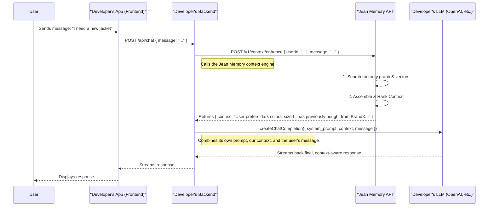

# Jean Connect: The Ideal SDK Design

**Version:** 2.0 (Draft)
**Status:** Strategic Vision

## Part 1: Core Philosophy & Vision

Our goal is to build the infrastructure for computers to understand us. The Jean Connect SDK is the bridge that allows developers to embed this understanding into their applications. This document outlines the ideal design for this SDK, optimizing for developer experience, user trust, and architectural flexibility.

**Our Core Tenets:**
1.  **We are a Context Engine, Not a Chatbot:** Our primary function is to provide rich, relevant, and synthesized context. We do not generate the final AI response. We empower the developer's chosen LLM with unparalleled user understanding.
2.  **Simplicity Through Modularity:** We will offer a powerful, headless core for maximum flexibility and an optional, pre-built UI for maximum speed. Developers choose their level of integration.
3.  **User Trust is Paramount:** All user-facing interactions, especially authentication and data connection, must be transparent, secure, and user-controlled. We follow the principle of "Connect, Don't Collect."
4.  **Developer Experience is Our Product:** Our documentation will be beautiful, our APIs will be intuitive and industry-standard, and getting started should take minutes, not days.

---

## Part 2: The Ideal Message & Data Flow

This clarifies the flow of data from the end-user to the LLM, with Jean Memory acting as the critical context-enrichment step.



This architecture ensures that Jean Memory does one thing and does it exceptionally well: **providing context.** The developer retains full control over their final prompt, their choice of LLM, and their user interface.

---

## Part 3: The Ideal Authentication & Connection Flow

This flow is designed to be secure, seamless, and user-centric.

### 3.1 Primary Authentication ("Sign In with Jean")

1.  **Initiation:** The user clicks a "Sign In with Jean" button in the developer's app.
2.  **Secure Redirect:** The user is redirected to `https://jeanmemory.com/oauth/authorize`. The full-page redirect is a critical security step, allowing the user to verify they are on our legitimate domain before entering credentials.
3.  **Authentication:** The user signs in using their primary Jean Memory account (powered by our existing Supabase authentication).
4.  **Consent:** The user grants the developer's application permission to access their memory.
5.  **Onboarding & Redirection:** The user lands on a simple, hosted success page on our domain. This page will offer two clear paths:
    *   A primary button: **"Return to [Developer's App]"**
    *   An optional section for new users: **"Enhance Your Memory: Connect sources like Notion or Twitter."**
6.  **Completion:** The user is redirected back to the developer's app with an authorization code. The Jean SDK in the background securely exchanges this code for a JWT access token using the OAuth 2.1 PKCE standard.

### 3.2 Connecting External Services

This flow occurs *after* the user is authenticated and is handled via a controlled popup to avoid disrupting the user's experience in the host application. The technical implementation will follow the detailed plan in `SDK_OVERVIEW.md`.

---

## Part 4: A Two-Layer SDK Architecture

To serve both developers who want speed and those who want control, we will structure our SDKs (starting with React) into two layers.

### 4.1 The Core Layer (e.g., `@jeanmemory/core`)

This is the headless engine. It contains no UI. Its purpose is to provide a clean, promise-based interface to the Jean Memory API.

```typescript
// Example usage of the core library
import JeanMemory from '@jeanmemory/core';

const jean = new JeanMemory({ apiKey: 'jean_sk_...' });

async function handleMessage(userId: string, message: string) {
  const { context } = await jean.context.enhance({ userId, message });
  
  // Now, use this context in your LLM call
  const response = await myLLM.chat({
    prompt: `Context: ${context}\n\nUser says: ${message}`
  });
  
  return response;
}
```

This core library would also handle the authentication client-side, managing token storage and refresh.

### 4.2 The UI Layer (e.g., `@jeanmemory/react-ui`)

This is an optional library that provides pre-built React components for a beautiful, out-of-the-box experience. It is built on top of the core library.

```tsx
// Example usage of the UI library
import { JeanChat } from '@jeanmemory/react-ui';
import '@jeanmemory/react-ui/style.css';

function ChatComponent() {
  return (
    <JeanChat 
      apiKey="jean_sk_..."
      // The UI component handles the full auth flow and chat state
    />
  );
}
```

This two-layer approach provides the best of both worlds:
*   **For speed:** A single component (`<JeanChat />`) for a "Chatbase-like" 5-line integration.
*   **For flexibility:** A powerful core library (`@jeanmemory/core`) that gives developers full control over their UI and application logic.

---

## Part 5: The API - Designed from First Principles

Our public API should be clean, RESTful, and industry-standard. It should directly reflect our core philosophy. The confusing collection of endpoints (`/mcp`, `/sdk/synthesize`, `/sdk/chat/enhance`) will be consolidated.

**Proposed API Endpoint Structure:**

*   `POST /v1/context/enhance`
    *   **Purpose:** The primary endpoint of our product. Takes a user ID and a message, and returns the engineered context.
    *   **Request Body:** `{ "userId": "...", "message": "...", "context_bias": "shopping" }`
    *   **Response Body:** `{ "context": "...", "usage": {...} }`

*   `GET /v1/integrations`
    *   **Purpose:** Lists available integrations (Notion, etc.) and their status for the user.

*   `POST /v1/integrations/{service}/connect`
    *   **Purpose:** Initiates the OAuth flow for connecting an external service.

*   `/oauth/*`
    *   **Purpose:** Standard OAuth 2.1 endpoints for user authentication (`/authorize`, `/token`).

The key takeaway is that we will deprecate endpoints that perform tasks outside our core "context engine" mandate, such as `/sdk/synthesize`.

---

## Part 6: The Future - True Contextual Bias

The `system_prompt` discussion raises a powerful product concept. We should evolve beyond a simple passthrough parameter.

**Vision for `context_bias`:**

The `/v1/context/enhance` endpoint will accept an optional `context_bias` parameter (e.g., `'shopping'`, `'learning'`, `'professional'`). This parameter will directly influence the context engineering process:

1.  **Weighted Search:** When querying the memory graph and vector stores, memories tagged with metadata relevant to the bias will be up-weighted.
2.  **Prompt Synthesis:** The internal prompts used by Jean Memory to synthesize the final context block will be tailored. For a "shopping" bias, the prompt might be, *"Synthesize the user's shopping preferences, including sizes, favorite brands, and budget considerations."*
3.  **Entity Extraction:** The system could prioritize extracting and returning entities relevant to the domain (e.g., product names for shopping, technical terms for learning).

This feature transforms Jean Memory from a generic memory layer into a truly intelligent context engine that adapts to the specific needs of the developer's application.
