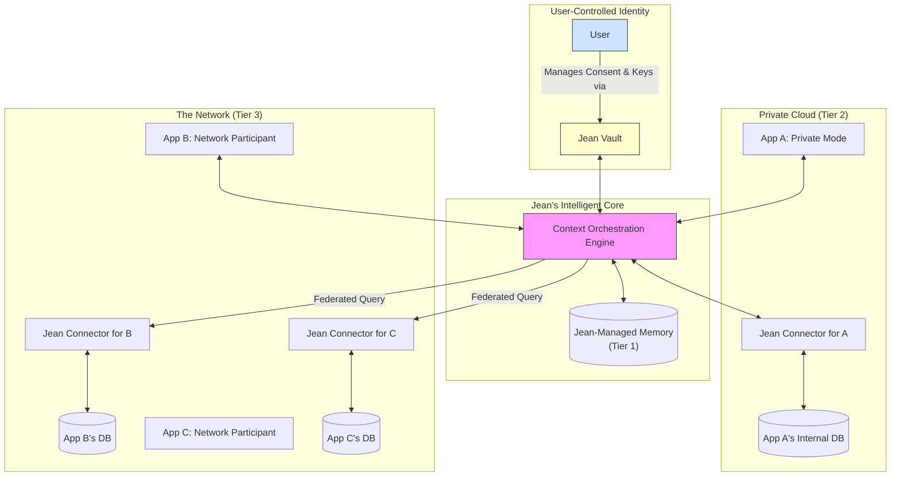

<h1 align="center">Jean Connect: The Universal Context Layer for AI</h1>

<p align="center">
  <strong>Stop building stateless AI. Give your applications the context to truly understand users.</strong>
</p>

<p align="center">
  <a href="#">Website</a> · <a href="#">Dashboard</a> · <a href="#">Documentation</a> · <a href="#">Join the Network</a>
</p>

---

## The Internet Has a Memory Problem

The next generation of software is being built on AI, yet every application suffers from the same fundamental flaw: **amnesia**.

AI models are incredibly powerful, but they are stateless. They don't remember users across applications, sessions, or even conversations. This leads to frustrating, generic experiences. Your users are forced to repeat themselves, and your application sees only a tiny sliver of who they are.

-   **Context is Siloed:** Your calendar knows your schedule, your code editor knows your projects, and your music app knows your taste. None of them can talk to each other.
-   **Personalization is Shallow:** Without deep, persistent context, "personalization" is just pattern-matching, not true understanding.
-   **Integration is a Nightmare:** Building bespoke memory systems and data pipelines for every application is costly, insecure, and unscalable.

The infrastructure for a personalized, context-aware internet has not yet been built. **Until now.**

## Jean Connect: From Silos to Synthesis

Jean Connect is the **universal context layer** for the age of AI. We are building the "Plaid for Context"—a single, secure platform that allows applications to access and engineer user context, no matter where it lives.

Our mission is to provide the critical infrastructure that allows AI to understand humans with consistency, persistence, and depth. We do this by transforming fragmented data points into a synthesized, actionable understanding of the user, all while keeping the user in absolute control.

### How It Works: The Hub-and-Spoke Ecosystem

Jean Connect operates on a revolutionary two-tiered, user-centric architecture. Data stays secure in its original location; Jean orchestrates the flow of context based on explicit user consent.



---

## A Simple Path to Powerful Context: The Three Tiers of Adoption

We provide a seamless upgrade path, allowing you to adopt Jean Connect at the level that's right for your business today, while future-proofing your application for tomorrow.

### Tier 1: Jean-Managed Memory (The Easy Button)

Get started in minutes with a fully-managed, high-performance memory solution. This is the fastest way to add a powerful, persistent memory to your application.

-   **Value:** Zero-configuration, best-in-class performance, and access to our most advanced context engineering features out of the box.
-   **Best for:** Startups, new projects, and developers who want a "batteries-included" turn-key solution.

```typescript
// Get started in 5 lines of code
import { JeanClient } from '@jean/sdk';

const jean = new JeanClient({
  apiKey: 'jean_sk_...',
  // That's it! You're using Jean-Managed Memory by default.
});
```

### Tier 2: Private Cloud (Bring Your Own Memory)

Integrate Jean's intelligence with your existing infrastructure. Your user data never leaves your control; our Orchestration Engine operates as a secure, stateless processor on top of your database.

-   **Value:** Maintain absolute data sovereignty and security compliance (GDPR, SOC 2). Eliminate vendor lock-in and leverage your existing data stores.
-   **Best for:** Enterprises with established infrastructure, or companies with strict data residency and security requirements.

```typescript
import { JeanClient } from '@jean/sdk';
import { MyCustomMemoryAdapter } from './my-adapter';

const jean = new JeanClient({
  apiKey: 'jean_sk_...',
  memory: {
    connector: new MyCustomMemoryAdapter({ db: '...'})
  }
});
```

### Tier 3: The Network (The Future of Personalization)

Join the Jean Network to build "impossible" user experiences. By contributing a segment of your context (with user consent), you gain the ability to draw context from all other participating applications.

-   **Value:** Deliver magical, cross-platform personalization that your siloed competitors can only dream of.
-   **Best for:** Visionary companies who want to build the next generation of deeply personalized, context-aware applications.

```typescript
import { JeanClient } from '@jean/sdk';

const jean = new JeanClient({
  apiKey: 'jean_sk_...',
  network: {
    enabled: true, // Opt-in to the network
    contribute: ['preferences', 'goals'] // Define what context you share
  }
});
```

---

## The Incentive Flywheel: Why Join The Network?

Joining the Jean Network is a strategic decision that creates a powerful competitive moat for your application. It operates on a simple **"give-to-get"** principle: to access the network's context, you must contribute to it.

This creates a powerful flywheel of incentives:

| Incentive                      | For a Siloed App (Without the Network)                                                              | For a Networked App (With Jean Connect)                                                                                             |
| ------------------------------ | --------------------------------------------------------------------------------------------------- | ----------------------------------------------------------------------------------------------------------------------------------- |
| **User Onboarding**            | A blank slate. The user must manually input preferences and history, leading to high churn.         | Instantly understands the user. Onboards them with context from their calendar, notes, and other apps for immediate, magical value. |
| **Personalized Recommendations** | Can only recommend based on in-app behavior. A travel app can't know when a user's project ends.    | Can synthesize context. The travel app *knows* the user's project ends in October and proactively suggests a vacation.                |
| **Proactive Assistance**       | Can only react to direct user input.                                                                | Can anticipate needs. It sees a user is researching a topic in one app and can surface relevant documents in another.             |
| **User Retention & Stickiness**  | Users can switch to a competitor and lose only the data from one app.                               | The user's "Jean Identity" is a core part of their digital life. Leaving the app means leaving behind a piece of their brain.       |

By joining the network, you're not just adding a feature. You are fundamentally changing the value proposition of your product and creating experiences that are impossible to replicate from within a silo.

## For the User: The Jean Dashboard

The entire ecosystem is anchored by the user. The Jean Dashboard is their central hub to manage their AI identity. Here, they can:

-   **Grant & Revoke Consent:** A simple, clear interface to control which applications can access which pieces of their context.
-   **View Synthesized Memories:** See a timeline of what Jean has learned about them and how it's being used.
-   **Connect New Sources:** Easily link new apps and data sources to their Jean Vault, enriching their context and making all their applications smarter.

This user-centric model builds trust and transparency, which is essential for the future of personalized AI.

## The Path to Ubiquity

Our strategy is to become the indispensable, neutral utility for AI context, just as Plaid is for finance and Stripe is for payments.

1.  **On-Ramp with Jean-Managed Memory:** Capture the majority of the market with a simple, powerful, and easy-to-adopt solution.
2.  **Capture the Enterprise with Private Cloud:** Provide a secure, compliant solution that allows large companies to adopt our intelligence layer without compromising their data sovereignty.
3.  **Build the Moat with The Network:** Create an ecosystem with such a powerful network effect that being "Jean Connected" is a competitive necessity.
4.  **Become the Standard:** Establish the Jean Connector interface and our Context API as the industry standard for how AI applications communicate and share context.

## Build the Future with Us

The age of amnesiac software is over. The future is an internet that understands, remembers, and assists. Jean Connect is the engine that will power this future.

**[Get Started with a Jean-Managed Memory Account](#)  |  [Read the Enterprise Integration Docs](#)  |  [Learn More About The Network](#)**

---

## A Pragmatic Roadmap to Ubiquity

A grand vision requires a grounded, actionable plan. This phased roadmap is designed to deliver value at every step, build momentum, and manage complexity, allowing us to launch an initial, powerful product within weeks, not years.

### Phase 1: Perfect the Silo & Build the Foundation (The Next 2 Weeks & Beyond)

**Goal:** Become the undisputed **best managed-memory solution** on the market. Nail the Tier 1 offering and build the perfect on-ramp to the future network.

**Core Philosophy:** The easiest way to get developers to join our network tomorrow is to give them a product that solves their biggest problem today. Right now, that problem is building a stateful, personalized AI application *at all*.

**What We Build & Launch in Two Weeks:**

1.  **A Flawless "Easy Button":** We focus all our energy on making the Tier 1 "Jean-Managed Memory" experience exceptional. This is a complete, production-ready solution that a developer can integrate in 5 lines of code.
2.  **The "Proto-Vault" User Experience:** We launch the Jean Dashboard with the core user flow: `Sign in with Jean` -> `Connect your first app`. Initially, this first app *is* our managed memory.
3.  **The First Aggregator Connector (Proof of Concept):** We build and launch with a single, powerful "Sign in with OpenAI/ChatGPT" connector. A user can sign in, connect their OpenAI account, and we can immediately import their chat history to provide context from day one. This immediately demonstrates the aggregator vision.
4.  **Architect for the Future:** We ensure our internal architecture is modular. The Orchestration Engine should communicate with our own managed database via an internal "connector," the same way it will eventually communicate with external ones.

**Outcome:** We launch a product that is immediately valuable and differentiated. It's the best managed-memory solution *because* it comes with the built-in superpower of starting with a user's existing ChatGPT history, solving the cold-start problem for our customers.

### Phase 2: Launch "Private Cloud" & the Open Connector Standard (Months 3-9)

**Goal:** Prove the "Bring Your Own Memory" model (Tier 2) with high-value enterprise partners and establish our standard.

**What We Build:**

1.  **Open Source the Jean Connector Standard:** We publish the specification and a reference implementation (e.g., for a standard Postgres/pgvector database). This removes all barriers to adoption.
2.  **Onboard Enterprise Design Partners:** We work with 3-5 enterprise customers to deploy the connector in their private cloud, proving the security and value of the federated model.
3.  **Expand Aggregator Connectors:** We add connectors for Claude, Google Gemini, and other major platforms, strengthening our position as the central "Switzerland of Context."

**Outcome:** We have strong enterprise revenue streams and case studies. The Jean Connector is gaining traction as the open standard for context interoperability, and the value of our network is becoming undeniable.

### Phase 3: Open The Network & Become Indispensable (Months 9-18)

**Goal:** Launch the public "give-to-get" network (Tier 3) and achieve a powerful network effect.

**What We Build:**

1.  **Enable the "Network" Flag:** We allow any developer using our SDK to opt-in their application to the network.
2.  **Full User Consent Dashboard:** The Jean Dashboard becomes a comprehensive hub for users to manage exactly what context flows between which applications.
3.  **Market the Flywheel:** We heavily promote the "impossible features" now available to any developer in the network, creating immense FOMO for those still in a silo.

**Outcome:** We have achieved the end-state vision. Jean Connect is the default, indispensable context layer for any serious AI application.

---

## Blind Spots & Strategic Risks: What We Must Get Right

A vision this ambitious has inherent risks. Acknowledging and planning for them is critical.

1.  **The User Adoption Hurdle:**
    *   **Risk:** Why would an end-user want *another* account? "Sign in with Jean" could be seen as friction, not a feature.
    *   **Mitigation:** The initial value proposition must be massive and immediate. By launching with the ChatGPT importer, the user gets an immediate payoff: their new app already knows them. The long-term value is in the cross-platform magic and the control provided by the dashboard. We must sell the benefit to the end-user as much as to the developer.

2.  **The "Empty Network" Cold Start Problem:**
    *   **Risk:** Why would the 10th app join a network of only 9 other apps? The "give-to-get" model fails if there's nothing to "get."
    *   **Mitigation:** Our phased roadmap is the solution. The network's initial value comes from *our* aggregator connectors (OpenAI, Google, etc.). The network is valuable on day one because it gives access to the giants, even before a single third-party developer has contributed their data. We seed the network ourselves.

3.  **The "Switzerland" Trust Paradox:**
    *   **Risk:** Our entire model is built on being a trusted, neutral third party. A single security breach, even if it's the fault of a partner application, could shatter user trust and destroy the company.
    *   **Mitigation:** Security cannot be a feature; it must be our religion. This means rigorous security audits, a clear and transparent security policy, and building tools to help our partners maintain security (e.g., a "Connector Security Scorecard"). We must be prepared to be the responsible party, even when we are not the liable one.

4.  **Performance & Complexity at Scale:**
    *   **Risk:** Federated queries across multiple APIs are inherently slower and more complex than a local database call. If the user experience is slow or unreliable, the magic is lost.
    *   **Mitigation:** We must invest heavily in the intelligence of our Orchestration Engine. This includes sophisticated caching, predictive pre-fetching of context, and gracefully degrading services. The user experience should be "magical," and we must hide the immense technical complexity required to deliver it.

5.  **The Giant's Gambit:**
    *   **Risk:** What if OpenAI, Google, or Anthropic decide to block aggregators or make their context APIs prohibitively expensive?
    *   **Mitigation:** Diversification and open standards. The more third-party apps that join our network, the less reliant we are on any single giant. By pushing our open-source Jean Connector standard, we create a groundswell of support for an open context ecosystem, making it harder for the giants to lock it down without significant backlash from the developer community. We become the champions of an open alternative.
