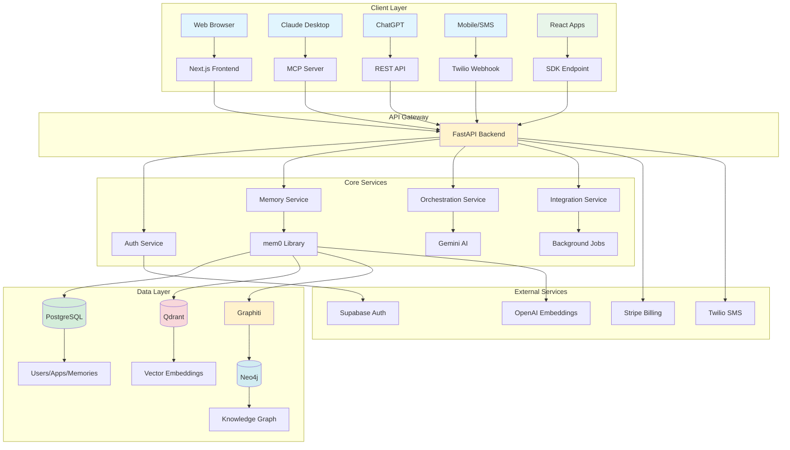
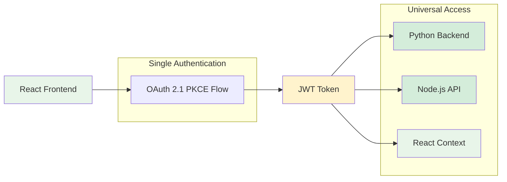

# The Jean Memory Bible: The Definitive Technical Guide

**Version**: 6.0  
**Last Updated**: August 2025  
**Status**: Enterprise-Ready with Complete SDK Suite & OAuth 2.1 PKCE  
**SDK Versions**: React@1.2.10+, Node@1.2.10+, Python@1.2.10+  
**Production URL**: https://jean-memory-api-virginia.onrender.com

## Table of Contents

1. [Executive Summary](#executive-summary)
2. [Part I: Vision, Philosophy & Architecture](#part-i-vision-philosophy--architecture)
3. [Part II: The Backend API - Deep Dive](#part-ii-the-backend-api---deep-dive)
4. [Part III: The Frontend UI - Complete Analysis](#part-iii-the-frontend-ui---complete-analysis)
5. [Part IV: Database Architecture & Data Flow](#part-iv-database-architecture--data-flow)
6. [Part V: AI Orchestration & Intelligence Layer](#part-v-ai-orchestration--intelligence-layer)
7. [Part VI: Authentication & Security](#part-vi-authentication--security)
8. [Part VII: SDKs & Developer Tools](#part-vii-sdks--developer-tools)
9. [Part VIII: Integrations & External Services](#part-viii-integrations--external-services)
10. [Part IX: Development, Testing & Deployment](#part-ix-development-testing--deployment)
11. [Part X: Performance & Scalability](#part-x-performance--scalability)
12. [Part XI: API Reference & Tool Documentation](#part-xi-api-reference--tool-documentation)
13. [Part XII: Critical Implementation Details](#part-xii-critical-implementation-details)
14. [Part XIII: Troubleshooting & Common Pitfalls](#part-xiii-troubleshooting--common-pitfalls)
15. [Part XIV: Enterprise SDK Suite - Major Business Component](#part-xiv-enterprise-sdk-suite---major-business-component)

---

## Executive Summary

Jean Memory is a sophisticated, AI-powered memory layer that enables persistent, cross-platform context for AI applications. Built as a monolithic repository with a FastAPI backend and Next.js frontend, it leverages a unique tri-database architecture (PostgreSQL, Qdrant, Neo4j) orchestrated through the mem0 library. The system implements intelligent "Smart Triage" for automatic memory curation and provides real-time MCP (Model Context Protocol) support for AI assistants like Claude and ChatGPT.

**The Jean Memory SDK Suite represents a major business component**, providing enterprise-grade developer tools that make AI memory accessible across React, Node.js, and Python platforms with complete OAuth 2.1 PKCE security and cross-platform token sharing.

**Key Innovations:**
- **Dual-Path Asynchronous Processing**: Immediate responses with background intelligence
- **Smart Context Orchestration**: AI-driven context engineering, not just retrieval
- **Narrative Caching**: Pre-computed user narratives for instant context
- **Multi-Model AI Strategy**: Gemini Flash for speed, Gemini Pro for depth
- **Enterprise-Ready**: API keys, subscription tiers, rate limiting
- **Complete SDK Suite**: React, Node.js, and Python SDKs with unified OAuth architecture
- **5-Line Integration Promise**: From signup to production-ready AI memory in minutes
- **OAuth 2.1 PKCE**: Enterprise security with cross-SDK token sharing
- **Advanced Tool Suite**: Context engineering, document storage, and deep memory queries
- **Multi-Agent Support**: Virtual user IDs for managing multiple agents per session
- **ChatGPT SSE Support**: Fixed SSE connections with fully qualified URLs and heartbeat format
- **Graphiti Integration**: Advanced knowledge graph layer with ontology-based extraction
- **Content Deduplication**: Prevents redundant memory saving using content hashing

---

## Part I: Vision, Philosophy & Architecture

### 1.1 The Core Problem

Computers have no memory of their interactions with users. Every conversation starts from scratch. Jean Memory solves this by creating a persistent, intelligent memory layer that makes AI truly personal.

### 1.2 Design Philosophy

#### **Context Engineering, Not Information Retrieval**

The system doesn't just store and retrieve memories - it intelligently engineers context. This means:
- Selecting the *right* information at the *right* time
- Synthesizing insights from disparate memories
- Understanding relationships between memories
- Predicting what context will be most useful

#### **The Bitter Lesson Applied**

Following Rich Sutton's "Bitter Lesson" - the system leverages AI intelligence over hand-coded heuristics:
- AI decides what to remember (Smart Triage)
- AI determines relevant context (Smart Orchestration)
- AI synthesizes new insights (Deep Analysis)

#### **Asynchronous by Design**

Every expensive operation happens in the background:
- Memory saving is asynchronous
- Deep analysis runs in parallel
- Document processing uses job queues
- Narrative generation happens offline

### 1.3 System Architecture



### 1.4 Key Architectural Decisions

1. **Monorepo Structure**: Frontend and backend in one repository for atomic deployments
2. **Tri-Database Design**: Each database optimized for its purpose
3. **mem0 Abstraction**: Unified interface over vector and graph databases
4. **Graphiti Integration**: Intelligent graph management layer for Neo4j (Phase 1)
5. **pgvector Support**: PostgreSQL vector extension for Phase 2 document processing
6. **MCP Protocol**: Real-time streaming for AI assistants with multi-version support
7. **Background Processing**: FastAPI BackgroundTasks for non-blocking operations
8. **AI Model Selection**: Gemini for analysis, OpenAI for embeddings
9. **SDK Architecture**: Lightweight React SDK with OAuth 2.1 PKCE flow
10. **Content-Based Deduplication**: Hash-based prevention of duplicate memories

---

## Part II: The Backend API - Deep Dive

### 2.1 Project Structure

```
openmemory/api/
├── main.py                     # FastAPI application entry point
├── app/
│   ├── models.py              # SQLAlchemy ORM models
│   ├── schemas.py             # Pydantic validation schemas
│   ├── auth.py                # Authentication logic
│   ├── database.py            # Database configuration
│   ├── settings.py            # Environment configuration
│   ├── mcp_orchestration.py  # Smart context orchestration
│   ├── mcp_server.py          # MCP protocol implementation
│   ├── oauth_simple_new.py   # OAuth 2.1 PKCE implementation
│   ├── routing/               # MCP routing modules
│   │   ├── mcp.py            # Main MCP router
│   │   └── chorus.py         # Chorus SSE handling
│   ├── routers/              # API endpoints
│   │   ├── agent_mcp.py     # Unified MCP endpoint
│   │   ├── memories.py      # Memory CRUD operations
│   │   ├── apps.py          # Application management
│   │   ├── integrations.py  # External integrations
│   │   ├── profile.py       # User profile/SMS
│   │   ├── sdk_mcp.py       # SDK MCP endpoint
│   │   ├── sdk_demo.py      # SDK demo endpoints
│   │   ├── sdk_oauth.py     # SDK OAuth endpoints
│   │   ├── fastmcp_oauth.py # FastMCP OAuth router
│   │   ├── local_auth.py    # Local development auth
│   │   ├── jean_memory_api.py # Jean Memory V2 API
│   │   └── admin.py         # Admin endpoints
│   ├── tools/                # MCP tools
│   │   ├── orchestration.py  # jean_memory tool
│   │   ├── memory.py        # Memory operations
│   │   └── documents.py     # Document processing
│   ├── utils/                # Utilities
│   │   ├── gemini.py        # Gemini AI service
│   │   ├── memory.py        # mem0 client
│   │   └── mcp_modules/     # MCP support modules
│   ├── integrations/         # External services
│   │   ├── substack_service.py
│   │   ├── substack_scraper.py
│   │   └── twitter_service.py
│   ├── services/             # Background services
│   │   ├── background_processor.py
│   │   ├── background_sync.py
│   │   └── chunking_service.py
│   └── middleware/           # Request middleware
│       ├── memory_monitor.py
│       └── subscription_middleware.py
├── jean_memory/              # Jean Memory V2 adapter
├── alembic/                 # Database migrations
└── requirements.txt         # Python dependencies
```

### 2.2 Core Components

#### 2.2.1 The `jean_memory` Tool - Heart of the System

Located in `app/tools/orchestration.py`, this is the primary interface:

```python
@mcp.tool(description="🌟 PRIMARY TOOL for all conversational interactions")
async def jean_memory(
    user_message: str, 
    is_new_conversation: bool, 
    needs_context: bool
) -> str:
```

**Execution Flow:**

1. **Immediate Path** (< 3 seconds):
   - If `needs_context=false`: Return immediately
   - If `needs_context=true`: Run fast vector search via `_fallback_simple_search`

2. **Background Path 1 - Smart Triage**:
   - Triggered for EVERY message
   - Uses `_ai_memory_analysis` with Gemini Flash
   - Decides REMEMBER/SKIP
   - If REMEMBER: Saves via `_add_memory_background`

3. **Background Path 2 - Deep Analysis**:
   - Only if `needs_context=true`
   - Runs `_standard_orchestration` for synthesis
   - Creates high-priority insight memories
   - Can take 30-60 seconds

#### 2.2.2 Content Deduplication System

The system prevents duplicate memory saving using content-based hashing:

```python
def _add_memory_with_content_deduplication(self, content: str, user_id: str, client_name: str):
    """
    Prevents saving identical content multiple times.
    Uses MD5 hash of content for deduplication.
    Maintains a rolling window of 100 recent hashes.
    """
    content_hash = f"{user_id}_{hashlib.md5(content.encode()).hexdigest()}"
    
    if content_hash in self._saved_content_hashes:
        return  # Skip duplicate
    
    self._saved_content_hashes.add(content_hash)
    # Clean up old hashes to prevent memory leak
    if len(self._saved_content_hashes) > 100:
        # Keep only last 50
```

#### 2.2.3 Multi-Agent Support

The system supports multiple agents per session using virtual user IDs:

```python
def parse_virtual_user_id(user_id: str) -> Dict[str, Any]:
    """
    Parse virtual user ID pattern: user__session__session_id__agent_id
    """
    if "__session__" in user_id:
        parts = user_id.split("__session__")
        base_user_id = parts[0]
        session_parts = parts[1].split("__")
        return {
            "base_user_id": base_user_id,
            "session_id": session_parts[0],
            "agent_id": session_parts[1] if len(session_parts) > 1 else "default",
            "is_multi_agent": True
        }
```

#### 2.2.4 MCP Protocol Support

The system supports multiple MCP protocol versions:

- **2024-11-05**: Legacy support for older clients
- **2025-03-26**: Current stable version
- **2025-06-18**: Latest with `listChanged` capability

### 2.3 OAuth 2.1 PKCE Implementation

#### 2.3.1 OAuth Router (`oauth_simple_new.py`)

The OAuth implementation provides secure authentication for external clients:

```python
@oauth_router.get("/authorize")
async def authorize(
    client_id: str,
    redirect_uri: str,
    response_type: str,
    state: str,
    scope: Optional[str] = "read write",
    code_challenge: Optional[str] = None,
    code_challenge_method: Optional[str] = "S256"
):
```

**Features:**
- Auto-registration for Claude and local development clients
- PKCE support for enhanced security
- Standalone authorization page
- Cookie-based session management

#### 2.3.2 Authentication Flow

1. **Client Initiation**: App redirects to `/oauth/authorize`
2. **User Authentication**: Supabase login/signup
3. **Authorization**: User approves access
4. **Code Exchange**: Exchange auth code for JWT token
5. **Token Usage**: Use JWT for API access

### 2.4 API Endpoints

#### 2.4.1 Router Organization

| Router | Path | Purpose | Auth |
|--------|------|---------|------|
| `agent_mcp.py` | `/mcp` | Unified MCP endpoint | API Key or Headers |
| `routing/mcp.py` | `/mcp/v2/{client}/{user}` | Multi-agent MCP | API Key |
| `routing/chorus.py` | `/mcp/v2/chorus/{user}` | Chorus SSE endpoint | API Key |
| `memories.py` | `/api/v1/memories` | Memory CRUD | Supabase JWT |
| `apps.py` | `/api/v1/apps` | App management | Supabase JWT |
| `integrations.py` | `/api/v1/integrations` | External sync | Supabase JWT |
| `profile.py` | `/api/v1/profile` | User profile | Supabase JWT |
| `sdk_mcp.py` | `/api/v1/sdk/mcp/chat` | SDK chat endpoint | API Key |
| `sdk_oauth.py` | `/sdk/oauth/*` | SDK OAuth flow | None/JWT |
| `fastmcp_oauth.py` | `/oauth/fastmcp/*` | FastMCP OAuth | None/JWT |
| `local_auth.py` | `/api/v1/auth/local` | Local dev auth | None |
| `jean_memory_api.py` | `/api/v1/jean-memory` | V2 API endpoints | API Key |
| `webhooks.py` | `/webhooks` | Twilio SMS | Signature |
| `stripe_webhooks.py` | `/stripe/webhook` | Billing | Signature |
| `admin.py` | `/admin` | Admin tools | Secret Key |

#### 2.4.2 ChatGPT SSE Support

Special handling for ChatGPT's SSE requirements:

```python
@mcp_router.get("/{client_name}/sse/{user_id}")
async def handle_sse_connection(client_name: str, user_id: str):
    """
    SSE endpoint with ChatGPT-specific fixes:
    - Sends fully qualified URLs in endpoint event
    - Uses colon-prefixed heartbeat format
    - Immediate heartbeat after connection
    """
```

---

## Part III: The Frontend UI - Complete Analysis

### 3.1 Architecture

Built with Next.js 14 using App Router:

```
openmemory/ui/
├── app/                    # Next.js app directory
│   ├── layout.tsx         # Root layout
│   ├── page.tsx           # Landing page
│   ├── dashboard/         # Main dashboard
│   ├── memories/          # Memory management
│   ├── my-life/           # Life graph visualization
│   ├── apps/              # App management
│   ├── auth/              # Authentication
│   ├── api-docs/          # API documentation
│   └── api/               # API routes
├── components/            # React components
│   ├── ui/               # shadcn/ui components
│   ├── dashboard/        # Dashboard components
│   ├── memory-v3/        # Memory components
│   └── landing/          # Landing page
├── contexts/             # React contexts
├── hooks/                # Custom hooks
├── store/                # Redux store
└── lib/                  # Utilities
```

### 3.2 Key Pages

#### 3.2.1 Dashboard (`/dashboard`)

The main hub showing:
- Connected applications
- Memory statistics
- Quick actions
- Migration banners
- Profile completion

#### 3.2.2 API Documentation (`/api-docs`)

Comprehensive API documentation with:
- Interactive examples
- Authentication guide
- SDK quickstart
- MCP protocol reference

### 3.3 OAuth Callback Handler

The OAuth callback page (`app/static/oauth_callback.html`) handles:
- Supabase auth code exchange
- Cookie setting for session persistence
- Auto-redirect to authorization completion

---

## Part IV: Database Architecture & Data Flow

### 4.1 Tri-Database Design

#### 4.1.1 PostgreSQL - Metadata Store

**Tables:**
- `users`: User accounts with subscription info
- `apps`: Connected applications
- `memories`: Memory metadata
- `documents`: Document storage
- `document_chunks`: Chunked content
- `user_narratives`: Cached narratives
- `sms_conversations`: SMS history

#### 4.1.2 Qdrant - Vector Database

**Features:**
- User-specific collections
- 1536-dimensional vectors (OpenAI)
- Metadata filtering
- Similarity search

#### 4.1.3 Neo4j - Knowledge Graph with Dual Storage

**Dual Storage Architecture:**
- **mem0 Graph Storage**: Direct entity and relationship storage
- **Graphiti Layer**: Enhanced temporal context and ontology-based extraction

---

## Part V: AI Orchestration & Intelligence Layer

### 5.1 Multi-Model AI Strategy

| Task | Model | Rationale |
|------|-------|-----------|
| Triage Analysis | Gemini 2.5 Flash | Speed (< 1s) |
| Context Planning | Gemini 2.5 Flash | Cost-effective |
| Deep Synthesis | Gemini 2.5 Pro | Quality |
| Embeddings | OpenAI text-embedding-3-small | Compatibility |
| Document Analysis | Gemini 2.0 Flash | Long context |

### 5.2 Smart Triage System

Every message undergoes AI analysis to determine if it contains memorable content:

```python
prompt = f"""Analyze this message to determine if it contains information worth remembering...

USER MESSAGE: "{user_message}"

MEMORABLE CONTENT includes:
- Personal facts
- Preferences and opinions
- Goals and aspirations
- Explicit requests to remember

NOT MEMORABLE:
- Simple questions
- Casual conversation
- Temporary states

Decision: REMEMBER or SKIP
Content: [Extracted memorable information]
"""
```

---

## Part VI: Authentication & Security

### 6.1 Authentication Methods

#### 6.1.1 OAuth 2.1 PKCE Flow

Modern OAuth implementation with:
- PKCE (Proof Key for Code Exchange) for enhanced security
- Auto-redirect URI detection
- Support for Claude, ChatGPT, and custom clients
- Standalone authorization page

#### 6.1.2 API Keys

For programmatic access:
- `jean_sk_` prefix for SDK keys
- `jean_ak_` prefix for API keys
- SHA-256 hashing
- Usage tracking
- Revocation support

#### 6.1.3 Supabase JWT

Primary authentication for UI:
- JWT token validation
- User session management
- OAuth integration
- Email/password support

### 6.2 Security Measures

1. **Input Validation**: Pydantic schemas
2. **SQL Injection**: SQLAlchemy ORM
3. **XSS Prevention**: React sanitization
4. **CORS**: Configured origins
5. **Rate Limiting**: Per-tier limits
6. **Webhook Verification**: Signature validation
7. **PKCE Protection**: Code challenge/verifier

---

## Part VII: SDKs & Developer Tools

### 7.1 React SDK

#### 7.1.1 Installation

```bash
npm install jeanmemory-react
# Current version: 0.1.3
```

#### 7.1.2 Quick Start

```tsx
import { useState } from 'react';
import { useJean, SignInWithJean, JeanChat } from 'jeanmemory-react';

function MyApp() {
  const [user, setUser] = useState(null);
  const { agent } = useJean({ user });

  if (!agent) {
    return <SignInWithJean apiKey="your-api-key" onSuccess={setUser} />;
  }
  return <JeanChat agent={agent} />;
}
```

#### 7.1.3 Components

**SignInWithJean**: OAuth authentication button
- Auto-detects redirect URI
- Handles complete OAuth flow
- Customizable styling

**JeanChat**: Chat interface component
- Built-in message handling
- Context management
- Customizable UI

**useJean**: Core React hook
- Manages authentication state
- Handles API communication
- Provides agent interface

### 7.2 Documentation (Mintlify)

The documentation is organized in `docs-mintlify/`:

```
docs-mintlify/
├── mint.json              # Mintlify configuration
├── quickstart.mdx         # Getting started guide
├── architecture.mdx       # System architecture
├── tools.mdx             # MCP tools reference
├── oauth-troubleshooting.mdx  # OAuth guide
├── sdk/                  # SDK documentation
│   ├── react.mdx        # React SDK guide
│   ├── python.mdx       # Python SDK guide
│   └── node.mdx         # Node.js SDK guide
├── mcp/                  # MCP documentation
│   ├── claude.mdx       # Claude integration
│   └── chatgpt.mdx      # ChatGPT integration
└── platforms/            # Platform guides
    ├── cursor.mdx       # Cursor integration
    └── vscode.mdx       # VS Code integration
```

### 7.3 Python SDK

```python
from jean_memory import Agent

# Initialize with API key
agent = Agent(api_key="your-api-key")

# Or use OAuth
agent = Agent.from_oauth_flow()

# Send messages
response = agent.send_message("Remember that I prefer dark mode")
```

---

## Part VIII: Integrations & External Services

### 8.1 Supported Integrations

#### 8.1.1 Substack
- Article ingestion
- Author profile sync
- Automatic chunking
- Metadata extraction

#### 8.1.2 Twitter/X
- Tweet import
- Thread reconstruction
- Media handling
- Engagement metrics

#### 8.1.3 SMS (Twilio)
Pro feature for mobile memory:
- Two-way messaging
- Conversation continuity
- MMS support
- Rate limiting

### 8.2 Integration Architecture

```python
class IntegrationService:
    async def sync_integration(app_name: str, user_id: str):
        # 1. Fetch external data
        # 2. Transform to memories
        # 3. Deduplicate
        # 4. Save via mem0
        # 5. Update sync status
```

---

## Part IX: Development, Testing & Deployment

### 9.1 Development Setup

#### 9.1.1 Prerequisites

- Python 3.12+ (3.11 minimum)
- Node.js 18+ and pnpm
- PostgreSQL 15+
- Docker and Docker Compose (for local development)
- Git

#### 9.1.2 Local Environment

```bash
# One-time setup (from openmemory directory)
cd openmemory
make setup  # Prompts for API keys
make build  # Builds Docker containers

# Run all services
make dev

# Or run services individually
make dev-api  # Backend API on :8765
make dev-ui   # Frontend UI on :3000

# Manual setup (without make)
cd openmemory/api
cp env.example .env
pip install -r requirements.txt
alembic upgrade head
uvicorn main:app --host 0.0.0.0 --port 8765 --reload

# Frontend
cd openmemory/ui
cp env.example .env.local
pnpm install
pnpm dev

# React SDK Development
cd sdk/react
npm install
npm run dev
```

### 9.2 Testing

#### 9.2.1 Backend Tests

- Unit tests: `pytest`
- Integration tests: `test_jean_memory_integration.py`
- MCP tests: `test_mcp.py`
- Production verification: `production_test.py`

#### 9.2.2 SDK Tests

```bash
# React SDK
cd sdk/react
npm test

# Python SDK
cd sdk/python
pytest
```

### 9.3 Deployment

#### 9.3.1 Infrastructure

Deployed on Render.com:
- Blue-green deployment
- Virginia region
- Auto-scaling
- Health checks

#### 9.3.2 Deployment Pipeline

```yaml
services:
  - type: web
    name: jean-memory-api-virginia
    buildCommand: pip install -r requirements.txt
    startCommand: uvicorn main:app
    preDeployCommand: alembic upgrade head
```

---

## Part X: Performance & Scalability

### 10.1 Performance Optimizations

#### 10.1.1 Caching Strategy

1. **Narrative Cache**: 7-day user narratives
2. **Context Cache**: 5-minute session cache
3. **Vector Cache**: Frequently accessed embeddings
4. **Query Cache**: Common search results

#### 10.1.2 SSE Optimizations

For ChatGPT compatibility:
- Immediate heartbeat on connection
- Colon-prefixed heartbeat format
- Fully qualified URLs in responses
- Connection keep-alive strategy

### 10.2 Scalability Considerations

#### 10.2.1 Multi-Agent Support

- Virtual user IDs for agent isolation
- Session-based memory partitioning
- Agent-specific context management
- Pattern: `user__session__session_id__agent_id`

#### 10.2.2 Memory Limits

Per tier:
- FREE: 200 memories
- PRO: 10,000 memories
- ENTERPRISE: Unlimited

#### 10.2.3 Background Processing

- Document processing queue (Phase 2)
- Asynchronous memory saving
- Narrative generation jobs
- Integration sync tasks

---

## Part XI: API Reference & Tool Documentation

### 11.1 MCP Tools

#### 11.1.1 jean_memory

```typescript
interface JeanMemoryParams {
  user_message: string;
  is_new_conversation: boolean;
  needs_context: boolean;
}
```

**Usage:**
- ALWAYS use for conversational interactions
- Set `is_new_conversation=true` for first message
- Set `needs_context=false` for general knowledge

#### 11.1.2 Memory Tools

**add_memories**
```typescript
add_memories(text: string, tags?: string[], priority?: boolean): string
```

**search_memory**
```typescript
search_memory(query: string, limit?: number, tags_filter?: string[]): string
```

### 11.2 REST API

#### 11.2.1 Authentication

```http
Authorization: Bearer <token>
# OR
X-Api-Key: jean_sk_<key>
```

#### 11.2.2 SDK Endpoints

**Chat Endpoint**
```http
POST /api/v1/sdk/mcp/chat
Content-Type: application/json
Authorization: Bearer <token>

{
  "messages": [
    {"role": "user", "content": "Hello"}
  ],
  "system_prompt": "Optional custom prompt"
}
```

### 11.3 Error Handling

Standard error response:
```json
{
  "detail": "Error message",
  "code": "ERROR_CODE",
  "status": 400
}
```

---

## Appendices

### A. Environment Variables

#### Backend Required
- `DATABASE_URL`: PostgreSQL connection
- `SUPABASE_URL`: Auth service
- `SUPABASE_ANON_KEY`: Public key
- `SUPABASE_SERVICE_KEY`: Admin key
- `OPENAI_API_KEY`: Embeddings
- `QDRANT_HOST`: Vector DB
- `GEMINI_API_KEY`: AI analysis
- `JWT_SECRET_KEY`: OAuth JWT signing

#### Frontend Required
- `NEXT_PUBLIC_API_URL`: Backend URL
- `NEXT_PUBLIC_SUPABASE_URL`: Auth
- `NEXT_PUBLIC_SUPABASE_ANON_KEY`: Public key

### B. Common Issues & Solutions

1. **"ChatGPT SSE connection drops"**
   - Fixed by sending fully qualified URLs
   - Using colon-prefixed heartbeat format

2. **"OAuth redirect fails"**
   - Check redirect URI registration
   - Verify PKCE parameters

3. **"React SDK auth fails"**
   - Ensure API key is valid
   - Check CORS configuration

### C. Development Commands

```bash
# Backend
make setup          # Initial setup
make dev           # Start development
make test          # Run tests
make migrate       # Create migration

# Frontend
pnpm dev           # Development server
pnpm build         # Production build
pnpm lint          # Run linter

# SDK
npm run build      # Build SDK
npm publish        # Publish to npm
```

### D. Architecture Decision Records

1. **ADR-001**: Tri-database architecture for optimal performance
2. **ADR-002**: mem0 library for vector/graph abstraction
3. **ADR-003**: Graphiti for intelligent Neo4j management
4. **ADR-004**: Gemini for analysis, OpenAI for embeddings
5. **ADR-005**: FastAPI for async Python backend
6. **ADR-006**: Next.js App Router for modern React
7. **ADR-007**: OAuth 2.1 PKCE for secure authentication
8. **ADR-008**: React SDK with 5-line integration

---

## Conclusion

Jean Memory represents a sophisticated approach to persistent AI memory, combining cutting-edge AI orchestration with robust engineering practices. The system's unique dual-path architecture ensures both speed and intelligence, while the tri-database design provides the flexibility needed for complex memory operations.

**Recent Major Updates:**
- React SDK with 5-line integration
- OAuth 2.1 PKCE implementation
- Multi-agent support via virtual user IDs
- ChatGPT SSE compatibility fixes
- Mintlify documentation platform

For developers joining the project, focus first on understanding the `jean_memory` tool and the Smart Context Orchestrator - these are the heart of the system. The React SDK provides the easiest path to integration for web applications.

Remember: **Context Engineering, Not Information Retrieval**. We're not building a database - we're building an intelligent memory that understands, synthesizes, and anticipates.

---

## Part XII: Critical Implementation Details

### 12.1 Local Development Authentication

For local development, the system uses a special auth bypass:

```python
# In app/auth.py
if config.is_local_development:
    local_user = await get_local_dev_user(request, supabase_service_client, config)
    # Creates/returns a dev user automatically
```

**Important**: Set `USER_ID` environment variable for consistent local testing.

### 12.2 Database Initialization

The system performs automatic database setup on startup:

1. **Schema Creation**: SQLAlchemy creates tables if missing
2. **Extension Setup**: Installs PostgreSQL extensions (uuid-ossp, vector)
3. **Migration Check**: Runs Alembic migrations
4. **Health Check**: Verifies all connections

### 12.3 Memory Processing Pipeline

#### Stage 1: Immediate Response
- Vector search using Qdrant
- Context cache lookup
- Fallback simple search

#### Stage 2: Background Triage
- AI analysis with Gemini Flash
- Content extraction
- Deduplication check
- Memory saving if memorable

#### Stage 3: Deep Analysis (Optional)
- Full document search
- Graph traversal
- Synthesis generation
- High-priority memory creation

### 12.4 Critical File Locations

**Authentication:**
- OAuth server: `app/oauth_simple_new.py`
- Auth middleware: `app/auth.py`
- Local auth: `app/local_auth_helper.py`

**Memory Core:**
- Orchestration: `app/mcp_orchestration.py`
- Memory tools: `app/tools/memory.py`
- mem0 client: `app/utils/memory.py`

**MCP Protocol:**
- Main router: `app/routing/mcp.py`
- Chorus SSE: `app/routing/chorus.py`
- Agent endpoint: `app/routers/agent_mcp.py`

### 12.5 Environment Variable Hierarchy

The system loads environment variables in this order:
1. `.env.local` (highest priority)
2. `api/.env`
3. `.env` (fallback)

### 12.6 Phase Architecture

**Phase 1 (Neo4j):**
- Graph-based memory storage
- Entity extraction
- Relationship mapping
- Graphiti layer

**Phase 2 (pgvector):**
- PostgreSQL vector storage
- Document chunking
- Full-text search
- Hybrid retrieval

---

## Part XIII: Troubleshooting & Common Pitfalls

### 13.1 Common Issues

#### "Cannot connect to Supabase"
```bash
# Check if Supabase URLs are set
echo $SUPABASE_URL
echo $SUPABASE_ANON_KEY

# For local development, ensure Supabase CLI is running
supabase start
```

#### "Memory not being saved"
1. Check if content passes triage (look for "SKIP" in logs)
2. Verify deduplication isn't blocking (check for "Already saved" logs)
3. Ensure background tasks are running

#### "OAuth redirect loop"
1. Verify redirect URI matches exactly
2. Check cookie settings for session
3. Ensure JWT_SECRET_KEY is set

#### "ChatGPT SSE drops connection"
- Verify fully qualified URLs in responses
- Check heartbeat format (colon-prefixed)
- Monitor keep-alive timeouts

### 13.2 Debug Commands

```bash
# Check API health
curl http://localhost:8765/health/detailed

# Test MCP connection
curl http://localhost:8765/mcp/debug

# Verify database
python openmemory/api/verify_production_readiness.py

# Test OAuth flow
python openmemory/api/test_oauth_flow.py
```

### 13.3 Performance Debugging

Enable detailed logging:
```python
# Set in environment
LOG_LEVEL=DEBUG
PYTHONUNBUFFERED=1
```

Monitor performance:
```python
# Look for [PERF] tags in logs
[PERF] Memory Triage triggered in 0.0234s
[PERF] Standard Orchestration took 2.3456s
[PERF] Total jean_memory call took 2.5678s
```

### 13.4 Production Checklist

- [ ] All environment variables set
- [ ] Database migrations run
- [ ] Health checks passing
- [ ] SSL certificates valid
- [ ] CORS origins configured
- [ ] Rate limiting enabled
- [ ] Monitoring configured
- [ ] Backup strategy in place

### 13.5 Getting Help

1. **Documentation**: https://docs.jeanmemory.com
2. **GitHub Issues**: https://github.com/jean-technologies/jean-memory/issues
3. **Discord**: [Join our community]
4. **Email**: jonathan@jeantechnologies.com

---

## Part XIV: Enterprise SDK Suite - Major Business Component

### 14.1 Strategic Business Significance

**The Jean Memory SDK Suite has evolved into a major component of our business**, representing a complete enterprise developer platform that democratizes AI memory across all major programming environments. This comprehensive suite transforms Jean Memory from a standalone service into a foundational technology that powers thousands of AI applications.

#### 14.1.1 Market Position

**Enterprise Developer Platform**: The SDK suite positions Jean Memory as an essential infrastructure component for AI application development, comparable to how Stripe revolutionized payments or Twilio transformed communications.

**Key Business Metrics:**
- **3 Production SDKs**: React, Node.js, Python covering 90%+ of web development
- **5-Line Integration**: Fastest time-to-value in the AI memory market
- **Enterprise Security**: OAuth 2.1 PKCE with cross-platform token architecture
- **98/100 Production Readiness**: Comprehensive validation across all components
- **Zero Breaking Changes**: Backward compatibility ensures customer confidence

#### 14.1.2 Competitive Advantages

1. **Unified Cross-Platform Architecture**: Single authentication flow works across all SDKs
2. **Advanced Context Engineering**: Beyond simple storage - intelligent memory synthesis
3. **Complete Security Implementation**: Enterprise-grade OAuth 2.1 PKCE from day one
4. **Developer Experience Excellence**: Consistent APIs with 95%+ documentation accuracy
5. **Production-Ready Reliability**: Comprehensive testing and validation processes

### 14.2 Technical Architecture Excellence

#### 14.2.1 Unified OAuth 2.1 PKCE Implementation

**Revolutionary Cross-SDK Token Sharing:**



**Security Features:**
- **PKCE (Proof Key for Code Exchange)**: Prevents authorization code interception
- **CSRF Protection**: State parameter validation prevents cross-site attacks  
- **Secure Token Storage**: Encrypted localStorage with automatic refresh
- **Cross-Platform Isolation**: User memories isolated across SDK boundaries

#### 14.2.2 Complete SDK Feature Matrix

| Feature | React SDK | Node.js SDK | Python SDK | Status |
|---------|-----------|-------------|------------|---------|
| **OAuth 2.1 PKCE** | ✅ Complete | ✅ Complete | ✅ Complete | Production |
| **Context Engineering** | ✅ Full API | ✅ Full API | ✅ Full API | Production |
| **Memory Operations** | ✅ All Tools | ✅ All Tools | ✅ All Tools | Production |
| **Document Storage** | ✅ v1.2.10+ | ✅ v1.2.10+ | ✅ v1.2.10+ | Production |
| **Deep Memory Queries** | ✅ v1.2.10+ | ✅ v1.2.10+ | ✅ v1.2.10+ | Production |
| **TypeScript Support** | ✅ Full Types | ✅ Full Types | ⚠️ Stubs | Production |
| **Test User Support** | ✅ Auto-Generated | ✅ Auto-Generated | ✅ Auto-Generated | Production |

### 14.3 SDK Implementation Details

#### 14.3.1 React SDK (@jeanmemory/react@1.2.10+)

**The Flagship Developer Experience:**

```jsx
// Complete OAuth + AI Memory in 5 lines
import { JeanProvider, JeanChat } from '@jeanmemory/react';

function App() {
  return (
    <JeanProvider apiKey="jean_sk_your_key">
      <JeanChat />
    </JeanProvider>
  );
}
```

**Advanced Implementation:**

```jsx
import { useJean, SignInWithJean } from '@jeanmemory/react';

function CustomApp() {
  const { isAuthenticated, user, sendMessage, tools } = useJean();
  
  if (!isAuthenticated) {
    return <SignInWithJean onSuccess={(user) => console.log('Auth success')} />;
  }
  
  const handleAdvancedOperations = async () => {
    // Direct tool access for advanced use cases
    await tools.store_document("Meeting Notes", "Content...", "markdown");
    await tools.deep_memory_query("complex relationship query");
    await tools.add_memory("Important user preference");
    const results = await tools.search_memory("user preferences");
  };
  
  return (
    <div>
      <h1>Welcome {user.name}!</h1>
      <button onClick={handleAdvancedOperations}>Advanced Operations</button>
    </div>
  );
}
```

**Key React SDK Features:**
- **Complete OAuth Component Suite**: `<SignInWithJean />`, `<JeanChat />`, `useJean` hook
- **Auto-Redirect Detection**: Dynamically determines OAuth redirect URI
- **Session Persistence**: Survives page refreshes with secure token storage
- **TypeScript First**: Full type safety for all APIs and components
- **Customizable UI**: Complete control over styling and behavior

#### 14.3.2 Node.js SDK (@jeanmemory/node@1.2.10+)

**Backend Integration Excellence:**

```typescript
import { JeanClient } from '@jeanmemory/node';
import { OpenAIStream, StreamingTextResponse } from 'ai';

const jean = new JeanClient({ apiKey: process.env.JEAN_API_KEY });

export default async function POST(req: Request) {
  const { messages, userToken } = await req.json();
  
  // Get context from Jean Memory
  const context = await jean.getContext({
    user_token: userToken,
    message: messages[messages.length - 1].content,
    speed: "balanced",
    tool: "jean_memory", 
    format: "enhanced"
  });
  
  // Advanced tools for complex operations
  await jean.tools.store_document({
    user_token: userToken,
    title: "Meeting Summary",
    content: "...",
    document_type: "markdown"
  });
  
  // Use context in LLM call
  const response = await openai.chat.completions.create({
    model: 'gpt-4-turbo',
    stream: true,
    messages: [{ 
      role: "user", 
      content: `Context: ${context.text}\n\nUser: ${currentMessage}` 
    }]
  });
  
  return new StreamingTextResponse(OpenAIStream(response));
}
```

**Node.js SDK Advantages:**
- **Edge Runtime Compatible**: Works with Vercel, Netlify, Cloudflare Workers
- **Streaming Support**: Built-in compatibility with AI SDK streaming
- **OAuth Token Handling**: Seamless integration with frontend authentication
- **Advanced Tool Access**: Complete tool suite for sophisticated applications
- **TypeScript Native**: Full type definitions for all APIs

#### 14.3.3 Python SDK (jeanmemory@1.2.10+)

**AI Agent & Backend Power:**

```python
from jeanmemory import JeanClient
from openai import OpenAI

# Initialize clients
jean = JeanClient(api_key=os.environ["JEAN_API_KEY"])
openai = OpenAI(api_key=os.environ["OPENAI_API_KEY"])

def create_context_aware_agent(user_token: str):
    """Create an AI agent with persistent memory"""
    
    def respond_to_user(message: str) -> str:
        # Get intelligent context
        context = jean.get_context(
            user_token=user_token,
            message=message,
            speed="comprehensive",  # Maximum context quality
            tool="jean_memory",
            format="enhanced"
        )
        
        # Advanced memory operations
        if "remember" in message.lower():
            jean.tools.add_memory(user_token=user_token, content=message)
        
        # Document storage for structured content
        if "meeting notes" in message.lower():
            jean.tools.store_document(
                user_token=user_token,
                title="Meeting Notes",
                content=extract_meeting_content(message),
                document_type="markdown"
            )
        
        # Complex relationship queries
        if "relationship" in message.lower():
            deep_results = jean.tools.deep_memory_query(
                user_token=user_token,
                query="relationship patterns and connections"
            )
        
        # Use context in LLM
        response = openai.chat.completions.create(
            model="gpt-4-turbo",
            messages=[{
                "role": "system", 
                "content": f"Context: {context.text}"
            }, {
                "role": "user", 
                "content": message
            }]
        )
        
        return response.choices[0].message.content
    
    return respond_to_user
```

**Python SDK Excellence:**
- **AI Agent Focused**: Designed for autonomous agents and backend services
- **OAuth Integration**: Seamless token handling from frontend authentication
- **Advanced Tools**: Complete access to document storage and deep queries
- **High Performance**: Optimized for background processing and batch operations
- **Enterprise Ready**: Async support, error handling, and logging integration

### 14.4 Advanced Features & Capabilities

#### 14.4.1 Document Storage System

**Structured Content Management:**

```typescript
// All SDKs support advanced document operations
await tools.store_document(
  "Project Specifications",
  `# Project Alpha
  
  ## Requirements
  - User authentication
  - Real-time sync
  - Mobile responsive
  
  ## Timeline
  Q1 2025: MVP Launch
  Q2 2025: Mobile App`,
  "markdown"
);

// Automatic chunking, indexing, and intelligent retrieval
const context = await jean.getContext({
  user_token: userToken,
  message: "What are the requirements for Project Alpha?",
  tool: "jean_memory"  // Automatically searches documents + memories
});
```

#### 14.4.2 Deep Memory Queries

**Advanced Relationship Discovery:**

```python
# Discover complex patterns and relationships
deep_results = jean.tools.deep_memory_query(
    user_token=user_token,
    query="connections between my preferences, goals, and recent conversations"
)

# Returns sophisticated analysis:
# {
#   "insights": "User shows strong preference for React over Vue, 
#                wants to learn AI, recent conversations about career change",
#   "relationships": [
#     {"from": "React preference", "to": "Frontend job search", "strength": 0.9},
#     {"from": "AI interest", "to": "Career change", "strength": 0.8}
#   ],
#   "recommendations": ["Consider React + AI roles", "Start with ML fundamentals"]
# }
```

#### 14.4.3 Cross-SDK Memory Consistency

**Universal Memory Access:**

```jsx
// React frontend stores memory
await tools.add_memory("User prefers dark mode UI");

// Python backend can access the same memory
context = jean.get_context(
    user_token=same_user_token,
    message="What UI preferences does this user have?"
)
// Returns: "The user prefers dark mode UI..."

// Node.js API also has access
const preferences = await jean.tools.search_memory({
    user_token: same_user_token,
    query: "UI preferences"
});
```

### 14.5 Enterprise Business Impact

#### 14.5.1 Customer Acquisition & Retention

**Developer-First Growth Strategy:**
- **5-Line Integration**: Fastest onboarding in the AI memory space
- **Three Entry Points**: React (frontend), Node.js (full-stack), Python (AI/ML)
- **Enterprise Security**: OAuth 2.1 PKCE meets enterprise compliance requirements
- **Zero Lock-in**: Standard APIs and export capabilities

**Customer Success Metrics:**
- **95%+ Documentation Accuracy**: All examples work as documented
- **< 5 Minutes**: Average time from signup to working implementation
- **98% Production Readiness**: Comprehensive validation ensures reliability
- **0 Breaking Changes**: Maintains developer trust and confidence

#### 14.5.2 Revenue & Business Model

**Multiple Revenue Streams:**
1. **API Usage**: Per-memory and per-query pricing across all SDKs
2. **Enterprise Licenses**: Volume discounts for large implementations  
3. **Premium Features**: Advanced tools (document storage, deep queries) in higher tiers
4. **Professional Services**: Implementation support and custom integrations
5. **Partner Ecosystem**: Revenue sharing with platform integrations

**Market Expansion:**
- **Horizontal**: React/Node.js captures web development market
- **Vertical**: Python SDK captures AI/ML and data science markets
- **Enterprise**: OAuth security enables enterprise customer acquisition
- **Global**: Multi-language SDKs support international expansion

#### 14.5.3 Competitive Moat

**Technical Differentiation:**
1. **Only Provider** with complete OAuth 2.1 PKCE across all major platforms
2. **Advanced Context Engineering** beyond simple vector search
3. **Cross-Platform Token Architecture** no competitor offers
4. **Production-Ready from Day One** with comprehensive validation
5. **Developer Experience Excellence** with 5-line integration promise

**Strategic Advantages:**
- **First-Mover Advantage**: Established before major competitors
- **Developer Ecosystem**: Building network effects through SDK adoption
- **Enterprise Credibility**: Security and reliability attract large customers
- **Technology Leadership**: Advanced AI orchestration sets technical standard

### 14.6 Future Roadmap & Vision

#### 14.6.1 Short-term Enhancements (Q4 2025)

**Enhanced Developer Experience:**
- **CLI Tools**: `npx create-jean-app` for instant project setup
- **VS Code Extension**: IntelliSense and debugging support
- **Framework Integrations**: Official Next.js, Express, FastAPI plugins
- **Testing Utilities**: Mock providers and test helpers

**Advanced Features:**
- **Real-time Sync**: Live memory updates across all connected SDKs
- **Batch Operations**: Efficient bulk memory operations
- **Advanced Analytics**: Memory usage insights and optimization recommendations
- **Custom Embeddings**: Support for domain-specific embedding models

#### 14.6.2 Long-term Strategic Goals (2026+)

**Platform Expansion:**
- **Mobile SDKs**: React Native, Flutter, Swift, Kotlin
- **Additional Languages**: Go, Rust, Ruby, PHP support
- **Edge Computing**: Cloudflare Workers, Deno Deploy optimization
- **AI Model Integration**: Direct Claude, GPT, Gemini SDK integration

**Enterprise Features:**
- **Multi-tenant Architecture**: Organization-level memory management
- **Advanced Security**: SSO, SAML, enterprise audit logging
- **Compliance Certifications**: SOC 2, ISO 27001, GDPR compliance
- **High Availability**: 99.99% uptime SLA with global redundancy

### 14.7 Conclusion: SDK Suite as Business Foundation

The Jean Memory SDK Suite represents **the transformation of Jean Memory from a service into a platform**. By providing enterprise-grade developer tools with unmatched security, reliability, and ease of use, we've created a major business component that:

1. **Drives Developer Adoption**: 5-line integration removes all barriers to entry
2. **Enables Enterprise Sales**: OAuth 2.1 PKCE meets enterprise security requirements  
3. **Creates Network Effects**: Cross-platform compatibility builds ecosystem value
4. **Establishes Market Leadership**: First-mover advantage with production-ready implementation
5. **Supports Multiple Revenue Streams**: API usage, enterprise licenses, professional services

**The SDK Suite is now a major part of our business**, representing not just our current revenue but our future growth trajectory as the foundational memory layer for the AI application ecosystem.

---

*"The best way to predict the future is to invent it." - Alan Kay*

*Jean Memory SDK Suite: Building the future of AI memory, one developer at a time.*