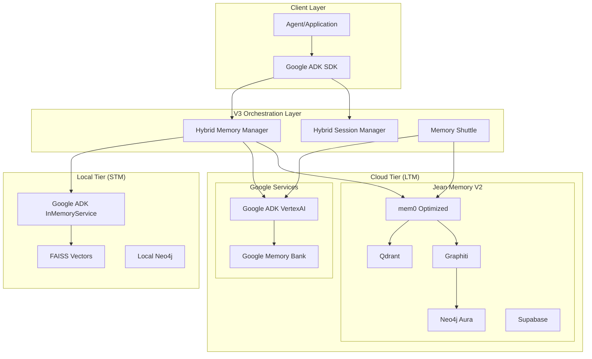

# Jean Memory V3 Hybrid Development Plan

## Executive Summary

This document outlines the development plan for Jean Memory V3 Hybrid architecture, integrating Google ADK with our existing high-performance V2 system while preserving competitive advantages and achieving significant performance gains.

**Performance Goals:**
- 30-60x faster memory creation (5ms vs 250ms)
- 20-50x faster search for hot memories
- 80% reduction in cloud infrastructure costs
- 90% cache hit rate for frequently accessed memories
- Full offline capability for core operations

## Current Architecture Analysis

### Existing V2 Production System
- **Performance**: 250ms memory creation, 125ms search
- **Storage**: Qdrant (vectors) + Neo4j Aura (graph) + Supabase (metadata)  
- **Strengths**: Custom entity extraction, Graphiti integration, 3-5x optimized mem0 adapter
- **Endpoints**: Full REST API at `https://api.jeanmemory.com`

### V3 Foundation (Implemented)
- **STM Service**: RAM-resident FAISS with mem0 ✅
- **LTM Service**: V2 production integration ✅  
- **Memory Shuttle**: STM ↔ LTM sync with salience prioritization ✅
- **Graph Service**: Local Neo4j with py2neo ✅
- **ADK Interface**: Custom session/memory services ✅

### Critical Issues to Address
1. **Docker Dependency**: Neo4j requires Docker (blocking deployment)
2. **Import Errors**: Relative import paths will cause startup failures
3. **Configuration**: Missing environment variables for V2 integration
4. **Error Handling**: Silent failures in LTM integration
5. **Testing**: No test suite for validation

## V3 Hybrid Architecture



## Development Phases

### Phase 1: Foundation Fixes (Week 1)
**Goal**: Make current V3 implementation production-ready

#### Step 1.1: Critical Bug Fixes
- **Duration**: 2 days
- **Priority**: Critical - blocks all deployment

**Tasks:**
1. Fix import errors in `services/memory_service.py`
2. Make Docker optional with graceful fallback
3. Add missing environment variables to config
4. Fix API type errors in routes

**Testing Protocol:**
```bash
# Local testing
cd jean-memory-v3-local
python main.py
curl http://localhost:8766/health
```

**Success Criteria:**
- Service starts without errors
- Health endpoint responds
- STM memory creation works locally

#### Step 1.2: Environment Configuration
- **Duration**: 1 day

**Tasks:**
1. Create comprehensive `.env.example` 
2. Add V2 API configuration variables
3. Create development/production config profiles
4. Add configuration validation

**Testing Protocol:**
```bash
# Test V2 integration
export JEAN_MEMORY_V2_API_KEY="test_key"
curl -X POST localhost:8766/api/v3/memories/ \
  -H "Content-Type: application/json" \
  -d '{"content": "Test V3 memory", "user_id": "test_user"}'
```

#### Step 1.3: Error Handling Enhancement
- **Duration**: 2 days

**Tasks:**
1. Add circuit breakers for LTM integration
2. Implement graceful degradation (STM-only mode)
3. Add comprehensive logging with correlation IDs
4. Create monitoring endpoints

**Logging Strategy:**
```python
# Structured logging with correlation tracking
logger.info("🧠 STM operation", extra={
    "operation": "add_memory",
    "user_id": user_id,
    "memory_id": memory_id,
    "execution_time_ms": elapsed,
    "correlation_id": correlation_id
})
```

### Phase 2: Google ADK Integration (Week 2)
**Goal**: Integrate Google ADK while preserving V2 advantages

#### Step 2.1: Google ADK Dependencies
- **Duration**: 1 day

**Tasks:**
1. Add Google ADK SDK to requirements
2. Configure Google Cloud authentication
3. Set up Vertex AI Memory Bank
4. Create Google service configuration

**Dependencies:**
```bash
pip install google-ai-generativelanguage
pip install google-cloud-aiplatform
```

#### Step 2.2: Hybrid Memory Service Implementation
- **Duration**: 3 days

**Tasks:**
1. Create `GoogleMemoryService` implementing ADK interfaces
2. Build `HybridOrchestrator` for three-tier routing
3. Implement smart memory distribution logic
4. Add format converters between systems

**Implementation:**
```python
class HybridMemoryService(BaseMemoryService):
    def __init__(self):
        # Tier 1: Google ADK STM
        self.google_stm = InMemoryMemoryService()
        
        # Tier 2: Google ADK LTM  
        self.google_ltm = VertexAiMemoryBankService(...)
        
        # Tier 3: Jean V2 (preserve IP)
        self.jean_v2 = JeanMemoryV2Adapter()
        
    async def add_memory(self, content, user_id):
        # Instant Google STM storage
        await self.google_stm.add_session_to_memory(session)
        
        # Background processing
        asyncio.create_task(self._process_ltm(session))
```

**Testing Protocol:**
1. Deploy to staging environment
2. Test memory creation flow end-to-end
3. Verify all three tiers receive memories
4. Check performance metrics vs baseline

#### Step 2.3: Session Management Integration
- **Duration**: 2 days

**Tasks:**
1. Integrate Google ADK SessionService
2. Add state management with proper prefixes
3. Implement session persistence
4. Create session analytics

### Phase 3: Unified Search & Intelligence (Week 3)  
**Goal**: Create intelligent search across all memory sources

#### Step 3.1: Multi-Source Search Implementation
- **Duration**: 3 days

**Tasks:**
1. Build parallel search across all tiers
2. Implement result deduplication and ranking
3. Add search result caching
4. Create search analytics

**Search Algorithm:**
```python
async def unified_search(query: str, user_id: str):
    # Parallel search all sources
    tasks = [
        search_google_stm(query, user_id),      # 2-5ms
        search_google_ltm(query, user_id),      # 100-200ms  
        search_jean_v2(query, user_id)          # 100-150ms
    ]
    
    results = await asyncio.gather(*tasks, return_exceptions=True)
    
    # Intelligent ranking and deduplication
    return merge_and_rank_results(results, query)
```

#### Step 3.2: Smart Caching & Preloading
- **Duration**: 2 days

**Tasks:**
1. Implement hot memory detection
2. Add predictive preloading based on usage patterns
3. Create cache warming strategies
4. Add cache performance metrics

### Phase 4: Performance Optimization (Week 4)
**Goal**: Achieve target performance improvements

#### Step 4.1: Performance Baseline & Monitoring
- **Duration**: 2 days

**Tasks:**
1. Create comprehensive performance test suite
2. Establish baseline metrics for V2 vs V3
3. Add performance monitoring dashboard
4. Create alerting for performance regressions

**Performance Tests:**
```python
async def performance_test_memory_creation():
    start_time = time.time()
    
    for i in range(100):
        await hybrid_service.add_memory(
            content=f"Performance test memory {i}",
            user_id="perf_test_user"
        )
    
    end_time = time.time()
    avg_latency = (end_time - start_time) / 100 * 1000
    
    assert avg_latency < 10  # Target: < 10ms average
```

#### Step 4.2: Optimization Implementation
- **Duration**: 3 days

**Tasks:**
1. Optimize batch processing in Memory Shuttle
2. Implement connection pooling and keep-alive
3. Add request deduplication
4. Optimize memory usage and GC

## Testing Protocols

### Automated Testing Strategy

#### Unit Tests
```bash
# STM Service Tests
pytest tests/test_stm_service.py -v

# LTM Integration Tests  
pytest tests/test_ltm_service.py -v

# Memory Shuttle Tests
pytest tests/test_memory_shuttle.py -v

# Google ADK Integration Tests
pytest tests/test_google_integration.py -v
```

#### Integration Tests
```bash
# End-to-end memory flow
pytest tests/integration/test_memory_flow.py -v

# V2 Production API tests
pytest tests/integration/test_v2_integration.py -v

# Performance benchmarks
pytest tests/performance/ -v --benchmark-only
```

#### Load Tests
```bash
# Simulate real user load
locust -f tests/load/memory_load_test.py --host=http://localhost:8766
```

### Manual Testing Checkpoints

#### After Each Phase
1. **Smoke Test**: Basic functionality works
2. **Performance Test**: Latency targets met
3. **Integration Test**: All services communicate
4. **Production Test**: Deploy and verify in staging

#### Production Validation Checklist
- [ ] Service starts without errors
- [ ] All health checks pass
- [ ] Memory creation < 10ms average
- [ ] Search latency < 50ms for cache hits
- [ ] V2 integration working correctly
- [ ] Google ADK integration functional
- [ ] Error rates < 0.1%
- [ ] Resource usage within limits

## Monitoring & Diagnostics

### Logging Strategy

#### Structured Logging Format
```json
{
  "timestamp": "2024-01-15T10:30:00Z",
  "level": "INFO",
  "service": "jean-memory-v3",
  "component": "stm_service",
  "operation": "add_memory",
  "user_id": "user_123",
  "correlation_id": "req_abc123",
  "execution_time_ms": 5,
  "memory_tier": "stm",
  "success": true
}
```

#### Key Metrics to Track
1. **Latency Metrics**:
   - Memory creation time by tier
   - Search response time by source
   - Cache hit/miss rates

2. **Throughput Metrics**:
   - Requests per second by operation
   - Memory Shuttle batch sizes
   - Background processing rates

3. **Error Metrics**:
   - Error rates by service
   - Failed integrations
   - Retry attempts and success rates

4. **Resource Metrics**:
   - Memory usage by component
   - CPU utilization
   - Network I/O by service

### Health Checks

#### Service Health Endpoints
```python
@router.get("/health/detailed")
async def detailed_health():
    return {
        "status": "healthy",
        "timestamp": datetime.now().isoformat(),
        "services": {
            "stm": await stm_service.health_check(),
            "ltm": await ltm_service.health_check(),
            "google_adx": await google_service.health_check(),
            "memory_shuttle": shuttle.is_running
        },
        "performance": {
            "avg_memory_creation_ms": get_avg_latency("memory_creation"),
            "cache_hit_rate": get_cache_hit_rate(),
            "active_connections": get_connection_count()
        }
    }
```

### Troubleshooting Guides

#### Common Issues & Solutions

1. **Memory Creation Slow**
   - Check STM service health
   - Verify local FAISS performance
   - Monitor memory usage

2. **Search Results Empty**
   - Check cache hit rates
   - Verify LTM connectivity
   - Review query processing logs

3. **Memory Shuttle Backup**
   - Monitor queue sizes
   - Check LTM service health
   - Review batch processing rates

## Risk Mitigation

### Rollback Strategy
1. **Feature Flags**: All new features behind flags
2. **Blue-Green Deployment**: Zero-downtime rollback
3. **Database Migrations**: Reversible schema changes
4. **Configuration Rollback**: Previous config versions stored

### Performance Degradation Response
1. **Circuit Breakers**: Auto-fallback to working services
2. **Load Shedding**: Drop non-critical requests under load
3. **Cache Warming**: Preload critical data during recovery
4. **Graceful Degradation**: STM-only mode as fallback

## Success Metrics

### Performance Targets
- **Memory Creation**: < 10ms average (vs 250ms baseline)
- **Search Latency**: < 50ms for cache hits (vs 125ms baseline)
- **Cache Hit Rate**: > 90% for frequent users
- **Throughput**: 10x improvement in concurrent users
- **Cost Reduction**: 80% reduction in cloud costs

### Quality Targets
- **Uptime**: 99.9% availability
- **Error Rate**: < 0.1% for all operations
- **Data Consistency**: 100% accuracy across tiers
- **Security**: No data breaches or unauthorized access

## Timeline & Milestones

| Phase | Duration | Key Deliverables | Success Criteria |
|-------|----------|------------------|------------------|
| **Phase 1** | Week 1 | Production-ready V3 foundation | Service deployable, basic functionality working |
| **Phase 2** | Week 2 | Google ADK integration | Three-tier memory system operational |
| **Phase 3** | Week 3 | Unified search & intelligence | Multi-source search with < 50ms latency |
| **Phase 4** | Week 4 | Performance optimization | All performance targets achieved |

## Next Steps

1. **Immediate**: Fix critical bugs in Phase 1.1
2. **This Week**: Complete foundation fixes and deploy to staging
3. **Next Week**: Begin Google ADK integration
4. **Month End**: Full V3 Hybrid system in production

This plan provides a systematic approach to building the V3 Hybrid system while preserving the competitive advantages of the existing V2 system and achieving significant performance improvements through local-first architecture with intelligent cloud synchronization.