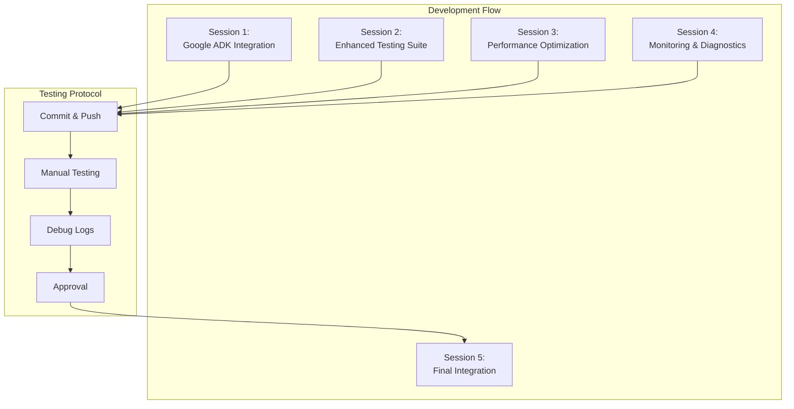

# Jean Memory V3 Multi-Session Development Guide

## Overview

This guide enables parallel development of Jean Memory V3 Hybrid architecture using multiple Claude Code sessions. Each session focuses on isolated features with safe testing protocols and commit checkpoints.

## Current Status: Phase 1.1 Complete ✅

**Foundation Status:**
- ✅ Service starts without errors
- ✅ Health endpoint responds (200 OK)
- ✅ STM memory creation works locally
- ✅ Docker/Neo4j/OpenAI graceful fallbacks implemented
- ✅ Import errors fixed, API types corrected

**Ready for:** Phase 1.2+ parallel development

## Multi-Session Architecture

### Session Isolation Strategy

Each session works on independent modules with:
- **Isolated git branches** per session
- **Independent testing protocols** 
- **Commit & push checkpoints** before manual testing
- **Clear integration handoff points**

### Development Paradigm



## Session Assignments

### Session 1: Google ADK Integration Core
**Branch:** `session-1-google-adk-core`
**Priority:** High
**Dependencies:** None (builds on current foundation)

### Session 2: Enhanced Testing & Validation Suite  
**Branch:** `session-2-testing-suite`
**Priority:** High
**Dependencies:** None (parallel to Session 1)

### Session 3: Performance Optimization & Monitoring
**Branch:** `session-3-performance`
**Priority:** Medium
**Dependencies:** Session 1 completion

### Session 4: Advanced Features & Intelligence
**Branch:** `session-4-advanced-features`
**Priority:** Medium  
**Dependencies:** Sessions 1 & 2 completion

### Session 5: Final Integration & Production Readiness
**Branch:** `session-5-final-integration`
**Priority:** Critical
**Dependencies:** All other sessions complete

## Development Protocol

### Pre-Session Setup

1. **Create isolated branch:**
   ```bash
   git checkout -b session-X-feature-name
   git push -u origin session-X-feature-name
   ```

2. **Verify current service status:**
   ```bash
   python main.py &
   curl http://localhost:8766/health
   kill %1
   ```

3. **Document baseline state** in session-specific notes

### During Session Development

1. **Implement features** per session specification
2. **Test locally** after each major change
3. **Commit frequently** with descriptive messages
4. **Log debug output** to session-specific log files

### Testing Checkpoint Protocol

1. **Pre-commit testing:**
   ```bash
   # Test basic functionality
   python -c "from services.memory_service import JeanMemoryV3Service; print('✅ Imports work')"
   
   # Test service startup
   timeout 10 python main.py
   ```

2. **Commit with detailed message:**
   ```bash
   git add .
   git commit -m "Session X: [Feature] - [What was implemented]
   
   - Specific changes made
   - Testing status
   - Known issues if any
   
   Ready for manual testing"
   ```

3. **Push and wait for manual approval:**
   ```bash
   git push
   ```

4. **Manual testing checklist** (provided per session)

5. **Debug log analysis** if issues found

### Post-Testing Actions

- **If tests pass:** Proceed to next feature in session
- **If tests fail:** Fix issues, repeat testing protocol
- **Session complete:** Mark as ready for integration

## Session-Specific Development Documents

The following documents detail each session's specific tasks, testing protocols, and integration requirements:

1. `SESSION_1_GOOGLE_ADK_INTEGRATION.md`
2. `SESSION_2_TESTING_SUITE.md` 
3. `SESSION_3_PERFORMANCE_OPTIMIZATION.md`
4. `SESSION_4_ADVANCED_FEATURES.md`
5. `SESSION_5_FINAL_INTEGRATION.md`

## Integration Coordination

### Session Dependencies Map

```
Session 1 (Google ADK) ──┐
                         ├── Session 5 (Final Integration)
Session 2 (Testing) ─────┤
                         │
Session 3 (Performance) ─┤
                         │
Session 4 (Advanced) ────┘
```

### Integration Checkpoints

1. **Checkpoint 1:** Sessions 1 & 2 complete
   - Test Google ADK integration with enhanced test suite
   - Verify performance baselines

2. **Checkpoint 2:** Sessions 3 & 4 complete  
   - Test optimized performance with monitoring
   - Verify advanced features work with ADK

3. **Checkpoint 3:** All sessions complete
   - Final integration testing
   - Production deployment readiness

## Communication Protocol

### Session Updates

Each session maintains:
- **Progress log** in session branch README
- **Issue tracker** for blockers/questions
- **Integration notes** for handoff requirements

### Cross-Session Coordination

- **Minimal dependencies** between Sessions 1-4
- **Clear interfaces** defined for integration points
- **Session 5** handles all cross-cutting concerns

## Safety Protocols

### Rollback Strategy

Each session maintains:
- **Known good state** tagged commits
- **Rollback instructions** in session docs
- **Isolation verification** after each major change

### Production Safety

- **No production deployment** until Session 5 complete
- **Staging environment** testing for each session
- **Feature flags** for gradual rollout

## Next Steps

1. **Read session-specific documents** for detailed implementation plans
2. **Start with Sessions 1 & 2** simultaneously (no dependencies)
3. **Follow testing protocol** religiously for each checkpoint
4. **Manual testing approval** before proceeding to next feature
5. **Begin Session 5** only after all others complete

This approach ensures:
- ✅ **Parallel development** without conflicts
- ✅ **Safe iterative testing** at each step  
- ✅ **Debug capability** through detailed logs
- ✅ **Production safety** through isolation
- ✅ **Clear integration path** with Session 5

---

**Status:** Ready to begin parallel development
**Next Action:** Start Sessions 1 & 2 simultaneously