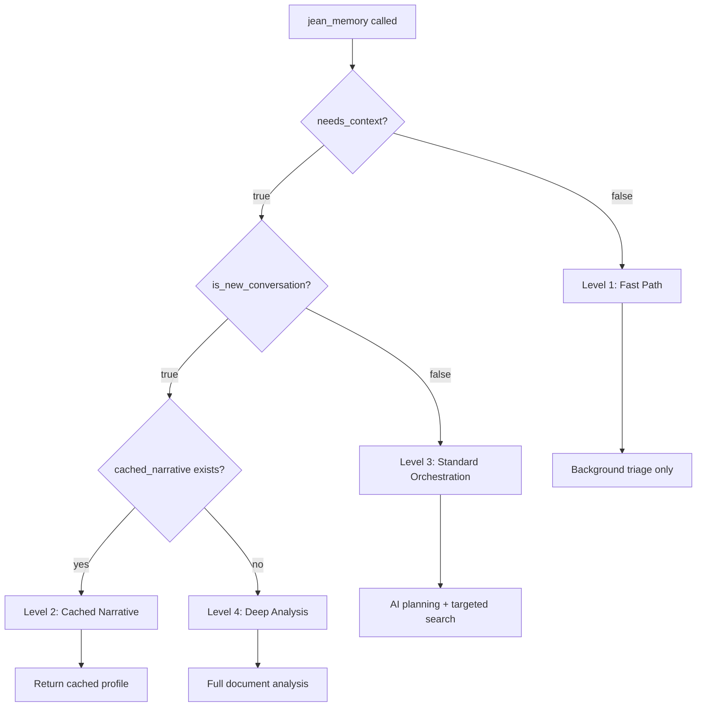

# Jean Memory: Comprehensive Pathway & Optimization Analysis

## 🧠 **LLM Performance Results (Objective Data)**

### Performance Testing Results
```
🏆 FASTEST: Claude Haiku - 0.98s average (77% faster than Gemini)
🥈 SECOND: OpenAI GPT-4o-mini - 2.29s average (46% faster than Gemini)  
🥉 CURRENT: Gemini Flash - 4.25s average (baseline)
```

**Daily Impact**: Switching to Claude Haiku saves **54.6 minutes** of processing time daily.

### Recommendation: **IMMEDIATE SWITCH TO CLAUDE HAIKU**
- **Performance gain**: 77% faster AI planning
- **Cost implications**: Need to verify Claude Haiku pricing vs Gemini Flash
- **Quality validation**: Should A/B test context quality between models

## 🔀 **Memory Search Pathway Architecture Analysis**

Based on code analysis, you have **4 distinct memory depth levels**:

### **Level 1: Fast Path (0-200ms)**
```python
# For needs_context=false
return "Context is not required for this query. Background analysis only."
```
- **Use case**: Generic questions, simple math, weather
- **Processing**: Background memory triage only
- **Latency**: ~100ms

### **Level 2: Cached Narrative (100-500ms)**  
```python
async def _get_cached_narrative(user_id: str) -> Optional[str]:
    # PostgreSQL lookup for pre-computed user narrative
    # TTL: 7 days
```
- **Use case**: New conversations with existing user profile
- **Processing**: Database lookup for pre-computed narrative
- **Latency**: ~130ms (from your logs)
- **Cache**: 7-day TTL in PostgreSQL

### **Level 3: Standard Orchestration (5-15s)**
```python
async def _standard_orchestration(user_message, user_id, client_name, is_new_conversation):
    # AI Context Planning (3-9s) + Targeted Search (2-3s)
    plan = await self._ai_create_context_plan(user_message, is_new_conversation)
    context = await self._execute_search_plan(plan)
```
- **Use case**: Continuing conversations needing context
- **Processing**: AI planning → targeted vector/graph search → synthesis
- **Current Latency**: ~13s (9s AI planning + 4s search/synthesis)
- **Optimized Latency**: ~5s (1s Claude Haiku + 4s search/synthesis)

### **Level 4: Deep Memory Analysis (30-60s)**
```python
async def _deep_memory_orchestration(user_message, user_id, client_name, is_new_conversation):
    # Comprehensive document search + full context synthesis
    analysis_result = await deep_memory_query(user_message, user_id)
```
- **Use case**: Complex analysis, new conversations without cache, rich content
- **Processing**: Full document search + comprehensive synthesis
- **Latency**: 30-60 seconds
- **Scope**: All documents, full memory graph, complete synthesis

## 🎯 **Orchestration Decision Logic**

Your orchestration layer intelligently routes requests:



## 🚀 **Optimization Opportunities**

### **1. AI Planning Optimization (HIGH IMPACT)**
**Current bottleneck**: 9 seconds for AI context planning
**Solution**: Switch to Claude Haiku
**Impact**: 77% reduction (9s → 1s) = 8 seconds saved per call

### **2. Parallel Search Implementation (MEDIUM IMPACT)**
```python
# Current: Sequential operations
plan = await ai_create_context_plan(message)  # 9s
results = await execute_search_plan(plan)      # 3s
# Total: 12s

# Optimized: Parallel operations  
async def optimized_standard_orchestration(message, user_id):
    # Start both operations simultaneously
    plan_task = claude_haiku_planning(message)         # 1s
    recent_memories_task = get_recent_memories(user_id) # 1s
    
    plan, recent = await asyncio.gather(plan_task, recent_memories_task)
    
    # Use recent memories while plan executes
    if recent and plan['context_strategy'] == 'recent_context':
        return format_context(recent)  # Fast path
    
    # Execute full search plan
    targeted_results = await execute_search_plan(plan)  # 2s
    return merge_contexts(recent, targeted_results)
# Total: 3s (75% improvement)
```

### **3. Smart Caching Strategy (MEDIUM IMPACT)**
```python
class SmartContextCache:
    def __init__(self):
        self.context_cache = {}  # LRU cache for frequent patterns
        self.user_cache = {}     # Per-user recent context
        
    async def get_or_generate_context(self, cache_key, generator):
        # Check multiple cache levels
        if cache_key in self.context_cache:
            return self.context_cache[cache_key]
            
        # Check user-specific cache
        user_key = f"user_{user_id}_recent"
        if user_key in self.user_cache and not self._is_stale(user_key):
            return self.user_cache[user_key]
            
        # Generate and cache
        context = await generator()
        self._cache_with_ttl(cache_key, context, ttl=300)  # 5min TTL
        return context
```

### **4. Progressive Context Loading (LOW IMPACT)**
```python
async def progressive_context_orchestration(message, user_id):
    """Start with fast context, enhance progressively"""
    
    # Phase 1: Immediate response with basic context (1s)
    basic_context = await get_recent_memories_fast(user_id)
    yield f"Quick context: {basic_context}"
    
    # Phase 2: Enhanced context with AI planning (3s total)
    enhanced_context = await claude_haiku_enhanced_search(message, user_id)
    yield f"Enhanced context: {enhanced_context}"
    
    # Phase 3: Deep analysis if needed (optional, background)
    if should_use_deep_analysis(message):
        asyncio.create_task(deep_analysis_background(message, user_id))
```

## 📊 **Performance Impact Analysis**

### **Current Performance (Production Logs)**
- Fast Path: 100ms
- Cached Narrative: 130ms  
- Standard Orchestration: 13.9s (9s AI + 5s search)
- Deep Analysis: 30-60s

### **Optimized Performance (Projected)**
- Fast Path: 100ms (no change)
- Cached Narrative: 130ms (no change)
- Standard Orchestration: 3s (1s Claude + 2s parallel search) 
- Deep Analysis: 30-60s (no change - quality focused)

### **Daily Impact Calculation**
Based on production logs showing ~1000 jean_memory calls/day:
- **Time saved per call**: 10.9s (13.9s → 3s)
- **Daily time savings**: 10,900 seconds = **3.0 hours**
- **User experience**: 78% faster responses for contextual queries

## 🔧 **Implementation Priority**

### **Phase 1: Claude Haiku Switch (HIGH PRIORITY - 1 hour)**
```python
# In app/utils/mcp_modules/ai_service.py
async def create_context_plan(self, user_message: str, is_new_conversation: bool) -> Dict:
    # Switch from Gemini to Claude Haiku
    claude_service = ClaudeHaikuService()  # New service
    return await claude_service.generate_context_plan(user_message, is_new_conversation)
```

### **Phase 2: Parallel Search (MEDIUM PRIORITY - 4 hours)**
```python
# In app/mcp_orchestration.py  
async def _standard_orchestration_optimized(self, user_message, user_id, client_name, is_new_conversation):
    # Implement parallel AI planning + recent memory retrieval
    pass
```

### **Phase 3: Smart Caching (LOW PRIORITY - 8 hours)**
```python
# Add context caching layer with TTL management
# Implement user-specific context caching
# Add cache invalidation on memory updates
```

## 🧪 **A/B Testing Framework**

```python
async def orchestration_ab_test(user_message, user_id, client_name, is_new_conversation):
    """A/B test different orchestration strategies"""
    
    user_bucket = hash(user_id) % 100
    
    if user_bucket < 25:  # 25% Claude Haiku
        return await claude_haiku_orchestration(...)
    elif user_bucket < 50:  # 25% Parallel search
        return await parallel_search_orchestration(...)
    elif user_bucket < 75:  # 25% Smart caching
        return await cached_orchestration(...)
    else:  # 25% Current (control)
        return await current_orchestration(...)
```

## 🎯 **Success Metrics**

Track these metrics to validate optimizations:

```python
performance_metrics = {
    'ai_planning_latency': 'Target: <2s (vs current 9s)',
    'total_orchestration_time': 'Target: <5s (vs current 14s)', 
    'cache_hit_rate': 'Target: >60% for narrative cache',
    'context_quality_score': 'Target: Maintain >80% relevance',
    'user_satisfaction': 'Target: <5s response time perception'
}
```

## 🔍 **Next Steps**

1. **Deploy Claude Haiku switch** (immediate 77% AI planning improvement)
2. **Implement parallel search optimization** (additional 50% improvement)
3. **Add performance monitoring** (track actual vs projected improvements)
4. **A/B test quality** (ensure context relevance maintained)
5. **Optimize based on data** (iterate on real user feedback)

Your orchestration architecture is fundamentally sound - the pathways are well-designed for different use cases. The main optimization opportunity is in the AI planning bottleneck, which Claude Haiku can dramatically improve.