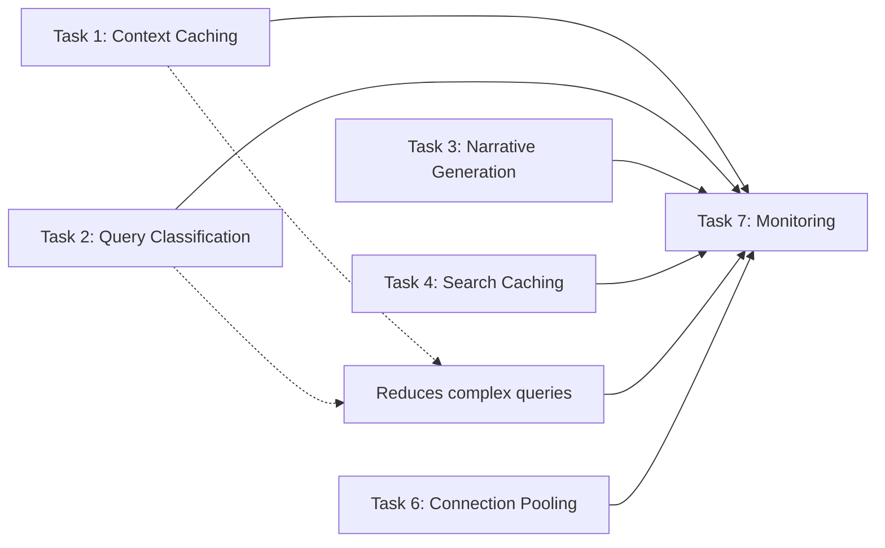

# Jean Memory Performance Optimization - Notion Board Tasks

## Phase 1: Quick Wins (Week 1)

### Task 1: Implement AI Context Plan Caching
**Title:** Add LRU cache for AI context plans
**Category:** Ready
**Priority:** P0
**Description:** Cache Gemini API context plans to eliminate 60-80% of response time for similar queries. Expected 70-90% performance boost for cached queries with 40-60% cache hit rate.
**Owner:** [Assign]
**Links:** 
- FRD: See Item 1 in OPTIMIZATION_MINI_FRDS.md
- EDD: See Item 1 in OPTIMIZATION_MINI_FRDS.md

### Task 2: Add Smart Query Classification
**Title:** Bypass AI planning for simple queries
**Category:** Ready  
**Priority:** P0
**Description:** Pattern-match greetings and simple queries to skip unnecessary AI planning. 25-40% of queries can be 30-50% faster without quality loss.
**Owner:** [Assign]
**Links:**
- FRD: See Item 2 in OPTIMIZATION_MINI_FRDS.md
- EDD: See Item 2 in OPTIMIZATION_MINI_FRDS.md

## Phase 2: Critical Optimization (Week 2)

### Task 3: Enable Background Narrative Generation
**Title:** Pre-compute user narratives asynchronously
**Category:** Backlog
**Priority:** P0
**Description:** Generate narratives in background after memory saves to reduce new conversation time from 15s to 1.5s (90% improvement).
**Owner:** [Assign]
**Links:**
- FRD: See Item 3 in OPTIMIZATION_MINI_FRDS.md
- EDD: See Item 3 in OPTIMIZATION_MINI_FRDS.md

## Phase 3: System Improvements (Week 3)

### Task 4: Cache Memory Search Results
**Title:** Add search result caching layer
**Category:** Backlog
**Priority:** P1
**Description:** Cache Qdrant search results for 10 minutes to reduce repeated queries by 15-25%. Minimal memory footprint (<1MB).
**Owner:** [Assign]
**Links:**
- FRD: See Item 4 in OPTIMIZATION_MINI_FRDS.md
- EDD: See Item 4 in OPTIMIZATION_MINI_FRDS.md

### Task 5: Parallelize Context Strategy Execution
**Title:** Optimize deep context strategies with parallel processing
**Category:** Backlog
**Priority:** P1
**Description:** Use asyncio.gather() to parallelize independent operations in complex strategies. 40-60% faster execution for deep analysis queries.
**Owner:** [Assign]
**Links:**
- FRD: See Item 6 in OPTIMIZATION_MINI_FRDS.md
- EDD: See Item 6 in OPTIMIZATION_MINI_FRDS.md

### Task 6: Configure Database Connection Pooling
**Title:** Add connection pooling and async optimizations
**Category:** Backlog
**Priority:** P1
**Description:** Configure SQLAlchemy connection pools and optimize async patterns for 15-25% overall improvement and 2x concurrent user capacity.
**Owner:** [Assign]
**Links:**
- FRD: See Item 8 in OPTIMIZATION_MINI_FRDS.md
- EDD: See Item 8 in OPTIMIZATION_MINI_FRDS.md

## Phase 4: Monitoring (Week 4)

### Task 7: Add Performance Monitoring
**Title:** Implement cache metrics and performance tracking
**Category:** Backlog
**Priority:** P2
**Description:** Add logging for cache hit rates, response times, and resource usage to validate optimization impact.
**Owner:** [Assign]
**Links:**
- Part of Items 1, 4, 8 monitoring requirements

## Task Dependencies



## Definition of Done

Each task is complete when:
- [ ] Code implemented and tested locally
- [ ] Unit tests written and passing
- [ ] Performance metrics logged
- [ ] Deployed to staging
- [ ] Acceptance criteria verified
- [ ] Production deployment successful
- [ ] Monitoring confirms expected improvements

## Expected Outcomes

| Week | Tasks | Expected Impact |
|------|-------|-----------------|
| 1 | Tasks 1-2 | 60-70% faster for common queries |
| 2 | Task 3 | 90% faster new conversations |
| 3 | Tasks 4-6 | 25-40% overall improvement |
| 4 | Task 7 | Full visibility into gains |

## JIRA Task Format

For each task in JIRA, use this structure:

**Title:** [From above]
**Type:** Task
**Priority:** [P0/P1/P2 from above]
**Story Points:** 
- Tasks 1-2: 3 points each
- Task 3: 5 points
- Tasks 4-6: 3 points each
- Task 7: 2 points

**Description:**
```
## Problem
[One sentence problem statement]

## Solution
[One sentence solution]

## Impact
[Expected performance improvement]

## FRD Link
[Link to OPTIMIZATION_MINI_FRDS.md#item-X]

## EDD Link
[Link to OPTIMIZATION_MINI_FRDS.md#item-X]
```

**Acceptance Criteria:**
[Copy from mini-FRD]

**Labels:** performance, optimization, backend

**Sprint:** Assign based on phase

## Notes for Implementation

1. **Start with Tasks 1-2** - These are true quick wins with minimal risk
2. **Task 3 is critical** - This addresses the worst user experience (15s wait)
3. **Tasks 4-6 can be done in parallel** - Assign to different developers
4. **Task 7 is ongoing** - Add metrics as you implement each optimization
5. **Skip complex items** - We've removed Evaluation Framework and Targeted Indexing as they're not worth the complexity right now