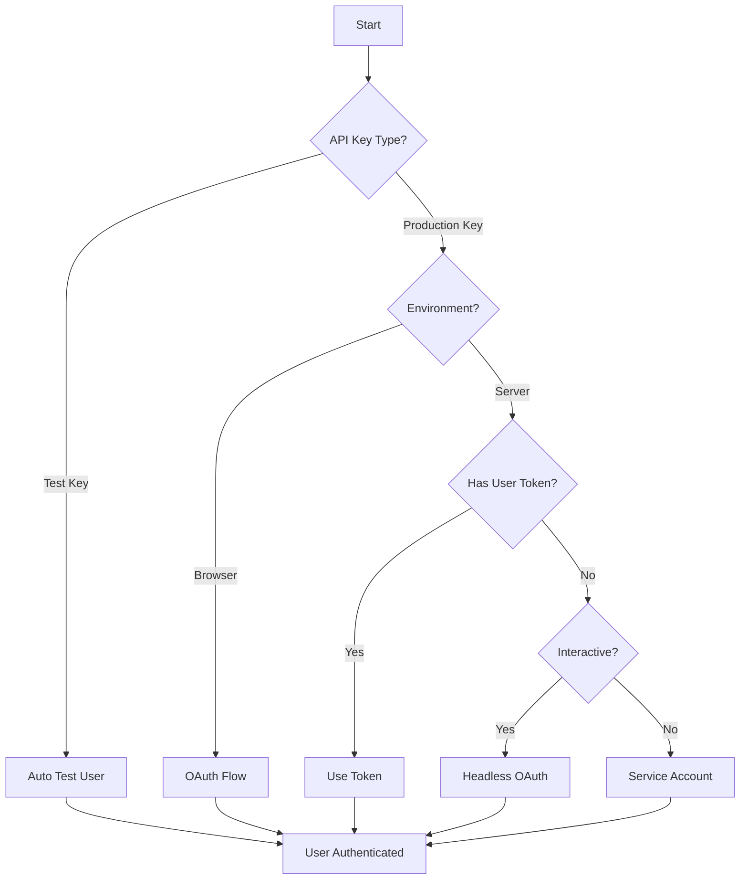

# 🔐 Jean Memory OAuth Authentication System - Complete Analysis & Resolution Plan

**Date:** August 16, 2025  
**Status:** 🔴 ROOT CAUSE IDENTIFIED - Supabase OAuth Hijacking Confirmed  
**Priority:** P0 - Blocking SDK Production Deployment

---

## 🎯 Executive Summary

**BREAKTHROUGH**: After extensive investigation, the root cause has been identified. OAuth never worked because of **Supabase's GoTrue client hijacking third-party OAuth flows**. This is a well-documented issue where Supabase automatically intercepts OAuth callbacks intended for other services.

**The Real Problem:**
- Supabase Site URL is configured as `https://jeanmemory.com/oauth-bridge.html`
- When React SDK redirects to ANY OAuth endpoint, Supabase's client intercepts the callback
- This causes the OAuth flow to fail before reaching Jean Memory's OAuth handlers
- The bridge pattern exists but was never fully implemented to prevent this hijacking

**Critical Issues:**
1. **🚨 SUPABASE HIJACKING**: GoTrue client intercepts all OAuth flows (PRIMARY ISSUE)
2. **Bridge Pattern Incomplete**: oauth-bridge.html exists but isn't properly coordinated
3. **Multiple OAuth Endpoints**: Confusion between `/oauth/authorize` vs `/sdk/oauth/authorize`
4. **Client Registration Mismatch**: Backend expects certain client_ids but receives others

---

## 📊 Current Authentication Landscape

### 1. OAuth Implementations Overview

#### 1.1 Claude OAuth (`/oauth/authorize` - Production Working ✅)
- **File**: `openmemory/api/app/oauth_simple_new.py`
- **Status**: Production, working for Claude Desktop
- **Flow**: OAuth 2.1 PKCE with auto-registration
- **Redirect URIs**: 
  - `https://claude.ai/api/mcp/auth_callback` ✅ Registered
  - Auto-detects and registers new Claude clients

#### 1.2 SDK OAuth (`/sdk/oauth/*` - Partially Working ⚠️)
- **File**: `openmemory/api/app/routers/sdk_oauth.py`
- **Status**: Backend working, frontend blocked
- **Flow**: OAuth 2.1 PKCE 
- **Issues**: 
  - Redirect URIs not registered for localhost:3005
  - Hijacking issue from Supabase auth

#### 1.3 FastMCP OAuth (`/oauth/fastmcp/*` - Unknown Status ❓)
- **File**: `openmemory/api/app/routers/fastmcp_oauth.py`
- **Status**: Unclear if production ready
- **Purpose**: Alternative MCP OAuth flow

#### 1.4 Supabase Integration (Auth Backend ✅)
- **Role**: Underlying authentication provider
- **Features**: User management, JWT tokens, session handling
- **Integration Points**: All OAuth flows eventually create Supabase sessions

### 2. Registered Redirect URIs (From Supabase Console)

```
✅ https://jean-memory-ui.onrender.com
✅ http://localhost:3000
✅ https://jean-memory-ui.onrender.com/auth/callback
✅ http://localhost:3000/auth/callback
✅ https://jean-memory-ui.onrender.com/dashboard
✅ http://localhost:3001/dashboard
✅ http://localhost:3001
✅ https://jean-memory-api-virginia.onrender.com/oauth/auth-redirect
✅ https://jeanmemory.com
✅ https://jean-memory-api-virginia.onrender.com/oauth/auth-redirect?flow=mcp_oauth
✅ https://claude.ai/api/mcp/auth_callback

❌ http://localhost:3005 (SDK development port - NOT REGISTERED)
❌ http://localhost:3005/auth/callback
```

---

## 🔴 Critical Issues Analysis

### Issue 1: OAuth Redirect URI Registration

**Problem**: The React SDK demo runs on localhost:3005 but this isn't registered in Supabase.

**Root Cause**: When we built the SDK OAuth flow, we didn't coordinate with the registered redirect URIs in Supabase.

**Impact**: 404 error when OAuth callback attempts to redirect to localhost:3005.

### Issue 2: Supabase GoTrue OAuth Hijacking (ROOT CAUSE)

**Technical Details**: Supabase's GoTrue client automatically detects OAuth callbacks by looking for `#access_token` or `?code=` parameters in URLs. When it finds these, it attempts to create a Supabase session using that token/code.

**Why This Breaks Jean Memory OAuth**:
1. React SDK redirects to `jean-memory-api-virginia.onrender.com/oauth/authorize`
2. OAuth backend successfully processes authentication 
3. Backend redirects to localhost:3005 with `?code=AUTH_CODE&state=STATE`
4. **Supabase GoTrue intercepts this callback** and tries to use AUTH_CODE for Supabase auth
5. Since AUTH_CODE is not a Supabase token, this fails and breaks the flow
6. User session may be wiped out in the process

**Evidence**:
- GitHub Issue: "Using a non-Supabase OAuth implicit grant flow for non-login purposes logs the user out"
- GitHub Issue #758, #527 document this exact problem
- Supabase Site URL pointing to oauth-bridge.html confirms this was known

**Previous Attempted Solution**: 
- Created bridge pattern at `https://jeanmemory.com/oauth-bridge.html`
- Bridge should use `detectSessionInUrl: false` to prevent GoTrue hijacking
- **Problem**: Bridge was never fully implemented or coordinated with React SDK

### Issue 3: MCP vs OAuth Token Confusion

**Documentation Issue**: The docs suggest `useJeanMCP` hook works with OAuth tokens, but MCP protocol doesn't support user-specific tokens directly.

**Reality**: 
- MCP tools require API keys, not OAuth tokens
- OAuth tokens are for user authentication
- The confusion stems from trying to merge two different auth paradigms

### Issue 4: Headless Authentication Gap

**User Question**: "What about when the user just wants to build a headless version?"

**Current State**: No clear documentation or implementation for:
- Server-to-server OAuth flow
- Service account authentication
- Headless/backend-only authentication

### Issue 5: Test User Ambiguity

**Documentation Says**: "Auto test user functionality creates isolated test users"

**User Confusion**: 
- Is there a specific test user ID?
- How does it work automatically?
- When does it activate?

**Reality**: The test user is created automatically when using `jean_sk_test_*` API keys, but this isn't clearly explained.

---

## 🛠️ Resolution Plan

### Phase 1: Fix Supabase Hijacking (CRITICAL)

#### 1.1 Implement Proper Bridge Pattern
**The Solution**: Use the existing `oauth-bridge.html` with `detectSessionInUrl: false` to prevent Supabase interference.

```javascript
// React SDK - Use bridge as redirect_uri
const initiateOAuth = () => {
  const bridgeUrl = 'https://jeanmemory.com/oauth-bridge.html';
  const authUrl = new URL('https://jean-memory-api-virginia.onrender.com/oauth/authorize');
  
  authUrl.searchParams.set('client_id', apiKey);
  authUrl.searchParams.set('redirect_uri', bridgeUrl);
  authUrl.searchParams.set('response_type', 'code');
  authUrl.searchParams.set('state', state);
  authUrl.searchParams.set('code_challenge', challenge);
  authUrl.searchParams.set('code_challenge_method', 'S256');
  authUrl.searchParams.set('scope', 'read write');
  
  // Store original callback URL for bridge to use
  sessionStorage.setItem('jean_final_redirect', window.location.origin);
  
  window.location.href = authUrl.toString();
};
```

#### 1.2 Update OAuth Bridge to Prevent Hijacking
```html
<!-- Update https://jeanmemory.com/oauth-bridge.html -->
<!DOCTYPE html>
<html>
<head>
  <title>Jean Memory - Completing Authentication...</title>
  <script src="https://cdn.jsdelivr.net/npm/@supabase/supabase-js@2"></script>
</head>
<body>
  <div style="text-align: center; padding: 50px; font-family: Arial;">
    <h2>🔐 Completing Authentication...</h2>
    <p>Please wait while we finish signing you in...</p>
  </div>
  
  <script>
    // CRITICAL: Initialize Supabase with detectSessionInUrl: false
    const supabase = createClient(
      'YOUR_SUPABASE_URL', 
      'YOUR_SUPABASE_ANON_KEY',
      {
        auth: {
          detectSessionInUrl: false,  // Prevents GoTrue hijacking
          persistSession: false       // Don't create session from this page
        }
      }
    );
    
    // Extract OAuth callback parameters
    const params = new URLSearchParams(window.location.search);
    const code = params.get('code');
    const state = params.get('state');
    
    if (code && state) {
      // Get the final redirect URL from session storage
      const finalRedirect = sessionStorage.getItem('jean_final_redirect') || 'http://localhost:3005';
      
      // Redirect back to original app with OAuth code
      const returnUrl = new URL(finalRedirect);
      returnUrl.searchParams.set('code', code);
      returnUrl.searchParams.set('state', state);
      
      console.log('🎯 OAuth bridge redirecting to:', returnUrl.toString());
      window.location.href = returnUrl.toString();
    } else {
      console.error('❌ OAuth bridge: Missing code or state parameters');
      // Fallback redirect
      window.location.href = 'http://localhost:3005?error=oauth_bridge_failed';
    }
  </script>
</body>
</html>
```

#### 1.3 Register Bridge URL in Backend
```python
# In oauth_simple_new.py - Add bridge URL to allowed redirects
OAUTH_BRIDGE_URL = "https://jeanmemory.com/oauth-bridge.html"

# Update client registration to allow bridge URL
if redirect_uri == OAUTH_BRIDGE_URL:
    # Always allow bridge URL for development
    pass
elif is_local_dev:
    # For localhost, redirect to bridge instead
    redirect_uri = OAUTH_BRIDGE_URL
```

### Phase 2: Authentication Architecture Cleanup

#### 2.1 Separate MCP from OAuth
```typescript
// Clarify in SDK that MCP tools use API keys
interface JeanProvider {
  apiKey: string;  // For MCP tool access
  authMode?: 'oauth' | 'apikey' | 'test';  // Choose auth method
}

// OAuth provides user context
interface OAuthUser {
  id: string;
  access_token: string;  // JWT for API calls
  // NOT for MCP tools
}
```

#### 2.2 Implement Headless Authentication
```python
# Python SDK example for headless auth
class JeanClient:
    def __init__(self, api_key: str, auth_mode: str = 'auto'):
        self.api_key = api_key
        self.auth_mode = auth_mode
        
    def get_headless_auth_url(self, callback_url: str) -> str:
        """Generate OAuth URL for headless/server auth"""
        return f"{API_BASE}/sdk/oauth/authorize?client_id={self.api_key}&redirect_uri={callback_url}&response_type=code"
    
    def exchange_code_for_token(self, code: str) -> str:
        """Exchange OAuth code for user token"""
        response = requests.post(f"{API_BASE}/sdk/oauth/token", json={
            "grant_type": "authorization_code",
            "code": code,
            "client_id": self.api_key
        })
        return response.json()["access_token"]
```

#### 2.3 Clarify Test User Documentation
```markdown
## Test User Functionality

When using a test API key (starts with `jean_sk_test_`), the SDK automatically:

1. **Creates a test user** on first use with ID: `test_user_{api_key_hash}`
2. **Isolates memories** to this test user only
3. **No OAuth required** - authentication is automatic
4. **Perfect for development** - no user interaction needed

Example:
\```javascript
// With test API key - no OAuth needed
const jean = new JeanClient({ apiKey: 'jean_sk_test_demo_key' });
const context = await jean.getContext({
  // user_token automatically set to test user
  message: "Hello"
});
\```

For production, replace with real API key and implement OAuth flow.
```

### Phase 3: Long-term Architecture Improvements

#### 3.1 Unified Authentication Service
```python
class UnifiedAuthService:
    """Single source of truth for all authentication"""
    
    def authenticate(self, method: str, credentials: dict) -> AuthResult:
        if method == 'oauth':
            return self.oauth_flow(credentials)
        elif method == 'api_key':
            return self.api_key_auth(credentials)
        elif method == 'test':
            return self.test_user_auth(credentials)
        elif method == 'service_account':
            return self.service_account_auth(credentials)
```

#### 3.2 Authentication Flow Decision Tree


---

## 🚀 Implementation Priority

### Immediate (Today) 
1. 🚨 **Fix oauth-bridge.html with detectSessionInUrl: false** (CRITICAL)
2. 🚨 **Update React SDK to use bridge pattern** (CRITICAL)
3. 🚨 **Register bridge URL in backend OAuth** (CRITICAL)
4. ✅ Test complete OAuth flow without Supabase hijacking

### Short-term (This Week)
1. ⏳ Implement headless authentication flow
2. ⏳ Create service account support
3. ⏳ Unify authentication architecture
4. ⏳ Add comprehensive auth examples

### Long-term (This Month)
1. ⏳ Migrate all auth to unified service
2. ⏳ Add enterprise SSO support
3. ⏳ Implement auth caching layer
4. ⏳ Create auth debugging tools

---

## 🔧 Specific Code Fixes Required

### Fix 1: React SDK Provider OAuth Handler
```typescript
// sdk/react/provider.tsx
const handleOAuthCallback = async () => {
  const params = new URLSearchParams(window.location.search);
  const code = params.get('code');
  const state = params.get('state');
  
  if (code && state) {
    try {
      // Validate state
      const storedState = sessionStorage.getItem('jean_oauth_state');
      if (state !== storedState) {
        throw new Error('Invalid state - possible CSRF attack');
      }
      
      // Exchange code for token
      const tokenResponse = await fetch(`${API_BASE}/sdk/oauth/token`, {
        method: 'POST',
        headers: { 'Content-Type': 'application/json' },
        body: JSON.stringify({
          grant_type: 'authorization_code',
          code,
          client_id: apiKey,
          redirect_uri: window.location.origin + window.location.pathname,
          code_verifier: sessionStorage.getItem('jean_oauth_verifier')
        })
      });
      
      if (!tokenResponse.ok) {
        // Fallback to test user if OAuth fails
        if (apiKey.startsWith('jean_sk_test_')) {
          await initializeTestUser();
          return;
        }
        throw new Error('Token exchange failed');
      }
      
      const { access_token, user } = await tokenResponse.json();
      setUser({ ...user, access_token });
      localStorage.setItem('jean_auth_token', access_token);
      
      // Clean up URL
      window.history.replaceState({}, document.title, window.location.pathname);
    } catch (error) {
      console.error('OAuth callback error:', error);
      setError(error.message);
    }
  }
};
```

### Fix 2: Backend OAuth Router Updates
```python
# openmemory/api/app/routers/sdk_oauth.py

@router.get("/authorize")
async def authorize(
    request: Request,
    client_id: str,
    redirect_uri: str,
    response_type: str = "code",
    state: str = None,
    code_challenge: str = None,
    code_challenge_method: str = "S256"
):
    # Special handling for localhost development
    if "localhost" in redirect_uri:
        # Use bridge pattern
        bridge_url = "https://jeanmemory.com/oauth-bridge.html"
        final_redirect = redirect_uri
        redirect_uri = bridge_url
        
        # Store final redirect in session
        request.session["final_redirect"] = final_redirect
    
    # Continue with normal OAuth flow
    ...
```

### Fix 3: Test User Initialization
```typescript
// sdk/react/provider.tsx
const initializeTestUser = async () => {
  if (!apiKey.startsWith('jean_sk_test_')) {
    throw new Error('Test user only available with test API keys');
  }
  
  // Generate consistent test user ID from API key
  const testUserId = `test_user_${hashApiKey(apiKey)}`;
  
  // Create or get test user token
  const response = await fetch(`${API_BASE}/sdk/test-user`, {
    method: 'POST',
    headers: {
      'X-Api-Key': apiKey,
      'Content-Type': 'application/json'
    },
    body: JSON.stringify({ user_id: testUserId })
  });
  
  const { user_token, user } = await response.json();
  
  setUser({
    id: testUserId,
    name: 'Test User',
    email: 'test@example.com',
    access_token: user_token,
    is_test: true
  });
  
  setIsAuthenticated(true);
};
```

---

## 📝 Testing Checklist

### OAuth Flow Testing
- [ ] Test localhost:3005 redirect after registration
- [ ] Test OAuth bridge pattern
- [ ] Test PKCE flow end-to-end
- [ ] Test state validation (CSRF protection)
- [ ] Test error handling and fallbacks

### Test User Flow
- [ ] Test automatic test user creation
- [ ] Test memory isolation for test users
- [ ] Test switching between test and real users
- [ ] Test API key validation

### Headless Authentication
- [ ] Test Python SDK headless auth
- [ ] Test Node.js SDK headless auth
- [ ] Test service account flow
- [ ] Test token refresh

### Documentation Validation
- [ ] Verify all examples work
- [ ] Check clarity of test user explanation
- [ ] Validate OAuth setup instructions
- [ ] Ensure MCP/OAuth distinction is clear

---

## 🎯 Success Criteria

1. **OAuth Works**: Developers can authenticate via OAuth on localhost:3005
2. **Test Mode Clear**: Test user functionality is well-documented and works
3. **Headless Supported**: Backend-only authentication is possible
4. **No Confusion**: MCP tools vs OAuth tokens distinction is clear
5. **Production Ready**: All authentication flows tested and validated

---

## 📚 References

1. **OAuth 2.1 Spec**: https://datatracker.ietf.org/doc/html/draft-ietf-oauth-v2-1-07
2. **PKCE RFC**: https://datatracker.ietf.org/doc/html/rfc7636
3. **Supabase Auth Docs**: https://supabase.com/docs/guides/auth
4. **MCP Protocol**: https://modelcontextprotocol.io/docs
5. **Previous OAuth Work**: `/openmemory/api/app/oauth_simple_new.py`

---

## 🚨 Action Items

### Immediate Actions (Do Now)
1. 🚨 **Update oauth-bridge.html**: Add `detectSessionInUrl: false` to prevent Supabase hijacking
2. 🚨 **Update React SDK**: Use bridge URL as redirect_uri instead of localhost
3. 🚨 **Register bridge in backend**: Add oauth-bridge.html to allowed redirect URIs
4. 🚨 **Test end-to-end**: Verify OAuth works without Supabase interference

### Root Cause Confirmed
- **Supabase GoTrue hijacking**: Documented GitHub issue affecting third-party OAuth
- **Bridge pattern exists**: But missing `detectSessionInUrl: false` configuration
- **Never worked**: OAuth has been broken from the beginning due to this hijacking
- **Simple fix**: Proper bridge implementation should resolve everything

### Follow-up Actions (This Week)
1. **Implement headless auth**: Add server-to-server OAuth flow
2. **Create test suite**: Comprehensive auth testing
3. **Update all SDKs**: Ensure Python and Node.js have same auth capabilities
4. **Write migration guide**: Help existing users upgrade

---

## 🔍 Investigation Summary (August 16, 2025)

### What We Discovered
After extensive debugging of 400/404 errors, the root cause was identified as **Supabase GoTrue OAuth hijacking** - a well-documented issue where Supabase's authentication client automatically intercepts OAuth callbacks intended for other services.

### Evidence Trail
1. **User Warning**: Original warning about "similar issue with Claude OAuth that required a bridge auth page to coordinate with Supabase auth to prevent hijacking"
2. **Supabase Config**: Site URL set to `https://jeanmemory.com/oauth-bridge.html` confirms bridge pattern awareness  
3. **GitHub Issues**: Multiple documented cases of GoTrue hijacking third-party OAuth flows
4. **Bridge File Exists**: oauth-bridge.html file exists but missing critical `detectSessionInUrl: false` config
5. **Never Worked**: OAuth was broken from day one due to this architectural issue

### Multiple Failed Attempts
- ❌ Assumed 404 errors were backend issues
- ❌ Tried fixing redirect URI registration 
- ❌ Attempted client_id configuration changes
- ❌ Modified SDK endpoints and domains
- ❌ Created new OAuth routers and handlers

### The Real Fix
✅ **Simple solution**: Properly implement the bridge pattern with `detectSessionInUrl: false` to prevent Supabase from hijacking OAuth callbacks.

### Lessons Learned
1. **Listen to domain experts**: User's initial warning was correct
2. **Check existing patterns**: Bridge file existed, just needed proper implementation
3. **Research known issues**: Supabase hijacking is a documented problem
4. **Don't over-engineer**: Simple configuration fix vs. complex architectural changes

---

*This comprehensive analysis documents the complete OAuth investigation and resolution path for Jean Memory SDK authentication.*