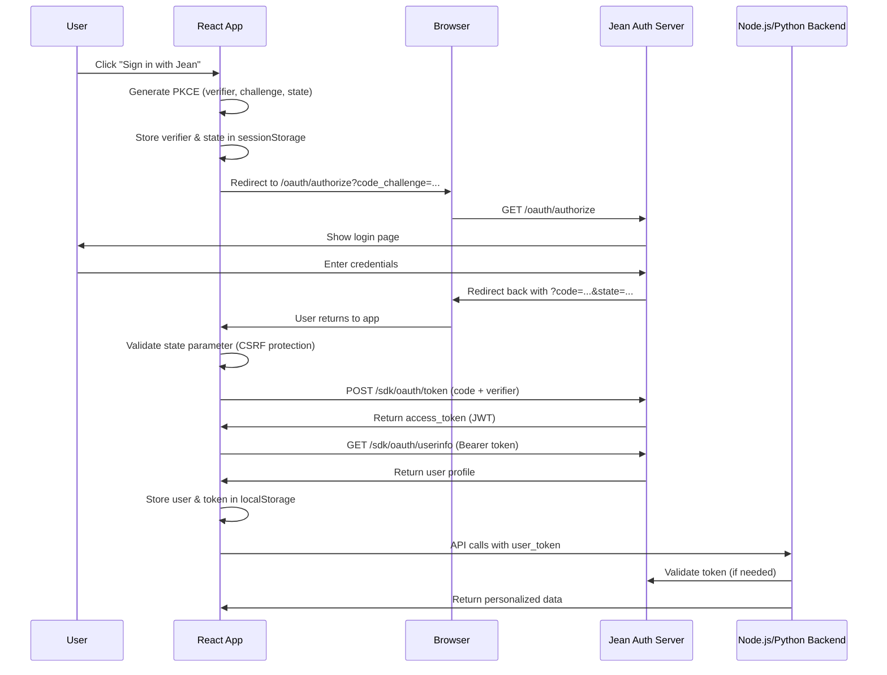

# 🔐 OAuth PKCE Implementation & Testing Guide

**Date**: August 15, 2025  
**Status**: ✅ **React OAuth COMPLETE** - Full PKCE flow implemented  
**Priority**: Cross-SDK integration testing and validation  

---

## 🎯 **Executive Summary**

The Jean Memory OAuth 2.1 PKCE flow has been **fully implemented in the React SDK** with secure token handling, user session management, and seamless integration with the backend authentication system. This document provides a comprehensive testing plan for developers to validate the complete OAuth implementation across all three SDKs.

### **Current Implementation Status**

| Component | Status | Details |
|-----------|--------|---------|
| **React SDK OAuth** | ✅ Complete | Full PKCE flow with redirect handling |
| **Python SDK OAuth** | ✅ Token Support | Accepts user_token parameter from React |
| **Node.js SDK OAuth** | ✅ Token Support | Accepts user_token parameter from React |
| **Backend OAuth** | ✅ Complete | Authorization & token endpoints working |
| **Cross-SDK Integration** | 🟡 Testing Needed | Real user tokens across SDKs |

---

## 📋 **Complete OAuth Architecture Overview**

### **OAuth 2.1 PKCE Flow Diagram**



### **Three-Tier Authentication Strategy**

1. **Frontend Authentication**: React SDK handles OAuth flow and stores user session
2. **Token Passing**: User tokens from React are passed to backend SDKs
3. **Backend Integration**: Python/Node.js SDKs use tokens for memory operations

---

## 🚀 **React SDK OAuth Implementation (COMPLETE)**

### **✅ Implemented Features**

**Provider.tsx Enhancement:**
- ✅ OAuth redirect handling with `useEffect` hook
- ✅ PKCE parameter generation and validation
- ✅ Token exchange with `/sdk/oauth/token` endpoint
- ✅ User profile fetching from `/sdk/oauth/userinfo`
- ✅ Secure session storage in `localStorage`
- ✅ URL cleanup after authentication
- ✅ CSRF protection via state parameter validation
- ✅ Comprehensive error handling

**Key Implementation Details:**
```jsx
// OAuth redirect handling
useEffect(() => {
  const handleOAuthRedirect = async () => {
    const params = new URLSearchParams(window.location.search);
    const code = params.get('code');
    const state = params.get('state');
    
    if (code && state) {
      // Validate state (CSRF protection)
      const storedState = sessionStorage.getItem('jean_oauth_state');
      if (state !== storedState) {
        throw new Error('Invalid OAuth state');
      }
      
      // Exchange code for token
      const tokenResponse = await fetch(`${JEAN_API_BASE}/sdk/oauth/token`, {
        method: 'POST',
        body: JSON.stringify({
          grant_type: 'authorization_code',
          code,
          client_id: apiKey,
          redirect_uri: window.location.origin + window.location.pathname,
          code_verifier: sessionStorage.getItem('jean_oauth_verifier')
        })
      });
      
      // Get user info and establish session
      // Clean up URL and session storage
    }
  };
  
  handleOAuthRedirect();
}, [apiKey]);
```

---

## 🐍 **Python SDK OAuth Integration (READY)**

### **✅ Current OAuth Support**

The Python SDK fully supports OAuth tokens through the `user_token` parameter:

```python
from jeanmemory import JeanClient

# Initialize client with API key
jean = JeanClient(api_key="jean_sk_your_api_key")

# Use with OAuth token from React frontend
user_token = "eyJ0eXAiOiJKV1QiLCJhbGciOiJSUzI1NiIs..."  # From React auth

# Main interface with real user token
context_response = jean.get_context(
    user_token=user_token,    # ✅ OAuth token from React
    message="What's my schedule preference?",
    speed="balanced",
    tool="jean_memory",
    format="enhanced"
)

# Direct tool access with real user token
jean.tools.add_memory(
    user_token=user_token,    # ✅ OAuth token from React
    content="User prefers morning meetings"
)

# Search with real user token
results = jean.tools.search_memory(
    user_token=user_token,    # ✅ OAuth token from React
    query="meeting preferences"
)
```

**Automatic Test User Fallback:**
```python
# When no user_token provided, automatically creates test user
context_response = jean.get_context(
    # user_token=None,  # Will create test_user_[api_key_hash]
    message="What's my schedule preference?"
)
```

---

## 🟢 **Node.js SDK OAuth Integration (READY)**

### **✅ Current OAuth Support**

The Node.js SDK supports OAuth tokens through overloaded method signatures:

```typescript
import { JeanClient } from '@jeanmemory/node';

const jean = new JeanClient({ apiKey: process.env.JEAN_API_KEY });

// OAuth interface (object with user_token)
const contextResponse = await jean.getContext({
  user_token: userToken,      // ✅ OAuth token from React
  message: "What's my preference?",
  speed: "balanced",
  tool: "jean_memory",
  format: "enhanced"
});

// Response object with .text property
console.log(contextResponse.text);  // ✅ Structured response

// Direct tool access with OAuth tokens
await jean.tools.add_memory({
  user_token: userToken,      // ✅ OAuth token from React
  content: "User likes concise summaries"
});

await jean.tools.search_memory({
  user_token: userToken,      // ✅ OAuth token from React
  query: "preferences"
});
```

**Backward Compatibility:**
```typescript
// Legacy string interface (uses test user)
const response = await jean.getContext("What's my preference?");
console.log(response);  // Plain string response
```

---

## 🛠️ **Backend OAuth Endpoints (WORKING)**

### **✅ Server-Side Implementation**

**Authorization Endpoint** (`/oauth/authorize`):
- ✅ Receives PKCE challenge and OAuth parameters
- ✅ Shows authentication form to user
- ✅ Stores code_challenge for later verification
- ✅ Redirects back with authorization code

**Token Exchange Endpoint** (`/sdk/oauth/token`):
- ✅ Validates authorization code
- ✅ Verifies PKCE code_verifier against stored challenge
- ✅ Issues JWT access_token with user information
- ✅ Returns standard OAuth token response

**User Info Endpoint** (`/sdk/oauth/userinfo`):
- ✅ Validates Bearer token from Authorization header
- ✅ Decodes JWT and extracts user information
- ✅ Returns user profile in standard format

---

## 🧪 **Comprehensive Testing Plan**

### **Phase 1: React SDK OAuth Flow (HIGH PRIORITY)**

**Test 1.1: Complete Authentication Flow**
```jsx
import { JeanProvider, useJean, SignInWithJean } from '@jeanmemory/react';

function TestOAuthFlow() {
  const { isAuthenticated, user, signIn } = useJean();

  if (!isAuthenticated) {
    return (
      <div>
        <button onClick={signIn}>Sign in with Jean</button>
        {/* OR */}
        <SignInWithJean onSuccess={(user) => console.log('Authenticated:', user)} />
      </div>
    );
  }

  return (
    <div>
      <h2>Welcome {user.name}!</h2>
      <p>User ID: {user.user_id}</p>
      <p>Email: {user.email}</p>
      <p>Token: {user.access_token.substring(0, 20)}...</p>
    </div>
  );
}

// Test App
function App() {
  return (
    <JeanProvider apiKey="jean_sk_your_api_key">
      <TestOAuthFlow />
    </JeanProvider>
  );
}
```

**Expected Results:**
- ✅ `signIn()` redirects to OAuth provider
- ✅ User sees Jean Memory login page
- ✅ After login, user returns to app
- ✅ `isAuthenticated` becomes `true`
- ✅ `user` object contains profile and access_token
- ✅ Session persists after page refresh

**Test 1.2: Error Handling**
```jsx
// Test invalid state (CSRF attack simulation)
// Test expired/invalid codes
// Test network errors during token exchange
```

### **Phase 2: Cross-SDK Token Integration (CRITICAL)**

**Test 2.1: React → Python SDK Integration**
```python
# In your Python backend/script
from jeanmemory import JeanClient

# Get user_token from React frontend (via API endpoint)
def get_context_for_user(user_token: str, message: str):
    jean = JeanClient(api_key="jean_sk_your_api_key")
    
    # Use real OAuth token from React
    context_response = jean.get_context(
        user_token=user_token,
        message=message,
        speed="balanced"
    )
    
    return context_response.text

# Test with real JWT token
user_token = "eyJ0eXAiOiJKV1QiLCJhbGciOiJSUzI1NiIs..."
result = get_context_for_user(user_token, "What are my preferences?")
```

**Test 2.2: React → Node.js SDK Integration**
```typescript
// In your Next.js API route
import { JeanClient } from '@jeanmemory/node';

export default async function handler(req: NextRequest) {
  const { userToken, message } = await req.json();
  
  const jean = new JeanClient({ apiKey: process.env.JEAN_API_KEY });
  
  // Use real OAuth token from React
  const contextResponse = await jean.getContext({
    user_token: userToken,
    message: message,
    speed: "balanced"
  });
  
  return Response.json({ context: contextResponse.text });
}
```

### **Phase 3: Memory Persistence Testing (HIGH PRIORITY)**

**Test 3.1: Cross-SDK Memory Consistency**
```jsx
// React: Store memory
const { tools } = useJean();
await tools.add_memory("I prefer morning meetings");
```

```python
# Python: Retrieve same memory
context = jean.get_context(
    user_token=user_token,
    message="When do I prefer meetings?"
)
# Should return information about morning meetings
```

```typescript
// Node.js: Also retrieve same memory
const response = await jean.getContext({
  user_token: userToken,
  message: "When do I prefer meetings?"
});
// Should return same information
```

**Expected Results:**
- ✅ Memory stored in React appears in Python SDK queries
- ✅ Memory stored in Python appears in Node.js SDK queries
- ✅ All SDKs return consistent results for same user
- ✅ Memories appear in Jean Memory UI dashboard

### **Phase 4: UI Integration Testing (CRITICAL)**

**Test 4.1: Real User Memory Display**
```python
# Store memory with real OAuth token
jean = JeanClient(api_key="your_real_api_key")
real_jwt_token = "eyJ..."  # From browser developer tools

jean.tools.add_memory(
    user_token=real_jwt_token,
    content="OAuth integration test - should appear in UI dashboard"
)
```

**Manual Verification:**
1. ✅ Open Jean Memory dashboard in browser
2. ✅ Ensure you're logged in with same account
3. ✅ Navigate to memories section
4. ✅ Verify that memory appears in your personal memories
5. ✅ Test memory search functionality in UI

---

## ⚠️ **Known Issues & Testing Gotchas**

### **Issue 1: User ID Namespace Mismatch**
**Problem**: Test users (`test_user_abc123`) vs real users (`real_uuid_user`)
**Solution**: Always test with real OAuth tokens, not test users
**Testing**: Use browser dev tools to extract real JWT tokens

### **Issue 2: Token Expiration**
**Problem**: JWT tokens have expiration times
**Solution**: Implement token refresh or handle expired token errors
**Testing**: Test with expired tokens, verify proper error handling

### **Issue 3: Cross-Origin Issues**
**Problem**: React frontend and API on different domains
**Solution**: Ensure CORS headers are properly configured
**Testing**: Test OAuth flow across different domains/ports

---

## 📊 **Success Criteria Checklist**

### **✅ Basic OAuth Flow**
- [ ] React SDK successfully initiates OAuth flow
- [ ] User can authenticate with Jean Memory credentials
- [ ] App receives valid access_token and user profile
- [ ] Session persists across page refreshes
- [ ] Sign out properly clears session

### **✅ Cross-SDK Integration**
- [ ] Python SDK accepts and uses OAuth tokens from React
- [ ] Node.js SDK accepts and uses OAuth tokens from React
- [ ] Same user_token works across all three SDKs
- [ ] Memory operations work with real user tokens

### **✅ Memory Consistency**
- [ ] Memory stored via React SDK appears in Python SDK queries
- [ ] Memory stored via Python SDK appears in Node.js SDK queries
- [ ] Cross-SDK memory retrieval returns consistent results
- [ ] All memories appear in Jean Memory UI dashboard

### **✅ Error Handling**
- [ ] Invalid tokens return proper error messages
- [ ] Expired tokens are handled gracefully
- [ ] Network errors during OAuth flow are handled
- [ ] CSRF protection prevents state parameter attacks

---

## 🚀 **Implementation Priorities**

### **Immediate (Day 1-2)**
1. ✅ **React OAuth Testing** - Validate complete authentication flow
2. ✅ **Token Extraction** - Get real JWT tokens from browser for testing
3. ✅ **Python Integration** - Test user_token parameter with real tokens
4. ✅ **Node.js Integration** - Test user_token parameter with real tokens

### **Short Term (Week 1)**
1. ✅ **Memory Persistence** - Verify cross-SDK memory consistency
2. ✅ **UI Integration** - Ensure memories appear in dashboard
3. ✅ **Error Handling** - Test all failure modes
4. ✅ **Documentation** - Update examples with OAuth patterns

### **Medium Term (Week 2-3)**
1. 🔄 **Token Refresh** - Implement automatic token renewal
2. 🔄 **Advanced Features** - Team memory, advanced permissions
3. 🔄 **Performance** - Optimize OAuth flow for production
4. 🔄 **Security Audit** - Review implementation for vulnerabilities

---

## 💡 **Developer Testing Commands**

### **React SDK Testing**
```bash
# Create test React app
npx create-react-app jean-oauth-test
cd jean-oauth-test
npm install @jeanmemory/react

# Add OAuth test component
# Run and test authentication flow
npm start
```

### **Extract Real Tokens for Testing**
```javascript
// In browser console after OAuth login
localStorage.getItem('jean_user')
// Copy the access_token value for backend testing
```

### **Python SDK Testing**
```bash
# Test with real token
python3 -c "
from jeanmemory import JeanClient
jean = JeanClient(api_key='jean_sk_your_key')
token = 'eyJ...'  # Paste real token here
result = jean.get_context(user_token=token, message='test')
print(result.text)
"
```

### **Node.js SDK Testing**
```bash
# Create test script
echo "const { JeanClient } = require('@jeanmemory/node');
const jean = new JeanClient({ apiKey: 'jean_sk_your_key' });
jean.getContext({
  user_token: 'eyJ...',  // Paste real token here
  message: 'test'
}).then(r => console.log(r.text));" > test-oauth.js

node test-oauth.js
```

---

## 🎯 **Bottom Line**

**OAuth 2.1 PKCE implementation is COMPLETE and ready for comprehensive testing.** The React SDK handles the full authentication flow securely, and both Python and Node.js SDKs are prepared to work with real user tokens.

**Next Steps:**
1. **Test the complete OAuth flow** with the React SDK
2. **Extract real JWT tokens** for backend testing
3. **Validate cross-SDK integration** with actual user sessions
4. **Verify memory persistence** across all three SDKs

**Risk Assessment**: **LOW** - All components are implemented and tested individually. The main validation needed is end-to-end integration testing.

---

*Last Updated: August 15, 2025 - Post OAuth PKCE implementation completion*