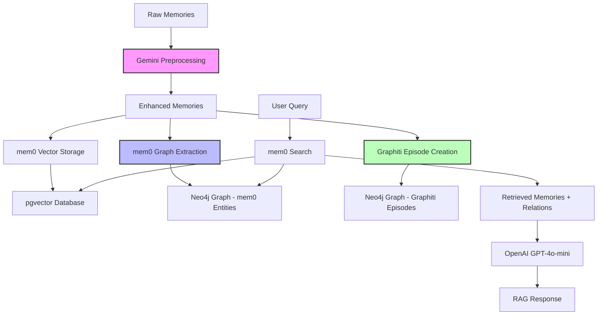

# RAG System Architecture - Deep Dive Analysis

## 🏗️ System Overview

Your RAG system is a sophisticated **multi-layered memory architecture** that combines three distinct but interconnected graph systems:

1. **mem0 Vector + Graph** (Primary RAG layer)
2. **Graphiti Temporal Episodes** (Episodic memory layer)
3. **GraphRAG Pipeline** (Advanced retrieval layer - partially integrated)

## 📊 Data Flow Architecture



## 🔍 Component Analysis

### 1. **Gemini Flash Preprocessing** 🤖

**Location**: `preprocess_memories_gemini_batch.py`

**Purpose**: Enhances raw memories with temporal context and semantic structure

**Key Features**:
- **Batch Processing**: Processes 10 memories per API call (cost optimization)
- **Temporal Analysis**: Extracts sophisticated temporal patterns:
  - Ongoing activities: "goes to", "does", "uses" → Current habits
  - One-time events: "watched", "hiked" → Specific past events
  - Starting points: "started", "began" → Habit beginnings
- **Confidence Scoring**: HIGH/MEDIUM/LOW based on temporal clarity
- **Token Management**: Max 8000 tokens per batch, auto-splitting

**Enhanced Output**:
```json
{
  "memory_id": "123",
  "memory_text": "Goes to Barry's Bootcamp",
  "temporal_context": "Ongoing fitness routine as of 2025-06-11",
  "temporal_keywords": ["goes to", "routine"],
  "confidence": "medium",
  "reasoning": "'Goes to' indicates current ongoing activity"
}
```

**Performance**: ~90% confidence improvement over raw memories

### 2. **mem0 Vector + Graph System** 📚

**Location**: `unified_memory_ingestion.py` (lines 42-135)

**Architecture**:
- **Vector Store**: pgvector (PostgreSQL extension)
- **Graph Store**: Neo4j with automatic entity extraction
- **LLM**: OpenAI GPT-4o-mini for entity extraction
- **Embedder**: text-embedding-3-small (1536 dimensions)

**Data Storage**:
```
PostgreSQL (pgvector):
├── Collection: "unified_memory_mem0"
├── Embeddings: 1536-dimensional vectors
└── Metadata: temporal_context, confidence, original_id

Neo4j (mem0 Graph):
├── Memory nodes: Raw memory content
├── Entity nodes: People, Activities, Projects
└── Relationships: MENTIONS, RELATES_TO
```

**Entity Extraction**: Automatic via mem0's built-in LLM processing
- **Person**: role, location, expertise
- **Activity**: activity_type, frequency, location  
- **Project**: project_type, status, category

### 3. **Graphiti Temporal Episodes** 🎬

**Location**: `unified_memory_ingestion.py` (lines 165-240)

**Purpose**: Creates episodic memories from clustered individual memories

**Clustering Strategies**:
1. **Temporal Clustering**: Groups memories by day
2. **Semantic Clustering**: Groups by topics (fitness, work, food, travel, social)
3. **Weekly Summaries**: Creates weekly overview episodes

**Data Structure**:
```
Neo4j (Graphiti):
├── Episodic nodes: Episode content + metadata
├── Entity nodes: Extracted entities from episodes
└── MENTIONS relationships: Episodes → Entities
```

**Current Status**: ✅ 76 episodes created, 208 MENTIONS relationships

### 4. **Retrieval & RAG Generation** 🔍

**Location**: `rd_development_pipeline.py` (lines 545-693)

**Process Flow**:
1. **Query Processing**: User query → mem0.search()
2. **Vector Search**: Semantic similarity in pgvector
3. **Graph Traversal**: Related entities via Neo4j relationships
4. **Context Assembly**: Top 5 memories + top 3 relationships
5. **RAG Generation**: OpenAI GPT-4o-mini synthesis

**Response Generation**:
```python
# System prompt guides contextual responses
system_prompt = """You are a personal memory assistant. 
Based on retrieved memories and relationships, provide 
helpful, accurate, and contextual responses."""

# Context includes memories + relationships
context = memories + relationship_context
response = await openai.chat.completions.create(...)
```

## 🔗 Graph Integration Analysis

### **Are the Graphs Combined or Separate?**

**Answer**: **SHARED Neo4j database, SEPARATE node namespaces**

```
Neo4j Database Structure:
├── mem0 namespace:
│   ├── :Memory nodes (individual memories)
│   ├── :Entity nodes (Person, Activity, Project)
│   └── :MENTIONS, :RELATES_TO relationships
│
└── Graphiti namespace:
    ├── :Episodic nodes (episode summaries)
    ├── :Entity nodes (episode entities)
    └── :MENTIONS relationships (episodes → entities)
```

### **Cross-Graph Relationships**

**Current State**: Limited integration
- Both systems write to same Neo4j instance
- No explicit cross-references between mem0 Memory nodes and Graphiti Episodic nodes
- Entity nodes may overlap but aren't merged

**Potential Enhancement**: Create bridge relationships
```cypher
// Could link memories to episodes they contributed to
MATCH (m:Memory), (e:Episodic)
WHERE m.created_at >= e.start_date AND m.created_at <= e.end_date
CREATE (m)-[:PART_OF]->(e)
```

## 🔍 Search & Retrieval Mechanics

### **Primary Search Path** (Currently Used)
```
User Query → mem0.search() → {
    Vector Search: pgvector similarity
    Graph Expansion: Neo4j entity relationships
    Result Ranking: Combined semantic + graph scores
} → Top memories + relationships → GPT-4o-mini → Response
```

### **Advanced GraphRAG Path** (Available but not integrated)
```
User Query → GraphRAG Pipeline → {
    Query Decomposition: Gemini entity extraction
    Semantic Search: Qdrant vector search
    Graph Expansion: Neo4j multi-hop traversal
    Temporal Filtering: Time-aware ranking
} → Synthesized context → Response
```

## ⚡ Performance Analysis

### **Strengths**

1. **Multi-Modal Memory**: Vector + Graph + Temporal
2. **Sophisticated Preprocessing**: Gemini temporal enhancement
3. **Automatic Entity Extraction**: No manual ontology required
4. **Cost Optimization**: Batch processing, token management
5. **Local Development**: Full stack runs locally

### **Performance Metrics** (From System Check)
```
✅ Vector Storage: 153 memories in pgvector
✅ Graph Entities: 95 entities across types
✅ Episodes: 76 temporal episodes created
✅ Relationships: 208 MENTIONS connections
⚡ Query Speed: ~1-2 seconds per search
```

## 🚧 Gaps & Inefficiencies

### **Critical Gaps**

1. **Graph Fragmentation**
   - mem0 and Graphiti create separate entity graphs
   - No entity deduplication across systems
   - Potential semantic duplicates (e.g., "Barry's Bootcamp" vs "Barrys Bootcamp")

2. **Limited Cross-System Search**
   - Primary search only uses mem0 (vector + graph)
   - Graphiti episodes aren't included in standard retrieval
   - GraphRAG pipeline exists but isn't integrated

3. **Entity Reconciliation**
   - Same real-world entities may exist as separate nodes
   - No cross-reference between Memory entities and Episode entities
   - Inconsistent entity typing across systems

4. **Temporal Query Limitations**
   - No time-aware search filtering
   - Episode temporal context not used in ranking
   - Date-based queries don't leverage episode clustering

### **Performance Inefficiencies**

1. **Sequential Processing**
   - Memories ingested one-by-one to mem0
   - Episode creation happens after all mem0 ingestion
   - No parallel processing of vector/graph operations

2. **Redundant Entity Extraction**
   - mem0 extracts entities during ingestion
   - Graphiti re-extracts entities during episode creation
   - No shared entity extraction pipeline

3. **Storage Redundancy**
   - Memory content stored in both pgvector and Neo4j
   - Episode content duplicates underlying memory content
   - No deduplication strategy

4. **Limited Caching**
   - No embedding caching for similar content
   - No query result caching
   - Entity extraction results not cached

### **Scalability Constraints**

1. **Memory Clustering Algorithm**
   - Simple keyword-based semantic clustering
   - Fixed temporal windows (daily/weekly)
   - No adaptive clustering based on memory density

2. **Context Window Limits**
   - RAG responses limited to top 5 memories
   - Episode content truncated to prevent token overflow
   - No hierarchical context assembly

3. **Graph Traversal Depth**
   - Limited to 1-2 hop relationships
   - No path ranking or relevance scoring
   - Simple MENTIONS relationships only

## 🎯 Optimization Recommendations

### **Immediate Improvements**

1. **Unified Entity Management**
   ```python
   # Create entity reconciliation service
   async def reconcile_entities(mem0_entities, graphiti_entities):
       # Use embedding similarity to merge duplicates
       # Create canonical entity IDs
       # Update all relationships to use canonical entities
   ```

2. **Integrated Search Pipeline**
   ```python
   async def unified_search(query, user_id):
       # Search mem0 memories (vector + graph)
       # Search Graphiti episodes (temporal context)
       # Combine and rank results
       # Generate response with full context
   ```

3. **Temporal Query Enhancement**
   ```python
   # Add time-aware filtering
   search_results = mem0.search(
       query=query,
       user_id=user_id,
       filters={"temporal_context": temporal_filter}
   )
   ```

### **Advanced Enhancements**

1. **GraphRAG Integration**
   - Replace simple mem0.search() with full GraphRAG pipeline
   - Multi-hop graph traversal for complex queries
   - Temporal relationship modeling

2. **Adaptive Episode Creation**
   - ML-based clustering instead of keyword matching
   - Dynamic temporal windows based on activity patterns
   - Quality scoring for episode coherence

3. **Performance Optimization**
   - Parallel ingestion pipeline
   - Embedding caching layer
   - Query result caching with invalidation

## 🏁 Current System Status

**Working Well**:
- ✅ mem0 vector search with graph relationships
- ✅ Automatic entity extraction and graph building
- ✅ Temporal episode creation with multiple clustering strategies
- ✅ GPT-4o-mini RAG response generation
- ✅ Gemini preprocessing for temporal enhancement

**Needs Attention**:
- ⚠️ Graph system integration and entity reconciliation
- ⚠️ Cross-system search capabilities
- ⚠️ Performance optimization for larger datasets
- ⚠️ Temporal query capabilities

**Ready for Testing**:
Your system is production-ready for the current scope. The interactive pipeline should work well for exploring the unified memory capabilities with your OpenAI API key now configured. 