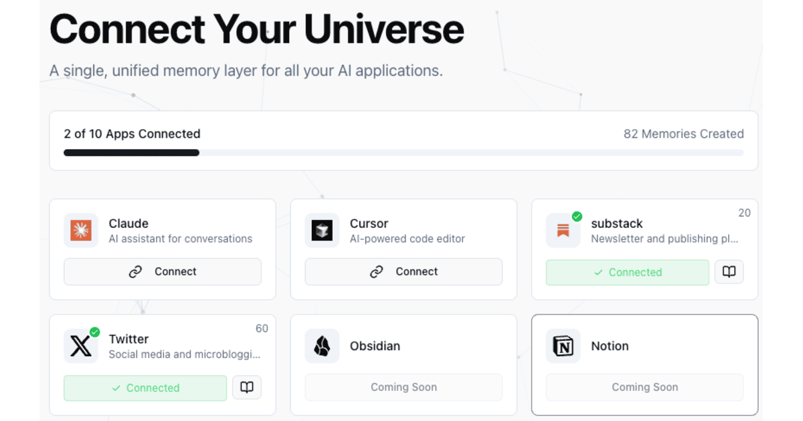

<h1 align="center">Jean Memory</h1>

<p align="center">
  <strong>AI Memory across your applications in 5 lines of code.</strong>
</p>

<p align="center">
  <a href="https://jeanmemory.com">Website</a>
  ·
  <a href="https://jeanmemory.com/dashboard-new">Dashboard</a>
  ·
  <a href="https://docs.jeanmemory.com">SDK & API Docs</a>
  ·
  <a href="https://github.com/jean-technologies/jean-memory/issues">Report an Issue</a>
</p>

<p align="center">
  
</p>

## Quick Start: Add Memory to Your App in 5 Minutes

Integrate a powerful memory layer into your application with our easy-to-use SDKs.

### React: Add a Full Chat UI

Drop a complete, context-aware chat component into your React app.

```tsx
// 1. Install the SDK
// npm install @jeanmemory/react

// 2. Add the provider and chat component
import { JeanProvider, JeanChat } from '@jeanmemory/react';

function MyApp() {
  return (
    <JeanProvider apiKey="YOUR_API_KEY">
      <JeanChat />
    </JeanProvider>
  );
}
```

### Python: Power Your Backend Agent

Add a context layer to your Python backend or AI agent.

```python
# 1. Install the SDK
# pip install jeanmemory

# 2. Get context before calling your LLM
from jeanmemory import JeanClient

jean = JeanClient(api_key="YOUR_API_KEY")

# Get user_token from your frontend OAuth flow
context = jean.get_context(
    user_token="USER_TOKEN_FROM_FRONTEND",
    message="What was our last conversation about?"
).text
```

### Node.js: Enhance Your JavaScript Backend

Integrate memory into your Next.js, Express, or other Node.js services.

```javascript
// 1. Install the SDK
// npm install @jeanmemory/node

// 2. Get context in your API route
import { JeanClient } from '@jeanmemory/node';

const jean = new JeanClient({ apiKey: "YOUR_API_KEY" });

// Get userToken from your frontend OAuth flow
const context = await jean.getContext({
    user_token: userToken,
    message: "What was our last conversation about?"
});
```

➡️ **[Explore the full SDK Documentation](https://docs.jeanmemory.com)** for advanced usage, authentication, and more examples.

## What is Jean Memory?

Jean Memory provides a persistent and intelligent memory layer that enables AI applications to understand users with deep, personal context. It moves beyond simple information retrieval to sophisticated context engineering, ensuring that an AI has precisely the right information at the time of inference to provide personalized, accurate, and helpful responses.

-   **5-Minute Integration**: Add a complete, production-ready chat UI to your React app in minutes.
-   **Headless SDKs**: Powerful, headless libraries for Python and Node.js to integrate with any backend or agent.
-   **Intelligent Orchestration**: Goes beyond a vector database. An AI-powered orchestration layer dynamically analyzes intent, saves new information, and retrieves the most relevant context for your LLM.
-   **Granular Tools**: A full suite of API tools (`add_memories`, `search_memory`, `deep_memory_query`) for developers who need direct, fine-grained control.
-   **Secure and Private**: User context is stored securely, under your control.
-   **Flexible Hosting**: Use our managed cloud service for a zero-setup experience or self-host the entire stack for complete control.

## How It Works: The Orchestration Engine

Jean Memory operates on a two-layer architecture: an intelligent orchestration layer and a core API of granular tools.

1.  **Orchestration Layer (`jean_memory` tool)**: This is the primary, intelligent entry point. When called, this tool analyzes the user's message and conversation history to determine the optimal context strategy. It then calls the necessary core tools to gather information, synthesizes the results, and provides a perfectly engineered context package to the AI. It also handles background memory saving.

2.  **Core API (Granular Tools)**: These are the underlying building blocks that the orchestrator uses. They are also exposed via a REST API for developers who need direct, granular control for building custom agents or applications.

For detailed information, please refer to our full **[API Documentation](https://docs.jeanmemory.com)**.

## 🧪 SDK Testing (For Developers)

**Testing the Jean Memory SDKs?** Use these guides:
- **[Quick 5-Minute Test](./QUICK_SDK_TEST.md)** - Rapid verification of all SDKs
- **[Complete Testing Guide](./DEVELOPER_TESTING_GUIDE.md)** - Comprehensive testing instructions

## Local Development Setup

Run the entire Jean Memory stack on your local machine for development and self-hosting.

**Prerequisites:**
- Node.js 18+ and npm
- Python 3.12+
- Docker and Docker Compose
- Git

**1. Clone the repository:**
```bash
git clone https://github.com/jean-technologies/jean-memory.git
cd jean-memory
```

**2. Navigate to the `openmemory` directory:**
```bash
cd openmemory
```

**3. Run one-time setup:**
This script will gather required API keys and generate the necessary environment files.
```bash
make setup
```

**4. Add your API keys when prompted:**
- `OPENAI_API_KEY` (required) - Get from the [OpenAI Platform](https://platform.openai.com/api-keys)
- `GEMINI_API_KEY` (optional) - Get from [Google AI Studio](https://makersuite.google.com/app/apikey)

**5. Build the environment:**
This command builds the Docker containers and configures the environment based on your keys.
```bash
make build
```

**6. Start the development services:**

*Option A: Run all services concurrently:*
```bash
make dev
```

*Option B: Run services individually in separate terminals:*
```bash
# Terminal 1: Start the backend API and databases
make dev-api

# Terminal 2: Start the frontend UI
make dev-ui
```

**7. Access the application:**
- **UI Dashboard**: `http://localhost:3000`
- **API Documentation**: `http://localhost:8765/docs`
- **Supabase Studio**: `http://localhost:54323`

## Contributing

We welcome contributions from the community. Please read our [contributing guide](docs/contributing/CONTRIBUTING.md) to get started with the development process and pull request submission.

## License

This project incorporates code from [mem0ai/mem0](https://github.com/mem0ai/mem0), which is distributed under the Apache 2.0 License. All additions and modifications made by Jean Technologies are proprietary.

## Support

- **Documentation**: [docs.jeanmemory.com](https://docs.jeanmemory.com)
- **Bug Reports**: [GitHub Issues](https://github.com/jean-technologies/jean-memory/issues)
- **General Inquiries**: [jonathan@jeantechnologies.com](mailto:jonathan@jeantechnologies.com)
