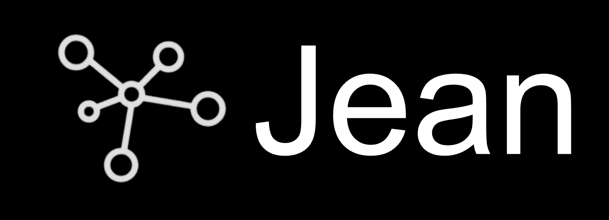

<p align="center">
  <a href="https://github.com/jean-technologies/jean-memory">
    
  </a>
</p>

<p align="center">
  <h1 align="center">Jean Memory</h1>
  <p align="center">A secure, private memory layer for your AI.</p>
</p>

<p align="center">
  <a href="https://jeanmemory.com">Website</a>
  ·
  <a href="https://jeanmemory.com/dashboard-new">Dashboard</a>
  ·
  <a href="https://jeanmemory.com/api-docs">Docs</a>
  ·
  <a href="https://github.com/jean-technologies/jean-memory/issues">Report an Issue</a>
</p>

<p align="center">
  <a href="https://github.com/jean-technologies/jean-memory">
    
  </a>
  <a href="https://github.com/jean-technologies/jean-memory/blob/main/LICENSE">
    
  </a>
  <a href="https://github.com/jean-technologies/jean-memory/issues">
    
  </a>
</p>

## What is Jean Memory?

Jean securely stores the personal context that makes your AI truly yours. From your unique insights to your personal preferences, this is the data that powers a smarter, more helpful AI. You control what's remembered and what's shared, always.

- **🔒 Private & Secure**: Your context is yours alone.
- **🚀 Fast & Universal**: Works across all your MCP-compatible AI tools like Claude and Cursor.
- **🏠 Cloud or Local**: Use our managed service or host it yourself.

🧠 **Human-like Agentic Memory**: Jean is more than just a vector database. It creates a dynamic, connected graph of your memories, allowing AI agents to understand relationships, context, and how ideas evolve over time. This enables more sophisticated reasoning and a deeper understanding of you.

<p align="center">
  
</p>

## 🚀 Quick Start

Get started in seconds with our hosted service:

1.  **Sign up** at [jeanmemory.com](https://jeanmemory.com) and go to your dashboard.
2.  **Choose an app** (like Claude or Cursor) and get your install command.
3.  **Run the command** to connect your AI tool.
4.  **Restart your AI app** and start using your memory!

## 🎥 **Video Tutorial**

Watch this 5-minute step-by-step tutorial to get Jean Memory working with your AI tools:

<p align="center">
  <a href="https://youtu.be/qXe4mEaCN9k">
    
  </a>
</p>

**[▶️ Watch the Full Tutorial on YouTube](https://youtu.be/qXe4mEaCN9k)**

## 🛠️ Local Development

Run the entire Jean Memory stack on your local machine.

**Prerequisites:**
- Node.js 18+ and npm
- Python 3.12+ (auto-installed on macOS via Homebrew if missing)
- Docker and Docker Compose
- Git

**1. Clone the repository:**
```bash
git clone https://github.com/jonathan-politzki/jean-memory.git
cd jean-memory
```

**2. Navigate to the openmemory directory:**
```bash
cd openmemory
```

**3. Run one-time setup:**
This collects your API keys and creates all environment files:
```bash
make setup
```

**4. Add your API keys when prompted:**
- `OPENAI_API_KEY` (required) - Get from [OpenAI Platform](https://platform.openai.com/api-keys)
- `GEMINI_API_KEY` (optional) - Get from [Google AI Studio](https://makersuite.google.com/app/apikey)

**5. Build the environment:**
After adding API keys, build and configure everything:
```bash
make build
```

**6. Start development:**

**Option A - Full development environment:**
```bash
make dev
```

**Option B - Start services individually:**

*Terminal 1 - Start API and databases:*
```bash
make dev-api
```

*Terminal 2 - Start frontend:*
```bash
make dev-ui
```

**7. Access the application:**
- **UI Dashboard**: `http://localhost:3000`
- **API Documentation**: `http://localhost:8765/docs`
- **Supabase Studio**: `http://localhost:54323`

## 🔧 Environment Configuration

Jean Memory uses a centralized environment configuration:

- **Primary config**: `openmemory/.env.local` (your main environment file)
- **API specific**: `openmemory/api/.env` (synced automatically)
- **UI specific**: `openmemory/ui/.env.local` (synced automatically)

The setup script automatically creates and synchronizes these files. Environment variables are loaded in this order of precedence:
1. `.env.local` (highest priority)
2. `api/.env` (API-specific)
3. `.env` (fallback)

**Useful commands:**
```bash
# Update environment with latest Supabase keys
make configure-env

# Check what services are running
make status

# View service logs
make logs

# Stop all services
make stop
```

## ⭐ Upgrade to Jean Memory Pro

Advanced features for power users and developers, including **priority support, advanced search, higher limits, and data export.**

<p align="center">
  <a href="https://buy.stripe.com/8x214n2K0cmVadx3pIabK01">
    
  </a>
</p>

## 🤝 Contributing

We welcome contributions! Please see our [contributing guide](docs/contributing/CONTRIBUTING.md) to get started.

## 📄 License

This project incorporates code from [mem0ai/mem0](https://github.com/mem0ai/mem0) under the Apache 2.0 License. Jean Memory additions and modifications are proprietary.

## 🙋‍♂️ Support

- **Docs**: [jeanmemory.com/api-docs](https://jeanmemory.com/api-docs)
- **Issues**: [GitHub Issues](https://github.com/jonathan-politzki/jean-memory/issues)
- **Email**: [jonathan@jeantechnologies.com](mailto:jonathan@jeantechnologies.com)

---

<p align="center">
  Built with ❤️ by <a href="https://jeantechnologies.com">Jean Technologies</a>
</p>
