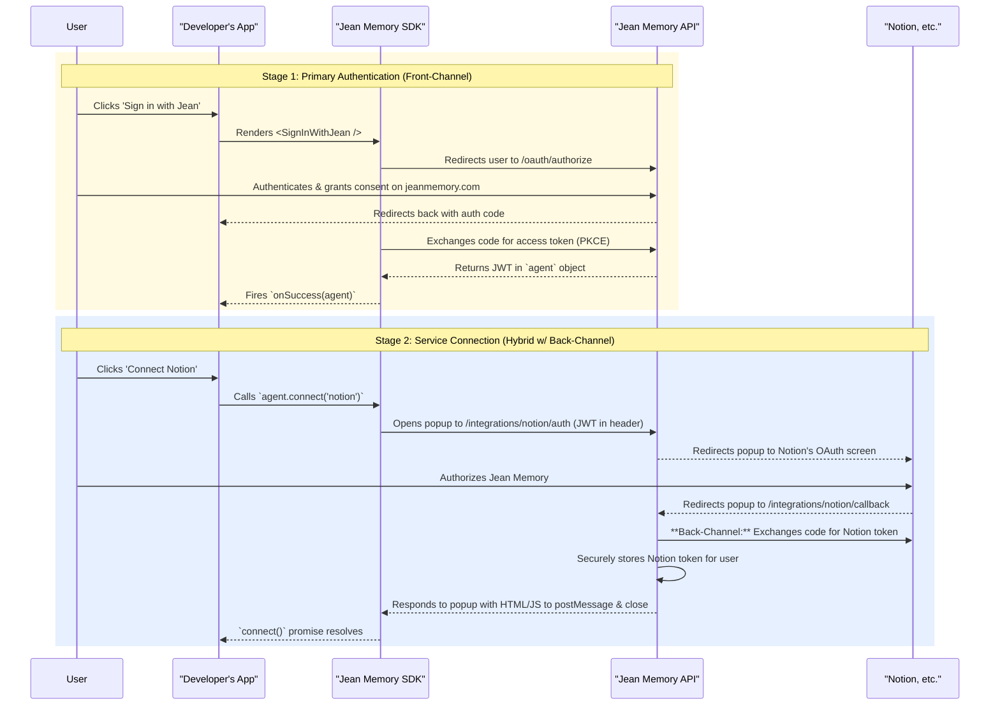

# Jean Memory SDK: The "Sign In with Your Memory" Architecture

This document outlines the complete architectural and philosophical approach for the Jean Memory SDK, focusing on creating a seamless, secure, and scalable user experience for authentication and service connection.

## Part 1: The Core Philosophy - "Connect, Don't Collect"

Our guiding principle is to establish Jean Memory as a secure, primary identity and then allow users to **connect** various external memory sources. We don't collect their credentials for other services; we use an industry-standard protocol (OAuth 2.1) to get permission to act on their behalf.

This "Connection" model is superior to a federated identity model because:
*   **It's Simpler:** It avoids the complexity of account linking, identity conflicts, and maintaining multiple authentication methods.
*   **It's More Secure:** It builds on our existing robust authentication system.
*   **It's User-Centric:** The user is always in control, with a central place (their Jean Memory account) to see and manage all connected services.

## Part 2: The Security Model - Why Redirects Are Essential

A user's trust is our most valuable asset. The choice between a popup modal and a full-page redirect for login is a critical security decision.

| Flow Type | Method | When to Use | Why It's Best |
| :--- | :--- | :--- | :--- |
| **Primary Authentication** | Full-Page Redirect | `SignInWithJean` | **Verifiability.** The user sees the `https://jeanmemory.com` URL and SSL padlock, proving they are on our legitimate site and not a phishing clone. This is the only way to establish trust when credentials are exchanged. |
| **Service Connection** | Controlled Popup | `agent.connect('notion')` | **Context Preservation.** It doesn't disrupt the user's flow in the third-party app. The popup is still a real browser window with a verifiable URL, but its temporary nature is less jarring than a full redirect for a secondary action. |

Loading a login form within an iframe or a simple `div` modal inside a third-party app is **strictly prohibited**. This would expose users to phishing and is blocked by modern browser security policies (`X-Frame-Options`, CSP) for this very reason.

## Part 3: The Hybrid Architecture - A Step-by-Step Breakdown

Our recommended architecture uses a hybrid of front-channel (browser-based) and back-channel (server-to-server) communication, which is the gold standard.

**Diagram of the Complete Flow:**


## Part 4: Concrete Implementation Plan

### 4.1 React SDK (`useJeanAgent.tsx`)

We will add a `connect` method to the `agent` object.

```typescript
// In the return value of the useJean hook
const agent = {
  // ... existing properties like user_id, access_token
  
  connect: (service: 'notion' | 'substack') => {
    return new Promise((resolve, reject) => {
      const popup = window.open(
        `https://jeanmemory.com/api/v1/integrations/${service}/auth`,
        'jean-service-connect',
        'width=600,height=700'
      );

      const messageListener = (event) => {
        // IMPORTANT: Verify the event origin for security
        if (event.origin !== 'https://jeanmemory.com') {
          return;
        }

        if (event.data?.status === 'success' && event.data?.service === service) {
          window.removeEventListener('message', messageListener);
          popup?.close();
          resolve('Connection successful!');
        } else if (event.data?.status === 'error') {
          window.removeEventListener('message', messageListener);
          popup?.close();
          reject(new Error(event.data.message || 'Connection failed.'));
        }
      };

      window.addEventListener('message', messageListener);

      // Handle the case where the user closes the popup manually
      const popupTimer = setInterval(() => {
        if (popup?.closed) {
          clearInterval(popupTimer);
          window.removeEventListener('message', messageListener);
          reject(new Error('Connection cancelled by user.'));
        }
      }, 500);
    });
  }
};
```
*Note: The actual implementation would be inside the hook logic, this is a conceptual representation.*

### 4.2 API Backend (`integrations.py`)

The `/integrations/{service}/callback` endpoint needs to be modified.

**Current (Before):**
```python
# ... inside notion_oauth_callback ...
# This redirects the user's main browser window, which is not what we want for a popup.
return RedirectResponse(url=f"{frontend_base}/onboarding?success=true")
```

**Proposed (After):**
```python
from fastapi.responses import HTMLResponse

# ... inside notion_oauth_callback ...

# After successfully exchanging the code and storing the token...
html_content = f"""
<!DOCTYPE html>
<html>
<head>
  <title>Authentication Complete</title>
</head>
<body>
  <p>Success! You can now close this window.</p>
  <script>
    // Send a message to the window that opened this popup
    if (window.opener) {{
      window.opener.postMessage({{
        "status": "success",
        "service": "notion"
      }}, "*"); // In production, we MUST replace "*" with the specific origin of the third-party app for security.
    }}
    // Close the popup
    window.close();
  </script>
</body>
</html>
"""
return HTMLResponse(content=html_content)
```
*Security Note on `targetOrigin`: The `"*"` in `postMessage` is a placeholder. A production implementation must pass the client's origin to the backend and use that specific origin here to prevent cross-site scripting attacks.*

## Part 5: Impact on Documentation (`@docs-mintlify/`)

This new, improved flow makes our SDK more powerful and requires updates to our documentation.

1.  **`quickstart.mdx`**:
    *   A new section, "Step 4: Connect Memory Sources," should be added.
    *   It will demonstrate the `agent.connect('notion')` call, explaining that it should be used *after* a user has successfully signed in.

2.  **`overview.mdx`**:
    *   The "How Jean Memory Works" section should be updated to reflect the "Connection Model." We can add a fourth card for "External Services" to the existing group.

3.  **This `SDK_OVERVIEW.md` file should become the canonical source of truth.** We can link to it from other relevant docs like `architecture.mdx`.

By following this plan, we can build a feature that is not only powerful and aligns with your product vision but is also secure, scalable, and a pleasure for both users and developers to work with.
