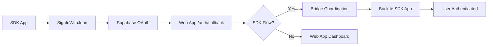

# 🚀 Simplified Authentication Integration - SDK v1.8.0

## What This Solves
- ✅ **Uses your existing Supabase infrastructure** (same as web app)
- ✅ **Preserves bridge coordination** (won't break Claude MCP OAuth)  
- ✅ **Automatic session management** (no manual token parsing)
- ✅ **Zero-config authentication** (just wrap your app)

## Quick Start

### 1. Install Latest SDK
```bash
npm install @jeanmemory/react@1.8.0
```

### 2. Wrap Your App
```tsx
import { JeanProvider, useJean, SignInWithJean } from '@jeanmemory/react';

function App() {
  return (
    <JeanProvider apiKey="your_api_key">
      <AuthenticatedApp />
    </JeanProvider>
  );
}

function AuthenticatedApp() {
  const { user, isAuthenticated, isLoading } = useJean();
  
  if (isLoading) return <div>Loading...</div>;
  
  if (!isAuthenticated) {
    return (
      <div>
        <h1>Sign in to continue</h1>
        <SignInWithJean />
      </div>
    );
  }
  
  return (
    <div>
      <h1>Welcome {user.name}!</h1>
      <p>Email: {user.email}</p>
      {/* Your authenticated app here */}
    </div>
  );
}
```

### 3. That's It! 

**No manual token handling required.** The SDK now:
- Uses Supabase auth directly (same as your web app)
- Automatically handles bridge coordination  
- Manages session persistence
- Restores user on page reload

## How It Works (Simplified Flow)



## Bridge Coordination Details

The web app `/auth/callback` automatically detects SDK flows and coordinates:

**SDK Parameters:**
- `oauth_session` - Session ID
- `flow=sdk_oauth` - Flow type  
- `api_key` - Your SDK API key

**Web App Response:**
- Detects SDK flow
- Redirects to bridge for coordination
- Bridge returns JWT token to SDK app
- SDK parses and authenticates user

## Error Handling

```tsx
function AuthenticatedApp() {
  const { error, signOut } = useJean();
  
  if (error) {
    return (
      <div>
        <h2>Authentication Error</h2>
        <p>{error}</p>
        <button onClick={signOut}>Try Again</button>
      </div>
    );
  }
  
  // Rest of your app...
}
```

## Testing

1. **Start your app**
2. **Click "Sign in with Jean"**  
3. **Authenticate with Google**
4. **Should redirect back authenticated**

## Troubleshooting

### If auth fails:
1. Check browser console for errors
2. Verify API key format: `jean_sk_...`
3. Ensure your domain is in Supabase allowed redirects
4. Check network tab for failed requests

### If bridge coordination fails:
- The web app callback should detect SDK flows automatically
- Bridge should process and return JWT token
- SDK should parse token and authenticate user

## Support

If this breaks, the issue is likely:
1. **API key format** - Must start with `jean_sk_`
2. **Supabase config** - Domain not in allowed redirects
3. **Bridge coordination** - Parameters not being passed correctly

**This SDK now works exactly like your web app authentication** - same Supabase flow, same coordination, but wrapped for React SDK use.