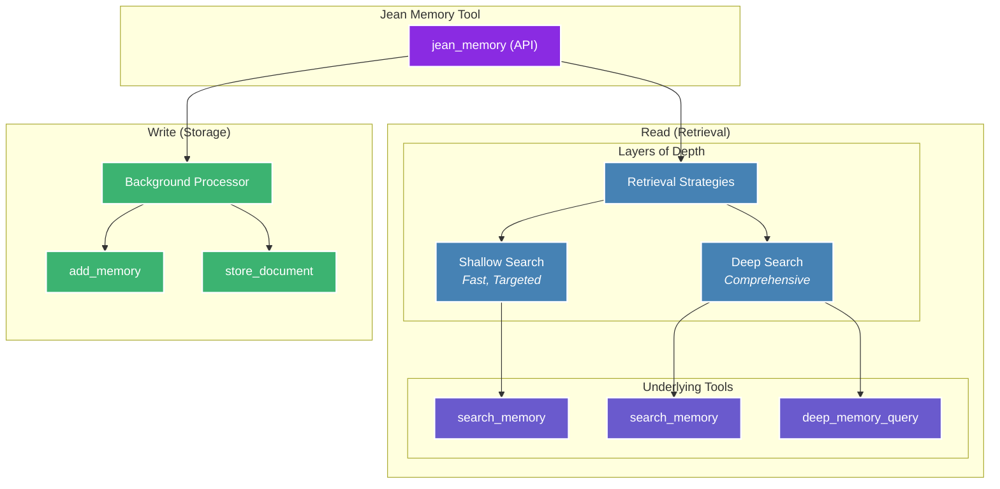

import { CodeBlock } from 'mintlify/components';

## Copy-Paste All Documentation

Don't like reading docs? Paste this into your AI coding tool (Cursor, Claude, etc.), give it instructions for what you'd like to build, and have it build it for you.

<CodeBlock language="markdown" showLineNumbers={false}>
## introduction.mdx\n\n---
title: Introduction to MCP
description: "A powerful, stateful protocol for building advanced agentic systems."
---

The Model Context Protocol (MCP) is an open standard designed to provide a more powerful and flexible way to connect AI agents to tools and data. It standardizes the piping of context and memory across the internet, enabling a new level of interoperability for AI systems.

While our REST API is perfect for many use cases, MCP is the ideal choice for developers building sophisticated, agentic systems that require stateful connections, real-time communication, and dynamic tool use.

## Why Choose MCP over the REST API?

| Feature                       | REST API                                   | Model Context Protocol (MCP)                               |
| ----------------------------- | ------------------------------------------ | ---------------------------------------------------------- |
| **Connection**                | Stateless (each request is independent)    | Stateful (a continuous, persistent connection)             |
| **Communication**             | Request-Response (client-driven)           | Bidirectional (server can push updates to the agent)       |
| **Tool Use**                  | Static (hard-coded to specific endpoints)  | Dynamic (agent can discover and learn to use new tools)    |
| **Context Management**        | Handled in the prompt (can lead to bloat)  | Managed by the protocol (more efficient and scalable)      |

In short, if you are building a simple application and just need to store and retrieve memories, our REST API is a great choice. If you are building a complex, autonomous agent that needs to interact with its environment in real-time, MCP is the way to go.

## Key Benefits of MCP for Agentic Memory

*   **Complex, Multi-Step Tasks**: Because MCP maintains a stateful connection, it's perfect for complex workflows where context needs to be preserved across multiple steps. The agent can have an ongoing "conversation" with a tool, rather than sending a series of disconnected requests.

*   **Real-Time Reactivity**: MCP allows tools to proactively push information to the agent. This is essential for building agents that can react to live events, such as a file being updated, a new message arriving, or a change in a database.

*   **Enhanced Autonomy and Adaptability**: With dynamic tool discovery, your agent can learn to use new tools and capabilities without being explicitly re-programmed. This allows you to build more adaptive and autonomous agents that can evolve over time.

*   **Efficiency and Scalability**: By managing context and tool definitions outside of the prompt, MCP avoids the "prompt bloat" that can limit the performance and scalability of agents built on REST APIs.

## How to Get Started

To get started with MCP, you'll need to connect to one of our MCP servers. The authentication is handled via a standard OAuth 2.1 flow, which is initiated when you connect.

You can find more details on how to implement this in our SDK documentation.
\n\n## authentication.mdx\n\n---
title: Authentication
description: 'How to authenticate with the Jean Memory API.'
---

## OAuth 2.1 for Modern AI

Jean Memory uses the OAuth 2.1 authorization framework, the industry-standard protocol for authorization. This ensures that your integration is secure, scalable, and compatible with the latest AI standards, including the **Model Context Protocol (MCP)**.

Our implementation of OAuth 2.1 is designed to be straightforward for developers while providing robust security for end-users.

### Key Features

- **PKCE for Enhanced Security**: All of our OAuth flows use Proof Key for Code Exchange (PKCE) to protect against authorization code interception attacks.
- **Granular Scopes**: You can request specific permissions from users, ensuring that your application only has access to the data it needs.
- **Short-Lived Access Tokens**: Access tokens are short-lived, reducing the risk of them being compromised.
- **Refresh Tokens**: Long-lived refresh tokens allow your application to maintain a persistent connection to the Jean Memory API without requiring users to re-authenticate.

### The MCP Connection

The Model Context Protocol is a new standard for stateful, bidirectional communication between AI models and external tools. Jean Memory's support for OAuth 2.1 makes it a first-class citizen in the MCP ecosystem, allowing you to build powerful, agentic systems that can securely access a user's memories.

You can learn more in the [MCP Introduction](/mcp/introduction).
\n\n## context-engineering.mdx\n\n---
title: Context Engineering
description: "How Jean Memory intelligently orchestrates context."
---

## Context Engineering, Not Information Retrieval

Jean Memory's core philosophy is **Context Engineering**, not just Information Retrieval. This means the system doesn't just store and retrieve memories—it intelligently engineers context for your AI assistant. This is the key to making AI truly personal and useful.

The system is designed to:
-   Select the *right* information at the *right* time.
-   Synthesize insights from disparate memories.
-   Understand relationships between memories.
-   Predict what context will be most useful.

This approach is inspired by Rich Sutton's "The Bitter Lesson," which argues that leveraging AI's intelligence is more effective than hand-coded heuristics. Jean Memory uses AI to decide what to remember, what context is relevant, and how to synthesize new insights.

## The `jean_memory` Tool: A Tool of Tools

The `jean_memory` tool is the heart of the system. It's the primary interface for your AI to interact with the memory layer. It's a "tool of tools" that orchestrates various underlying memory functions to provide the right context at the right depth, with built-in intelligence and long-context awareness.



```python
@mcp.tool(description="🌟 ALWAYS USE THIS TOOL!!!")
async def jean_memory(
    user_message: str, 
    is_new_conversation: bool, 
    needs_context: bool
) -> str:
```

### Execution Flow

The `jean_memory` tool uses a dual-path asynchronous process to provide a fast response while performing deeper analysis in the background.

1.  **Immediate Path (< 3 seconds)**:
    -   If `needs_context=false`, it returns immediately.
    -   If `needs_context=true`, it runs a fast vector search to get the most relevant context instantly.

2.  **Background Path 1 - Smart Triage**:
    -   Triggered for **every** message.
    -   Uses a fast AI model (Gemini Flash) to analyze the message and decide whether to **REMEMBER** or **SKIP** it.
    -   If it decides to **REMEMBER**, it saves the memory in the background.

3.  **Background Path 2 - Deep Analysis**:
    -   Only runs if `needs_context=true`.
    -   Performs a full context engineering pipeline to synthesize insights from multiple memories.
    -   This can take 30-60 seconds and creates high-priority "insight memories."

## Smart Context Orchestrator

The `SmartContextOrchestrator` is the brain behind the `jean_memory` tool. It uses different strategies to create the best possible context for the AI.

### Context Strategies

1.  **`deep_understanding`**: Used for new conversations to provide comprehensive context about the user.
2.  **`relevant_context`**: Used for ongoing conversations to provide targeted, relevant information.
3.  **`comprehensive_analysis`**: Used for deep queries like "tell me everything you know about X" to do a full scan of all available information.

By using these strategies, Jean Memory ensures that the AI has the perfect amount of context to be helpful without being overwhelmed by information.
\n\n## setup.mdx\n\n---
title: MCP Setup
description: 'Connect Jean Memory to AI assistants'
---

## What is MCP?

Model Context Protocol (MCP) lets AI assistants like Claude and ChatGPT connect to external tools.

## Quick Setup

### Claude Desktop

1. Find your config file:
   - Mac: `~/Library/Application Support/Claude/claude_desktop_config.json`
   - Windows: `%APPDATA%\Claude\claude_desktop_config.json`

2. Add Jean Memory:
```json
{
  "mcpServers": {
    "jean-memory": {
      "command": "npx",
      "args": ["-y", "@modelcontextprotocol/server-jean-memory"]
    }
  }
}
```

3. Restart Claude Desktop

### ChatGPT

Coming soon - use the API for now.

### Cursor

Add to your `.cursor/config.json`:
```json
{
  "mcp": {
    "servers": {
      "jean-memory": {
        "command": "npx",
        "args": ["-y", "@modelcontextprotocol/server-jean-memory"]
      }
    }
  }
}
```

## How It Works

Once connected, the AI can:
- Store memories: "Remember that..."
- Search memories: "What did we discuss about..."
- Use context automatically in responses\n\n## react.mdx\n\n---
title: React SDK
description: 'The official React library for Jean Memory.'
---

## Installation

To get started, install the Jean Memory React SDK and its peer dependency, `@assistant-ui/react`.

```bash
npm install @jeanmemory/react @assistant-ui/react
```

## Basic Usage

The easiest way to get started is with the `JeanChat` component. It provides a full-featured chat interface with memory enabled out of the box.

```javascript
import { useJeanAgent, JeanChat } from '@jeanmemory/react';

function App() {
  const { agent } = useJeanAgent({ 
    apiKey: process.env.REACT_APP_JEAN_API_KEY 
  });
  
  return <JeanChat agent={agent} />;
}
```

## Customizable Authentication

Jean Memory provides a flexible authentication flow that you can tailor to your application's branding. The "Sign In with Jean" button can be customized to fit your needs.

<div style={{
    display: 'flex', 
    alignItems: 'center', 
    justifyContent: 'center',
    margin: '2rem 0'
}}>
    <button style={{
        display: 'inline-flex',
        alignItems: 'center',
        gap: '0.5rem',
        padding: '0.25rem 0.9rem',
        borderRadius: '8px',
        background: '#FFFFFF',
        color: '#000000',
        fontWeight: '500',
        fontSize: '14px',
        border: '1px solid #E5E7EB',
        boxShadow: '0 1px 2px 0 rgba(0, 0, 0, 0.05)'
    }}>
        Sign In with Jean
        
    </button>
</div>

You can adapt the text to best suit your user experience, for example:

- "Add Memory to X"
- "Bring Your Memories"
- "Personalize"

## `useJeanAgent` Hook

This is the core hook for interacting with the Jean Memory API.

```javascript
const { 
  agent, 
  signIn, 
  signOut, 
  isAuthenticated, 
  isLoading, 
  error 
} = useJeanAgent({
  apiKey: "jean_sk_...",        // Required
  systemPrompt: "You are...",   // Optional: Customize the AI's personality
  baseUrl: "https://...",       // Optional: For self-hosted instances
  debug: false                  // Optional: Enable debug logging
});
```

## `JeanChat` Component

A fully-featured, customizable chat component.

```javascript
<JeanChat 
  agent={agent}
  theme={{
    primaryColor: '#9563FF',
    fontFamily: 'Inter'
  }}
  height="600px"
  placeholder="Ask me anything..."
/>
```

## Manual Memory Management

While conversations are automatically saved, you can also manage memories manually.

```javascript
// Add a new memory
await agent.addMemory("User prefers to be addressed by their first name, Alex.");

// Search for memories
const results = await agent.searchMemories("user preferences");
console.log(results);
```

## Next.js Integration

For Next.js applications, you need to dynamically import the `JeanChat` component to disable server-side rendering (SSR), as it relies on browser APIs.

```javascript
// app/chat/page.js
'use client';

import dynamic from 'next/dynamic';
import { useJeanAgent } from '@jeanmemory/react';

const JeanChat = dynamic(
  () => import('@jeanmemory/react').then(mod => mod.JeanChat),
  { ssr: false }
);

export default function ChatPage() {
  const { agent } = useJeanAgent({ 
    apiKey: process.env.NEXT_PUBLIC_JEAN_API_KEY 
  });
  
  return <JeanChat agent={agent} />;
}
```
\n\n## nodejs.mdx\n\n---
title: 'Node.js SDK'
description: 'Server-side memory for Node applications'
---

## Installation

```bash
npm install @jeanmemory/node
```

## Quick Start

```javascript
import { JeanAgent } from '@jeanmemory/node';

const agent = new JeanAgent({
  apiKey: process.env.JEAN_API_KEY
});

await agent.run();
```

## Express Integration

```javascript
import express from 'express';
import { JeanAgent } from '@jeanmemory/node';

const app = express();
const agent = new JeanAgent({ apiKey: process.env.JEAN_API_KEY });

app.post('/chat', async (req, res) => {
  const response = await agent.sendMessage(req.body.message);
  res.json({ response: response.content });
});
```

Full documentation coming soon.\n\n## python.mdx\n\n---
title: Python SDK
description: 'Python library for Jean Memory'
---

## Installation

```bash
pip install jeanmemory
```

## Basic Usage

```python
from jeanmemory import JeanAgent

agent = JeanAgent(api_key="jean_sk_...")
agent.run()  # Starts interactive chat
```

## Programmatic Usage

```python
from jeanmemory import JeanAgent
import os

agent = JeanAgent(
    api_key=os.getenv("JEAN_API_KEY"),
    system_prompt="You are a helpful assistant"
)

# Send a message
response = agent.send_message("What's on my todo list?")
print(response.content)

# Stream responses
for chunk in agent.send_message_stream("Tell me about the project"):
    print(chunk, end="")
```

## Memory Management

```python
# Add memory with tags
agent.add_memory(
    text="Meeting with Sarah about Q4 roadmap",
    tags=["meetings", "q4"]
)

# Search memories
memories = agent.search_memories("roadmap")
for memory in memories:
    print(memory.text)

# Get all memories
all_memories = agent.get_memories()
```

## Flask Integration

```python
from flask import Flask, request, jsonify
from jeanmemory import JeanAgent

app = Flask(__name__)
agent = JeanAgent(api_key="jean_sk_...")

@app.route('/chat', methods=['POST'])
def chat():
    message = request.json['message']
    response = agent.send_message(message)
    return jsonify({'response': response.content})
```

## Async Support

```python
import asyncio
from jeanmemory import AsyncJeanAgent

async def main():
    agent = AsyncJeanAgent(api_key="jean_sk_...")
    response = await agent.send_message("Hello")
    print(response.content)

asyncio.run(main())
```

## CLI Usage

```bash
# Interactive chat
jean chat --api-key jean_sk_...

# Add memory
jean remember "Important meeting tomorrow"

# Search
jean search "meeting"
```\n\n
</CodeBlock>
