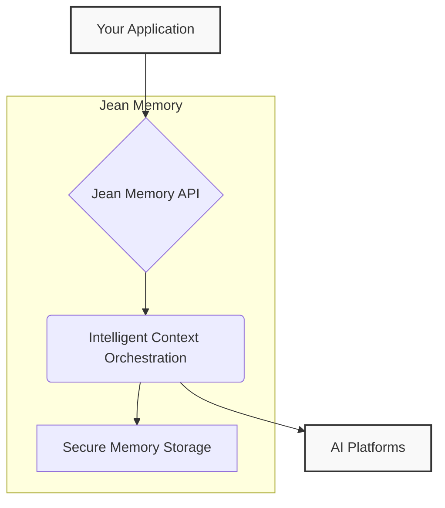
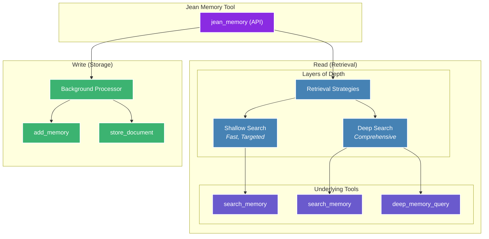

# Jean Memory - Complete Documentation for AI Coding Tools

**Generated on:** 2025-08-07 14:51:43

## What is Jean Memory?

Jean Memory is the universal memory layer for AI applications. It provides persistent, cross-application memory that allows AI agents to remember user preferences, conversation context, and personal information across different applications and sessions.

### Key Capabilities:
- **Universal Memory**: Works across any application or platform
- **5-Line Integration**: Add persistent memory to any React app in under 5 minutes
- **Cross-Application Persistence**: Users' AI agents remember them across different apps
- **Context Engineering**: Intelligent context building for personalized AI experiences
- **Multiple Integration Methods**: REST API, React SDK, Python SDK, Node.js SDK, and MCP

### Quick Integration Examples:

#### React (5 lines):
```tsx
import { useState } from 'react';
import { useJean, SignInWithJean, JeanChat } from 'jeanmemory-react';

function MyApp() {
  const [user, setUser] = useState(null);
  const { agent } = useJean({ user });
  
  if (!agent) return <SignInWithJean apiKey="your-api-key" onSuccess={setUser} />;
  return <JeanChat agent={agent} />;
}
```

#### Python:
```python
from jeanmemory import JeanAgent
agent = JeanAgent(api_key="your-api-key")
agent.run()
```

#### Node.js:
```javascript
import { JeanAgent } from '@jeanmemory/node';
const agent = new JeanAgent({ apiKey: "your-api-key" });
await agent.run();
```

### NPM Packages:
- React: `npm install jeanmemory-react` 
- Node.js: `npm install @jeanmemory/node`
- Python: `pip install jeanmemory`

---

# Complete Documentation

## Overview (overview.mdx)

## What is Jean Memory?

Jean Memory is a universal memory layer for AI applications. It gives your AI a persistent, cross-platform memory, allowing it to remember past conversations and context.

The core philosophy is **Context Engineering, not just Information Retrieval**. This means Jean Memory doesn't just store data—it intelligently understands, synthesizes, and prepares the perfect context for your AI, right when it's needed.

This is all orchestrated through a single, powerful `jean_memory` tool, which acts as a "tool of tools" to provide intelligent, agentic memory with long-term context.

## High-Level Architecture

Jean Memory sits between your application and your AI models, acting as an intelligent orchestration layer. It receives requests, retrieves and synthesizes the necessary context, and provides it to the AI model to generate a personalized and relevant response.

<div style={{ display: 'flex', justifyContent: 'center' }}>

</div>

## Key Features

-   **Universal**: Works with ChatGPT, Claude, Cursor, and any custom AI application.
-   **Persistent**: Memories survive across sessions and platforms.
-   **Intelligent Context**: AI-powered context engineering, not just keyword matching.
-   **Simple Integration**: Add memory to any AI with just a few lines of code.
-   **Asynchronous by Design**: Fast responses with complex processing in the background.

## Getting Started

Ready to give your AI a memory?

<CardGroup cols={3}>
  <Card
    title="Quickstart"
    icon="rocket"
    href="/quickstart"
  >
    Get running in 2 minutes
  </Card>
  <Card
    title="SDK Docs"
    icon="code"
    href="/sdk/react"
  >
    Full library documentation
  </Card>
  <Card
    title="API Reference"
    icon="book"
    href="/api/authentication"
  >
    Learn how to authenticate
  </Card>
</CardGroup>

---

## Quickstart (quickstart.mdx)

## For the AI Developers

Want to just start building? We've consolidated all of our documentation into a single file for you to copy and paste into your favorite AI coding tool.

<Card title="Skip the reading, start building" icon="code">
  Don't like reading docs? Copy all our documentation below and paste it into your AI coding tool (Cursor, Claude Code, etc.) with instructions for what you'd like to build.
  
  <button 
    id="copyDocsBtn"
    style={{
      display: 'inline-flex',
      alignItems: 'center',
      gap: '0.5rem',
      padding: '0.5rem 1rem',
      background: '#7c3aed',
      color: 'white',
      border: 'none',
      borderRadius: '0.375rem',
      fontSize: '0.875rem',
      fontWeight: '500',
      cursor: 'pointer',
      marginTop: '1rem'
    }}
    onClick={() => {
      const btn = document.getElementById('copyDocsBtn');
      fetch('/assets/consolidated-docs.md')
        .then(response => response.text())
        .then(text => {
          navigator.clipboard.writeText(text).then(() => {
            btn.innerHTML = 'Copied!';
            setTimeout(() => {
              btn.innerHTML = 'Copy All Docs for AI';
            }, 2000);
          });
        })
        .catch(err => {
          console.error('Failed to copy: ', err);
          btn.innerHTML = 'Failed to copy';
          setTimeout(() => {
            btn.innerHTML = 'Copy All Docs for AI';
          }, 2000);
        });
    }}
  >
    Copy All Docs for AI
  </button>
</Card>

## How Jean Memory Works

Jean Memory acts as an intelligent memory layer between your application and your AI model, ensuring that every interaction is informed by relevant, long-term context.

<CardGroup cols={3}>
    <Card title="Your Application" icon="cloud">
        The user-facing application that initiates a request.
    </Card>
    <Card title="Jean Memory" icon="brain">
        Intelligently orchestrates memory storage, retrieval, and deduplication.
    </Card>
    <Card title="AI Model" icon="sparkles">
        Receives enhanced context to provide personalized responses.
    </Card>
</CardGroup>


<iframe 
    width="100%" 
    style={{aspectRatio: "16 / 9", margin: '2rem 0'}} 
    src="https://www.youtube.com/embed/kO6f7doPjSI" 
    title="YouTube video player" 
    frameBorder="0" 
    allow="accelerometer; autoplay; clipboard-write; encrypted-media; gyroscope; picture-in-picture" 
    allowFullScreen>
</iframe>

## 1. Get Your API Key

Sign up at [jeanmemory.com](https://jeanmemory.com) and grab your API key.

## 2. Install

<Tabs>
  <Tab title="React">
    ```bash
    npm install @jeanmemory/react
    ```
  </Tab>
  <Tab title="Python">
    ```bash
    pip install jeanmemory
    ```
  </Tab>
  <Tab title="Node.js">
    ```bash
    npm install @jeanmemory/node
    ```
  </Tab>
</Tabs>

## 3. Add to Your App

<Tabs>
  <Tab title="React">
    ```javascript
    import { useJeanAgent, JeanChat } from '@jeanmemory/react';
    
    function App() {
      const { agent } = useJeanAgent({ 
        apiKey: process.env.REACT_APP_JEAN_API_KEY 
      });
      return <JeanChat agent={agent} />;
    }
    ```
  </Tab>
  <Tab title="Python">
    ```python
    from jeanmemory import JeanAgent
    import os
    
    agent = JeanAgent(
        api_key=os.getenv("JEAN_API_KEY")
    )
    agent.run()
    ```
  </Tab>
  <Tab title="Node.js">
    ```javascript
    import { JeanAgent } from '@jeanmemory/node';
    
    const agent = new JeanAgent({
      apiKey: process.env.JEAN_API_KEY
    });
    
    await agent.run();
    ```
  </Tab>
</Tabs>

## 4. Set Environment Variable

```bash
# .env file
JEAN_API_KEY=jean_sk_your_api_key_here
```

## That's It!

Your AI now has persistent memory. Test it:

1. Tell it something: "My favorite color is blue"
2. Ask: "What's my favorite color?"

It remembers across sessions automatically!

---

## Architecture (architecture.mdx)

## More Than a Database: An Intelligent Memory System

At Jean Memory, our core philosophy is **Context Engineering, not just Information Retrieval**. While many systems can store and retrieve data, our goal is to build an intelligent memory system that mirrors the human brain—understanding, synthesizing, and anticipating what you need to know.

To achieve this, we've built our system on a unique tri-database architecture, where each component is chosen for its specific strengths. This allows us to handle the complex demands of AI memory far more effectively than a single database could.

### The Tri-Database Stack

<Card title="Qdrant (Vector DB for RAG)" icon="rocket">
  **For semantic search and relevance.** We use Qdrant for Retrieval-Augmented Generation (RAG). It's powerful and quick, allowing us to perform lightning-fast semantic searches to find the most contextually similar information.
</Card>

<Card title="Neo4j (Graph DB for Relationships)" icon="code">
  **For understanding connections.** We use Neo4j to build a rich knowledge graph of the entities and relationships within a user's memories. Graph databases enable the forming of connections between information, so you see the full picture.
</Card>

<Card title="PostgreSQL (Relational DB for Metadata)" icon="book">
  **For structured data and reliability.** All of the metadata associated with your memories, users, and applications is stored in a robust PostgreSQL database. This ensures data integrity and provides a reliable foundation for the entire system.
</Card>


### The Future of Intelligent Memory

We see `mem0` as a powerful layer of abstraction, and we've built our intelligent layer of agentic memory and context engineering on top of it. Our system is designed to intelligently manage memory over time, much like the human brain. This includes:

- **De-duplication:** To prevent your memory from becoming crowded.
- **Self-Organization:** Rearranging and optimizing data during periods of unuse, similar to how the human brain processes information during sleep.

This combination of a powerful, multi-database backend and a sophisticated intelligence layer is what we see as the future of intelligent memory systems.

---

## Example Use Cases (example-use-cases.mdx)

Jean Memory enables you to build AI applications that truly understand and remember your users. Our customers are using it in imaginative and creative ways, from building **AI career coaching platforms** to creating powerful **integrations with their favorite note-taking applications**.

Here are some of the powerful possibilities, broken down by category, to inspire your own creations.

## Personalized AI Experiences

Create applications that adapt to individual users, providing a deeply personal and intelligent experience.

<Card title="AI Career Coach" icon="rocket">
  **A coach that remembers your journey.** Build an AI mentor that tracks a user's skills, experience, and career goals to provide personalized advice and tailored job recommendations.
</Card>

<Card title="Personalized Note-Taking" icon="book">
  **Your second brain, supercharged.** Connect Jean Memory to note-taking apps to create a personal knowledge base. Allow users to query their own notes and ideas with an AI that understands the context.
</Card>

<Card title="Adaptive AI Tutors" icon="book">
  **Learning that evolves with the student.** Develop an AI tutor that remembers a student's progress, learning style, and areas of difficulty, tailoring lessons for a truly adaptive educational experience.
</Card>

## Agentic & Automated Workflows

Integrate Jean Memory into automated systems to create powerful, context-aware agents.

<Card title="Agentic Memory with n8n" icon="code">
  **Automate with memory.** Build powerful, automated workflows that can remember and act on information from a variety of sources, creating intelligent agents that can handle complex, multi-step tasks.
</Card>

<Card title="Programmatic Content Creation" icon="code">
  **An AI that knows your voice.** Generate content that remembers your unique style, tone, and key messaging points, ensuring your brand is always consistent, whether it's writing emails, reports, or marketing copy.
</Card>

## Collaborative & Organizational Memory

Use Jean Memory to create a shared source of truth for teams and businesses.

<Card title="Long-Term Client Memory" icon="rocket">
  **Never lose a client detail again.** Keep track of all your clients, their history, and their needs with a shared memory that can be accessed by your entire team, ensuring seamless handoffs and personalized service.
</Card>

<Card title="Working Memory Across Platforms" icon="rocket">
  **A seamless, cross-platform experience.** Provide a unified user experience across all of your applications, with a shared memory that follows the user wherever they go, from web to mobile to desktop.
</Card>

<Card title="Shared Memory for Coworkers" icon="book">
  **Unlock your team's collective intelligence.** Enable your team to collaborate more effectively with a shared knowledge base that can be accessed and contributed to by everyone, preventing knowledge silos.
</Card>

---

## Mcp: Authentication (authentication.mdx)

## OAuth 2.1 for Modern AI

Jean Memory uses the OAuth 2.1 authorization framework, the industry-standard protocol for authorization. This ensures that your integration is secure, scalable, and compatible with the latest AI standards, including the **Model Context Protocol (MCP)**.

Our implementation of OAuth 2.1 is designed to be straightforward for developers while providing robust security for end-users.

### Key Features

- **PKCE for Enhanced Security**: All of our OAuth flows use Proof Key for Code Exchange (PKCE) to protect against authorization code interception attacks.
- **Granular Scopes**: You can request specific permissions from users, ensuring that your application only has access to the data it needs.
- **Short-Lived Access Tokens**: Access tokens are short-lived, reducing the risk of them being compromised.
- **Refresh Tokens**: Long-lived refresh tokens allow your application to maintain a persistent connection to the Jean Memory API without requiring users to re-authenticate.

## SDK vs Manual Implementation

### Using SDKs (Recommended)
All our SDKs handle OAuth automatically:

```javascript
// React - OAuth handled automatically
const { agent } = useJean({ apiKey: "your-api-key" });

// Python - OAuth handled automatically  
agent = JeanAgent(api_key="your-api-key")

// Node.js - OAuth handled automatically
const agent = new JeanAgent({ apiKey: "your-api-key" });
```

### Manual OAuth Implementation (Advanced)

If you're building a custom client or testing framework, you'll need to implement the OAuth flow manually.

#### Step 1: Register Your Application
Contact support@jeanmemory.com to register your OAuth client and whitelist redirect URIs.

#### Step 2: Authorization Request
```javascript
const authUrl = new URL('https://jean-memory-api-virginia.onrender.com/oauth/authorize');
authUrl.searchParams.append('client_id', 'your-registered-client-id');
authUrl.searchParams.append('redirect_uri', 'http://localhost:3000/callback'); // Must be whitelisted
authUrl.searchParams.append('response_type', 'code');
authUrl.searchParams.append('code_challenge', pkceChallenge);
authUrl.searchParams.append('code_challenge_method', 'S256');
authUrl.searchParams.append('state', randomState);
```

#### Step 3: Token Exchange
```javascript
const tokenResponse = await fetch('https://jean-memory-api-virginia.onrender.com/oauth/token', {
  method: 'POST',
  headers: { 'Content-Type': 'application/x-www-form-urlencoded' },
  body: new URLSearchParams({
    grant_type: 'authorization_code',
    client_id: 'your-client-id',
    code: authorizationCode,
    redirect_uri: 'http://localhost:3000/callback',
    code_verifier: pkceVerifier
  })
});
```

<Warning>
**Common Issue:** "Invalid redirect URI" error means your URI isn't whitelisted. See our [OAuth Troubleshooting Guide](/oauth-troubleshooting) for solutions.
</Warning>

### The MCP Connection

The Model Context Protocol is a new standard for stateful, bidirectional communication between AI models and external tools. Jean Memory's support for OAuth 2.1 makes it a first-class citizen in the MCP ecosystem, allowing you to build powerful, agentic systems that can securely access a user's memories.

You can learn more in the [MCP Introduction](/mcp/introduction).

---

## Mcp: Context Engineering (context-engineering.mdx)

## Context Engineering, Not Information Retrieval

Jean Memory's core philosophy is **Context Engineering**, not just Information Retrieval. This means the system doesn't just store and retrieve memories—it intelligently engineers context for your AI assistant. This is the key to making AI truly personal and useful.

The system is designed to:
-   Select the *right* information at the *right* time.
-   Synthesize insights from disparate memories.
-   Understand relationships between memories.
-   Predict what context will be most useful.

This approach is inspired by Rich Sutton's "The Bitter Lesson," which argues that leveraging AI's intelligence is more effective than hand-coded heuristics. Jean Memory uses AI to decide what to remember, what context is relevant, and how to synthesize new insights.

## The `jean_memory` Tool: A Tool of Tools

The `jean_memory` tool is the heart of the system. It's the primary interface for your AI to interact with the memory layer. It's a "tool of tools" that orchestrates various underlying memory functions to provide the right context at the right depth, with built-in intelligence and long-context awareness.



```python
@mcp.tool(description="🌟 ALWAYS USE THIS TOOL!!!")
async def jean_memory(
    user_message: str, 
    is_new_conversation: bool, 
    needs_context: bool
) -> str:
```

### Execution Flow

The `jean_memory` tool uses a dual-path asynchronous process to provide a fast response while performing deeper analysis in the background.

1.  **Immediate Path (< 3 seconds)**:
    -   If `needs_context=false`, it returns immediately.
    -   If `needs_context=true`, it runs a fast vector search to get the most relevant context instantly.

2.  **Background Path 1 - Smart Triage**:
    -   Triggered for **every** message.
    -   Uses a fast AI model (Gemini Flash) to analyze the message and decide whether to **REMEMBER** or **SKIP** it.
    -   If it decides to **REMEMBER**, it saves the memory in the background.

3.  **Background Path 2 - Deep Analysis**:
    -   Only runs if `needs_context=true`.
    -   Performs a full context engineering pipeline to synthesize insights from multiple memories.
    -   This can take 30-60 seconds and creates high-priority "insight memories."

## Smart Context Orchestrator

The `SmartContextOrchestrator` is the brain behind the `jean_memory` tool. It uses different strategies to create the best possible context for the AI.

### Context Strategies

1.  **`deep_understanding`**: Used for new conversations to provide comprehensive context about the user.
2.  **`relevant_context`**: Used for ongoing conversations to provide targeted, relevant information.
3.  **`comprehensive_analysis`**: Used for deep queries like "tell me everything you know about X" to do a full scan of all available information.

By using these strategies, Jean Memory ensures that the AI has the perfect amount of context to be helpful without being overwhelmed by information.

---

## Mcp: Introduction (introduction.mdx)

The Model Context Protocol (MCP) is an open standard designed to provide a more powerful and flexible way to connect AI agents to tools and data. It standardizes the piping of context and memory across the internet, enabling a new level of interoperability for AI systems.

While our REST API is perfect for many use cases, MCP is the ideal choice for developers building sophisticated, agentic systems that require stateful connections, real-time communication, and dynamic tool use.

## Why Choose MCP over the REST API?

| Feature                       | REST API                                   | Model Context Protocol (MCP)                               |
| ----------------------------- | ------------------------------------------ | ---------------------------------------------------------- |
| **Connection**                | Stateless (each request is independent)    | Stateful (a continuous, persistent connection)             |
| **Communication**             | Request-Response (client-driven)           | Bidirectional (server can push updates to the agent)       |
| **Tool Use**                  | Static (hard-coded to specific endpoints)  | Dynamic (agent can discover and learn to use new tools)    |
| **Context Management**        | Handled in the prompt (can lead to bloat)  | Managed by the protocol (more efficient and scalable)      |

In short, if you are building a simple application and just need to store and retrieve memories, our REST API is a great choice. If you are building a complex, autonomous agent that needs to interact with its environment in real-time, MCP is the way to go.

## Key Benefits of MCP for Agentic Memory

*   **Complex, Multi-Step Tasks**: Because MCP maintains a stateful connection, it's perfect for complex workflows where context needs to be preserved across multiple steps. The agent can have an ongoing "conversation" with a tool, rather than sending a series of disconnected requests.

*   **Real-Time Reactivity**: MCP allows tools to proactively push information to the agent. This is essential for building agents that can react to live events, such as a file being updated, a new message arriving, or a change in a database.

*   **Enhanced Autonomy and Adaptability**: With dynamic tool discovery, your agent can learn to use new tools and capabilities without being explicitly re-programmed. This allows you to build more adaptive and autonomous agents that can evolve over time.

*   **Efficiency and Scalability**: By managing context and tool definitions outside of the prompt, MCP avoids the "prompt bloat" that can limit the performance and scalability of agents built on REST APIs.

## How to Get Started

To get started with MCP, you'll need to connect to one of our MCP servers. The authentication is handled via a standard OAuth 2.1 flow, which is initiated when you connect.

You can find more details on how to implement this in our SDK documentation.

---

## Mcp: Setup (setup.mdx)

## What is MCP?

Model Context Protocol (MCP) lets AI assistants like Claude and ChatGPT connect to external tools.

## Quick Setup

### Claude Desktop

1. Find your config file:
   - Mac: `~/Library/Application Support/Claude/claude_desktop_config.json`
   - Windows: `%APPDATA%\Claude\claude_desktop_config.json`

2. Add Jean Memory:
```json
{
  "mcpServers": {
    "jean-memory": {
      "command": "npx",
      "args": ["-y", "@modelcontextprotocol/server-jean-memory"]
    }
  }
}
```

3. Restart Claude Desktop

### ChatGPT

Coming soon - use the API for now.

### Cursor

Add to your `.cursor/config.json`:
```json
{
  "mcp": {
    "servers": {
      "jean-memory": {
        "command": "npx",
        "args": ["-y", "@modelcontextprotocol/server-jean-memory"]
      }
    }
  }
}
```

## How It Works

Once connected, the AI can:
- Store memories: "Remember that..."
- Search memories: "What did we discuss about..."
- Use context automatically in responses

---

## Oauth Troubleshooting (oauth-troubleshooting.mdx)

## Common OAuth Issues

### "Invalid redirect URI" Error

**Problem:** `{"detail":"Invalid redirect URI"}` when testing OAuth flow.

**Cause:** Your redirect URI isn't whitelisted on our server.

**Solutions:**

#### For Local Development
```javascript
// Use one of these whitelisted URIs for local testing:
const redirectUri = 'http://localhost:3000/callback';
// or
const redirectUri = 'http://127.0.0.1:3000/callback';
```

#### For Production
Contact support at support@jeanmemory.com to whitelist your production domain:
- `https://yourdomain.com/callback`
- `https://yourdomain.com/auth/callback`

<Warning>
Allow 10-15 minutes after whitelist approval for DNS propagation.
</Warning>

### Testing Without Full OAuth Setup

For development and testing, you can use the SDK's built-in fallback mode:

```javascript
// React SDK - automatically handles fallback
const { agent } = useJean({ 
  apiKey: "your-api-key",
  // Will work even without OAuth completion
});

// Python SDK - demo mode
agent = JeanAgent(api_key="your-api-key", demo_mode=True)
```

## OAuth Flow Requirements

### Required Parameters
```javascript
{
  response_type: 'code',
  client_id: 'your-registered-client-id', 
  redirect_uri: 'https://yourdomain.com/callback', // Must be exact match
  code_challenge: 'generated-pkce-challenge',
  code_challenge_method: 'S256',
  state: 'random-state-value'
}
```

### Callback Handler
```javascript
// Your /callback endpoint must handle:
const urlParams = new URLSearchParams(window.location.search);
const code = urlParams.get('code');
const state = urlParams.get('state');

// Then exchange code for token
const tokenResponse = await fetch('/oauth/token', {
  method: 'POST',
  headers: { 'Content-Type': 'application/x-www-form-urlencoded' },
  body: new URLSearchParams({
    grant_type: 'authorization_code',
    client_id: 'your-client-id',
    code: code,
    redirect_uri: 'https://yourdomain.com/callback',
    code_verifier: 'stored-pkce-verifier'
  })
});
```

## Development Workflow

### Phase 1: Mock Development
- Use SDK fallback modes for UI development
- Test application logic without OAuth

### Phase 2: OAuth Setup  
- Register application at [jeanmemory.com](https://jeanmemory.com)
- Request redirect URI whitelist
- Test authentication flow

### Phase 3: Integration Testing
- Full end-to-end testing with real tokens
- Performance validation
- Production deployment

## Getting Help

**For OAuth Issues:**
- Email: support@jeanmemory.com
- Subject: "OAuth Redirect URI Whitelist Request"
- Include: Your domain(s) and redirect URI(s)

**For Technical Issues:**
- GitHub Issues: [jean-technologies/jean-memory](https://github.com/jean-technologies/jean-memory/issues)
- Include: Error messages, code samples, browser console logs

---

## Sdk: Nodejs (nodejs.mdx)

## Installation

```bash
npm install @jeanmemory/node
```

## Quick Start

```javascript
import { JeanAgent } from '@jeanmemory/node';

const agent = new JeanAgent({
  apiKey: process.env.JEAN_API_KEY
});

await agent.run();
```

## Express Integration

```javascript
import express from 'express';
import { JeanAgent } from '@jeanmemory/node';

const app = express();
const agent = new JeanAgent({ apiKey: process.env.JEAN_API_KEY });

app.post('/chat', async (req, res) => {
  const response = await agent.sendMessage(req.body.message);
  res.json({ response: response.content });
});
```

Full documentation coming soon.

---

## Sdk: Python (python.mdx)

## Installation

```bash
pip install jeanmemory
```

## Basic Usage

```python
from jeanmemory import JeanAgent

agent = JeanAgent(api_key="jean_sk_...")
agent.run()  # Starts interactive chat
```

## Programmatic Usage

```python
from jeanmemory import JeanAgent
import os

agent = JeanAgent(
    api_key=os.getenv("JEAN_API_KEY"),
    system_prompt="You are a helpful assistant"
)

# Send a message
response = agent.send_message("What's on my todo list?")
print(response.content)

# Stream responses
for chunk in agent.send_message_stream("Tell me about the project"):
    print(chunk, end="")
```

## Memory Management

```python
# Add memory with tags
agent.add_memory(
    text="Meeting with Sarah about Q4 roadmap",
    tags=["meetings", "q4"]
)

# Search memories
memories = agent.search_memories("roadmap")
for memory in memories:
    print(memory.text)

# Get all memories
all_memories = agent.get_memories()
```

## Flask Integration

```python
from flask import Flask, request, jsonify
from jeanmemory import JeanAgent

app = Flask(__name__)
agent = JeanAgent(api_key="jean_sk_...")

@app.route('/chat', methods=['POST'])
def chat():
    message = request.json['message']
    response = agent.send_message(message)
    return jsonify({'response': response.content})
```

## Async Support

```python
import asyncio
from jeanmemory import AsyncJeanAgent

async def main():
    agent = AsyncJeanAgent(api_key="jean_sk_...")
    response = await agent.send_message("Hello")
    print(response.content)

asyncio.run(main())
```

## CLI Usage

```bash
# Interactive chat
jean chat --api-key jean_sk_...

# Add memory
jean remember "Important meeting tomorrow"

# Search
jean search "meeting"
```

---

## Sdk: React (react.mdx)

## Installation

To get started, install the Jean Memory React SDK and its peer dependency, `@assistant-ui/react`.

```bash
npm install @jeanmemory/react @assistant-ui/react
```

## Basic Usage

The easiest way to get started is with the `JeanChat` component. It provides a full-featured chat interface with memory enabled out of the box.

```javascript
import { useJeanAgent, JeanChat } from '@jeanmemory/react';

function App() {
  const { agent } = useJeanAgent({ 
    apiKey: process.env.REACT_APP_JEAN_API_KEY 
  });
  
  return <JeanChat agent={agent} />;
}
```

## Customizable Authentication

Jean Memory provides a flexible authentication flow that you can tailor to your application's branding. The "Sign In with Jean" button can be customized to fit your needs.

<div style={{
    display: 'flex', 
    alignItems: 'center', 
    justifyContent: 'center',
    margin: '2rem 0'
}}>
    <button style={{
        display: 'inline-flex',
        alignItems: 'center',
        gap: '0.5rem',
        padding: '0.25rem 0.9rem',
        borderRadius: '8px',
        background: '#FFFFFF',
        color: '#000000',
        fontWeight: '500',
        fontSize: '14px',
        border: '1px solid #E5E7EB',
        boxShadow: '0 1px 2px 0 rgba(0, 0, 0, 0.05)'
    }}>
        Sign In with Jean
        
    </button>
</div>

You can adapt the text to best suit your user experience, for example:

- "Add Memory to X"
- "Bring Your Memories"
- "Personalize"

## `useJeanAgent` Hook

This is the core hook for interacting with the Jean Memory API.

```javascript
const { 
  agent, 
  signIn, 
  signOut, 
  isAuthenticated, 
  isLoading, 
  error 
} = useJeanAgent({
  apiKey: "jean_sk_...",        // Required
  systemPrompt: "You are...",   // Optional: Customize the AI's personality
  baseUrl: "https://...",       // Optional: For self-hosted instances
  debug: false                  // Optional: Enable debug logging
});
```

## `JeanChat` Component

A fully-featured, customizable chat component.

```javascript
<JeanChat 
  agent={agent}
  theme={{
    primaryColor: '#9563FF',
    fontFamily: 'Inter'
  }}
  height="600px"
  placeholder="Ask me anything..."
/>
```

## Manual Memory Management

While conversations are automatically saved, you can also manage memories manually.

```javascript
// Add a new memory
await agent.addMemory("User prefers to be addressed by their first name, Alex.");

// Search for memories
const results = await agent.searchMemories("user preferences");
console.log(results);
```

## Next.js Integration

For Next.js applications, you need to dynamically import the `JeanChat` component to disable server-side rendering (SSR), as it relies on browser APIs.

```javascript
// app/chat/page.js
'use client';

import dynamic from 'next/dynamic';
import { useJeanAgent } from '@jeanmemory/react';

const JeanChat = dynamic(
  () => import('@jeanmemory/react').then(mod => mod.JeanChat),
  { ssr: false }
);

export default function ChatPage() {
  const { agent } = useJeanAgent({ 
    apiKey: process.env.NEXT_PUBLIC_JEAN_API_KEY 
  });
  
  return <JeanChat agent={agent} />;
}
```

---

## Tools (tools.mdx)

Jean Memory is built on a foundation of powerful, modular tools that are orchestrated through the Model Context Protocol (MCP). This allows for a flexible and extensible system that can adapt to a wide range of use cases.

## The `jean_memory` Tool

The `jean_memory` tool is the heart of the system. It is the primary interface for all conversational interactions and is responsible for orchestrating the other tools to provide intelligent, context-aware responses.

```typescript
interface JeanMemoryParams {
  user_message: string;
  is_new_conversation: boolean;
  needs_context: boolean;
}
```

**Usage:**
- **ALWAYS** use for conversational interactions.
- Set `is_new_conversation=true` for the first message in a new conversation.
- Set `needs_context=false` for general knowledge questions that don't require personal context.

## Memory Tools

These tools are the building blocks of Jean Memory's storage and retrieval system. They are used by the `jean_memory` tool to manage a user's memories.

### `add_memories`

Intelligently processes and stores new memories with automatic deduplication.

```typescript
add_memories(text: string, tags?: string[], priority?: boolean): string
```

### `search_memory`

Advanced semantic search that finds relevant memories based on context, not just keywords.

```typescript
search_memory(query: string, limit?: number, tags_filter?: string[]): string
```

### `list_memories`

Retrieves a paginated list of all memories for a user.

```typescript
list_memories(limit?: number, offset?: number): string
```

### `deep_memory_query`

Performs a deep, comprehensive search across ALL user content using Gemini. This is thorough but slower - use `search_memory` for simple queries.

```typescript
deep_memory_query(search_query: str, memory_limit?: int, chunk_limit?: int, include_full_docs?: bool): string
```

## Document Tools

These tools are used to manage large documents, such as markdown files, code files, and essays.

### `store_document`

Lightweight document storage tool that queues processing in the background.

```typescript
store_document(title: str, content: str, document_type?: str, source_url?: str, metadata?: dict): str
```

### `get_document_status`

Check the processing status of a document upload using the job ID returned by `store_document`.

```typescript
get_document_status(job_id: str): str
```

## REST API

For developers who prefer a more traditional RESTful approach, we also provide a comprehensive REST API for managing memories.

### Authentication

Authentication is handled via API key.

```http
Authorization: Bearer <token>
# OR
X-Api-Key: jean_sk_<key>
```

### Common Endpoints

**Create Memory**
```http
POST /api/v1/memories
Content-Type: application/json

{
  "content": "User prefers dark mode",
  "app_name": "my-app"
}
```

**Search Memories**
```http
GET /api/v1/memories/search?q=preferences&limit=10
```

**Get Apps**
```http
GET /api/v1/apps
```

---


## Additional Context for AI Development

### Common Integration Patterns:
- **Chat Applications**: Use JeanChat component for instant AI chat with memory
- **Personal Assistants**: Build context with user preferences and history  
- **Customer Support**: Maintain customer context across support sessions
- **Learning Platforms**: Track progress and adapt to learning style
- **Team Collaboration**: Share context across team members

### API Base URL:
- Production: `https://jean-memory-api-virginia.onrender.com`

### Authentication:
- All SDKs handle OAuth 2.1 PKCE flow automatically
- Get API keys at: https://jeanmemory.com

### Key Features to Highlight in Applications:
- Cross-application memory persistence
- Personalized AI experiences
- Context-aware responses
- User preference learning
- Conversation continuity

This documentation contains everything needed to integrate Jean Memory into any application. Focus on the SDK that matches your technology stack and follow the quickstart examples.
