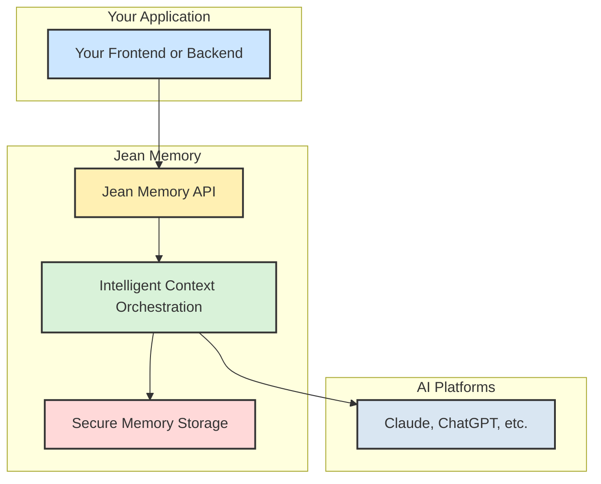

## What is Jean Memory?

Jean Memory is a universal memory layer for AI applications. It gives your AI a persistent, cross-platform memory, allowing it to remember past conversations and context.

The core philosophy is **Context Engineering, not just Information Retrieval**. This means Jean Memory doesn't just store data—it intelligently understands, synthesizes, and prepares the perfect context for your AI, right when it's needed.

This is all orchestrated through a single, powerful `jean_memory` tool, which acts as a "tool of tools" to provide intelligent, agentic memory with long-term context.

## High-Level Architecture

At a high level, Jean Memory sits between your application and the AI models, providing the necessary context to make the AI's responses personal and relevant.

## Key Features

-   **Universal**: Works with ChatGPT, Claude, Cursor, and any custom AI application.
-   **Persistent**: Memories survive across sessions and platforms.
-   **Intelligent Context**: AI-powered context engineering, not just keyword matching.
-   **Simple Integration**: Add memory to any AI with just a few lines of code.
-   **Asynchronous by Design**: Fast responses with complex processing in the background.

## Getting Started

Ready to give your AI a memory?

<CardGroup cols={3}>
  <Card
    title="Quickstart"
    icon="rocket"
    href="/quickstart"
  >
    Get running in 2 minutes
  </Card>
  <Card
    title="SDK Docs"
    icon="code"
    href="/sdk/react"
  >
    Full library documentation
  </Card>
  <Card
    title="API Reference"
    icon="book"
    href="/api/authentication"
  >
    Learn how to authenticate
  </Card>
</CardGroup>
