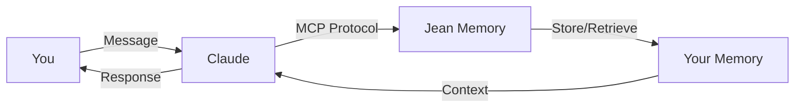

import { AICopyBlock } from '/components/AICopyBlock';

<AICopyBlock 
  title="Quick Setup for Claude Desktop"
  content={`# Jean Memory for Claude Desktop - Setup Instructions

## Step 1: Locate Claude Config
- Mac: ~/Library/Application Support/Claude/claude_desktop_config.json
- Windows: %APPDATA%/Claude/claude_desktop_config.json

## Step 2: Add Jean Memory Server
Add this to your config file:

\`\`\`json
{
  "mcpServers": {
    "jean-memory": {
      "command": "npx",
      "args": [
        "-y",
        "@modelcontextprotocol/server-jean-memory"
      ]
    }
  }
}
\`\`\`

## Step 3: Restart Claude Desktop
Completely quit and restart Claude Desktop.

## Step 4: Authorize
When you see the OAuth prompt, click "Authorize" to connect your Jean Memory account.

## Step 5: Test It
Say: "Remember that my favorite color is blue"
Close Claude and reopen
Say: "What's my favorite color?"

Claude now has persistent memory!`}
/>

## What You Get

Once connected, Claude will:
- **Remember everything** across conversations
- **Track your projects** and their status
- **Recall preferences** and important details
- **Maintain context** even after closing the app

## Setup Guide

<Steps>
  <Step title="Find Your Config File">
    **Mac**: 
    ```bash
    ~/Library/Application Support/Claude/claude_desktop_config.json
    ```
    
    **Windows**: 
    ```
    %APPDATA%\Claude\claude_desktop_config.json
    ```
    
    **Linux**: 
    ```bash
    ~/.config/Claude/claude_desktop_config.json
    ```
  </Step>
  
  <Step title="Add Jean Memory Server">
    Open the config file and add:
    
    ```json
    {
      "mcpServers": {
        "jean-memory": {
          "command": "npx",
          "args": [
            "-y",
            "@modelcontextprotocol/server-jean-memory"
          ]
        }
      }
    }
    ```
    
    <Warning>
      If you already have other MCP servers, add jean-memory to the existing mcpServers object.
    </Warning>
  </Step>
  
  <Step title="Restart Claude Desktop">
    Completely quit Claude Desktop (not just close the window) and restart it.
  </Step>
  
  <Step title="Authorize Access">
    1. Look for the MCP connection indicator in Claude
    2. Click "Authorize" when prompted
    3. Sign in to your Jean Memory account
    4. Allow access
  </Step>
  
  <Step title="Verify It's Working">
    Try this test:
    1. Say: "Remember that I'm working on Project Apollo"
    2. Close Claude completely
    3. Reopen and ask: "What project am I working on?"
    
    Claude should remember!
  </Step>
</Steps>

## How It Works



## Available Commands

Once connected, you can use natural language:

- **"Remember that..."** - Explicitly store information
- **"What did we discuss about..."** - Retrieve specific memories
- **"What do you know about me?"** - See stored context
- **"Forget about..."** - Remove specific memories

## Advanced Configuration

### Custom System Prompts

Add system prompts that leverage memory:

```json
{
  "mcpServers": {
    "jean-memory": {
      "command": "npx",
      "args": ["-y", "@modelcontextprotocol/server-jean-memory"],
      "env": {
        "JEAN_SYSTEM_PROMPT": "Always check memory for context before responding"
      }
    }
  }
}
```

### Multiple Profiles

Use different memory spaces for different contexts:

```json
{
  "mcpServers": {
    "jean-work": {
      "command": "npx",
      "args": ["-y", "@modelcontextprotocol/server-jean-memory"],
      "env": {
        "JEAN_PROFILE": "work"
      }
    },
    "jean-personal": {
      "command": "npx",
      "args": ["-y", "@modelcontextprotocol/server-jean-memory"],
      "env": {
        "JEAN_PROFILE": "personal"
      }
    }
  }
}
```

## Troubleshooting

<AccordionGroup>
  <Accordion title="MCP Connection Failed">
    1. Ensure you have Node.js 18+ installed
    2. Check that npx is in your PATH
    3. Try running `npx @modelcontextprotocol/server-jean-memory` manually to test
  </Accordion>
  
  <Accordion title="OAuth Error">
    1. Clear your browser cookies for jeanmemory.com
    2. Try authorizing in a different browser
    3. Check that you're logged into Jean Memory
  </Accordion>
  
  <Accordion title="Memory Not Persisting">
    1. Verify the MCP server shows as connected in Claude
    2. Check that you completed the OAuth flow
    3. Try explicitly saying "Remember that..." to test
  </Accordion>
  
  <Accordion title="Config File Not Found">
    The config file might not exist yet. Create it in the correct location with the JSON content above.
  </Accordion>
</AccordionGroup>

## Pro Tips

<Info>
  **Tip 1**: You can see what memories are being used by asking Claude to "show me the memory context for this conversation"
</Info>

<Info>
  **Tip 2**: Use tags by saying "Remember for work that..." to categorize memories
</Info>

<Info>
  **Tip 3**: Claude will automatically store important information from your conversations - you don't always need to explicitly say "remember"
</Info>

## Privacy & Security

- **OAuth 2.1**: Secure authentication without sharing passwords
- **Encrypted Storage**: Your memories are encrypted at rest
- **User-Only Access**: Only you can access your memories
- **Local Processing**: MCP runs locally on your machine

## Next Steps

<CardGroup cols={2}>
  <Card
    title="Explore Other Platforms"
    icon="grid"
    href="/platforms/chatgpt"
  >
    Set up Jean with ChatGPT, Cursor, and more
  </Card>
  <Card
    title="Advanced MCP Features"
    icon="code"
    href="/concepts/mcp-protocol"
  >
    Learn about the Model Context Protocol
  </Card>
</CardGroup>