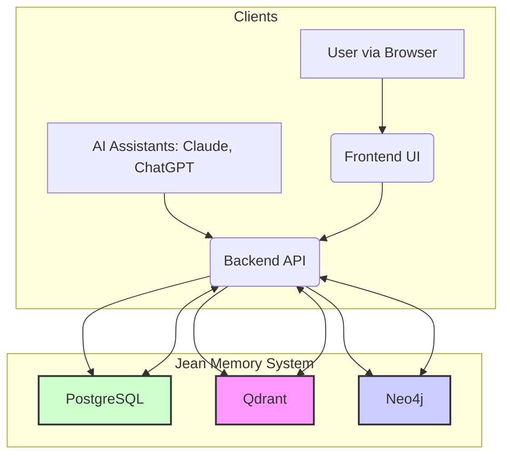

# The Jean Memory Bible: A Comprehensive Developer's Guide (v2)

**Version**: 2.0  
**Last Updated**: July 28, 2025

## Introduction

Welcome to the Jean Memory project. This document is the definitive, textbook-quality guide to understanding the architecture, components, and development practices of the entire system. It is designed to provide a new developer with a deep and comprehensive understanding of the codebase, the "why" behind its design, and the "how" of its implementation.

---

## Part I: The Vision & Architecture

### 1.1. The Philosophy of Jean Memory

Jean Memory is an ambitious attempt to solve a fundamental problem in human-computer interaction: the fact that computers have no memory of their interactions with us. It aims to provide a persistent, cross-platform memory layer for AI applications, enabling them to understand users with deep, personal context. The system is built on the concept of **"Context Engineering"**: the art of providing the *right*, select, relevant context at the moment of inference to make AI profoundly personal and useful.

### 1.2. The Core Principles

*   **Server-Side Intelligence**: All the "thinking" happens on the server. Clients are thin.
*   **Agentic Memory**: The system autonomously decides what to remember, search, and provide.
*   **Asynchronous Processing**: Time-consuming operations are handled in the background to ensure a fast user experience.
*   **Data Quality Over Quantity**: An AI-powered "Smart Triage" process filters out noise to preserve only high-signal, personal information.

### 1.3. System Architecture: A High-Level View

The system is a monorepo composed of a backend API, a frontend UI, and a triad of databases.

---

## Part II: The Backend API (`openmemory/api`)

The backend is the brain of the operation, handling all business logic, AI orchestration, and database interactions.

### 2.1. The Heart of the System: A Deep Dive into the `jean_memory` Orchestration

The core of the system's intelligence lies in the "Smart Triage" architecture, orchestrated by the `jean_memory` tool (`app/tools/orchestration.py`) and the `SmartContextOrchestrator` class (`app/mcp_orchestration.py`).

**Execution Flow:**

1.  **Entry Point**: A call is made to `jean_memory`. It immediately fetches the `background_tasks` instance from the application context.
2.  **Asynchronous Triage (Task 1)**: It immediately triggers the `triage_and_save_memory_background` task for **every message**. This is a critical design choice. We analyze every message for salient information so nothing is missed, but we do it in the background to not impact the user.
    *   Inside `triage_and_save_memory_background`, the `_ai_memory_analysis` function is called. This function uses a fast AI model (like Gemini Flash) with a carefully designed prompt to make a `REMEMBER` or `SKIP` decision.
    *   If the decision is `REMEMBER`, the robust `_add_memory_background` function is called to save the extracted content. Otherwise, the message is discarded.
3.  **Asynchronous Deep Analysis (Task 2)**: If the `needs_context` flag is `true`, the tool also triggers a second, independent background task: `run_deep_analysis_and_save_as_memory`.
    *   This task calls `_standard_orchestration`, which uses a more powerful AI model (like Gemini Pro) to perform a slow (up to 60 seconds), deep analysis of the message in the context of the user's existing memories.
    *   The result is a rich, synthesized insight that is then saved as a new, high-priority memory, prefixed with `[System Insight based on: ...]`.
4.  **Immediate Response**: While the background tasks are running, the main `jean_memory` function performs a fast, simple vector search (`_fallback_simple_search`) and returns the results immediately.

This "dual-path" asynchronous architecture ensures the system is both fast and intelligent, providing an immediate response while continuously enriching the user's memory store in the background.

### 2.2. A Guided Tour of the API Endpoints

The API is structured into logical modules within `app/routers/`. All endpoints are registered in `main.py`.

| File                  | Prefix      | Auth               | Description                                                                                             |
| --------------------- | ----------- | ------------------ | ------------------------------------------------------------------------------------------------------- |
| `agent.py`            | `/agent`    | `get_user`         | **Exposes the `jean_memory` tool as a standard REST endpoint.**                                           |
| `agent_mcp.py`        | `/mcp`      | Custom             | Handles real-time MCP connections for AI clients like Claude.                                             |
| `memories.py`         | `/api/v1`   | `get_current_supa_user` | Provides full CRUD (Create, Read, Update, Delete) operations for memories.                              |
| `apps.py`             | `/api/v1`   | `get_current_supa_user` | Manages user applications and their connections to Jean Memory.                                         |
| `users.py` (inferred) | `/api/v1`   | `get_current_supa_user` | Handles user profile management.                                                                        |
| `documents.py`        | `/api/v1`   | `get_current_supa_user` | Manages ingestion and processing of large documents.                                                    |
| `admin.py`            | `/admin`    | Custom             | Provides administrative endpoints for system management.                                                |
| `stripe_webhooks.py`  | `/webhooks` | Signature Verified | Handles incoming webhooks from Stripe for subscription management.                                        |

### 2.3. The Tri-Database Coordination: A Precise Walkthrough

The system's data is carefully distributed across three databases. The `_add_memory_background` function is the single, critical function that orchestrates writes across all three.

**A Step-by-Step Write Operation:**

1.  **Entry Point**: `_add_memory_background` is called with the content to be saved.
2.  **The `mem0` Abstraction**: The function calls `memory_client.add()`. `mem0` is a powerful library that acts as an abstraction layer over the vector and graph databases.
3.  **Vectorization & Qdrant**: `mem0` takes the text content, generates a vector embedding using an AI model (e.g., OpenAI's `text-embedding-3-small`), and stores this vector in the **Qdrant** database. This makes the memory searchable by semantic meaning.
4.  **Entity Extraction & Neo4j**: `mem0` also analyzes the text to identify named entities (people, places, topics) and the relationships between them. It then populates the **Neo4j** graph database with these nodes and edges. This allows for complex queries about how different memories are connected.
5.  **Metadata & PostgreSQL**: The `mem0.add()` call returns a unique ID for the memory it just created. `_add_memory_background` then creates a new `Memory` record in the **PostgreSQL** database. This record contains the original text, metadata (like the source application), and, crucially, the `mem0_id` that links it to the corresponding entries in Qdrant and Neo4j.

This carefully orchestrated process ensures data consistency and leverages the unique strengths of each database.

---

## Part III: The Frontend UI (`openmemory/ui`)

The frontend is a modern, reactive web application built with Next.js and TypeScript.

### 3.1. The Root of the Application (`app/layout.tsx`)

This is the root layout for the entire UI.

*   **Providers**: It wraps the entire application in several key providers:
    *   `AuthProvider`: Manages the Supabase authentication state.
    *   `ThemeProvider`: Manages light/dark mode.
    *   `Providers` (Redux): Connects the application to the Redux state store.

### 3.2. State Management with Redux Toolkit (`store/`)

Redux Toolkit is used for global state management.

*   **Slices (`memoriesSlice.ts`)**: Each "slice" defines a piece of the global state and the "reducers" that can modify it. Actions like `setMemoriesSuccess` are dispatched from the data-fetching hooks to update the state.

### 3.3. Interacting with the Backend (`hooks/useMemoriesApi.ts`)

Custom React hooks are the primary way the UI interacts with the backend API.

*   **`useMemoriesApi`**: This hook encapsulates all the logic for fetching, creating, updating, and deleting memories. It uses `apiClient` (an Axios instance) to make requests and dispatches actions to the Redux store to update the global state.

---

## Part IV: Development & Deployment

### 4.1. The `Makefile`

The `Makefile` in `openmemory/` provides shortcuts for common development tasks.

*   `make setup`: Runs the initial setup script.
*   `make dev`: Starts the local development environment.
*   `make test`: Runs the backend test suite.

### 4.2. The Deployment Pipeline (`render.yaml`)

The application is deployed to Render. The `render.yaml` file is the blueprint for this process.

*   **Services**: It defines the three main services: the backend API, the frontend UI, and a weekly cron job.
*   **The Critical Pre-deploy Step**: The `preDeployCommand: alembic upgrade head` is the most important part of the deployment pipeline. It ensures that any new database schema changes are applied to the production database *before* the new code goes live. **If this step fails, the deploy is aborted**, preventing a catastrophic mismatch between the code and the database. 