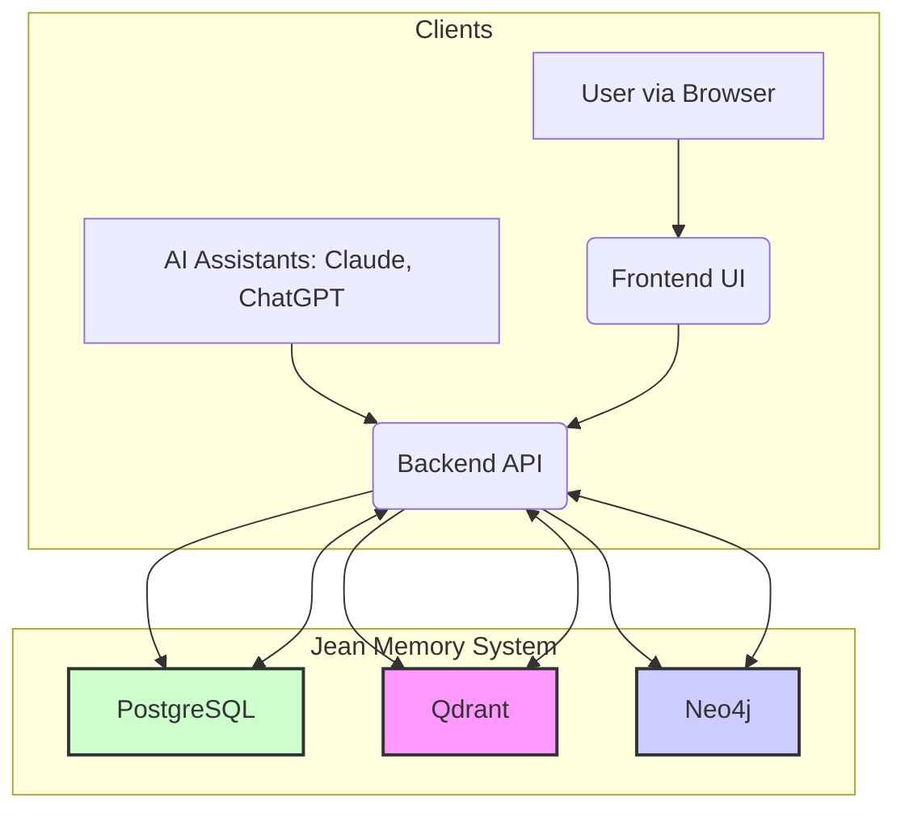

# The Jean Memory Bible: A Comprehensive Developer's Guide

Welcome to the Jean Memory project. This document is the definitive, textbook-quality guide to understanding the architecture, components, and development practices of the entire system. It is designed to provide a new developer with a deep and comprehensive understanding of the codebase, the "why" behind its design, and the "how" of its implementation.

---

## Table of Contents

1.  **[Part I: The Vision & Architecture](#part-i-the-vision--architecture)**
    *   [1.1. The Philosophy of Jean Memory](#11-the-philosophy-of-jean-memory)
    *   [1.2. The Core Principles](#12-the-core-principles)
    *   [1.3. System Architecture: A High-Level View](#13-system-architecture-a-high-level-view)
    *   [1.4. The Monorepo Structure](#14-the-monorepo-structure)

2.  **[Part II: The Backend API (`openmemory/api`)](#part-ii-the-backend-api-openmemoryapi)**
    *   [2.1. Technology Stack](#21-technology-stack)
    *   [2.2. Application Lifecycle & Entry Point (`main.py`)](#22-application-lifecycle--entry-point-mainpy)
    *   [2.3. The Heart of the System: The "Smart Triage" Architecture](#23-the-heart-of-the-system-the-smart-triage-architecture)
    *   [2.4. Authentication & Authorization (`app/auth.py`)](#24-authentication--authorization-appauthpy)
    *   [2.5. The Data Models (`app/models.py`)](#25-the-data-models-appmodelspy)
    *   [2.6. Talking to AIs: The MCP Client System](#26-talking-to-ais-the-mcp-client-system)
    *   [2.7. Database Migrations with Alembic](#27-database-migrations-with-alembic)

3.  **[Part III: The Frontend UI (`openmemory/ui`)](#part-iii-the-frontend-ui-openmemoryui)**
    *   [3.1. Technology Stack](#31-technology-stack)
    *   [3.2. The Root of the Application (`app/layout.tsx`)](#32-the-root-of-the-application-applayouttsx)
    *   [3.3. State Management with Redux Toolkit (`store/`)](#33-state-management-with-redux-toolkit-store)
    *   [3.4. Interacting with the Backend (`hooks/useMemoriesApi.ts`)](#34-interacting-with-the-backend-hooksusememoriesapits)

4.  **[Part IV: The Database Triad](#part-iv-the-database-triad)**
    *   [4.1. PostgreSQL: The Source of Truth](#41-postgresql-the-source-of-truth)
    *   [4.2. Qdrant: The Engine of Semantic Search](#42-qdrant-the-engine-of-semantic-search)
    *   [4.3. Neo4j: The Weaver of Relationships](#43-neo4j-the-weaver-of-relationships)

5.  **[Part V: Development & Deployment](#part-v-development--deployment)**
    *   [5.1. The Makefile: Your Development Companion](#51-the-makefile-your-development-companion)
    *   [5.2. The Deployment Pipeline (`render.yaml`)](#52-the-deployment-pipeline-renderyaml)

---

## Part I: The Vision & Architecture

### 1.1. The Philosophy of Jean Memory

Jean Memory is an ambitious attempt to solve a fundamental problem in human-computer interaction: the fact that computers have no memory of their interactions with us. It aims to provide a persistent, cross-platform memory layer for AI applications, enabling them to understand users with deep, personal context.

The system is built on the concept of **"Context Engineering"**: the art of providing the *right*, select, relevant context at the moment of inference to make AI profoundly personal and useful.

### 1.2. The Core Principles

*   **Server-Side Intelligence**: All the "thinking"—orchestration, memory analysis, and data synthesis—happens on the server. Client applications are thin and simply send messages and receive context.
*   **Agentic Memory**: The system autonomously decides what is important to remember, how to search for it, and what context to provide.
*   **Asynchronous Processing**: To ensure a fast user experience, time-consuming operations are handled in the background, never blocking the user.
*   **Data Quality Over Quantity**: The system is designed to be selective about what it saves, using an AI-powered "Smart Triage" process to filter out noise and preserve only high-signal, personal information.

### 1.3. System Architecture: A High-Level View

The Jean Memory system is a modern web application composed of three main parts: a powerful backend API, a reactive frontend UI, and a sophisticated triad of databases.

### 1.4. The Monorepo Structure

The entire project is housed in a single monorepo (`openmemory/`) to simplify dependency management and ensure consistency between the API and UI.

---

## Part II: The Backend API (`openmemory/api`)

### 2.1. Technology Stack

*   **Framework**: FastAPI
*   **Language**: Python
*   **Database ORM**: SQLAlchemy
*   **Database Migrations**: Alembic
*   **Core Memory Library**: `mem0`

### 2.2. Application Lifecycle & Entry Point (`main.py`)

The `main.py` file is the entry point for the FastAPI application. It uses a `lifespan` context manager to handle startup and shutdown events.

*   **On Startup**:
    1.  Initializes the database connection (`init_database`).
    2.  Performs health checks on the database triad (PostgreSQL, Neo4j, pgvector).
    3.  Starts background tasks, including a periodic cleanup worker and the main document processing service (`background_processor`).
*   **Request Handling**:
    1.  It includes all the API endpoints from the `app/routers/` directory.
    2.  It configures CORS middleware to allow requests from the frontend and other approved domains.
    3.  It sets up the MCP (Model Context Protocol) server, which handles real-time communication with AI clients.
*   **On Shutdown**:
    1.  Gracefully stops all background tasks.

### 2.3. The Heart of the System: The "Smart Triage" Architecture

This is the most important concept in the backend, centered on the `jean_memory` tool in `app/tools/orchestration.py`. It operates on a "dual-path" asynchronous model.

*   **Path 1: Immediate Response (Fast)**: When a message is received, the tool immediately performs a quick vector search and returns a response.
*   **Path 2: Background Processing (Slow & Smart)**: In parallel, two background tasks are triggered:
    1.  **Smart Triage**: A fast AI model (`_ai_memory_analysis`) decides if the message is worth remembering. If so, the salient information is saved via `_add_memory_background`.
    2.  **Deep Analysis**: A powerful AI model (`run_deep_analysis_and_save_as_memory`) performs a slow, deep analysis, synthesizes a new insight, and saves it as a new memory.

### 2.4. Authentication & Authorization (`app/auth.py`)

Authentication is primarily handled via Supabase, using JWTs (JSON Web Tokens).

*   **`get_current_supa_user`**: This is the core dependency for securing UI-facing endpoints. It extracts the `Bearer` token from the `Authorization` header and validates it with Supabase. For local development, it uses a helper (`get_local_dev_user`) to bypass the need for a live Supabase instance.
*   **API Key Authentication**: The system also supports API keys (`jean_sk_...`). The `_get_user_from_api_key` function validates these keys by comparing a SHA-256 hash of the provided key with the stored hash in the `api_keys` table.

### 2.5. The Data Models (`app/models.py`)

This file defines the entire PostgreSQL schema using SQLAlchemy's ORM.

*   **`User`**: The central model, representing a user account. It includes details like `user_id` (from Supabase), subscription tier, and relationships to all other data.
*   **`Memory`**: Represents a single memory record. It contains the `content`, a `state` (e.g., active, archived), and foreign keys to the `User` and `App` it belongs to.
*   **`Document` & `DocumentChunk`**: Manages large-form content. A `Document` is the parent record, and its content is broken down into smaller `DocumentChunk`s for efficient processing and searching.
*   **Relationships**: The file defines the relationships between all models (e.g., a `User` has many `Memory`s) and the association tables that link them (e.g., `document_memories`).

### 2.6. Talking to AIs: The MCP Client System

The **Model Context Protocol (MCP)** allows AI clients to use our tools.

*   **Centralized Configuration (`app/config/tool_config.py`)**: This is the single source of truth. It contains:
    *   `ALL_TOOLS`: A dictionary mapping tool names to their function objects.
    *   `CLIENT_TOOL_CONFIG`: A dictionary that defines which tools are visible to each client (e.g., `claude`, `chatgpt`).
*   **Client Logic (`app/clients/`)**: Each client has a file (e.g., `claude.py`) that uses `get_tools_for_client` from the central config to fetch its tool list and format it into the specific schema that client expects.

### 2.7. Database Migrations with Alembic

Alembic is used to manage changes to the PostgreSQL schema.

*   **Workflow**:
    1.  Modify a model in `app/models.py`.
    2.  Run `alembic revision --autogenerate -m "Your description"` to create a new migration script in `alembic/versions/`.
    3.  Run `alembic upgrade head` to apply the migration to your local database.
*   **Production**: The `render.yaml` deployment configuration automatically runs `alembic upgrade head` as a `preDeployCommand`, ensuring the production database is always up to date before the new code goes live.

---

## Part III: The Frontend UI (`openmemory/ui`)

### 3.1. Technology Stack

*   **Framework**: Next.js (with App Router)
*   **Language**: TypeScript
*   **Styling**: Tailwind CSS & shadcn/ui
*   **State Management**: Redux Toolkit

### 3.2. The Root of the Application (`app/layout.tsx`)

This is the root layout for the entire UI.

*   **Providers**: It wraps the entire application in several key providers:
    *   `AuthProvider`: Manages the Supabase authentication state.
    *   `ThemeProvider`: Manages light/dark mode.
    *   `Providers` (Redux): Connects the application to the Redux state store.
*   **Structure**: It defines the root `<html>` and `<body>` tags and includes the main `Navbar` and a `Toaster` for notifications.

### 3.3. State Management with Redux Toolkit (`store/`)

Redux Toolkit is used for global state management.

*   **`store.ts`**: Configures the main Redux store.
*   **Slices (`memoriesSlice.ts`, etc.)**: Each "slice" defines a piece of the global state and the "reducers" that can modify it. For example, `memoriesSlice.ts` manages the list of memories, the currently selected memory, and their loading status. Actions like `setMemoriesSuccess` are dispatched to update the state.

### 3.4. Interacting with the Backend (`hooks/useMemoriesApi.ts`)

Custom React hooks are the primary way the UI interacts with the backend API.

*   **`useMemoriesApi`**: This hook encapsulates all the logic for fetching, creating, updating, and deleting memories.
*   **Workflow**:
    1.  A UI component calls a function from the hook (e.g., `fetchMemories`).
    2.  The hook sets its `isLoading` state to `true`.
    3.  It uses `apiClient` (an Axios instance) to make a request to the backend.
    4.  Upon receiving a successful response, it dispatches an action to the Redux store (e.g., `dispatch(setMemoriesSuccess(data))`) to update the global state.
    5.  If an error occurs, it sets its `error` state.

---

## Part IV: The Database Triad

### 4.1. PostgreSQL: The Source of Truth

*   **Role**: Stores all structured, relational data.
*   **Key Tables**: `users`, `apps`, `memories`, `documents`, `api_keys`.
*   **Why?**: It's reliable, robust, and perfect for structured data.

### 4.2. Qdrant: The Engine of Semantic Search

*   **Role**: Stores vector embeddings of all memories and documents.
*   **Functionality**: Enables searches based on meaning, not just keywords.
*   **Why?**: It's incredibly fast and purpose-built for vector similarity search.

### 4.3. Neo4j: The Weaver of Relationships

*   **Role**: Stores memories as a knowledge graph, connecting entities.
*   **Functionality**: Allows for complex queries about the relationships between different pieces of information.
*   **Why?**: It's designed to explore complex, interconnected data.

---

## Part V: Development & Deployment

### 5.1. The Makefile: Your Development Companion

The `Makefile` in `openmemory/` provides shortcuts for common development tasks.

*   `make setup`: Runs the initial setup script.
*   `make dev`: Starts the local development environment (API, UI, and databases).
*   `make test`: Runs the backend test suite.

### 5.2. The Deployment Pipeline (`render.yaml`)

The application is deployed to Render. The `render.yaml` file defines the services and the deployment process.

*   **Services**: It defines the three main services:
    1.  `jean-memory-api-virginia`: The backend API.
    2.  `jean-memory-ui-virginia`: The frontend UI.
    3.  `narrative-backfill-weekly`: A cron job for periodic tasks.
*   **Deployment Flow**:
    1.  A push to `main` triggers a new build.
    2.  The `preDeployCommand: alembic upgrade head` is run for the API. **If this fails, the deploy is aborted.**
    3.  If successful, the new versions of the API and UI are started.
*   **Environment Variables**: It manages environment variables, using Render's `sync: false` for secrets and defining public variables directly. 