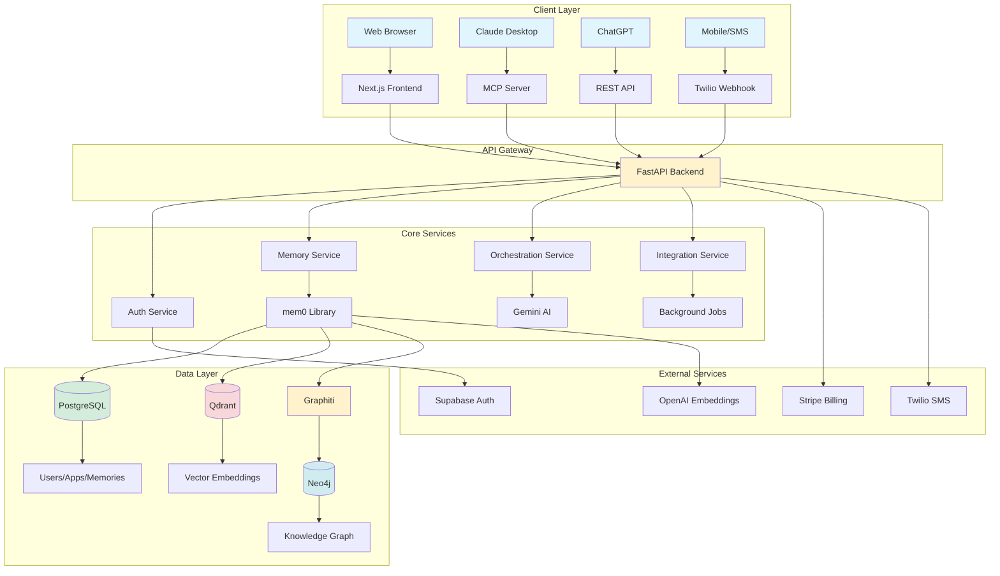
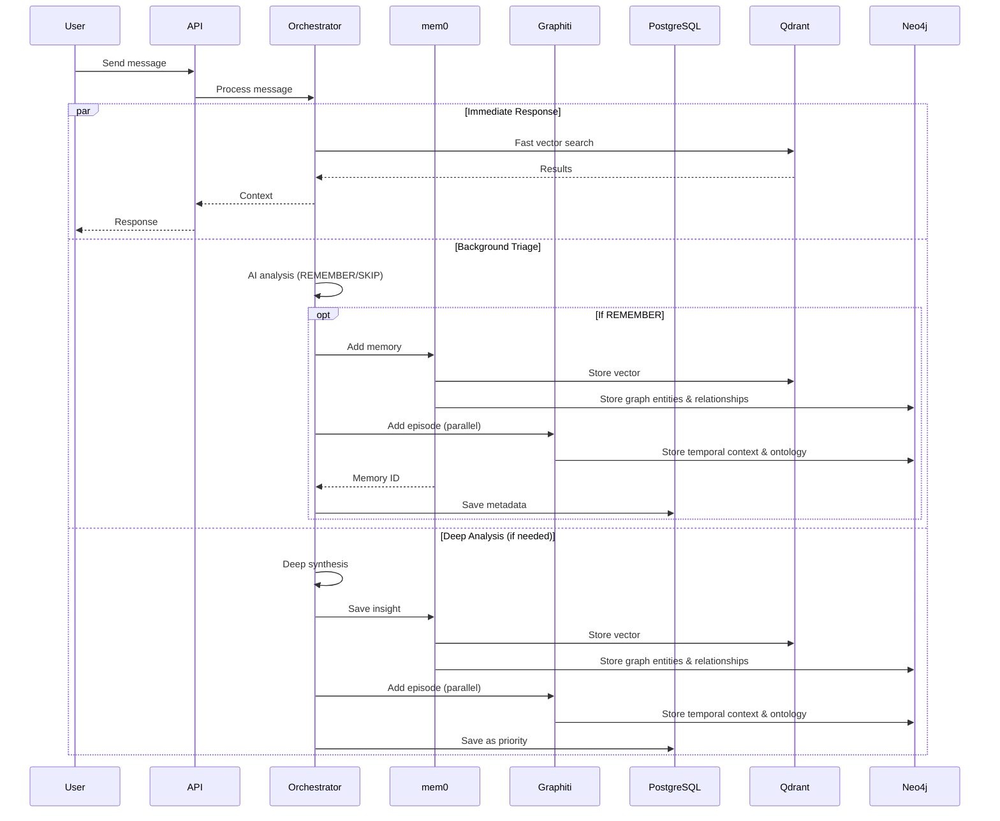
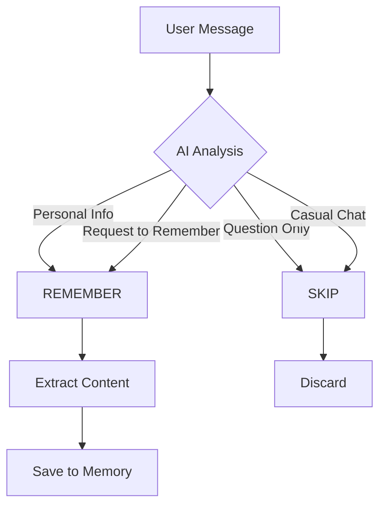

# The Jean Memory Bible: The Definitive Technical Guide

**Version**: 3.0  
**Last Updated**: January 2025  
**Status**: Production-Ready

## Table of Contents

1. [Executive Summary](#executive-summary)
2. [Part I: Vision, Philosophy & Architecture](#part-i-vision-philosophy--architecture)
3. [Part II: The Backend API - Deep Dive](#part-ii-the-backend-api---deep-dive)
4. [Part III: The Frontend UI - Complete Analysis](#part-iii-the-frontend-ui---complete-analysis)
5. [Part IV: Database Architecture & Data Flow](#part-iv-database-architecture--data-flow)
6. [Part V: AI Orchestration & Intelligence Layer](#part-v-ai-orchestration--intelligence-layer)
7. [Part VI: Authentication & Security](#part-vi-authentication--security)
8. [Part VII: Integrations & External Services](#part-vii-integrations--external-services)
9. [Part VIII: Development, Testing & Deployment](#part-viii-development-testing--deployment)
10. [Part IX: Performance & Scalability](#part-ix-performance--scalability)
11. [Part X: API Reference & Tool Documentation](#part-x-api-reference--tool-documentation)

---

## Executive Summary

Jean Memory is a sophisticated, AI-powered memory layer that enables persistent, cross-platform context for AI applications. Built as a monolithic repository with a FastAPI backend and Next.js frontend, it leverages a unique tri-database architecture (PostgreSQL, Qdrant, Neo4j) orchestrated through the mem0 library. The system implements intelligent "Smart Triage" for automatic memory curation and provides real-time MCP (Model Context Protocol) support for AI assistants like Claude and ChatGPT.

**Key Innovations:**
- **Dual-Path Asynchronous Processing**: Immediate responses with background intelligence
- **Smart Context Orchestration**: AI-driven context engineering, not just retrieval
- **Narrative Caching**: Pre-computed user narratives for instant context
- **Multi-Model AI Strategy**: Gemini Flash for speed, Gemini Pro for depth
- **Enterprise-Ready**: API keys, subscription tiers, rate limiting

---

## Part I: Vision, Philosophy & Architecture

### 1.1 The Core Problem

Computers have no memory of their interactions with users. Every conversation starts from scratch. Jean Memory solves this by creating a persistent, intelligent memory layer that makes AI truly personal.

### 1.2 Design Philosophy

#### **Context Engineering, Not Information Retrieval**

The system doesn't just store and retrieve memories - it intelligently engineers context. This means:
- Selecting the *right* information at the *right* time
- Synthesizing insights from disparate memories
- Understanding relationships between memories
- Predicting what context will be most useful

#### **The Bitter Lesson Applied**

Following Rich Sutton's "Bitter Lesson" - the system leverages AI intelligence over hand-coded heuristics:
- AI decides what to remember (Smart Triage)
- AI determines relevant context (Smart Orchestration)
- AI synthesizes new insights (Deep Analysis)

#### **Asynchronous by Design**

Every expensive operation happens in the background:
- Memory saving is asynchronous
- Deep analysis runs in parallel
- Document processing uses job queues
- Narrative generation happens offline

### 1.3 System Architecture



### 1.4 Key Architectural Decisions

1. **Monorepo Structure**: Frontend and backend in one repository for atomic deployments
2. **Tri-Database Design**: Each database optimized for its purpose
3. **mem0 Abstraction**: Unified interface over vector and graph databases
4. **Graphiti Integration**: Intelligent graph management layer for Neo4j
5. **MCP Protocol**: Real-time streaming for AI assistants
6. **Background Processing**: FastAPI BackgroundTasks for non-blocking operations
7. **AI Model Selection**: Gemini for analysis, OpenAI for embeddings

---

## Part II: The Backend API - Deep Dive

### 2.1 Project Structure

```
openmemory/api/
├── main.py                 # FastAPI application entry point
├── app/
│   ├── models.py          # SQLAlchemy ORM models
│   ├── schemas.py         # Pydantic validation schemas
│   ├── auth.py            # Authentication logic
│   ├── database.py        # Database configuration
│   ├── settings.py        # Environment configuration
│   ├── mcp_orchestration.py  # Smart context orchestration
│   ├── mcp_server.py      # MCP protocol implementation
│   ├── routers/           # API endpoints
│   │   ├── agent_mcp.py   # Unified MCP endpoint
│   │   ├── memories.py    # Memory CRUD operations
│   │   ├── apps.py        # Application management
│   │   ├── integrations.py # External integrations
│   │   ├── profile.py     # User profile/SMS
│   │   └── admin.py       # Admin endpoints
│   ├── tools/             # MCP tools
│   │   ├── orchestration.py # jean_memory tool
│   │   ├── memory.py      # Memory operations
│   │   └── documents.py   # Document processing
│   ├── utils/             # Utilities
│   │   ├── gemini.py      # Gemini AI service
│   │   ├── memory.py      # mem0 client
│   │   └── mcp_modules/   # MCP support modules
│   └── integrations/      # External services
│       ├── substack_service.py
│       └── twitter_service.py
├── jean_memory/           # Jean Memory V2 adapter
├── alembic/              # Database migrations
└── requirements.txt      # Python dependencies
```

### 2.2 Core Components

#### 2.2.1 The `jean_memory` Tool - Heart of the System

Located in `app/tools/orchestration.py`, this is the primary interface:

```python
@mcp.tool(description="🌟 ALWAYS USE THIS TOOL!!!")
async def jean_memory(
    user_message: str, 
    is_new_conversation: bool, 
    needs_context: bool
) -> str:
```

**Execution Flow:**

1. **Immediate Path** (< 3 seconds):
   - If `needs_context=false`: Return immediately
   - If `needs_context=true`: Run fast vector search via `_fallback_simple_search`

2. **Background Path 1 - Smart Triage**:
   - Triggered for EVERY message
   - Uses `_ai_memory_analysis` with Gemini Flash
   - Decides REMEMBER/SKIP
   - If REMEMBER: Saves via `_add_memory_background`

3. **Background Path 2 - Deep Analysis**:
   - Only if `needs_context=true`
   - Runs `_standard_orchestration` for synthesis
   - Creates high-priority insight memories
   - Can take 30-60 seconds

#### 2.2.2 Smart Context Orchestrator

The `SmartContextOrchestrator` class in `app/mcp_orchestration.py` implements the intelligence:

**Key Methods:**

- `orchestrate_smart_context()`: Main entry point with narrative caching
- `_ai_create_context_plan()`: Uses Gemini to plan context strategy
- `_fast_deep_analysis()`: 10-15 second analysis for new conversations
- `_standard_orchestration()`: Full context engineering pipeline
- `_add_memory_background()`: Asynchronous memory persistence

**Context Strategies:**

1. **deep_understanding**: New conversations, comprehensive context
2. **relevant_context**: Continuing conversations, targeted search
3. **comprehensive_analysis**: Deep queries like "tell me everything"

#### 2.2.3 Memory Operations

The memory tools are modularized in `app/tools/memory_modules/`:

- **search_operations.py**: Vector search, semantic queries
- **crud_operations.py**: Create, read, update, delete
- **chunk_search.py**: Document chunk searching
- **utils.py**: Shared utilities

### 2.3 API Endpoints

#### 2.3.1 Router Organization

| Router | Path | Purpose | Auth |
|--------|------|---------|------|
| `agent_mcp.py` | `/mcp` | Unified MCP endpoint | API Key or Headers |
| `memories.py` | `/api/v1/memories` | Memory CRUD | Supabase JWT |
| `apps.py` | `/api/v1/apps` | App management | Supabase JWT |
| `integrations.py` | `/api/v1/integrations` | External sync | Supabase JWT |
| `profile.py` | `/api/v1/profile` | User profile | Supabase JWT |
| `webhooks.py` | `/webhooks` | Twilio SMS | Signature |
| `stripe_webhooks.py` | `/stripe/webhook` | Billing | Signature |
| `admin.py` | `/admin` | Admin tools | Secret Key |

#### 2.3.2 Key Endpoints

**Memory Operations:**
- `GET /api/v1/memories` - List memories with pagination
- `POST /api/v1/memories` - Create memory
- `GET /api/v1/memories/{id}` - Get specific memory
- `PATCH /api/v1/memories/{id}` - Update memory
- `DELETE /api/v1/memories/{id}` - Delete memory

**MCP Protocol:**
- `POST /mcp` - Unified endpoint supporting both SSE and HTTP
- Methods: `initialize`, `tools/list`, `tools/call`

**Integrations:**
- `POST /api/v1/integrations/sync/twitter` - Sync Twitter
- `POST /api/v1/integrations/sync/substack` - Sync Substack
- `POST /api/v1/integrations/refresh-all` - Refresh all

### 2.4 Background Processing

#### 2.4.1 FastAPI BackgroundTasks

Used for immediate background operations:
- Memory saving
- Triage analysis
- Deep synthesis

#### 2.4.2 Document Processing Queue

The `BackgroundProcessor` in `app/services/background_processor.py`:
- Processes large documents asynchronously
- Chunks documents for vector search
- Updates processing status

#### 2.4.3 Background Sync Service

The `BackgroundSyncService` handles:
- Periodic integration syncs
- User-triggered refreshes
- CRON job orchestration

---

## Part III: The Frontend UI - Complete Analysis

### 3.1 Architecture

Built with Next.js 14 using App Router:

```
openmemory/ui/
├── app/                    # Next.js app directory
│   ├── layout.tsx         # Root layout
│   ├── page.tsx           # Landing page
│   ├── dashboard/         # Main dashboard
│   ├── memories/          # Memory management
│   ├── my-life/           # Life graph visualization
│   ├── apps/              # App management
│   ├── auth/              # Authentication
│   └── api/               # API routes
├── components/            # React components
│   ├── ui/               # shadcn/ui components
│   ├── dashboard/        # Dashboard components
│   ├── memory-v3/        # Memory components
│   └── landing/          # Landing page
├── contexts/             # React contexts
├── hooks/                # Custom hooks
├── store/                # Redux store
└── lib/                  # Utilities
```

### 3.2 Key Pages

#### 3.2.1 Dashboard (`/dashboard`)

The main hub showing:
- Connected applications
- Memory statistics
- Quick actions
- Migration banners
- Profile completion

**Components:**
- `AppCard`: Display connected apps
- `AnalysisPanel`: Memory insights
- `SyncModal`: Integration sync
- `InstallModal`: App installation

#### 3.2.2 Memories (`/memories`)

Full memory management interface:
- Search and filter
- Create/edit/delete
- Bulk operations
- Category management

**Features:**
- Real-time search
- Advanced filters
- Memory details modal
- Export capabilities

#### 3.2.3 My Life (`/my-life`)

Interactive life visualization:
- Knowledge graph
- Timeline view
- Relationship explorer
- Chat interface

**Visualization Modes:**
- `KnowledgeGraph`: 2D network
- `AdvancedKnowledgeGraph`: 3D view
- `InteractiveExplorer`: Timeline

### 3.3 State Management

#### 3.3.1 Redux Store

Centralized state using Redux Toolkit:

```typescript
store/
├── store.ts          # Store configuration
├── memoriesSlice.ts  # Memory state
├── appsSlice.ts      # Apps state
└── filtersSlice.ts   # Filter state
```

#### 3.3.2 React Contexts

- `AuthContext`: Authentication state
- `ThemeContext`: Dark/light mode

### 3.4 API Integration

#### 3.4.1 Custom Hooks

- `useMemoriesApi`: Memory operations
- `useAppsApi`: App management
- `useAppSync`: Sync operations
- `useAuth`: Authentication

#### 3.4.2 API Client

Axios-based client with:
- Automatic token injection
- Request/response interceptors
- Error handling
- Retry logic

---

## Part IV: Database Architecture & Data Flow

### 4.1 Tri-Database Design

#### 4.1.1 PostgreSQL - Metadata Store

**Purpose**: Transactional data, relationships, metadata

**Tables:**
- `users`: User accounts with subscription info
- `apps`: Connected applications
- `memories`: Memory metadata
- `documents`: Document storage
- `document_chunks`: Chunked content
- `user_narratives`: Cached narratives
- `sms_conversations`: SMS history

**Key Relationships:**
```sql
users (1) -> (N) apps
users (1) -> (N) memories
apps (1) -> (N) memories
documents (1) -> (N) document_chunks
memories (N) <-> (N) documents
```

#### 4.1.2 Qdrant - Vector Database

**Purpose**: Semantic search via embeddings

**Collections:**
- User-specific collections
- 1536-dimensional vectors (OpenAI)
- Metadata filtering
- Similarity search

**Integration**: Via mem0 library

#### 4.1.3 Neo4j - Knowledge Graph with Dual Storage

**Purpose**: Entity relationships and graph queries via dual storage approach

**Dual Storage Architecture:**
- **mem0 Graph Storage**: Direct entity and relationship storage via mem0's built-in graph capabilities
- **Graphiti Layer**: Additional intelligent layer providing enhanced temporal context and ontology-based extraction

**mem0 Graph Storage:**
- Automatic entity extraction and relationship inference
- Direct Neo4j storage of memory-derived entities
- Basic semantic connections between memories
- Integrated with vector storage for hybrid search

**Graphiti Enhancement Layer:**
- **Temporal Context**: Time-aware entity states and relationship evolution
- **Ontology-Based Extraction**: Structured entity types and relationship mappings
- **Episode Management**: Contextual grouping of related memories
- **Advanced Reasoning**: Cross-memory relationship inference

**Combined Node Types:**
- **mem0 Entities**: Basic entities extracted from memory content
- **Graphiti Episodes**: Temporal memory contexts with rich metadata
- **Hybrid Relationships**: Both direct mem0 connections and Graphiti-inferred associations

**Storage Flow:**
1. **mem0**: Memory → Entity Extraction → Neo4j (basic storage)
2. **Graphiti**: Memory → Episode Creation → Neo4j (enhanced storage with temporal context)

### 4.2 Data Flow

#### 4.2.1 Memory Creation Flow



#### 4.2.2 Memory Retrieval Flow

1. **Query Processing**: Parse user query
2. **Vector Search**: Find similar memories in Qdrant via mem0
3. **Dual Graph Enhancement**: 
   - Enrich with mem0's built-in Neo4j entity relationships
   - Add Graphiti temporal context and episode connections
4. **Entity Context**: Combine basic mem0 entities with Graphiti's temporal reasoning
5. **Metadata Join**: Add PostgreSQL metadata
6. **Context Formation**: Format for AI consumption with hybrid graph insights

### 4.3 Database Migrations

Managed via Alembic:
- Version-controlled schema changes
- Automatic migration on deploy
- Rollback capabilities
- Zero-downtime migrations

---

## Part V: AI Orchestration & Intelligence Layer

### 5.1 Multi-Model AI Strategy

#### 5.1.1 Model Selection

| Task | Model | Rationale |
|------|-------|-----------|
| Triage Analysis | Gemini 2.5 Flash | Speed (< 1s) |
| Context Planning | Gemini 2.5 Flash | Cost-effective |
| Deep Synthesis | Gemini 2.5 Pro | Quality |
| Embeddings | OpenAI text-embedding-3-small | Compatibility |
| Document Analysis | Gemini 2.0 Flash | Long context |

#### 5.1.2 Gemini Integration

The `GeminiService` class provides:
- Async generation
- Response formatting
- Safety filtering
- Error handling
- Performance logging

### 5.2 Smart Triage System

#### 5.2.1 Memory Analysis

Every message undergoes AI analysis:

```python
prompt = f"""Analyze this message to determine if it contains information worth remembering...

USER MESSAGE: "{user_message}"

MEMORABLE CONTENT includes:
- Personal facts
- Preferences and opinions
- Goals and aspirations
- Explicit requests to remember

NOT MEMORABLE:
- Simple questions
- Casual conversation
- Temporary states

Decision: REMEMBER or SKIP
Content: [Extracted memorable information]
"""
```

#### 5.2.2 Triage Decision Tree



### 5.3 Context Engineering

#### 5.3.1 Context Strategies

**Deep Understanding** (New Conversations):
- User profile synthesis
- Recent activity summary
- Preference extraction
- Relationship mapping

**Relevant Context** (Continuing):
- Query-specific search
- Related memories
- Recent context
- Minimal overhead

**Comprehensive Analysis** (Deep Queries):
- Full memory scan
- Document inclusion
- Multi-source synthesis
- Detailed insights

#### 5.3.2 Narrative Caching

Pre-computed user narratives:
- Generated with Gemini Pro
- 7-day TTL
- Background regeneration
- Instant context for new chats

### 5.4 Performance Optimizations

1. **Parallel Processing**: Multiple searches simultaneously
2. **Streaming Responses**: SSE for real-time updates
3. **Caching**: Context and narrative caching
4. **Query Optimization**: Targeted vs broad searches
5. **Model Selection**: Fast models for time-sensitive operations

---

## Part VI: Authentication & Security

### 6.1 Authentication Methods

#### 6.1.1 Supabase JWT

Primary authentication for UI:
- JWT token validation
- User session management
- OAuth integration
- Email/password support

#### 6.1.2 API Keys

For programmatic access:
- `jean_sk_` prefix
- SHA-256 hashing
- Usage tracking
- Revocation support

#### 6.1.3 Local Development

Simplified auth for development:
- Environment variable override
- Mock user creation
- No external dependencies

### 6.2 Authorization

#### 6.2.1 User Isolation

- All queries filtered by user_id
- No cross-user data access
- App-level isolation
- Memory-level permissions

#### 6.2.2 Subscription Tiers

```python
class SubscriptionTier(Enum):
    FREE = "FREE"
    PRO = "PRO"
    ENTERPRISE = "ENTERPRISE"
```

Feature gates:
- Memory limits
- SMS access
- API rate limits
- Integration counts

### 6.3 Security Measures

1. **Input Validation**: Pydantic schemas
2. **SQL Injection**: SQLAlchemy ORM
3. **XSS Prevention**: React sanitization
4. **CORS**: Configured origins
5. **Rate Limiting**: Per-tier limits
6. **Webhook Verification**: Signature validation

---

## Part VII: Integrations & External Services

### 7.1 Supported Integrations

#### 7.1.1 Substack

- Article ingestion
- Author profile sync
- Automatic chunking
- Metadata extraction

**Flow:**
1. Fetch RSS feed
2. Parse articles
3. Extract content
4. Chunk for search
5. Create memories

#### 7.1.2 Twitter/X

- Tweet import
- Thread reconstruction
- Media handling
- Engagement metrics

#### 7.1.3 SMS (Twilio)

Pro feature for mobile memory:
- Two-way messaging
- Conversation continuity
- MMS support
- Rate limiting

### 7.2 Integration Architecture

```python
class IntegrationService:
    async def sync_integration(app_name: str, user_id: str):
        # 1. Fetch external data
        # 2. Transform to memories
        # 3. Deduplicate
        # 4. Save via mem0
        # 5. Update sync status
```

### 7.3 Background Sync

- Hourly CRON jobs
- User-triggered refresh
- Failure retry
- Progress tracking

---

## Part VIII: Development, Testing & Deployment

### 8.1 Development Setup

#### 8.1.1 Prerequisites

- Python 3.11+
- Node.js 18+
- PostgreSQL 15+
- Docker (optional)

#### 8.1.2 Local Environment

```bash
# Backend
cd openmemory/api
cp env.example .env
pip install -r requirements.txt
alembic upgrade head
uvicorn main:app --reload

# Frontend
cd openmemory/ui
cp env.example .env.local
pnpm install
pnpm dev
```

### 8.2 Testing

#### 8.2.1 Backend Tests

- Unit tests: `pytest`
- Integration tests: `test_jean_memory_integration.py`
- MCP tests: `test_mcp.py`
- Production verification: `production_test.py`

#### 8.2.2 Frontend Tests

- Component tests: Jest
- E2E tests: Playwright
- Visual regression: Chromatic

### 8.3 Deployment

#### 8.3.1 Infrastructure

Deployed on Render.com:
- Blue-green deployment
- Virginia region
- Auto-scaling
- Health checks

#### 8.3.2 Deployment Pipeline

```yaml
services:
  - type: web
    name: jean-memory-api-virginia
    buildCommand: pip install -r requirements.txt
    startCommand: uvicorn main:app
    preDeployCommand: alembic upgrade head  # Critical!
```

#### 8.3.3 Environment Management

- Development: `.env.local`
- Staging: Render environment groups
- Production: Render secrets

### 8.4 Monitoring

- Application logs: Render
- Error tracking: Sentry (planned)
- Analytics: PostHog
- Performance: Custom metrics

---

## Part IX: Performance & Scalability

### 9.1 Performance Optimizations

#### 9.1.1 Caching Strategy

1. **Narrative Cache**: 7-day user narratives
2. **Context Cache**: 5-minute session cache
3. **Vector Cache**: Frequently accessed embeddings
4. **Query Cache**: Common search results

#### 9.1.2 Async Everything

- Background memory saving
- Parallel search operations
- Non-blocking document processing
- Streaming responses

#### 9.1.3 Database Optimizations

- Indexed columns for common queries
- Connection pooling
- Query optimization
- Batch operations

### 9.2 Scalability Considerations

#### 9.2.1 Horizontal Scaling

- Stateless API design
- Database connection limits
- Queue-based processing
- Load balancer ready

#### 9.2.2 Memory Limits

Per tier:
- FREE: 200 memories
- PRO: 10,000 memories
- ENTERPRISE: Unlimited

#### 9.2.3 Rate Limiting

- API: 100 req/min (FREE), 1000 req/min (PRO)
- SMS: 10/day (PRO), 50/day (ENTERPRISE)
- Integrations: Hourly sync limits

### 9.3 Performance Metrics

Typical response times:
- Simple search: < 500ms
- Context generation: < 3s
- Deep analysis: 10-15s
- Document processing: 30-60s

---

## Part X: API Reference & Tool Documentation

### 10.1 MCP Tools

#### 10.1.1 jean_memory

```typescript
interface JeanMemoryParams {
  user_message: string;
  is_new_conversation: boolean;
  needs_context: boolean;
}
```

**Usage:**
- ALWAYS use for conversational interactions
- Set `is_new_conversation=true` for first message
- Set `needs_context=false` for general knowledge

#### 10.1.2 Memory Tools

**add_memories**
```typescript
add_memories(text: string, tags?: string[], priority?: boolean): string
```

**search_memory**
```typescript
search_memory(query: string, limit?: number, tags_filter?: string[]): string
```

**list_memories**
```typescript
list_memories(limit?: number, offset?: number): string
```

### 10.2 REST API

#### 10.2.1 Authentication

```http
Authorization: Bearer <token>
# OR
X-Api-Key: jean_sk_<key>
```

#### 10.2.2 Common Endpoints

**Create Memory**
```http
POST /api/v1/memories
Content-Type: application/json

{
  "content": "User prefers dark mode",
  "app_name": "my-app"
}
```

**Search Memories**
```http
GET /api/v1/memories/search?q=preferences&limit=10
```

**Get Apps**
```http
GET /api/v1/apps
```

### 10.3 Error Handling

Standard error response:
```json
{
  "detail": "Error message",
  "code": "ERROR_CODE",
  "status": 400
}
```

Common error codes:
- `UNAUTHORIZED`: Invalid credentials
- `FORBIDDEN`: Insufficient permissions
- `NOT_FOUND`: Resource not found
- `RATE_LIMITED`: Too many requests
- `SUBSCRIPTION_REQUIRED`: Feature requires upgrade

---

## Appendices

### A. Environment Variables

#### Backend Required
- `DATABASE_URL`: PostgreSQL connection
- `SUPABASE_URL`: Auth service
- `SUPABASE_ANON_KEY`: Public key
- `SUPABASE_SERVICE_KEY`: Admin key
- `OPENAI_API_KEY`: Embeddings
- `QDRANT_HOST`: Vector DB
- `GEMINI_API_KEY`: AI analysis

#### Backend Optional
- `NEO4J_URI`: Graph database
- `STRIPE_SECRET_KEY`: Billing
- `TWILIO_ACCOUNT_SID`: SMS
- `POSTHOG_API_KEY`: Analytics

#### Frontend Required
- `NEXT_PUBLIC_API_URL`: Backend URL
- `NEXT_PUBLIC_SUPABASE_URL`: Auth
- `NEXT_PUBLIC_SUPABASE_ANON_KEY`: Public key

### B. Common Issues & Solutions

1. **"Memory client not initialized"**
   - Check environment variables
   - Verify Qdrant connection

2. **"Authentication failed"**
   - Verify Supabase configuration
   - Check token expiration

3. **"Deep analysis timeout"**
   - Normal for complex queries
   - Check Gemini API limits

### C. Development Commands

```bash
# Backend
make setup          # Initial setup
make dev           # Start development
make test          # Run tests
make migrate       # Create migration
make upgrade       # Apply migrations

# Frontend
pnpm dev           # Development server
pnpm build         # Production build
pnpm lint          # Run linter
pnpm test          # Run tests
```

### D. Architecture Decision Records

1. **ADR-001**: Tri-database architecture for optimal performance
2. **ADR-002**: mem0 library for vector/graph abstraction
3. **ADR-003**: Graphiti for intelligent Neo4j graph management
4. **ADR-004**: Gemini for analysis, OpenAI for embeddings
5. **ADR-005**: FastAPI for async Python backend
6. **ADR-006**: Next.js App Router for modern React

---

## Conclusion

Jean Memory represents a sophisticated approach to persistent AI memory, combining cutting-edge AI orchestration with robust engineering practices. The system's unique dual-path architecture ensures both speed and intelligence, while the tri-database design provides the flexibility needed for complex memory operations.

For developers joining the project, focus first on understanding the `jean_memory` tool and the Smart Context Orchestrator - these are the heart of the system. The rest of the architecture supports these core components in delivering a seamless, intelligent memory layer for AI applications.

Remember: **Context Engineering, Not Information Retrieval**. We're not building a database - we're building an intelligent memory that understands, synthesizes, and anticipates.

---

*"The best way to predict the future is to invent it." - Alan Kay*

*Jean Memory: Inventing the future of AI memory, one context at a time.* 