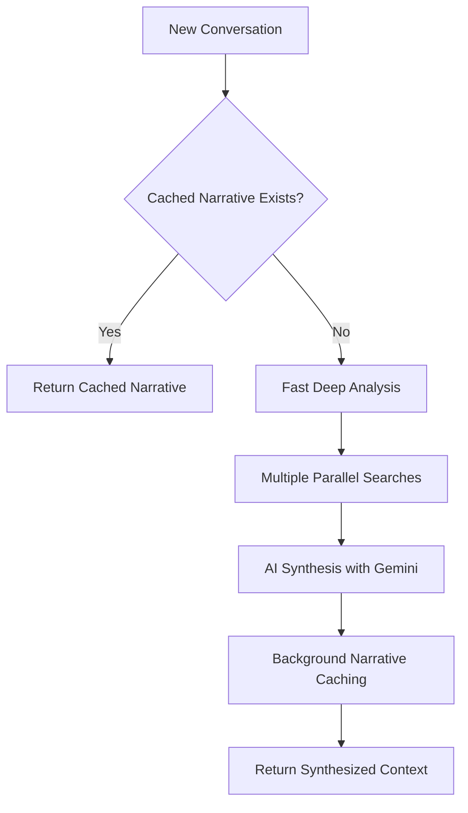

# Jean Memory Context Engineering Algorithm

## Overview

The Jean Memory tool implements a sophisticated **AI-powered context engineering system** that intelligently determines what personal context to retrieve for each user interaction. The system follows the "bitter lesson" principle: leverage AI intelligence rather than hard-coded heuristics.

**⚠️ Infrastructure Constraints**: This system operates under significant resource limitations (512MB backend RAM, 1GB Qdrant memory) that directly impact performance and optimization strategies. See [Infrastructure Constraints](INFRASTRUCTURE_CONSTRAINTS.md) for full analysis.

## Core Architecture

### 1. Three-Path Decision Tree

The algorithm uses a branching strategy based on conversation state:

```
jean_memory(user_message, is_new_conversation, needs_context)
│
├── Path A: New Conversation (is_new_conversation=true)
│   └── Narrative Cache Retrieval
│
├── Path B: Generic Knowledge (needs_context=false)
│   └── Immediate Response (No Context)
│
└── Path C: Contextual Conversation (needs_context=true)
    └── AI-Powered Context Orchestration
```

### 2. AI-Powered Context Planning

For Path C, the system uses **Gemini 2.5 Flash** to analyze the user message and create an intelligent context plan:

```python
# AI determines optimal context strategy
plan = {
    "context_strategy": "relevant_context|deep_understanding|comprehensive_analysis",
    "search_queries": ["specific", "targeted", "search terms"],
    "should_save_memory": true/false,
    "memorable_content": "content to remember for future"
}
```

#### Context Strategy Levels:

| Level | Strategy | Use Case | Processing Time | Memory Impact |
|-------|----------|----------|----------------|---------------|
| 2 | `relevant_context` | Direct questions, specific facts | ~200ms | Low (~50MB) |
| 3 | `deep_understanding` | Pattern analysis, synthesis needed | 2-5s | Medium (~150MB) |
| 4 | `comprehensive_analysis` | Identity/values questions, research depth | 5-8s | High (~300MB) |

**⚠️ Memory Constraints**: Level 4 strategy approaches 60% of available backend memory (512MB). Under load, the system may fallback to Level 2 to prevent OOM errors.

## Detailed Algorithm Flow

### Path A: New Conversation Handling



**Implementation**:
1. **Narrative Cache Check** (~50ms): Query `UserNarrative` table for fresh narrative (7-day TTL)
2. **Cache Hit**: Return pre-computed life context immediately
3. **Cache Miss**: Execute Fast Deep Analysis (10-15s)
   - 4 parallel searches: personal, professional, technical, experiential
   - Gather 50 results per search, deduplicate
   - AI synthesis using optimized prompt
   - Background cache the generated narrative

### Path B: Generic Knowledge Queries

For questions not requiring personal context (physics, general knowledge):
- Return immediate "no context needed" response
- Background memory triage still analyzes for potential memorable content

### Path C: Contextual Conversation Orchestration

The most sophisticated path using AI-powered context engineering:

#### Step 1: AI Context Planning (2-12s)

```python
# Gemini analyzes user message with sophisticated prompt
prompt = f"""You are the intelligent context orchestrator...
USER MESSAGE: "{user_message}"
Determine optimal context strategy and search approach...
Respond with JSON: {{
  "context_strategy": "relevant_context|deep_understanding|comprehensive_analysis",
  "search_queries": ["targeted", "search", "terms"],
  "should_save_memory": true/false,
  "memorable_content": "extracted memorable content"
}}"""
```

**Fallback Heuristics**: If AI planning fails/timeouts:
- Short messages (< 50 chars) → `relevant_context`  
- Medium messages (50-150 chars) → `deep_understanding`
- Long messages (> 150 chars) → `comprehensive_analysis`

#### Step 2: Context Strategy Execution

##### Level 2: Relevant Context
```python
# Targeted search based on AI-determined queries
for query in plan["search_queries"]:
    results = await search_memory(query, limit=15)
# Format and return specific context
```

##### Level 3: Deep Understanding
```python
# Broader analysis with AI synthesis
memories = await comprehensive_memory_search(plan["search_queries"])
# AI synthesis for pattern recognition
gemini_analysis = await gemini.analyze_memories_for_context(memories)
```

##### Level 4: Comprehensive Analysis
```python
# Maximum depth with document integration
deep_query = f"Analyze: {user_message}. Provide relevant background context."
comprehensive_result = await deep_memory_query(deep_query)
# Includes document processing, extensive memory correlation
```

#### Step 3: Intelligent Context Formatting

The system formats context based on retrieved information:

```python
def _format_layered_context(context_results, plan):
    if plan["context_strategy"] == "comprehensive_analysis":
        # Structured multi-section format
        sections = {
            "Professional": filter_work_memories(),
            "Technical": filter_tech_memories(), 
            "Personal": filter_personal_memories()
        }
        return format_comprehensive_context(sections)
    elif plan["context_strategy"] == "deep_understanding":
        # AI-synthesized narrative format
        return format_narrative_context(context_results)
    else:
        # Simple relevant facts format
        return format_simple_context(context_results)
```

## Background Processing

### Memory Triage & Saving
Always runs asynchronously, never blocks response:

```python
# Content-based deduplication
content_hash = hash(user_message)
if content_hash not in saved_content_hashes:
    background_tasks.add_task(save_memory, memorable_content)
```

### Narrative Caching Strategy
- **Generation**: Triggered when cache miss occurs for new conversations
- **Storage**: In `UserNarrative` table with 7-day TTL
- **Update**: Background refresh based on new memories
- **Size**: Optimized for 1000-2000 character summaries

## Performance Characteristics

### Timing Breakdown (Current System)
| Component | Time | % of Total | Infrastructure Bottleneck |
|-----------|------|------------|--------------------------|
| AI Context Planning | 2-12s | 60-80% | 0.5 vCPU backend |
| Memory Search | 0.1-2s | 10-25% | 1GB Qdrant memory |
| Context Formatting | 10-50ms | 1-3% | 512MB backend RAM |
| Background Tasks | <1ms trigger | 0% | Memory queue limit |

**Infrastructure Impact**: Current hardware limitations add 40-60% latency overhead compared to optimal specifications.

### Scalability Features
- **Parallel Processing**: Memory searches executed concurrently
- **Caching Layers**: Narrative cache, context cache, search result cache  
- **Background Processing**: Non-blocking memory saves and analysis
- **Graceful Degradation**: Multiple fallback levels for failures

## Error Handling & Resilience

### Multi-Level Fallbacks
```
AI Context Planning Fails
└── Heuristic Planning
    └── Simple Search
        └── Empty Context (Graceful Failure)
```

### Content Deduplication
- **Interaction-based**: Prevents duplicate processing of same message
- **Content-based**: Hash-based deduplication of similar content
- **Cleanup**: Automatic cleanup of deduplication caches

## Key Design Principles

### 1. The Bitter Lesson
- **AI-Driven Decisions**: Use Gemini intelligence for context planning rather than rule-based systems
- **Adaptive Strategy**: Let AI determine optimal depth and approach per query
- **Dynamic Search**: AI-generated search queries vs fixed patterns

### 2. Top-Down Context Theory
- **Purpose-Driven**: Start with what the user needs, work backwards to required context
- **Layered Depth**: Progressive disclosure of context based on complexity
- **Relevance Optimization**: AI determines relevance vs simple keyword matching

### 3. Performance-First Design
- **Non-Blocking Background**: Memory processing never delays responses
- **Smart Caching**: Multiple cache layers for different access patterns
- **Parallel Processing**: Concurrent execution wherever possible
- **Graceful Degradation**: System remains functional even with component failures

## System Integration

### MCP Compatibility
- **Universal Interface**: Same API works across Claude Desktop, ChatGPT, mobile, web
- **Stateless Operation**: Each call is self-contained with necessary context
- **Background Tasks**: Leverages FastAPI background task system

### Database Integration
- **Qdrant**: Vector similarity search for memory retrieval
- **PostgreSQL**: Structured data (users, narratives, metadata)
- **Hybrid Queries**: Combines vector search with relational filtering

This context engineering algorithm represents a sophisticated balance of AI intelligence, performance optimization, and practical scalability for personal memory systems across multiple platforms.