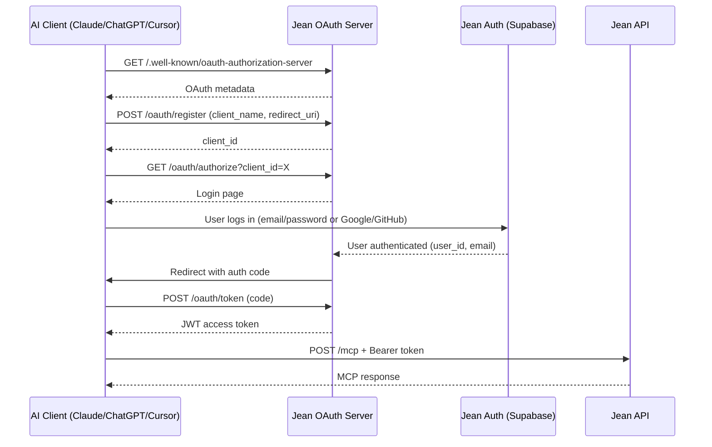

# OAuth 2.0 Clean Architecture for Jean Memory

## Design Goals

1. **Universal MCP Support** - Single OAuth implementation for all AI clients
2. **Zero User Friction** - No user IDs, just a simple URL
3. **Secure by Default** - JWT tokens with proper claims
4. **Modular & Extensible** - Easy to add new clients

## Architecture

### 1. Single MCP Endpoint (No User ID!)

```
https://api.jeanmemory.com/mcp
```

That's it. One URL for everyone. The JWT token tells us:
- Who the user is
- What client they're using  
- What permissions they have

### 2. OAuth Flow



### 3. JWT Token Structure

```json
{
  "sub": "user_id",           // User ID (internal)
  "email": "user@example.com",
  "client": "claude",         // Which AI is calling
  "scope": "read write",      // Permissions
  "exp": 1234567890,         // Expiry
  "iat": 1234567890          // Issued at
}
```

### 4. Modular Implementation

```
/oauth/
├── server.py              # OAuth 2.0 server
├── providers/
│   ├── base.py           # Base OAuth provider
│   ├── supabase.py       # Supabase auth integration
│   └── custom.py         # Future auth providers
├── clients/
│   ├── claude.py         # Claude-specific config
│   ├── chatgpt.py        # ChatGPT-specific config
│   └── cursor.py         # Cursor-specific config
└── middleware/
    └── jwt_auth.py       # JWT validation middleware
```

### 5. Client Registration

Each AI client gets registered with:
- `client_id` - Unique identifier
- `client_name` - Human-readable name
- `redirect_uris` - Allowed callbacks
- `scopes` - What they can access
- `metadata` - Client-specific config

### 6. API Changes

**Before (Bad):**
```python
@router.post("/mcp/v2/claude/{user_id}")
async def mcp_endpoint(user_id: str, request: Request):
    # Trusting user_id from URL 😱
```

**After (Good):**
```python
@router.post("/mcp")
@require_oauth  # Middleware validates JWT
async def mcp_endpoint(request: Request, user: User = Depends(get_current_user)):
    # User comes from validated JWT token ✅
    client_name = request.state.oauth_client  # "claude", "chatgpt", etc.
```

### 7. Migration Strategy

1. **Phase 1**: Build new OAuth system at `/oauth/*`
2. **Phase 2**: Add JWT middleware to new `/mcp` endpoint
3. **Phase 3**: Clients migrate to new endpoint
4. **Phase 4**: Deprecate old `/mcp/v2/claude/{user_id}` endpoints

### 8. Security Features

- **PKCE** - Required for all public clients
- **State Parameter** - CSRF protection
- **Token Rotation** - Access tokens expire in 1 hour
- **Refresh Tokens** - Long-lived, revokable
- **Rate Limiting** - Per client and per user
- **Audit Logging** - Track all OAuth events

### 9. Client Examples

**Claude:**
```
https://api.jeanmemory.com/mcp
```

**ChatGPT (future):**
```
https://api.jeanmemory.com/mcp
```

**Cursor (future):**
```
https://api.jeanmemory.com/mcp
```

All use the SAME endpoint! The JWT tells us everything.

### 10. Benefits

1. **One URL to Rule Them All** - Users don't need different URLs per client
2. **Secure** - No user IDs exposed
3. **Standard** - Any OAuth 2.0 client works
4. **Scalable** - Easy to add new AI clients
5. **Maintainable** - Clean separation of concerns

## Implementation Plan

### Step 1: OAuth Server (Week 1)
- [ ] JWT token generation with pyjwt
- [ ] Token storage (Redis for production)
- [ ] Client registration system
- [ ] PKCE implementation

### Step 2: Auth Integration (Week 1)
- [ ] Supabase login flow
- [ ] Social auth (Google/GitHub)
- [ ] Session management
- [ ] Token refresh flow

### Step 3: API Integration (Week 2)
- [ ] JWT middleware
- [ ] New `/mcp` endpoint
- [ ] Request routing by client
- [ ] Backwards compatibility

### Step 4: Client Support (Week 2)
- [ ] Claude configuration
- [ ] Testing suite
- [ ] Documentation
- [ ] Migration guide

## This is the Way

No more user IDs in URLs. No more "vibe coding". Just clean, standard OAuth 2.0 that works for any AI client now and in the future. 