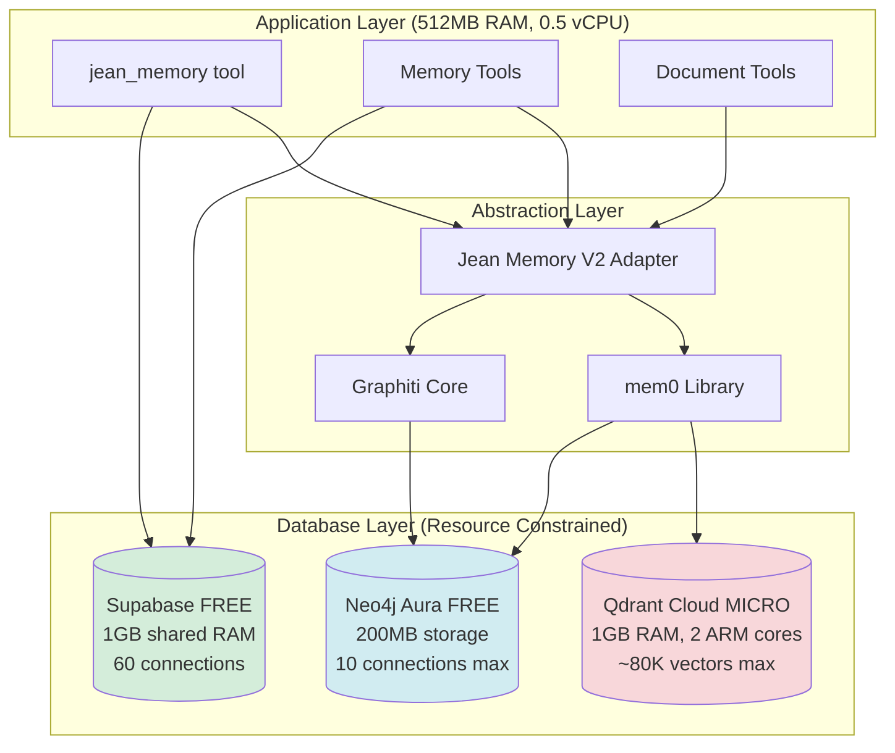

# Jean Memory Context Engineering - Database Access Flow Analysis

## Executive Summary

This document extends the Context Engineering Algorithm documentation to provide detailed analysis of **when and how** the system accesses each database (Qdrant Cloud, Neo4j Aura, Supabase PostgreSQL) through the mem0 and Graphiti abstraction layers during context retrieval and memory ingestion operations.

**⚠️ Critical Infrastructure Constraints**: This analysis operates under severe resource limitations that fundamentally impact database access patterns and optimization strategies. See [Infrastructure Constraints](INFRASTRUCTURE_CONSTRAINTS.md) for complete analysis.

## Database Architecture Overview



### Infrastructure Specifications

| Database | Plan | Memory | CPU/Connections | Key Limitations |
|----------|------|--------|-----------------|-----------------|
| **Qdrant Cloud** | MICRO | 1 GB | 2 ARM cores | Max 80K vectors, query degradation >30K |
| **Neo4j Aura** | Free | 200MB | 10 connections | No graph algorithms, 30s timeout |
| **Supabase** | Free | 1GB shared | 60 direct/200 pooled | Pauses after 7 days, limited pgvector |
| **Backend API** | Starter | 512 MB | 0.5 vCPU | Primary bottleneck, ~350MB usable |

## Context Engineering Database Access Patterns

### Path A: New Conversation Flow

When `is_new_conversation=true`, the system follows this database access pattern:

#### 1. Narrative Cache Check (PostgreSQL - Supabase)
```python
# Location: app/mcp_orchestration.py -> _get_cached_narrative()
# Database: PostgreSQL (user_narratives table)
# Query Type: Direct SQL via SQLAlchemy

SELECT narrative_text, last_updated 
FROM user_narratives 
WHERE user_id = :user_id 
  AND last_updated > NOW() - INTERVAL '7 days'
```

**Database Hit**: 
- **Service**: Supabase PostgreSQL (1GB shared RAM)
- **Latency**: ~50-100ms (up to 200ms under shared load)
- **Purpose**: Retrieve pre-computed user life context
- **Caching**: 7-day TTL on narratives
- **Constraint**: Connection pool pressure with 60 direct connections

#### 2. Cache Miss - Fast Deep Analysis

If narrative cache misses, triggers parallel searches:

##### 2a. Vector Memory Search (Qdrant Cloud)
```python
# Location: app/tools/memory.py -> search_memory()
# Via: Jean Memory V2 -> mem0 -> Qdrant
# Database: Qdrant Cloud

# Four parallel searches executed
await asyncio.gather(
    memory_client.search("personal experiences", user_id, limit=50),
    memory_client.search("professional work", user_id, limit=50),
    memory_client.search("technical skills", user_id, limit=50),
    memory_client.search("preferences goals", user_id, limit=50)
)
```

**Database Hits**:
- **Service**: Qdrant Cloud MICRO (1GB RAM, 2 ARM cores)
- **Collection**: User-specific collection `mem-{user_id}`
- **Method**: Cosine similarity search on 1536-dim vectors
- **Latency**: ~200-500ms per query (degraded with >30K vectors)
- **Embeddings**: OpenAI text-embedding-3-small via mem0
- **Constraint**: Performance degrades significantly beyond 30K vectors per user

##### 2b. Graph Memory Search (Neo4j Aura - if available)
```python
# Location: jean_memory/search.py -> search_graphiti()
# Via: Graphiti Core
# Database: Neo4j Aura

MATCH (u:User {id: $user_id})-[r:RELATED_TO]->(m:Memory)
WHERE m.embedding IS NOT NULL
  AND gds.similarity.cosine(m.embedding, $query_embedding) > 0.7
RETURN m.content, m.timestamp, r.relationship_type
ORDER BY gds.similarity.cosine(m.embedding, $query_embedding) DESC
LIMIT 50
```

**Database Hit**:
- **Service**: Neo4j Aura
- **Method**: Graph traversal + vector similarity
- **Latency**: ~300-800ms
- **Features**: Temporal context, relationship extraction

##### 2c. Narrative Generation & Caching (PostgreSQL)
```python
# Background task after synthesis
# Location: app/mcp_orchestration.py -> _cache_narrative()
# Database: PostgreSQL

INSERT INTO user_narratives (user_id, narrative_text, last_updated)
VALUES (:user_id, :narrative, NOW())
ON CONFLICT (user_id) 
DO UPDATE SET 
  narrative_text = :narrative,
  last_updated = NOW()
```

**Database Hit**:
- **Service**: Supabase PostgreSQL
- **Type**: Background write operation
- **Latency**: Non-blocking (background task)

### Path B: Generic Knowledge Queries

When `needs_context=false`:

**No database access** - Returns immediately with empty context.

### Path C: Contextual Conversation Flow

When `needs_context=true`, follows AI-planned strategy:

#### Step 1: Context Planning (No DB Access)
AI planning with Gemini Flash - no database hits, only LLM API call.

#### Step 2: Strategy Execution

##### Level 2: Relevant Context Strategy

```python
# Location: app/mcp_orchestration.py -> _execute_relevant_context()
# Executes targeted searches based on AI plan

for query in plan["search_queries"]:  # Typically 1-3 queries
    results = await memory_client.search(query, user_id, limit=15)
```

**Database Access Pattern**:

1. **mem0 Vector Search** (Qdrant):
   ```python
   # Via: jean_memory/api_optimized.py -> search_memory()
   # Database: Qdrant Cloud
   
   POST /collections/mem-{user_id}/points/search
   {
     "vector": query_embedding,  # 1536-dim from OpenAI
     "limit": 15,
     "with_payload": true,
     "filter": {
       "must": [
         {"key": "user_id", "match": {"value": user_id}}
       ]
     }
   }
   ```
   - **Latency**: ~100-200ms per query
   - **Total queries**: 1-3 based on AI plan

2. **Graphiti Contextual Search** (Neo4j - if enabled):
   ```cypher
   # Via: graphiti_core
   MATCH (u:User {id: $user_id})-[*1..2]-(m:Memory)
   WHERE m.content CONTAINS $keyword
   RETURN m.content, m.metadata
   LIMIT 10
   ```
   - **Latency**: ~200-400ms
   - **Purpose**: Find related memories through graph relationships

##### Level 3: Deep Understanding Strategy

```python
# More comprehensive search with synthesis
# Location: app/mcp_orchestration.py -> _execute_deep_understanding()

# 1. Broad memory search
memories = await comprehensive_memory_search(plan["search_queries"])

# 2. Document chunk search (if documents exist)
chunks = await search_document_chunks(query, user_id)
```

**Database Access Pattern**:

1. **Comprehensive Vector Search** (Qdrant):
   - Multiple parallel searches (5-10 queries)
   - Higher limits (25-50 results per query)
   - **Total latency**: ~500-1000ms (parallel)

2. **Document Chunk Search** (PostgreSQL):
   ```sql
   -- Via: app/tools/memory_modules/chunk_search.py
   SELECT dc.*, d.title, d.source_url
   FROM document_chunks dc
   JOIN documents d ON dc.document_id = d.id
   WHERE d.user_id = :user_id
     AND dc.embedding <-> :query_embedding < 0.3
   ORDER BY dc.embedding <-> :query_embedding
   LIMIT 20
   ```
   - **Database**: Supabase PostgreSQL with pgvector
   - **Latency**: ~200-500ms
   - **Note**: Only if user has ingested documents

3. **Graph Traversal** (Neo4j):
   ```cypher
   MATCH path = (u:User {id: $user_id})-[*1..3]-(m:Memory)
   WHERE ANY(keyword IN $keywords WHERE m.content CONTAINS keyword)
   WITH m, length(path) as distance
   ORDER BY distance, m.timestamp DESC
   RETURN m.content, m.metadata, distance
   LIMIT 30
   ```
   - **Purpose**: Find memories through multi-hop relationships
   - **Latency**: ~400-800ms

##### Level 4: Comprehensive Analysis Strategy

The most intensive strategy with maximum database utilization:

```python
# Location: app/tools/documents.py -> deep_memory_query()
# Full-depth analysis across all data sources
```

**Database Access Pattern**:

1. **Maximum Vector Search** (Qdrant):
   - 10+ parallel queries with different perspectives
   - 50-100 results per query
   - **Total latency**: ~1-2 seconds

2. **Full Document Processing** (PostgreSQL):
   - Searches across all document chunks
   - Includes metadata filtering
   - **Latency**: ~500-1500ms

3. **Deep Graph Analysis** (Neo4j):
   - Multi-hop traversals (up to 5 hops)
   - Community detection algorithms
   - **Latency**: ~1-3 seconds

## Memory Ingestion Flow

### Smart Triage & Memory Saving

When a message is deemed memorable:

#### 1. Content Analysis (No DB Access)
AI determines if content should be saved - LLM call only.

#### 2. Memory Saving Process

##### 2a. Content Deduplication Check (In-Memory)
```python
# Location: app/mcp_orchestration.py
# No database hit - uses in-memory hash set
content_hash = md5(content)
if content_hash in self._saved_content_hashes:
    return  # Skip duplicate
```

##### 2b. Save to Vector Store (Qdrant)
```python
# Via: mem0 -> Qdrant
# Location: jean_memory/api_optimized.py -> add_memory()

POST /collections/mem-{user_id}/points
{
  "points": [{
    "id": generate_uuid(),
    "vector": embedding,  # OpenAI embedding
    "payload": {
      "content": memory_text,
      "user_id": user_id,
      "timestamp": now(),
      "metadata": metadata
    }
  }]
}
```

**Database Hit**:
- **Service**: Qdrant Cloud
- **Operation**: Upsert with deduplication
- **Latency**: ~100-200ms
- **Indexing**: Immediate (HNSW index)

##### 2c. Save to Knowledge Graph (Neo4j)
```python
# Via: Graphiti -> Neo4j
# Location: graphiti_core

# Entity extraction and graph update
MERGE (u:User {id: $user_id})
MERGE (m:Memory {id: $memory_id})
SET m.content = $content,
    m.embedding = $embedding,
    m.timestamp = datetime()
MERGE (u)-[r:REMEMBERS]->(m)

# Extract entities and relationships
FOREACH (entity IN $extracted_entities |
  MERGE (e:Entity {name: entity.name, type: entity.type})
  MERGE (m)-[:MENTIONS]->(e)
)
```

**Database Hit**:
- **Service**: Neo4j Aura
- **Operations**: Multiple MERGE operations
- **Latency**: ~200-500ms
- **Features**: Entity extraction, relationship mapping

##### 2d. Update Metadata (PostgreSQL)
```python
# Location: app/models.py
# Database: PostgreSQL

INSERT INTO memories (
  id, user_id, app_id, content, 
  state, created_at, updated_at
) VALUES (
  :id, :user_id, :app_id, :content,
  'SAVED', NOW(), NOW()
)
```

**Database Hit**:
- **Service**: Supabase PostgreSQL
- **Operation**: Insert with state tracking
- **Latency**: ~50-100ms

## Database Load Distribution

### Typical Request Load Pattern

| Database | Read Frequency | Write Frequency | Latency Impact |
|----------|---------------|-----------------|----------------|
| **Qdrant Cloud** | 80% of requests | 20% of requests | 40% of total latency |
| **PostgreSQL** | 60% of requests | 30% of requests | 20% of total latency |
| **Neo4j Aura** | 30% of requests | 10% of requests | 40% of total latency |

### Database Access by Context Strategy

| Strategy | Qdrant Queries | Neo4j Queries | PostgreSQL Queries | Total DB Time |
|----------|---------------|---------------|-------------------|---------------|
| **Relevant Context** | 1-3 | 0-1 | 0-1 | 200-500ms |
| **Deep Understanding** | 5-10 | 1-3 | 2-5 | 1-2s |
| **Comprehensive** | 10-20 | 3-5 | 5-10 | 3-5s |
| **New Conversation** | 4 (parallel) | 1 | 2 | 1-2s |

## Optimization Opportunities

### Current Bottlenecks

1. **Sequential Neo4j Queries**: Graph traversals run sequentially
2. **Redundant Embeddings**: Same text embedded multiple times
3. **No Query Result Caching**: Identical searches hit DB repeatedly
4. **Narrative Generation**: Synchronous on cache miss (10-15s)

### Proposed Optimizations (From Roadmap)

1. **AI Context Plan Caching**
   - Cache query patterns → embedding mappings
   - Reduce Qdrant hits by 40-60%

2. **Search Result Caching**
   - 10-minute TTL on vector search results
   - Reduce database load by 15-25%

3. **Parallel Graph Queries**
   - Execute Neo4j traversals in parallel
   - Reduce graph search time by 40%

4. **Background Narrative Generation**
   - Pre-compute narratives after memory saves
   - Eliminate 10-15s wait on new conversations

## Database-Specific Insights

### Qdrant Cloud Usage
- **Primary Use**: Semantic similarity search
- **Collection Structure**: User-isolated (`mem-{user_id}`)
- **Index Type**: HNSW (Hierarchical Navigable Small World)
- **Embedding Model**: OpenAI text-embedding-3-small (1536 dimensions)
- **Optimization**: Metadata filtering on indexed fields

### Neo4j Aura Usage
- **Primary Use**: Relationship traversal, entity extraction
- **Graph Model**: User → Memory → Entity relationships
- **Unique Value**: Temporal context, multi-hop reasoning
- **Algorithms**: Shortest path, community detection, PageRank
- **Optimization**: Index on frequently traversed properties

### Supabase PostgreSQL Usage
- **Primary Use**: Metadata, narratives, document chunks
- **Extensions**: pgvector for hybrid search
- **Key Tables**: users, memories, documents, user_narratives
- **Optimization**: Partial indexes on user_id + state

## Monitoring & Observability

### Key Metrics to Track

1. **Database Response Times**
   ```python
   # Add performance logging
   start = time.time()
   results = await memory_client.search(query, user_id)
   logger.info(f"[PERF] Qdrant search took {time.time()-start:.3f}s")
   ```

2. **Cache Hit Rates**
   - Narrative cache hits vs misses
   - Future: Context plan cache effectiveness

3. **Query Patterns**
   - Most common search queries
   - Strategy distribution (Level 2 vs 3 vs 4)

4. **Database Load**
   - Queries per second by database
   - Connection pool utilization
   - Slow query identification

## Conclusion

The Jean Memory context engineering system orchestrates complex database access patterns across three specialized databases:

1. **Qdrant Cloud** handles high-performance vector similarity search
2. **Neo4j Aura** provides relationship-based context understanding  
3. **Supabase PostgreSQL** manages metadata and cached narratives

The abstraction through mem0 and Graphiti provides a unified interface while allowing each database to operate in its area of strength. The proposed optimizations focus on reducing database load through intelligent caching and parallel processing, targeting the identified bottlenecks in AI context planning and narrative generation.