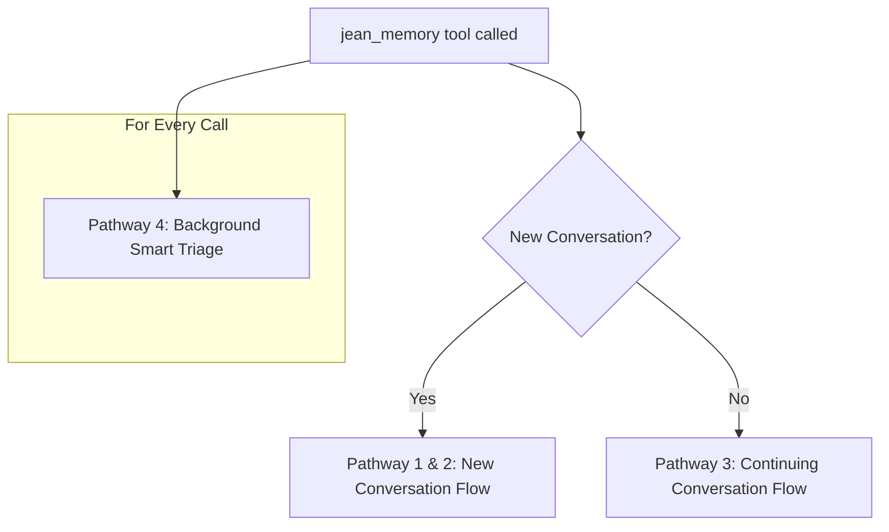
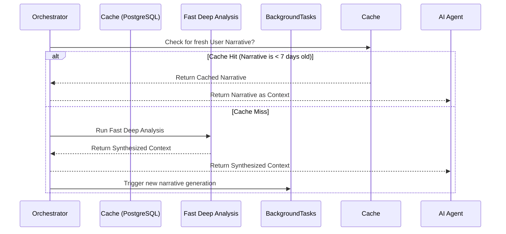
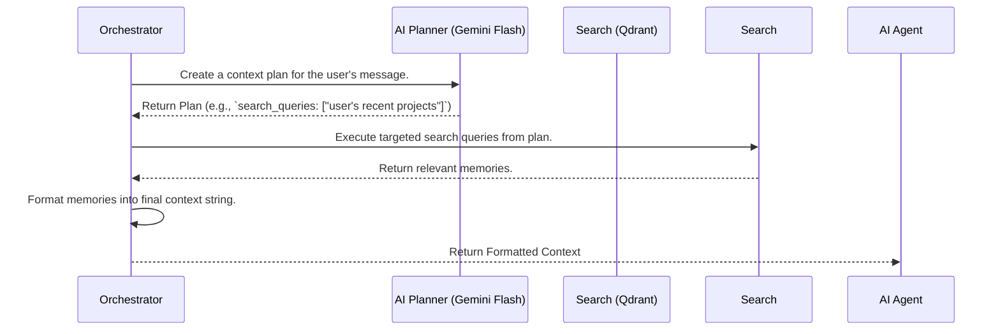
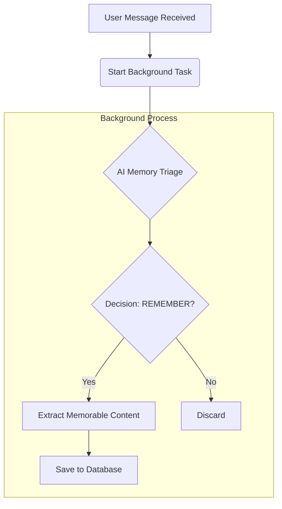

# Agentic Context Orchestration: A Deep Dive

**Version**: 1.0  
**Date**: July 28, 2025  
**Author**: Jean Memory AI Assistant  
**Status**: In Review

## 1. Executive Summary

This document provides a comprehensive technical breakdown of the `SmartContextOrchestrator`, the intelligent core of the Jean Memory system for AI agents. The orchestrator's primary responsibility is to "engineer" the optimal context for an AI conversation, balancing speed, relevance, and depth. It also manages the "Smart Triage" process for deciding what information is worth remembering.

This system is explicitly designed to address the latency-vs-quality trade-off. We are actively benchmarking this system and exploring optimizations, including the use of faster models like Claude Haiku for specific, speed-sensitive tasks like planning and triage. The detailed latency logging recently implemented will be critical for this analysis.

## 2. Core Problem & Design Philosophy

- **Problem**: AI agents require context to have meaningful conversations, but retrieving and packaging this context is complex. A naive approach can be too slow (dumping all memories) or not relevant enough (simple keyword search). Furthermore, not all information from a conversation is worth saving, and this decision requires intelligence.

- **Philosophy**: We follow the "Bitter Lesson"—leveraging AI intelligence over hand-coded rules. The system uses AI (Gemini Flash) for both high-level planning (what to search for) and triage (what to save). The architecture is asynchronous by design to ensure the user-facing experience is never blocked by slow background processes.

## 3. The `jean_memory` Tool: Entry Point

The entire orchestration process begins when an AI agent calls the `jean_memory` tool. This tool's sole responsibility is to delegate the request to the `SmartContextOrchestrator`.

```python
# openmemory/api/app/tools/orchestration.py

@mcp.tool(...)
async def jean_memory(user_message: str, is_new_conversation: bool, ...) -> str:
    orchestrator = get_smart_orchestrator()
    return await orchestrator.orchestrate_smart_context(...)
```

## 4. Orchestration Flow: A Multi-Pathway Approach

The `orchestrate_smart_context` function is the main router. It intelligently selects one of three primary pathways based on the conversational state.



---

### Pathway 1 & 2: New Conversation Flow (Speed & Depth)

**Goal**: Provide comprehensive context for the start of a new chat, as quickly as possible.



- **Pathway 1: Smart Cache (Cache Hit)**
    - **Speed**: Extremely fast (<100ms).
    - **Logic**: Checks a PostgreSQL table (`user_narratives`) for a pre-computed summary of the user. If one was generated in the last 7 days, it's returned immediately.
    - **Potential Bottleneck**: None. This is the optimal path.

- **Pathway 2: Fast Deep Analysis (Cache Miss)**
    - **Speed**: Slower (10-15 seconds).
    - **Logic**: If the cache misses, the system can't leave the AI waiting. It performs several targeted semantic searches in parallel to gather key memories, then uses Gemini to synthesize a "good enough" context for now.
    - **Background Regeneration**: Crucially, it also triggers a background task to generate a new, high-quality narrative with a more powerful model so the *next* conversation will be fast.
    - **Potential Bottleneck**: This pathway is *inherently* a bottleneck, as it involves multiple AI calls and searches. The detailed `[LATENCY]` logs for `Fast Deep Analysis` will show the breakdown between the `Memory Search` and `Gemini Synthesis` steps.

---

### Pathway 3: Continuing Conversation Flow (Relevance & Efficiency)

**Goal**: For an ongoing chat, retrieve only the most relevant context for the current turn, avoiding information overload.



- **Logic**:
    1.  **AI Planning**: The `_ai_create_context_plan` function is called. It uses Gemini Flash to analyze the user's latest message and decides what topics to search for. This is the "intelligent targeting" step.
    2.  **Targeted Search**: The system executes the `search_queries` from the plan against the vector database (Qdrant).
    3.  **Formatting**: The results are packaged into a clean string to be sent back to the AI agent.
- **Potential Bottleneck**: The `AI Context Plan generation` is the main potential bottleneck here. The logs now show its latency. If this step is consistently slow, we could consider switching this specific planner task to a faster model like Claude Haiku.

---

### Pathway 4: Background Smart Triage (Saving Memories)

**Goal**: Intelligently decide if the latest user message contains information worth saving, without blocking the main conversational flow. This runs in the background for *every* message.



- **Logic**:
    1.  **AI Triage**: The `_ai_memory_analysis` function is called in a `BackgroundTask`. It uses a specific prompt to ask Gemini Flash to classify the message as `REMEMBER` or `SKIP`.
    2.  **Save if Necessary**: If the decision is `REMEMBER`, the `_add_memory_background` function is called to persist the extracted content to the databases (Qdrant, Neo4j, and PostgreSQL).

- **Why You Might Not See Memories Saving**:
    - **It's Failing Silently**: This is a major concern. Because this entire process runs in the background, if the `_add_memory_background` function fails (e.g., due to a database connection issue, an error in the `mem0` library, or a permissions problem), the main AI conversation would continue without any visible error. You would only know by checking the server logs for errors related to `BG Add Memory`.
    - **The AI is Deciding to SKIP**: The AI Triage might be incorrectly classifying your messages as "not memorable." The logs will now show the decision (`REMEMBER` or `SKIP`) for each message, which will help us debug this.
    - **Latency**: The `[LATENCY]` log for `Background Memory Save` will now show us exactly how long the saving process takes. If this number is very high, it could indicate a problem with the database connections.

## 5. How Context is Packaged and Returned

The final output of the `jean_memory` tool is always a single string, formatted for clarity. It is **not** a JSON object. The orchestrator takes the raw search results (which are lists of memories) and formats them.

**Example for a Continuing Conversation:**
```
---
[Jean Memory Context]
Core Context: User is a software engineer at Google; User lives in San Francisco
Relevant: User's recent project involves optimizing Python APIs
---
```

## 6. Performance & Bottleneck Analysis

- **Biggest Latency Source**: AI model calls. Every step that involves `gemini.generate_response` is a potential bottleneck. The new logs will quantify this precisely.
- **Database Performance**: Vector searches in Qdrant are generally very fast, but can slow down with extremely complex filters. The `Background Memory Save` latency will indicate the health of our write operations to all three databases.
- **Claude Haiku Optimization**: As mentioned, tasks that are simple, structured, and latency-sensitive are prime candidates for testing a faster model like Claude Haiku. Based on this analysis, the two best functions to experiment with are:
    1.  `_ai_create_context_plan`: The planning step.
    2.  `_ai_memory_analysis`: The triage step.

This documentation, combined with the new detailed logging, should provide full visibility into the system's performance and behavior. 