# Claude MCP OAuth 2.1 Setup Guide

This document provides a concise overview of the architecture and setup for connecting Jean Memory to Claude via the Model Context Protocol (MCP) using OAuth 2.1.

## Final Architecture Overview

The authentication flow is complex due to a Supabase configuration that requires all OAuth redirects to go to the primary frontend domain (`jeanmemory.com`), while the API and OAuth logic are hosted on a separate backend domain (`jean-memory-api-virginia.onrender.com`).

The solution involves a "bridge page" hosted on the frontend to solve this cross-domain issue.

### Component Roles:

1.  **Claude Web:** The client application that initiates the MCP connection.
2.  **Jean Memory API Server (`...onrender.com`):**
    *   Hosts all MCP logic (`/mcp`).
    *   Hosts all OAuth 2.1 endpoints (`/oauth/*`).
    *   Serves the initial "Login with Google" page.
    *   Serves the final `/oauth/callback` page which handles the token exchange.
3.  **Supabase:** The identity provider. It handles the Google login and redirects the user back to the application.
4.  **Jean Memory Frontend (`jeanmemory.com`):**
    *   The main web application.
    *   Hosts a single, static `oauth-bridge.html` file in its `/public` directory.
5.  **`oauth-bridge.html`:**
    *   Acts as a "traffic cop."
    *   It is the configured `Site URL` in Supabase.
    *   Its only job is to immediately redirect the user from the frontend domain back to the API server's `/oauth/callback` endpoint to complete the flow.

### The Authentication Flow Diagram:

```mermaid
graph TD
    A[1. Claude Starts Auth] --> B[2. API Serves Login Page];
    B --> C[3. User Authenticates via Supabase];
    C --> D[4. Supabase Redirects to Bridge Page on jeanmemory.com];
    D --> E[5. Bridge Page JS Redirects to API Callback];
    E --> F[6. API Callback Exchanges Code for Session & Sets Cookies];
    F --> G[7. API Redirects to Claude with Auth Code];
    G --> H[8. Claude Exchanges Code for JWT Token ✅];
```

## Debugging History & Key Fixes

1.  **Problem:** Claude UI showed "disconnected" despite successful API requests.
    *   **Fix:** Implemented the modern "Streamable HTTP" transport protocol and added the required `mcp-session-id` header on initialize.

2.  **Problem:** Supabase forcefully redirected to `jeanmemory.com`, breaking the API's callback flow.
    *   **Fix:** Created the `oauth-bridge.html` page and reconfigured Supabase's Site URL to point to it. Moved the bridge page to the Next.js `public` directory to resolve the 404 error.

3.  **Current Problem (As of latest logs):** The API server receives no authentication cookies after the final redirect from the `/oauth/callback` page.
    *   **Root Cause:** The client-side JavaScript on the callback page is failing to acquire the Supabase session and set the necessary cookies before redirecting. This is a subtle but common issue with cross-domain OAuth flows.
    *   **Next Step:** Make the JavaScript on the `/oauth/callback` endpoint more robust by manually exchanging the auth code for a session and ensuring cookies are set properly. 