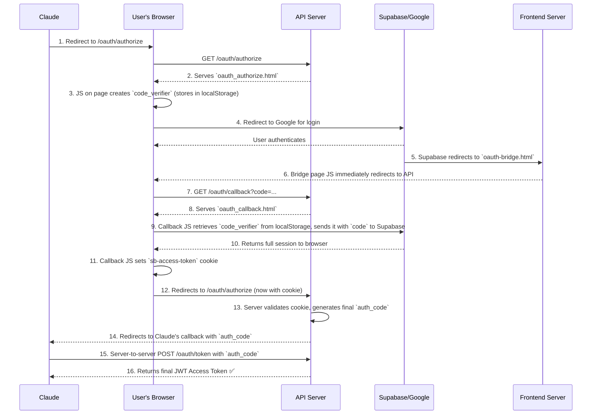

# Jean Memory <> Claude MCP OAuth 2.1 Guide

This document provides the definitive, distilled guide to the Claude MCP OAuth 2.1 implementation, consolidating all key learnings from the development and debugging process.

## Final Architecture

The core challenge is a cross-domain authentication flow between the **API server** (`jean-memory-api-virginia.onrender.com`) and the **main frontend** (`jeanmemory.com`), orchestrated by Supabase.

### Component Roles:
1.  **Claude Web**: The client initiating the MCP connection.
2.  **Jean Memory API Server**: Hosts all MCP logic (`/mcp`) and OAuth endpoints (`/oauth/*`). Serves the two critical HTML pages for the browser-based flow.
3.  **Supabase**: The identity provider (Google Auth).
4.  **Jean Memory Frontend**: Hosts a critical, static `oauth-bridge.html` file.
5.  **`oauth-bridge.html`**: The designated `Site URL` in Supabase. It acts as a redirector, immediately forwarding the user from the frontend domain back to the API's callback to complete the OAuth flow.

### The Authentication Flow



## Key Learnings & Critical Fixes

This implementation required solving a cascade of interdependent issues. The following were the most critical breakthroughs:

### 1. The Cross-Domain Redirect Problem
- **Problem**: Supabase's `Site URL` setting forcefully redirects all OAuth logins to the main frontend (`jeanmemory.com`), breaking the API's authentication flow.
- **Solution**: The **`oauth-bridge.html`** page. By setting this page as the `Site URL` in Supabase, it acts as a trusted intermediary, receiving the redirect and immediately forwarding the user back to the API server's `/oauth/callback` endpoint.

### 2. The PKCE `code_verifier` Disappearance
- **Problem**: The `code_verifier`—a secret created on the authorize page—was not available on the callback page, causing the final token exchange to fail with a `code verifier should be non-empty` error.
- **Root Cause**: Incorrectly initializing the Supabase client-side library with a custom `cookieStorageAdapter` on **both** the authorize and callback pages. This overrode the default `localStorage` mechanism that the PKCE flow relies on to pass the verifier between pages.
- **Solution**: Remove the custom storage adapter from the Supabase client initialization in both `oauth_authorize.html` and `oauth_callback.html`. The client should be initialized simply:
    ```javascript
    const supabase = window.supabase.createClient(URL, KEY, {
        auth: {
            detectSessionInUrl: true,
            flowType: 'pkce', // Let Supabase handle storage for PKCE
        }
    });
    ```

### 3. MCP Protocol Compliance
- **Problem**: Even after a successful OAuth connection, Claude would immediately disconnect or show "tools disabled."
- **Root Cause**: The server's `initialize` response did not match what Claude's client expected for the `2024-11-05` protocol version it was requesting. We were proactively sending the full list of tools, but the spec required a simple empty object `{}` to signal tool support.
- **Solution**: In `openmemory/api/app/routing/mcp.py`, the `handle_request_logic` function was modified to check the requested `protocolVersion`. If it is `2024-11-05`, the `capabilities.tools` object is returned as `{}`, as required. The full tool list is then provided in the subsequent `tools/list` call.

### 4. Internal vs. Supabase User ID
- **Problem**: API requests were failing because the JWT `sub` (subject) field contained the external Supabase user ID, but all internal database relations use an internal `User.id`.
- **Solution**: During the final authorization code creation, the server now performs a lookup to find the internal `User` record based on the Supabase ID and embeds the internal `user.id` into the JWT.

---
By addressing these four core issues—the cross-domain redirect, the client-side PKCE handling, the MCP protocol versioning, and the user ID mapping—the connection was successfully established. 