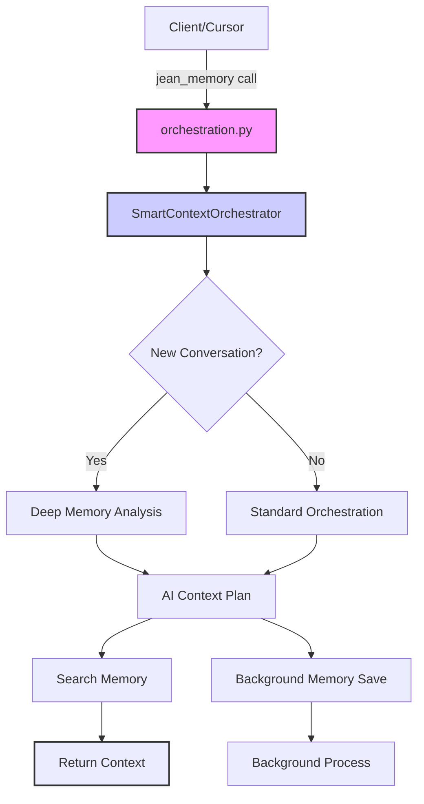
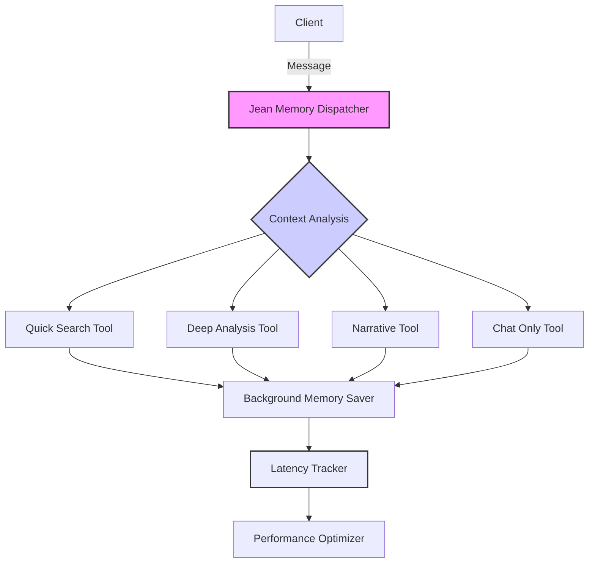

# Jean Memory Tool - Current Implementation & Revamp Plan

## Current Implementation (How It Actually Works)

### High-Level Architecture

The jean_memory system is currently implemented as a **single MCP tool** that acts as an intelligent orchestrator. Here's the actual flow:



### Current Tool Definition

**Single Tool**: `jean_memory(user_message: str, is_new_conversation: bool)`

- **Description**: "🌟 ALWAYS USE THIS TOOL. It is the primary tool for all conversational interactions."
- **Location**: `openmemory/api/app/tools/orchestration.py`
- **Timeout**: 25 seconds
- **Fallback**: Simple memory search if orchestration fails

### Actual Flow (Step by Step)

1. **Tool Call**: Client calls `jean_memory` with user message and conversation flag
2. **Orchestrator**: Gets `SmartContextOrchestrator` instance
3. **Strategy Decision**:
   - **New Conversation**: Uses "Deep Memory Analysis" (narrative cache or deep search)
   - **Continuing**: Uses "Standard Orchestration" (targeted search)
4. **AI Planning**: Uses Gemini to create context plan with search queries
5. **Memory Operations**:
   - **Search**: Executes search queries against user's memory
   - **Background Save**: Adds new memorable content asynchronously
6. **Context Return**: Returns formatted context string to client

### Current Background Processing

- **Location**: `openmemory/api/app/services/background_processor.py`
- **Process**: Document chunking and memory ingestion
- **Interval**: Every 30 seconds
- **Limitations**: Not integrated with real-time memory saving

### Current Issues Identified

1. **Single Tool Bottleneck**: Everything goes through one tool, causing latency
2. **No Latency Tracking**: No systematic bottleneck identification
3. **Limited Background Integration**: Memory saving not fully asynchronous
4. **Hard-coded Timeouts**: Not intelligent or adaptive
5. **Complex Orchestration**: Too much logic in single tool
6. **🚨 CRITICAL**: 1,561 lines of orchestration code for what should be simple routing!

## The Problem: Orchestrator Complexity Analysis

### Current Orchestrator Issues

The `mcp_orchestration.py` file has become a **1,561-line monster** with:

- **12+ different orchestration methods** doing similar things
- **Duplicate logic** for memory saving, context formatting, and search execution
- **Complex AI planning** that often just falls back to simple searches anyway
- **Over-engineered caching** with narrative generation, TTL management, etc.
- **Background task management** that's more complex than the actual work
- **Multiple fallback layers** that obscure the core logic

### What It Actually Does (Simplified)

Despite 1,561 lines, the orchestrator really just:

1. **Decides**: New conversation = comprehensive search, continuing = targeted search
2. **Searches**: Runs 2-4 memory searches based on the message
3. **Saves**: Adds new memories in background if content seems memorable
4. **Formats**: Returns search results as context string

That's it. Everything else is complexity for complexity's sake.

## Proposed Revamp Plan

### Vision: Tool of Tools Architecture

Transform from single orchestrator to intelligent tool dispatcher that:

1. **Intelligently Routes**: Determines which specific tools to use
2. **Context-Aware**: Decides how much and what type of context is needed
3. **Background Processing**: All memory saves happen asynchronously
4. **Latency Tracking**: Monitors and optimizes each step
5. **Smart Exit**: Intelligent conversation termination

### Proposed New Architecture



### Simplified Implementation Plan

#### Phase 1: Replace Complex Orchestrator (IMMEDIATE)

**Current**: 1,561 lines of orchestration complexity
**New**: ~200 lines of clean routing logic

```python
# NEW: Simple, clean orchestrator
class JeanMemoryDispatcher:
    async def dispatch(self, user_message: str, is_new_conversation: bool) -> str:
        # 1. Quick decision: what type of context do we need?
        context_type = self._analyze_context_need(user_message, is_new_conversation)
        
        # 2. Route to appropriate tool
        if context_type == "comprehensive":
            return await self._comprehensive_search(user_message)
        elif context_type == "quick":
            return await self._quick_search(user_message)
        elif context_type == "narrative":
            return await self._narrative_context(user_message)
        else:
            return await self._chat_only(user_message)
    
    def _analyze_context_need(self, message: str, is_new: bool) -> str:
        # Simple, fast decision logic (not complex AI planning)
        if is_new:
            return "narrative"
        elif len(message) > 100 or "tell me about" in message.lower():
            return "comprehensive" 
        elif any(word in message.lower() for word in ["what", "how", "when", "where"]):
            return "quick"
        else:
            return "chat_only"
```

#### Phase 2: Specialized Tools (CLEAN)

Instead of one complex orchestrator, create focused tools:

1. **`quick_search`** (~50 lines): Fast memory lookup
2. **`comprehensive_search`** (~75 lines): Deep context analysis  
3. **`narrative_context`** (~60 lines): Life story primer
4. **`background_saver`** (~40 lines): Async memory saving

#### Phase 3: Built-in Intelligence (SMART)

- **Latency tracking**: Every operation timed automatically
- **Smart caching**: Simple TTL-based context cache
- **Background processing**: True async with status tracking
- **Performance optimization**: Automatic bottleneck detection

### Proposed Tool Set

1. **`jean_memory_dispatcher`**: Main routing intelligence (~200 lines)
2. **`quick_search`**: Fast memory lookup (< 3s, ~50 lines)
3. **`deep_analysis`**: Comprehensive context (< 15s, ~75 lines)
4. **`narrative_context`**: Life story primer for new conversations (~60 lines)
5. **`chat_only`**: No memory operations, pure conversation (~20 lines)
6. **`smart_exit`**: Intelligent conversation termination (~30 lines)

**Total**: ~435 lines vs current 1,561 lines = **72% reduction in complexity**

### Implementation Plan

#### Phase 1: Latency Tracking
- Add comprehensive timing to current system
- Identify actual bottlenecks
- Baseline performance metrics

#### Phase 2: Background Processing
- Move all memory saves to true background
- Implement async memory ingestion
- Add processing status tracking

#### Phase 3: Tool Decomposition
- Break orchestrator into specific tools
- Implement intelligent routing
- Add context-aware decision making

#### Phase 4: Smart Features
- Life narrative integration
- Intelligent exit detection
- Adaptive timeout management

### Life Narrative Integration

**Current Consideration**: Add to system prompt: "Always use jean_memory tool for every function call"

**Better Approach**: 
- Detect new conversations automatically
- Pull life narrative as context primer
- Inject memory tool usage instruction contextually

### Smart Exit Process

Instead of hard-coded exit detection, implement:

1. **Gemini Flash Gating**: Quick conversation analysis
2. **Intent Classification**: Determine if conversation is ending
3. **Context Preservation**: Save conversation summary
4. **Graceful Termination**: Clean exit with memory consolidation

### Success Metrics

- **Latency**: < 3s for quick operations, < 15s for deep analysis
- **Background Processing**: 100% of memory saves asynchronous
- **Tool Efficiency**: Right tool for right task 90%+ of time
- **User Experience**: Seamless, fast, contextually aware
- **Code Simplicity**: 70%+ reduction in orchestration complexity

## Immediate Action Plan

### Week 1: Audit & Baseline
1. **Add timing** to every operation in current system
2. **Identify bottlenecks** in the 1,561-line orchestrator
3. **Document** what actually provides value vs complexity

### Week 2: Build Simple Dispatcher
1. **Create** new `JeanMemoryDispatcher` class (~200 lines)
2. **Implement** simple routing logic (no complex AI planning)
3. **Test** side-by-side with current orchestrator

### Week 3: Specialized Tools
1. **Build** `quick_search` and `comprehensive_search` tools
2. **Implement** true background memory saving
3. **Add** latency tracking to all operations

### Week 4: Deploy & Optimize
1. **Replace** complex orchestrator with simple dispatcher
2. **Monitor** performance improvements
3. **Optimize** based on real usage data

## Next Steps

1. **Audit Current Performance**: Add latency tracking to existing system
2. **Document Bottlenecks**: Identify specific slow operations
3. **Prototype Tool Decomposition**: Start with dispatcher + 2-3 specific tools
4. **Test Background Processing**: Ensure memory saves don't block responses
5. **Implement Smart Features**: Life narrative and intelligent exit

---

*This document reflects the actual current implementation as of the codebase analysis and provides a roadmap for the proposed revamp.*
