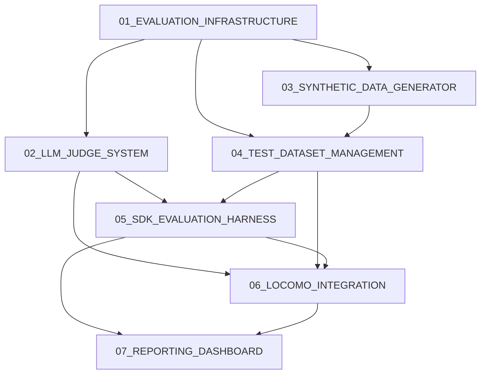

# Jean Memory Evaluation System - Task Overview

## Project Structure

This document provides an overview of the Jean Memory Evaluation System implementation, broken down into 7 logical subtasks with dependencies and implementation order.

## Subtask Dependencies

## Implementation Order & Timeline

### Phase 1: Foundation (Weeks 1-2)
1. **01_EVALUATION_INFRASTRUCTURE** - Core foundation that all other components depend on
2. **04_TEST_DATASET_MANAGEMENT** - Essential for storing and managing test cases

### Phase 2: Core Capabilities (Weeks 2-3)
3. **02_LLM_JUDGE_SYSTEM** - Automated evaluation capabilities
4. **03_SYNTHETIC_DATA_GENERATOR** - Test case generation for comprehensive coverage

### Phase 3: Integration & Testing (Weeks 3-4)
5. **05_SDK_EVALUATION_HARNESS** - End-to-end testing through real SDKs
6. **06_LOCOMO_INTEGRATION** - Research benchmark integration and validation

### Phase 4: Reporting & Analysis (Week 4)
7. **07_REPORTING_DASHBOARD** - Automated reporting and trend analysis

## Subtask Descriptions

### 01_EVALUATION_INFRASTRUCTURE_FRD.md
**Core foundation** - Decorator-based monitoring system with environment toggle
- **Dependencies**: None
- **Required for**: All other components
- **Key deliverable**: Non-invasive evaluation infrastructure

### 02_LLM_JUDGE_SYSTEM_FRD.md
**Automated evaluation** - Gemini Flash integration for quality scoring
- **Dependencies**: Evaluation Infrastructure
- **Required for**: SDK Harness, LoCoMo Integration, Reporting
- **Key deliverable**: Automated context quality assessment

### 03_SYNTHETIC_DATA_GENERATOR_FRD.md
**Test case generation** - LLM-powered diverse scenario creation
- **Dependencies**: Evaluation Infrastructure
- **Required for**: Test Dataset Management
- **Key deliverable**: Automated test case generation

### 04_TEST_DATASET_MANAGEMENT_FRD.md
**Dataset management** - Version-controlled test case storage and management
- **Dependencies**: Evaluation Infrastructure, Synthetic Data Generator
- **Required for**: SDK Harness, LoCoMo Integration
- **Key deliverable**: Centralized test case management system

### 05_SDK_EVALUATION_HARNESS_FRD.md
**End-to-end testing** - Real SDK integration for realistic evaluation
- **Dependencies**: Infrastructure, Judge System, Dataset Management
- **Required for**: LoCoMo Integration, Reporting
- **Key deliverable**: Realistic evaluation through actual user interfaces

### 06_LOCOMO_INTEGRATION_FRD.md
**Research validation** - LoCoMo framework integration for benchmark comparison
- **Dependencies**: Judge System, Dataset Management, SDK Harness
- **Required for**: Reporting
- **Key deliverable**: Research-validated performance comparison

### 07_REPORTING_DASHBOARD_FRD.md
**Analysis & insights** - Automated reporting and trend analysis
- **Dependencies**: All previous components
- **Required for**: None (final component)
- **Key deliverable**: Actionable performance insights and regression detection

## Success Metrics Summary

### Overall Targets
- **Relevance Score**: >8.5/10
- **Completeness**: >80%
- **P50 Latency**: <1000ms
- **P95 Latency**: <3000ms

### LoCoMo-Specific Targets
- **Single-hop Recall**: >95%
- **Multi-hop Reasoning**: >85%
- **Temporal Reasoning**: >80%
- **Adversarial Robustness**: >75%
- **Long-Range Consistency**: >90%

## Resource Requirements

### Development Effort
- **Total estimated effort**: 4 weeks with 1-2 developers
- **Minimum viable system**: 2 weeks (Infrastructure + Basic Judge + Simple Reporting)
- **Full system**: 4 weeks (All components with comprehensive coverage)

### Infrastructure Requirements
- **Additional memory**: <100MB when evaluation active
- **API costs**: Gemini Flash usage for judge evaluation (~$10-50/month for testing)
- **Storage**: ~500MB for test datasets and evaluation results

## Risk Mitigation

### Technical Risks
- **Judge reliability**: Validate against human annotations on subset
- **Performance impact**: Async processing and toggle controls
- **SDK compatibility**: Test with current SDK versions and maintain compatibility

### Project Risks
- **Scope creep**: Clearly defined acceptance criteria for each subtask
- **Dependencies**: Parallel development where possible, clear interfaces
- **Quality assurance**: Manual validation on subset of automated evaluations