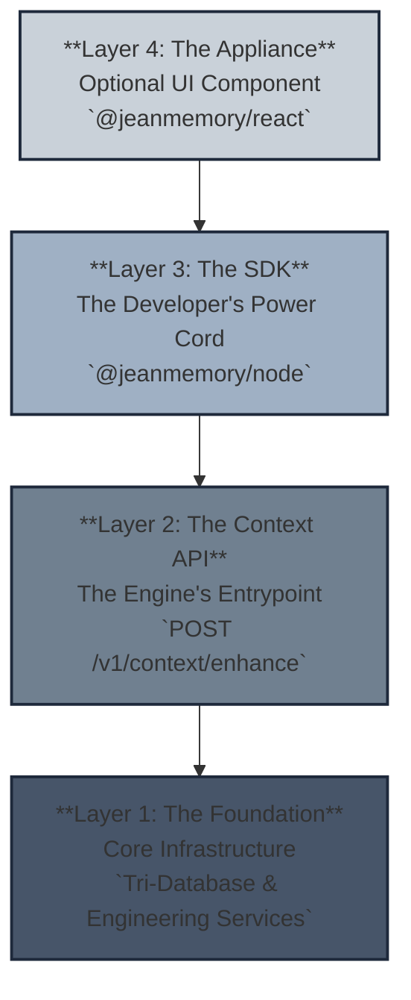

## The Pyramid of Integration

Our platform is designed as a pyramid, allowing you to integrate at the layer that best suits your needs. While most developers will use our powerful SDKs, you have the flexibility to access deeper layers of the system if required.

-   **Layer 1 (The Foundation):** The core infrastructure, including our specialized database stack and context engineering services.
-   **Layer 2 (The Context API):** The primary, centralized API endpoint that our SDKs communicate with. All the magic happens here.
-   **Layer 3 (The SDK):** **This is the primary product for developers.** A headless, language-specific wrapper that makes it simple to call the Context API.
-   **Layer 4 (The Appliance):** An optional, pre-built UI component (`JeanChat`) for the fastest possible visual integration.

## The Tri-Database Design

To deliver powerful, real-time context, we use a specialized, multi-database architecture. We use the right tool for every job.

-   **PostgreSQL:** The reliable foundation for structured metadata like users, memories, and applications.
-   **Qdrant (Vector DB):** Used for lightning-fast semantic search and relevance ranking (RAG).
-   **Neo4j (Graph DB):** The key to our deep understanding. It maps the relationships and connections between memories, allowing for sophisticated reasoning.

## Introduction to Context Engineering

This is our key differentiator. We don't just fetch data; we **engineer context**. This is a sophisticated process that transforms raw, noisy data into a coherent, relevant block of information that your LLM can actually use.

Our engine uses several strategies, including:

-   **Smart Triage:** An AI-powered filter that decides what information is meaningful enough to remember in the first place.
-   **Dual-Path Processing:** A fast, immediate search for instant context, followed by a deeper, asynchronous analysis that creates new "insight memories."
-   **Strategic Orchestration:** Dynamically choosing the right context-building strategy based on the user's query and needs.

For a full deep-dive, see the [Context Engineering](/context-engineering) page.
