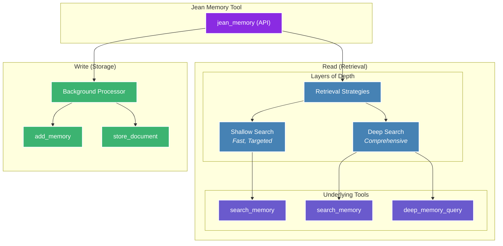

# Jean Memory - Complete Documentation for AI Coding Tools

**Generated on:** 2025-08-13 22:21:16

## What is Jean Memory?

Jean Memory is the universal memory layer for AI applications. It provides persistent, cross-application memory that allows AI agents to remember user preferences, conversation context, and personal information across different applications and sessions.

### Key Capabilities:
- **Universal Memory**: Works across any application or platform
- **5-Line Integration**: Add persistent memory to any React app in under 5 minutes
- **Cross-Application Persistence**: Users' AI agents remember them across different apps
- **Context Engineering**: Intelligent context building for personalized AI experiences
- **Multiple Integration Methods**: REST API, React SDK, Python SDK, Node.js SDK, and MCP

### Quick Integration Examples:

#### React (5 lines):
```tsx
import { useState } from 'react';
import { useJean, SignInWithJean, JeanChat } from 'jeanmemory-react';

function MyApp() {
  const [user, setUser] = useState(null);
  const { agent } = useJean({ user });
  
  if (!agent) return <SignInWithJean apiKey="your-api-key" onSuccess={setUser} />;
  return <JeanChat agent={agent} />;
}
```

#### Python:
```python
from jeanmemory import JeanAgent
agent = JeanAgent(api_key="your-api-key")
agent.run()
```

#### Node.js:
```javascript
import { JeanAgent } from '@jeanmemory/node';
const agent = new JeanAgent({ apiKey: "your-api-key" });
await agent.run();
```

### NPM Packages:
- React: `npm install jeanmemory-react` 
- Node.js: `npm install @jeanmemory/node`
- Python: `pip install jeanmemory`

---

# Complete Documentation

## Introduction

import { SignInWithJean } from 'jeanmemory-react';

Computers have no memory of their interactions with users. Every conversation starts from scratch. **Jean Memory solves this by creating a persistent, intelligent memory layer that makes AI truly personal.**

Our goal is to provide developers with the rich, personal context they need to make their AI applications truly intelligent. We are a specialized tool that integrates into your existing stack.


### How It Works

1.  **A User Signs Up:** The moment a user authenticates with your application via the secure `<SignInWithJean />` button, their memory graph is born.
2.  **Jean Starts Learning:** Jean immediately begins to learn from their conversations, automatically curating and saving important details in the background. This context is used to provide better, more relevant AI responses.
3.  **The User Connects More:** The user can optionally connect other data sources (like Notion, Slack, or Google Drive) to build a richer, more comprehensive memory.

<br/>

  <SignInWithJean />

---

## Quickstart

Choose your path. Add a complete UI component to your frontend or add a powerful context layer to your backend.

### Drop-in UI Component

The fastest way to get a full-featured chatbot running in your app.

```jsx
// 1. Install the React SDK
// npm install @jeanmemory/react

// 2. Add the provider and chat component
import { JeanProvider, JeanChat } from '@jeanmemory/react';

function MyPage() {
  return (
    <JeanProvider apiKey="YOUR_API_KEY">
      <JeanChat />
    </JeanProvider>
  );
}
```

### Headless Backend

For developers who want to power their existing AI agents with our headless SDK.

```python
# 1. Install the Python SDK
# pip install jeanmemory openai

# 2. Get context before calling your LLM
import os
from jeanmemory import JeanClient
from openai import OpenAI

jean = JeanClient(api_key=os.environ["JEAN_API_KEY"])
openai = OpenAI(api_key=os.environ["OPENAI_API_KEY"])

context = jean.get_context(
    user_token="USER_TOKEN_FROM_FRONTEND",
    message="What was our last conversation about?"
).text

prompt = f"Context: {context}\\n\\nUser question: What was our last conversation about?"

# 3. Use the context in your LLM call
completion = openai.chat.completions.create(
    model="gpt-4-turbo",
    messages=[{"role": "user", "content": prompt}]
)
```

<br/>

  Just copy and paste our full documentation into your AI agent (Cursor, Claude, etc.) and tell it what you want to build.

---

## Architecture

import { Card } from 'mintlify/components';

## More Than a Database: An Intelligent Memory System

At Jean Memory, our core philosophy is **Context Engineering, not just Information Retrieval**. While many systems can store and retrieve data, our goal is to build an intelligent memory system that mirrors the human brain—understanding, synthesizing, and anticipating what you need to know.

To achieve this, we've built our system on a unique tri-database architecture, where each component is chosen for its specific strengths. This allows us to handle the complex demands of AI memory far more effectively than a single database could.

### The Tri-Database Stack

  **For semantic search and relevance.** We use Qdrant for Retrieval-Augmented Generation (RAG). It's powerful and quick, allowing us to perform lightning-fast semantic searches to find the most contextually similar information.

  **For understanding connections.** We use Neo4j to build a rich knowledge graph of the entities and relationships within a user's memories. Graph databases enable the forming of connections between information, so you see the full picture.

  **For structured data and reliability.** All of the metadata associated with your memories, users, and applications is stored in a robust PostgreSQL database. This ensures data integrity and provides a reliable foundation for the entire system.


### The Future of Intelligent Memory
Our system is designed to intelligently manage memory over time, much like the human brain. This includes:

- **De-duplication:** To prevent your memory from becoming crowded.
- **Self-Organization:** Rearranging and optimizing data during periods of unuse, similar to how the human brain processes information during sleep.
- **Intelligent Orchestration:** Deciding whether, how much, and what context is relevant to respond well to a user, doing all the thinking under the hood.

This combination of a powerful, multi-database backend and a sophisticated intelligence layer is what makes Jean Memory a true context engine.

---

## Sdk: Overview

import { Card } from 'mintlify/components';

We provide a suite of specialized SDKs, each designed for a specific part of the modern application stack. This lets you use the right tool for the job, whether you're building a user interface or a backend agent.

## Why Three SDKs?

- **React SDK:** For the **Frontend**. Use this to build user-facing components. It includes the `<JeanChat />` appliance for instant setup and the `useJean` hook for building custom UIs. Its main job is to handle the UI and secure user authentication.

- **Node.js SDK:** For **Javascript Backends**. A headless library for your server. It's built to be used in API routes (like Next.js or Express) and serverless functions to fetch context for your LLM calls. It's the bridge between your application logic and the Jean Memory engine.

- **Python SDK:** For **Python Backends**. Also a headless library, this is the perfect choice for backend agents, data processing pipelines, and any AI/ML workflows written in Python.

---

## Sdk: React

The Jean Memory React SDK provides two powerful ways to integrate: a simple, out-of-the-box UI component for rapid development, and a flexible hook for building completely custom experiences.

## Installation

```bash
npm install @jeanmemory/react
```

## Path 1: The 5-Minute Chatbot (Appliance)

This is the fastest way to get a full-featured chatbot running in your app.

### 1. Wrap Your App in `JeanProvider`

The provider manages all the state and network requests for you.

```jsx {{ title: 'pages/_app.tsx' }}
import { JeanProvider } from '@jeanmemory/react';

function MyApp({ Component, pageProps }) {
  return (
    <JeanProvider apiKey={process.env.NEXT_PUBLIC_JEAN_API_KEY}>
      <Component {...pageProps} />
    </JeanProvider>
  );
}

export default MyApp;
```

This code wraps your entire application with the `JeanProvider`. This provider is essential as it manages the connection to Jean Memory, handles authentication, and makes the `useJean` hook available to all its child components. You provide it with your unique API key, which authenticates your application with the Jean Memory service.

### 2. Add the `JeanChat` Component

This component renders the entire chat interface.

```jsx {{ title: 'pages/index.tsx' }}
import { JeanChat } from '@jeanmemory/react';

export default function Home() {
  return (
    
      <JeanChat />
    
  );
}
```

This code adds the `<JeanChat />` component to your page. It’s a pre-built, fully functional chat interface that handles user input, displays the conversation, and manages the sign-in process. It's the quickest way to integrate a context-aware AI into your application.

That's it! You now have a fully functional, context-aware chatbot in your application. The `<JeanChat />` component will automatically handle authentication using the secure `<SignInWithJean />` flow.

## Configuration Options (Optional)

For 99% of use cases, the defaults work perfectly. But when you need control:

```typescript
const { sendMessage } = useJean();

// Speed-optimized (faster, less comprehensive)
await sendMessage("What's my schedule?", { speed: "fast" });

// Different tools for specific needs  
await sendMessage("What's my schedule?", { tool: "search_memory" });

// Simple text response instead of full metadata
await sendMessage("What's my schedule?", { format: "simple" });
```

## Advanced: Direct Tool Access

For advanced use cases, the `useJean` hook also provides direct access to the core memory tools. This allows for more deterministic control over the memory layer.

```typescript
const { tools } = useJean();

// Directly add a memory
await tools.add_memory("My dog's name is Max.");

// Perform a direct vector search
const results = await tools.search_memory("information about my pets");
```

---

## Sdk: Python

The Jean Memory Python SDK provides a simple, headless interface to our powerful Context API. It's designed to be integrated directly into your backend services, AI agents, or data processing pipelines.

## Installation

```bash
pip install jeanmemory
```

## Usage: Adding Context to an Agent

The primary use case for the Python SDK is to retrieve context that you can then inject into a prompt for your chosen Large Language Model.

The example below shows a typical workflow where we get context from Jean Memory before calling the OpenAI API.

```python
import os
from openai import OpenAI
from jeanmemory import JeanClient

# 1. Initialize the clients
jean = JeanClient(api_key=os.environ.get("JEAN_API_KEY"))
openai = OpenAI(api_key=os.environ.get("OPENAI_API_KEY"))

# 2. Get the user token from your frontend
# This token is securely obtained via the OAuth flow handled by
# our frontend components, like @jeanmemory/react.
user_token = get_user_token_from_request() 

# 3. Get context from Jean Memory
user_message = "What were the key takeaways from our last meeting about Project Phoenix?"
context_response = jean.get_context(
    user_token=user_token,
    message=user_message
    # All defaults: tool="jean_memory", speed="balanced", format="enhanced"
)

# 4. Engineer your final prompt
final_prompt = f"""
Using the following context, please answer the user's question.
The context is a summary of the user's memories related to their question.

Context:

User Question: {user_message}
"""

# 5. Call your LLM
completion = openai.chat.completions.create(
    model="gpt-4-turbo",
    messages=[
        {"role": "system", "content": "You are a helpful assistant."},
        {"role": "user", "content": final_prompt},
    ],
)

print(completion.choices[0].message.content)

```

This code block demonstrates the complete "golden path" for using the headless Python SDK. Here's a step-by-step breakdown:
1.  **Initialization**: It creates instances of the `JeanClient` and a large language model client (in this case, `OpenAI`).
2.  **Authentication**: It retrieves a `user_token` that your frontend would have acquired through the OAuth sign-in flow. This token is crucial as it identifies the user whose memory you want to access.
3.  **Context Retrieval**: It calls `jean.get_context()`, sending the user's token and their latest message. This is the core of the integration, where Jean Memory performs its context engineering.
4.  **Prompt Engineering**: It constructs a final prompt for the LLM, strategically placing the retrieved context before the user's actual question. This gives the LLM the necessary background information to provide a relevant, personalized response.
5.  **LLM Call**: It sends the final, context-rich prompt to the LLM to get the answer.

### A Note on Authentication

The `user_token` is the critical piece that connects a request to a specific user's memory. In a production application, your frontend should use our React SDK's `<SignInWithJean />` component (or a manual OAuth 2.1 PKCE flow) to authenticate the user and receive this token. Your frontend then passes this token to your backend, which uses it to make authenticated requests with the Python SDK.

For information on implementing a secure server-to-server OAuth flow for backend services, see the [Authentication](/authentication) guide.

---

## Configuration Options (Optional)

For 99% of use cases, the defaults work perfectly. But when you need control:

```python
# Speed-optimized (faster, less comprehensive)
context = jean.get_context(
    user_token=user_token,
    message=user_message,
    speed="fast"  # vs "balanced" (default) or "comprehensive"
)

# Different tools for specific needs
context = jean.get_context(
    user_token=user_token,
    message=user_message,
    tool="search_memory"  # vs "jean_memory" (default)
)

# Simple text response instead of full metadata
context = jean.get_context(
    user_token=user_token,
    message=user_message,
    format="simple"  # vs "enhanced" (default)
)
```

## Advanced: Direct Tool Access

For advanced use cases, the `JeanClient` also provides a `tools` namespace for direct, deterministic access to the core memory functions.

```python
# The intelligent, orchestrated way (recommended):
context = jean.get_context(user_token=..., message="...")

# The deterministic, tool-based way:
jean.tools.add_memory(user_token=..., content="My favorite color is blue.")
search_results = jean.tools.search_memory(user_token=..., query="preferences")
```

---

## Sdk: Nodejs

The Jean Memory Node.js SDK is a headless library for integrating our Context API into your backend services. It's perfect for developers building API routes, serverless functions, or stateful agents in a Node.js environment.

## Installation

```bash
npm install @jeanmemory/node
```

## Usage: Creating a Context-Aware API Route

A common use case is to create an API endpoint that your frontend can call. This endpoint will securely fetch context from Jean Memory and then stream a response from your chosen LLM.

The example below shows how to create a Next.js API route that is compatible with edge runtimes and the Vercel AI SDK.

```typescript {{ title: 'pages/api/chat.ts' }}
import { JeanClient } from '@jeanmemory/node';
import { OpenAIStream, StreamingTextResponse } from 'ai';
import OpenAI from 'openai';

// Create the clients
const jean = new JeanClient({ apiKey: process.env.JEAN_API_KEY });
const openai = new OpenAI({ apiKey: process.env.OPENAI_API_KEY });

// Set the runtime to edge for best performance
export const runtime = 'edge';

export default async function POST(req: Request) {
  // 1. Get the user's message and token from the request body
  const { messages, userToken } = await req.json();
  const currentMessage = messages[messages.length - 1].content;

  // Ensure the user token is present
  if (!userToken) {
    return new Response('Unauthorized', { status: 401 });
  }

  // 2. Get context from Jean Memory
  const contextResponse = await jean.getContext({
    user_token: userToken,
    message: currentMessage
    // All defaults: tool="jean_memory", speed="balanced", format="enhanced"
  });

  // 3. Engineer your final prompt
  const finalPrompt = `
    Using the following context, please answer the user's question.
    The context is a summary of the user's memories related to their question.

    Context:
    ---
    ${contextResponse.text}
    ---

    User Question: ${currentMessage}
  `;
  
  // 4. Call your LLM and stream the response
  const response = await openai.chat.completions.create({
    model: 'gpt-4-turbo',
    stream: true,
    messages: [
      { role: "system", content: "You are a helpful assistant." },
      { role: "user", content: finalPrompt },
    ],
  });

  const stream = OpenAIStream(response);
  return new StreamingTextResponse(stream);
}
```

This code sets up a Next.js API route that acts as a secure bridge between your frontend and your language model.
1.  **Extract Data**: It pulls the latest user message and, most importantly, the `userToken` from the incoming request. This token, acquired by your frontend via OAuth, authorizes access to the user's memory.
2.  **Fetch Context**: It calls `jean.getContext()`, passing the `userToken` and the user's message to the Jean Memory engine. The engine returns a block of relevant, engineered context.
3.  **Construct Prompt**: It assembles a final prompt, injecting the context from Jean Memory before the user's actual question. This enriches the LLM's understanding.
4.  **Stream Response**: It calls the LLM (in this case, OpenAI) with the context-rich prompt and streams the response back to the frontend using the Vercel AI SDK's `StreamingTextResponse`. This provides a responsive, real-time chat experience.

### Authentication Flow

As with the Python SDK, the `userToken` is obtained by your frontend application through a secure OAuth 2.1 flow using our `@jeanmemory/react` SDK. Your frontend makes an authenticated request to this API route, including the `userToken` in the request body. See the [Authentication](/authentication) guide for more details.

---

## Configuration Options (Optional)

For 99% of use cases, the defaults work perfectly. But when you need control:

```typescript
// Speed-optimized (faster, less comprehensive)
const context = await jean.getContext({
  user_token: userToken,
  message: currentMessage,
  speed: "fast"  // vs "balanced" (default) or "comprehensive"
});

// Different tools for specific needs
const context = await jean.getContext({
  user_token: userToken,
  message: currentMessage,
  tool: "search_memory"  // vs "jean_memory" (default)
});

// Simple text response instead of full metadata
const context = await jean.getContext({
  user_token: userToken,
  message: currentMessage,
  format: "simple"  // vs "enhanced" (default)
});
```

## Advanced: Direct Tool Access

For advanced use cases, the `JeanClient` also provides a `tools` namespace for direct, deterministic access to the core memory functions.

```typescript
// The intelligent, orchestrated way (recommended):
const context = await jean.getContext({ user_token: ..., message: "..." });

// The deterministic, tool-based way:
await jean.tools.add_memory({ user_token: ..., content: "My project's deadline is next Friday." });
const search_results = await jean.tools.search_memory({ user_token: ..., query: "project deadlines" });
```

---

## Authentication

## Our Philosophy: Secure by Design

Jean Memory handles sensitive personal data, and we take that responsibility seriously. That's why we've built our authentication system on the industry-standard **OAuth 2.1 protocol**. This ensures that user credentials are never shared with third-party applications and that users have full control over who can access their memory.

We provide two clear authentication flows to support different types of applications.

## Flow 2: Backend Services (Authorization Code Grant)

This flow is for trusted backend services that need to access a user's memory on their behalf, even when the user is not actively present (e.g., for a background data sync). It uses the standard **Authorization Code Grant**.

This is a more involved flow that requires server-side handling of secrets.

### High-Level Steps

1.  **User Authorization:** Your application redirects the user to the Jean Memory authorization URL with your `client_id` and a `redirect_uri`.
2.  **Grant Authorization Code:** The user logs in and approves the request. Jean Memory redirects back to your `redirect_uri` with a temporary `code`.
3.  **Exchange Code for Token:** Your backend service makes a secure, server-to-server request to the Jean Memory token endpoint, exchanging the `code` (along with your `client_id` and `client_secret`) for an `access_token` and a `refresh_token`.
4.  **Access API:** Your service can now use the `access_token` to make authenticated requests to the Jean Memory API on the user's behalf.
5.  **Refresh Token:** When the `access_token` expires, use the `refresh_token` to obtain a new one without requiring the user to log in again.

**Info:**
  **Getting Credentials:** The server-to-server flow is intended for trusted partners and high-volume applications. Please contact our team to discuss your use case and receive a `client_id` and `client_secret`.

For detailed instructions on implementing this flow, please consult standard OAuth 2.1 documentation.

---

## Context Engineering

## Context Engineering, Not Information Retrieval

Jean Memory's core philosophy is **Context Engineering**, not just Information Retrieval. This means the system doesn't just store and retrieve memories—it intelligently engineers context for your AI assistant. This is the key to making AI truly personal and useful.

The system is designed to:
-   Select the *right* information at the *right* time.
-   Synthesize insights from disparate memories.
-   Understand relationships between memories.
-   Predict what context will be most useful.

This is a continuous process. Memories are constantly being saved and analyzed in the background. When a query comes in, the system intelligently decides whether new context is required and, if so, what depth of search is necessary to provide the most relevant response.

## The Orchestration Engine

The `jean_memory` API is the heart of the system. It's the primary interface for your AI to interact with the memory layer, orchestrating various underlying functions to provide the right context at the right depth. 



### Context Strategies

The orchestrator uses different strategies to create the best possible context for the AI.

1.  **`deep_understanding`**: Used for new conversations to provide comprehensive context about the user.
2.  **`relevant_context`**: Used for ongoing conversations to provide targeted, relevant information.
3.  **`comprehensive_analysis`**: Used for deep queries like "tell me everything you know about X" to do a full scan of all available information.

### Opinionated Context Flows

While our primary `jean_memory` tool provides a balanced approach, the underlying tools can be composed into highly specialized, opinionated flows to solve specific problems. Below are a few examples of what's possible.

    This flow is designed for an AI assistant that needs to provide a user with a summary of relevant information *before* they even ask. It's perfect for a morning briefing or preparing for a meeting.               

      ```mermaid
      graph TD;
          A["Event Trigger<br/>(e.g., Calendar Event)"] --> B["List Recent Memories<br/>(list_memories)"];
          B --> C["Vector Search for Related Topics<br/>(search_memory)"];
          C --> D["Deep Dive on Key Entities<br/>(deep_memory_query)"];
          D --> E["Synthesize Briefing<br/>(Send to LLM)"];
          E --> F["Deliver Proactive Summary"];

          classDef trigger fill:#8A2BE2,stroke:#FFF,stroke-width:2px,color:#FFF;
          classDef process fill:#4682B4,stroke:#FFF,stroke-width:2px,color:#FFF;
          classDef output fill:#3CB371,stroke:#FFF,stroke-width:2px,color:#FFF;

          class A trigger;
          class B,C,D process;
          class E,F output;
      ```

    This flow is for tasks that require a comprehensive understanding of a large corpus of information, like a collection of research papers or project documents.                                                      

      ```mermaid
      graph TD;
          A["User Request<br/>'Research topic X'"] --> B["Store All Relevant Documents<br/>(store_document)"];
          B --> C["Iterative Search & Analysis"];
          subgraph C
              direction LR
              C1["Initial Vector Search<br/>(search_memory)"] --> C2["Identify Key Concepts"];
              C2 --> C3["Graph Traversal for Connections<br/>(deep_memory_query)"];
              C3 --> C1;
          end
          C --> D["Synthesize Full Report<br/>(Send to LLM)"];
          D --> E["Present Research Findings"];

          classDef trigger fill:#8A2BE2,stroke:#FFF,stroke-width:2px,color:#FFF;
          classDef process fill:#4682B4,stroke:#FFF,stroke-width:2px,color:#FFF;
          classDef loop fill:#6A5ACD,stroke:#FFF,stroke-width:2px,color:#FFF;
          classDef output fill:#3CB371,stroke:#FFF,stroke-width:2px,color:#FFF;
          
          class A trigger;
          class B,D process;
          class C loop;
          class E output;
      ```

    This flow is for an AI that learns a new skill or topic in real-time based on user interaction, getting progressively smarter with each turn of the conversation.                                                   

      ```mermaid
      graph TD;
          A["User Message"] --> B{"Is this a new topic?"};
          B -- "Yes" --> C["Scrape & Store<br/>Initial Knowledge<br/>(store_document)"];
          B -- "No" --> D["Standard Context Retrieval<br/>(search_memory)"];
          C --> E["Provide Initial Answer"];
          D --> E;
          E --> F["User Feedback"];
          F --> G["Refine & Add to Memory<br/>(add_memories)"];
          G --> A;

          classDef io fill:#3CB371,stroke:#FFF,stroke-width:2px,color:#FFF;
          classDef decision fill:#8A2BE2,stroke:#FFF,stroke-width:2px,color:#FFF;
          classDef process fill:#4682B4,stroke:#FFF,stroke-width:2px,color:#FFF;
          
          class A,E,F io;
          class B decision;
          class C,D,G process;
      ```

### Create Your Own Flow

The true power of Jean Memory is its flexibility. The primitive tools (`store_document`, `search_memory`, `add_memories`, etc.) are the building blocks for you to create your own context engineering flows tailored to your specific use case.

Whether you're building a hyper-personalized tutor, a strategic research agent, or something entirely new, our toolset provides the foundation.

**Want to build a custom flow?** [Reach out to our team](mailto:jonathan@jeantechnologies.com), and we'll be happy to show you how to get started.

---

## Tools

These are the primitive, low-level tools that our context engineering flows are built upon. While our primary `jean_memory` tool orchestrates these for you, they are directly callable for advanced use cases where you need precise, deterministic control over the memory layer.

### Document and Memory Tools

-   **`store_document(title, content)`**: Store large documents, files, or lengthy content. Perfect for saving meeting notes, documentation, or articles for future reference.
-   **`add_memories(text)`**: Manually stores specific information, bypassing the AI-powered "Smart Triage."
-   **`search_memory(query)`**: Performs a quick keyword search through your memories.
-   **`ask_memory(question)`**: Asks a simple question about your stored memories.
-   **`list_memories()`**: Browses through your stored memories.
-   **`deep_memory_query(query)`**: Performs a complex analysis across all of your memories to synthesize deeper insights.

---

## Use Cases

import { Card, Cards } from 'mintlify/components';

Jean Memory is more than just a chatbot enhancement; it's a foundational layer for building next-generation AI applications. Below are a few examples to inspire you.

    An AI agent's ability to perform complex, multi-step tasks is directly limited by the quality of its context. With Jean Memory, your agent has access to the user's entire project history, enabling it to reason and act with unprecedented intelligence.

    **Example:** An AI project manager that can autonomously draft a full project plan based on a user's scattered notes and previous conversations.

    Imagine an AI tutor that remembers every one of a student's past questions, struggles, and successes. It could adapt its teaching style in real-time and create practice problems that target specific knowledge gaps.
    
    **Example:** An AI language tutor that notices a student consistently makes the same grammatical error and proactively creates a mini-lesson to address it.

    By connecting to a user's calendar, email, and other data sources, a personal assistant powered by Jean Memory can move from being reactive to proactive. It can anticipate needs and offer help before the user even thinks to ask.

    **Example:** An AI assistant that sees an upcoming flight and proactively asks, "I see your flight to London is tomorrow. Would you like me to check for delays?"

---

## Oauth Troubleshooting

## Common OAuth Issues

### "Invalid redirect URI" Error

**Problem:** `{"detail":"Invalid redirect URI"}` when testing OAuth flow.

**Cause:** Your redirect URI isn't whitelisted on our server.

**Solutions:**

#### For Local Development
```javascript
// Use one of these whitelisted URIs for local testing:
const redirectUri = 'http://localhost:3000/callback';
// or
const redirectUri = 'http://127.0.0.1:3000/callback';
```

#### For Production
Contact support at support@jeanmemory.com to whitelist your production domain:
- `https://yourdomain.com/callback`
- `https://yourdomain.com/auth/callback`

**Warning:**
Allow 10-15 minutes after whitelist approval for DNS propagation.

### Testing Without Full OAuth Setup

For development and testing, you can use the SDK's built-in fallback mode:

```javascript
// React SDK - automatically handles fallback
const { agent } = useJean({ 
  apiKey: "your-api-key",
  // Will work even without OAuth completion
});

// Python SDK - demo mode
agent = JeanAgent(api_key="your-api-key", demo_mode=True)
```

## OAuth Flow Requirements

### Required Parameters
```javascript
{
  response_type: 'code',
  client_id: 'your-registered-client-id', 
  redirect_uri: 'https://yourdomain.com/callback', // Must be exact match
  code_challenge: 'generated-pkce-challenge',
  code_challenge_method: 'S256',
  state: 'random-state-value'
}
```

### Callback Handler
```javascript
// Your /callback endpoint must handle:
const urlParams = new URLSearchParams(window.location.search);
const code = urlParams.get('code');
const state = urlParams.get('state');

// Then exchange code for token
const tokenResponse = await fetch('/oauth/token', {
  method: 'POST',
  headers: { 'Content-Type': 'application/x-www-form-urlencoded' },
  body: new URLSearchParams({
    grant_type: 'authorization_code',
    client_id: 'your-client-id',
    code: code,
    redirect_uri: 'https://yourdomain.com/callback',
    code_verifier: 'stored-pkce-verifier'
  })
});
```

## Development Workflow

### Phase 1: Mock Development
- Use SDK fallback modes for UI development
- Test application logic without OAuth

### Phase 2: OAuth Setup  
- Register application at [jeanmemory.com](https://jeanmemory.com)
- Request redirect URI whitelist
- Test authentication flow

### Phase 3: Integration Testing
- Full end-to-end testing with real tokens
- Performance validation
- Production deployment

## Getting Help

**For OAuth Issues:**
- Email: support@jeanmemory.com
- Subject: "OAuth Redirect URI Whitelist Request"
- Include: Your domain(s) and redirect URI(s)

**For Technical Issues:**
- GitHub Issues: [jean-technologies/jean-memory](https://github.com/jean-technologies/jean-memory/issues)
- Include: Error messages, code samples, browser console logs

---

## Mcp: Authentication

## OAuth 2.1 for Modern AI

Jean Memory uses the OAuth 2.1 authorization framework, the industry-standard protocol for authorization. This ensures that your integration is secure, scalable, and compatible with the latest AI standards, including the **Model Context Protocol (MCP)**.

Our implementation of OAuth 2.1 is designed to be straightforward for developers while providing robust security for end-users.

### Key Features

- **PKCE for Enhanced Security**: All of our OAuth flows use Proof Key for Code Exchange (PKCE) to protect against authorization code interception attacks.
- **Granular Scopes**: You can request specific permissions from users, ensuring that your application only has access to the data it needs.
- **Short-Lived Access Tokens**: Access tokens are short-lived, reducing the risk of them being compromised.
- **Refresh Tokens**: Long-lived refresh tokens allow your application to maintain a persistent connection to the Jean Memory API without requiring users to re-authenticate.

## SDK vs Manual Implementation

### Using SDKs (Recommended)
All our SDKs handle OAuth automatically:

```javascript
// React - OAuth handled automatically
const { agent } = useJean({ apiKey: "your-api-key" });

// Python - OAuth handled automatically  
agent = JeanAgent(api_key="your-api-key")

// Node.js - OAuth handled automatically
const agent = new JeanAgent({ apiKey: "your-api-key" });
```

### Manual OAuth Implementation (Advanced)

If you're building a custom client or testing framework, you'll need to implement the OAuth flow manually.

#### Step 1: Register Your Application
Contact support@jeanmemory.com to register your OAuth client and whitelist redirect URIs.

#### Step 2: Authorization Request
```javascript
const authUrl = new URL('https://jean-memory-api-virginia.onrender.com/oauth/authorize');
authUrl.searchParams.append('client_id', 'your-registered-client-id');
authUrl.searchParams.append('redirect_uri', 'http://localhost:3000/callback'); // Must be whitelisted
authUrl.searchParams.append('response_type', 'code');
authUrl.searchParams.append('code_challenge', pkceChallenge);
authUrl.searchParams.append('code_challenge_method', 'S256');
authUrl.searchParams.append('state', randomState);
```

#### Step 3: Token Exchange
```javascript
const tokenResponse = await fetch('https://jean-memory-api-virginia.onrender.com/oauth/token', {
  method: 'POST',
  headers: { 'Content-Type': 'application/x-www-form-urlencoded' },
  body: new URLSearchParams({
    grant_type: 'authorization_code',
    client_id: 'your-client-id',
    code: authorizationCode,
    redirect_uri: 'http://localhost:3000/callback',
    code_verifier: pkceVerifier
  })
});
```

**Warning:**
**Common Issue:** "Invalid redirect URI" error means your URI isn't whitelisted. See our [OAuth Troubleshooting Guide](/oauth-troubleshooting) for solutions.

### The MCP Connection

The Model Context Protocol is a new standard for stateful, bidirectional communication between AI models and external tools. Jean Memory's support for OAuth 2.1 makes it a first-class citizen in the MCP ecosystem, allowing you to build powerful, agentic systems that can securely access a user's memories.

You can learn more in the [MCP Introduction](/mcp/introduction).

---

## Mcp: Introduction

The Model Context Protocol (MCP) is an open standard designed to provide a more powerful and flexible way to connect AI agents to tools and data. It standardizes the piping of context and memory across the internet, enabling a new level of interoperability for AI systems.

While our REST API is perfect for many use cases, MCP is the ideal choice for developers building sophisticated, agentic systems that require stateful connections, real-time communication, and dynamic tool use.

## Why Choose MCP over the REST API?

| Feature                       | REST API                                   | Model Context Protocol (MCP)                               |
| ----------------------------- | ------------------------------------------ | ---------------------------------------------------------- |
| **Connection**                | Stateless (each request is independent)    | Stateful (a continuous, persistent connection)             |
| **Communication**             | Request-Response (client-driven)           | Bidirectional (server can push updates to the agent)       |
| **Tool Use**                  | Static (hard-coded to specific endpoints)  | Dynamic (agent can discover and learn to use new tools)    |
| **Context Management**        | Handled in the prompt (can lead to bloat)  | Managed by the protocol (more efficient and scalable)      |

In short, if you are building a simple application and just need to store and retrieve memories, our REST API is a great choice. If you are building a complex, autonomous agent that needs to interact with its environment in real-time, MCP is the way to go.

## Key Benefits of MCP for Agentic Memory

*   **Complex, Multi-Step Tasks**: Because MCP maintains a stateful connection, it's perfect for complex workflows where context needs to be preserved across multiple steps. The agent can have an ongoing "conversation" with a tool, rather than sending a series of disconnected requests.

*   **Real-Time Reactivity**: MCP allows tools to proactively push information to the agent. This is essential for building agents that can react to live events, such as a file being updated, a new message arriving, or a change in a database.

*   **Enhanced Autonomy and Adaptability**: With dynamic tool discovery, your agent can learn to use new tools and capabilities without being explicitly re-programmed. This allows you to build more adaptive and autonomous agents that can evolve over time.

*   **Efficiency and Scalability**: By managing context and tool definitions outside of the prompt, MCP avoids the "prompt bloat" that can limit the performance and scalability of agents built on REST APIs.

## How to Get Started

To get started with MCP, you'll need to connect to one of our MCP servers. The authentication is handled via a standard OAuth 2.1 flow, which is initiated when you connect.

You can find more details on how to implement this in our SDK documentation.

---

## Mcp: Setup

## What is MCP?

Model Context Protocol (MCP) lets AI assistants like Claude and ChatGPT connect to external tools.

## Quick Setup

### Claude Desktop

1. Find your config file:
   - Mac: `~/Library/Application Support/Claude/claude_desktop_config.json`
   - Windows: `%APPDATA%\Claude\claude_desktop_config.json`

2. Add Jean Memory:
```json
{
  "mcpServers": {
    "jean-memory": {
      "command": "npx",
      "args": ["-y", "@modelcontextprotocol/server-jean-memory"]
    }
  }
}
```

3. Restart Claude Desktop

### ChatGPT

Coming soon - use the API for now.

### Cursor

Add to your `.cursor/config.json`:
```json
{
  "mcp": {
    "servers": {
      "jean-memory": {
        "command": "npx",
        "args": ["-y", "@modelcontextprotocol/server-jean-memory"]
      }
    }
  }
}
```

## How It Works

Once connected, the AI can:
- Store memories: "Remember that..."
- Search memories: "What did we discuss about..."
- Use context automatically in responses

---

## Mcp: Context Engineering

## Context Engineering, Not Information Retrieval

Jean Memory's core philosophy is **Context Engineering**, not just Information Retrieval. This means the system doesn't just store and retrieve memories—it intelligently engineers context for your AI assistant. This is the key to making AI truly personal and useful.

The system is designed to:
-   Select the *right* information at the *right* time.
-   Synthesize insights from disparate memories.
-   Understand relationships between memories.
-   Predict what context will be most useful.

This approach is inspired by Rich Sutton's "The Bitter Lesson," which argues that leveraging AI's intelligence is more effective than hand-coded heuristics. Jean Memory uses AI to decide what to remember, what context is relevant, and how to synthesize new insights.

## The `jean_memory` Tool: A Tool of Tools

The `jean_memory` tool is the heart of the system. It's the primary interface for your AI to interact with the memory layer. It's a "tool of tools" that orchestrates various underlying memory functions to provide the right context at the right depth, with built-in intelligence and long-context awareness.


```python
@mcp.tool(description="🌟 ALWAYS USE THIS TOOL!!!")
async def jean_memory(
    user_message: str, 
    is_new_conversation: bool, 
    needs_context: bool
) -> str:
```

### Execution Flow

The `jean_memory` tool uses a dual-path asynchronous process to provide a fast response while performing deeper analysis in the background.

1.  **Immediate Path (< 3 seconds)**:
    -   If `needs_context=false`, it returns immediately.
    -   If `needs_context=true`, it runs a fast vector search to get the most relevant context instantly.

2.  **Background Path 1 - Smart Triage**:
    -   Triggered for **every** message.
    -   Uses a fast AI model (Gemini Flash) to analyze the message and decide whether to **REMEMBER** or **SKIP** it.
    -   If it decides to **REMEMBER**, it saves the memory in the background.

3.  **Background Path 2 - Deep Analysis**:
    -   Only runs if `needs_context=true`.
    -   Performs a full context engineering pipeline to synthesize insights from multiple memories.
    -   This can take 30-60 seconds and creates high-priority "insight memories."

## Smart Context Orchestrator

The `SmartContextOrchestrator` is the brain behind the `jean_memory` tool. It uses different strategies to create the best possible context for the AI.

### Context Strategies

1.  **`deep_understanding`**: Used for new conversations to provide comprehensive context about the user.
2.  **`relevant_context`**: Used for ongoing conversations to provide targeted, relevant information.
3.  **`comprehensive_analysis`**: Used for deep queries like "tell me everything you know about X" to do a full scan of all available information.

By using these strategies, Jean Memory ensures that the AI has the perfect amount of context to be helpful without being overwhelmed by information.

---

## Guides: Full Stack Workflow

import { Steps } from '@mintlify/components';

## The Goal

This guide will walk you through the primary, recommended pattern for integrating Jean Memory: using our frontend tools to authenticate a user, and then using our backend SDK to get context for that user.

This pattern gives you full control over your application's UI and your final LLM calls, while leveraging Jean Memory for what it does best: providing context.

## The Workflow

<Steps>
<Step>
### Step 1: Authenticate the User (Frontend)

The first step is to get a secure `access_token` for your user. The `<SignInWithJean />` component from our React SDK is the easiest way to do this.

```tsx {{ title: 'src/MyWebApp.tsx' }}
import { SignInWithJean } from 'jeanmemory-react';
import { useState } from 'react';

function MyWebApp() {
  const [userToken, setUserToken] = useState(null);

  const handleLoginSuccess = (user) => {
    // The user object contains the access_token
    setUserToken(user.access_token);
    // You would typically store this token securely in your app's state
  };

  if (userToken) {
    return You are logged in!;
  }

  return (
    <SignInWithJean
      apiKey="YOUR_JEAN_SK_API_KEY"
      onSuccess={handleLoginSuccess}
    />
  );
}
```
</Step>

<Step>
### Step 2: Send Token to Your Backend

Once you have the `userToken`, your frontend can make authenticated requests to your own backend API. You should include the token in the `Authorization` header.

```typescript {{ title: 'src/apiClient.ts' }}
async function askMyAgent(message, userToken) {
  const response = await fetch('/api/chat', {
    method: 'POST',
    headers: {
      'Content-Type': 'application/json',
      'Authorization': `Bearer ${userToken}`, // Send the token here
    },
    body: JSON.stringify({ message }),
  });
  return response.json();
}
```
</Step>

<Step>
### Step 3: Get Context (Backend)

On your backend, you'll receive the request. Now you can use our headless Node.js or Python SDK to get the context for the user.

```typescript {{ title: '/pages/api/chat.ts' }}
import { JeanMemory } from '@jeanmemory/node';

const jean = new JeanMemory({ apiKey: process.env.JEAN_API_KEY });

export default async function handler(req, res) {
  const userToken = req.headers.authorization?.split(' ')[1];
  const { message } = req.body;

  if (!userToken) {
    return res.status(401).json({ error: 'Unauthorized' });
  }

  // Use the token to get context for this specific user
  const { context } = await jean.getContext({
    token: userToken,
    message: message,
  });

  // You now have the context!
  // Send it to your own LLM to get the final response.
  // ... your LLM logic here ...

  res.status(200).json({ context: context /*, your_llm_response */ });
}
```
</Step>

</Steps>

## Summary

This full-stack pattern is the most powerful way to use Jean Memory. It clearly separates the concerns of frontend authentication and backend context retrieval, giving you a secure, flexible, and scalable architecture.

---


## Additional Context for AI Development

### Common Integration Patterns:
- **Chat Applications**: Use JeanChat component for instant AI chat with memory
- **Personal Assistants**: Build context with user preferences and history  
- **Customer Support**: Maintain customer context across support sessions
- **Learning Platforms**: Track progress and adapt to learning style
- **Team Collaboration**: Share context across team members

### API Base URL:
- Production: `https://jean-memory-api-virginia.onrender.com`

### Authentication:
- All SDKs handle OAuth 2.1 PKCE flow automatically
- Get API keys at: https://jeanmemory.com

### Key Features to Highlight in Applications:
- Cross-application memory persistence
- Personalized AI experiences
- Context-aware responses
- User preference learning
- Conversation continuity

This documentation contains everything needed to integrate Jean Memory into any application. Focus on the SDK that matches your technology stack and follow the quickstart examples.