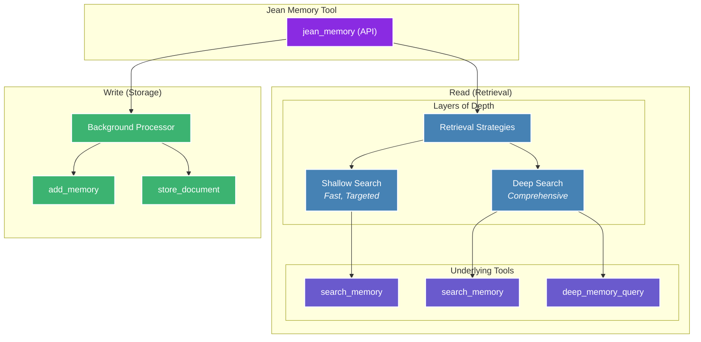

## Context Engineering, Not Information Retrieval

Jean Memory's core philosophy is **Context Engineering**, not just Information Retrieval. This means the system doesn't just store and retrieve memories—it intelligently engineers context for your AI assistant. This is the key to making AI truly personal and useful.
    

The system is designed to:
-   Select the *right* information at the *right* time.
-   Synthesize insights from disparate memories.
-   Understand relationships between memories.
-   Predict what context will be most useful.

This is a continuous process. Memories are constantly being saved and analyzed in the background. When a query comes in, the system intelligently decides whether new context is required and, if so, what depth of search is necessary to provide the most relevant response.
    

## The Orchestration Engine

The `jean_memory` API is the heart of the system. It's the primary interface for your AI to interact with the memory layer, orchestrating various underlying functions to provide the right context at the right depth. 



### Context Strategies

The orchestrator uses different strategies to create the best possible context for the AI.

1.  **`deep_understanding`**: Used for new conversations to provide comprehensive context about the user.
2.  **`relevant_context`**: Used for ongoing conversations to provide targeted, relevant information.
3.  **`comprehensive_analysis`**: Used for deep queries like "tell me everything you know about X" to do a full scan of all available information.
                                                        

### Opinionated Context Flows

While our primary `jean_memory` tool provides a balanced approach, the underlying tools can be composed into highly specialized, opinionated flows to solve specific problems. Below are a few examples of what's possible.

    

<AccordionGroup>
  <Accordion title="Flow 1: The Proactive Briefing">
    This flow is designed for an AI assistant that needs to provide a user with a summary of relevant information *before* they even ask. It's perfect for a morning briefing or preparing for a meeting.               

    <div style={{display: 'flex', justifyContent: 'center'}}>
      ```mermaid
      graph TD;
          A["Event Trigger<br/>(e.g., Calendar Event)"] --> B["List Recent Memories<br/>(list_memories)"];
          B --> C["Vector Search for Related Topics<br/>(search_memory)"];
          C --> D["Deep Dive on Key Entities<br/>(deep_memory_query)"];
          D --> E["Synthesize Briefing<br/>(Send to LLM)"];
          E --> F["Deliver Proactive Summary"];

          classDef trigger fill:#8A2BE2,stroke:#FFF,stroke-width:2px,color:#FFF;
          classDef process fill:#4682B4,stroke:#FFF,stroke-width:2px,color:#FFF;
          classDef output fill:#3CB371,stroke:#FFF,stroke-width:2px,color:#FFF;

          class A trigger;
          class B,C,D process;
          class E,F output;
      ```
    </div>
  </Accordion>
  <Accordion title="Flow 2: The Deep Dive Researcher">
    This flow is for tasks that require a comprehensive understanding of a large corpus of information, like a collection of research papers or project documents.                                                      

    <div style={{display: 'flex', justifyContent: 'center'}}>
      ```mermaid
      graph TD;
          A["User Request<br/>'Research topic X'"] --> B["Store All Relevant Documents<br/>(store_document)"];
          B --> C["Iterative Search & Analysis"];
          subgraph C
              direction LR
              C1["Initial Vector Search<br/>(search_memory)"] --> C2["Identify Key Concepts"];
              C2 --> C3["Graph Traversal for Connections<br/>(deep_memory_query)"];
              C3 --> C1;
          end
          C --> D["Synthesize Full Report<br/>(Send to LLM)"];
          D --> E["Present Research Findings"];

          classDef trigger fill:#8A2BE2,stroke:#FFF,stroke-width:2px,color:#FFF;
          classDef process fill:#4682B4,stroke:#FFF,stroke-width:2px,color:#FFF;
          classDef loop fill:#6A5ACD,stroke:#FFF,stroke-width:2px,color:#FFF;
          classDef output fill:#3CB371,stroke:#FFF,stroke-width:2px,color:#FFF;
          
          class A trigger;
          class B,D process;
          class C loop;
          class E output;
      ```
    </div>
  </Accordion>
  <Accordion title="Flow 3: The Just-in-Time Learner">
    This flow is for an AI that learns a new skill or topic in real-time based on user interaction, getting progressively smarter with each turn of the conversation.                                                   

    <div style={{display: 'flex', justifyContent: 'center'}}>
      ```mermaid
      graph TD;
          A["User Message"] --> B{"Is this a new topic?"};
          B -- "Yes" --> C["Scrape & Store<br/>Initial Knowledge<br/>(store_document)"];
          B -- "No" --> D["Standard Context Retrieval<br/>(search_memory)"];
          C --> E["Provide Initial Answer"];
          D --> E;
          E --> F["User Feedback"];
          F --> G["Refine & Add to Memory<br/>(add_memories)"];
          G --> A;

          classDef io fill:#3CB371,stroke:#FFF,stroke-width:2px,color:#FFF;
          classDef decision fill:#8A2BE2,stroke:#FFF,stroke-width:2px,color:#FFF;
          classDef process fill:#4682B4,stroke:#FFF,stroke-width:2px,color:#FFF;
          
          class A,E,F io;
          class B decision;
          class C,D,G process;
      ```
    </div>
  </Accordion>
</AccordionGroup>

### Create Your Own Flow

The true power of Jean Memory is its flexibility. The primitive tools (`store_document`, `search_memory`, `add_memories`, etc.) are the building blocks for you to create your own context engineering flows tailored to your specific use case.

    

Whether you're building a hyper-personalized tutor, a strategic research agent, or something entirely new, our toolset provides the foundation.
                                                        

**Want to build a custom flow?** [Reach out to our team](mailto:jonathan@jeantechnologies.com), and we'll be happy to show you how to get started.