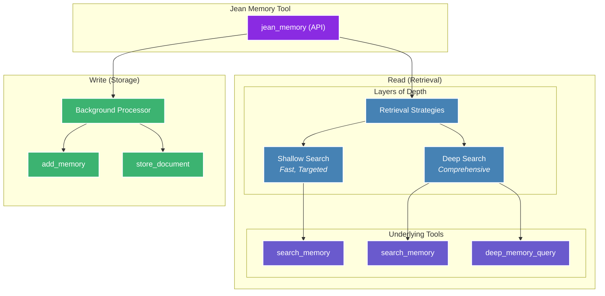

## Context Engineering, Not Information Retrieval

Jean Memory's core philosophy is **Context Engineering**, not just Information Retrieval. This means the system doesn't just store and retrieve memories—it intelligently engineers context for your AI assistant. This is the key to making AI truly personal and useful.

The system is designed to:
-   Select the *right* information at the *right* time.
-   Synthesize insights from disparate memories.
-   Understand relationships between memories.
-   Predict what context will be most useful.

This is a continuous process. Memories are constantly being saved and analyzed in the background. When a query comes in, the system intelligently decides whether new context is required and, if so, what depth of search is necessary to provide the most relevant response.

## The Orchestration Engine

The `jean_memory` API is the heart of the system. It's the primary interface for your AI to interact with the memory layer, orchestrating various underlying functions to provide the right context at the right depth.

### Context Strategies

The orchestrator uses different strategies to create the best possible context for the AI.

1.  **`deep_understanding`**: Used for new conversations to provide comprehensive context about the user.
2.  **`relevant_context`**: Used for ongoing conversations to provide targeted, relevant information.
3.  **`comprehensive_analysis`**: Used for deep queries like "tell me everything you know about X" to do a full scan of all available information.
