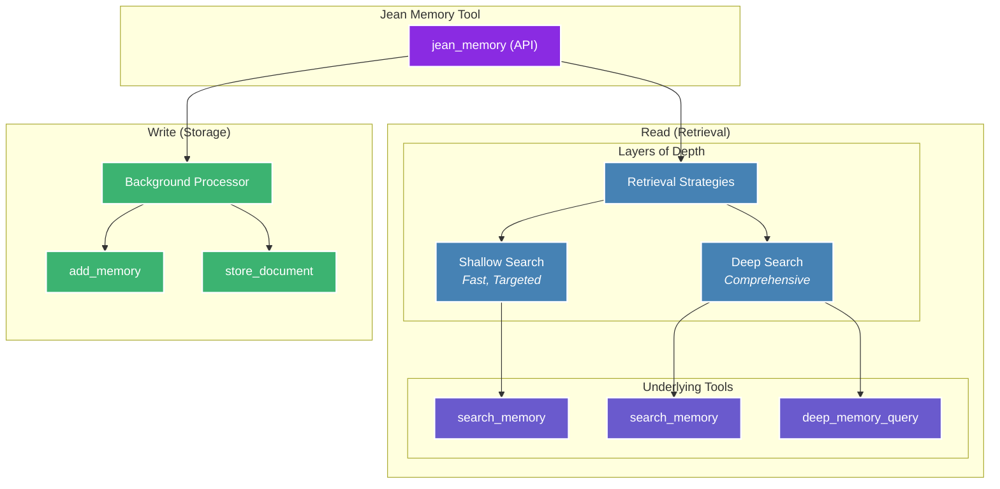

## Context Engineering, Not Information Retrieval

Jean Memory's core philosophy is **Context Engineering**, not just Information Retrieval. This means the system doesn't just store and retrieve memories—it intelligently engineers context for your AI assistant. This is the key to making AI truly personal and useful.

The system is designed to:
-   Select the *right* information at the *right* time.
-   Synthesize insights from disparate memories.
-   Understand relationships between memories.
-   Predict what context will be most useful.

This is a continuous process. Memories are constantly being saved and analyzed in the background. When a query comes in, the system intelligently decides whether new context is required and, if so, what depth of search is necessary to provide the most relevant response.

## The Orchestration Engine

The `jean_memory` API is the heart of the system. It's the primary interface for your AI to interact with the memory layer, orchestrating various underlying functions to provide the right context at the right depth.



### Context Strategies

The orchestrator uses different strategies to create the best possible context for the AI.

1.  **`deep_understanding`**: Used for new conversations to provide comprehensive context about the user.
2.  **`relevant_context`**: Used for ongoing conversations to provide targeted, relevant information.
3.  **`comprehensive_analysis`**: Used for deep queries like "tell me everything you know about X" to do a full scan of all available information.

### Opinionated Context Flows

While our primary `jean_memory` tool provides a balanced approach, the underlying tools can be composed into highly specialized, opinionated flows to solve specific problems. A strong opinion is what separates a simple tool from a powerful platform.

Below are a few examples of what's possible, designed to be both high-value and to demonstrate a clear, opinionated approach to context engineering.

<CardGroup cols={1}>
<Card title="Flow 1: Strategic Relationship Management">
  <p>This flow moves beyond simple fact recall ("What is Jane's title?") to providing actionable intelligence. It's for a professional who needs to prepare for a key meeting by understanding the deep context of a relationship, including past conversations, unresolved issues, and shared connections.</p>
  <div align="center">
  ```mermaid
  graph TD;
      A["Trigger: Upcoming meeting with<br/>'Jane Doe @ Acme Corp'"] --> B["Fuzzy Search: Find all memories<br/>related to 'Jane' & 'Acme'<br/>(search_memory)"];
      B --> C["Graph Query: Find shared connections,<br/>past projects, & unresolved issues<br/>(deep_memory_query)"];
      C --> D["Synthesize Strategic Briefing<br/>(Send to LLM)"];
      D --> E["Output:<br/>- Key relationship points<br/>- Unresolved issues to address<br/>- Suggested talking points"];
  
      classDef trigger fill:#DBEAFE,stroke:#3B82F6,stroke-width:2px,color:#1E3A8A;
      classDef process fill:#F3F4F6,stroke:#6B7280,stroke-width:1px,color:#1F2937;
      classDef synthesis fill:#D1FAE5,stroke:#10B981,stroke-width:2px,color:#065F46;
      classDef output fill:#E0E7FF,stroke:#6366F1,stroke-width:2px,color:#3730A3;
  
      class A trigger;
      class B,C process;
      class D synthesis;
      class E output;
  ```
  </div>
</Card>
<Card title="Flow 2: Longitudinal Skill Acquisition">
  <p>This flow is for creating a truly adaptive learning experience. Instead of just remembering the last lesson, the AI analyzes the user's entire learning history to identify and address persistent knowledge gaps, making it a powerful tutor.</p>
  <div align="center">
  ```mermaid
  graph TD;
      A["Trigger: User starts new lesson<br/>on 'React Custom Hooks'"] --> B["Analyze all past interactions<br/>tagged 'React' to find patterns of confusion<br/>(deep_memory_query)"];
      B --> C["Identify recurring knowledge gap:<br/>'useEffect dependency array'"];
      C --> D["Synthesize a personalized pre-lesson<br/>to address the specific gap<br/>(Send to LLM)"];
      D --> E["Output:<br/>'Before we start with custom hooks,<br/>let's quickly review a concept<br/>that's been tricky in the past...'"];
  
      classDef trigger fill:#DBEAFE,stroke:#3B82F6,stroke-width:2px,color:#1E3A8A;
      classDef process fill:#F3F4F6,stroke:#6B7280,stroke-width:1px,color:#1F2937;
      classDef synthesis fill:#D1FAE5,stroke:#10B981,stroke-width:2px,color:#065F46;
      classDef output fill:#E0E7FF,stroke:#6366F1,stroke-width:2px,color:#3730A3;
  
      class A trigger;
      class B,C process;
      class D synthesis;
      class E output;
  ```
  </div>
</Card>
<Card title="Flow 3: Creative Ideation Partner">
  <p>This flow showcases the true power of a knowledge graph by connecting disparate concepts to spark creativity. The AI acts as an ideation partner, drawing on the user's entire spectrum of interests—not just the topic at hand—to offer unique, divergent ideas.</p>
  <div align="center">
  ```mermaid
  graph TD;
      A["Trigger: User asks for creative ideas<br/>'Help me brainstorm a marketing campaign'"] --> B["Vector search for memories<br/>related to the explicit topic<br/>(search_memory)"];
      B --> C["Graph Query: Traverse memory graph to find<br/>*unrelated* but inspiring concepts<br/>from user's recent history<br/>(deep_memory_query)"];
      C --> D["Synthesize convergent & divergent ideas<br/>(Send to LLM)"];
      D --> E["Output:<br/>'Here are some standard ideas...<br/>but what if we combined it with your<br/>interest in brutalist architecture?'"];
      
      classDef trigger fill:#DBEAFE,stroke:#3B82F6,stroke-width:2px,color:#1E3A8A;
      classDef process fill:#F3F4F6,stroke:#6B7280,stroke-width:1px,color:#1F2937;
      classDef synthesis fill:#D1FAE5,stroke:#10B981,stroke-width:2px,color:#065F46;
      classDef output fill:#E0E7FF,stroke:#6366F1,stroke-width:2px,color:#3730A3;
  
      class A trigger;
      class B,C process;
      class D synthesis;
      class E output;
  ```
  </div>
</Card>
</CardGroup>

### Create Your Own Flow

The true power of Jean Memory is its flexibility. The primitive tools (`store_document`, `search_memory`, `add_memories`, etc.) are the building blocks for you to create your own context engineering flows tailored to your specific use case.

Whether you're building a hyper-personalized tutor, a strategic research agent, or something entirely new, our toolset provides the foundation.

**Want to build a custom flow?** [Reach out to our team](mailto:jonathan@jeantechnologies.com), and we'll be happy to show you how to get started.
