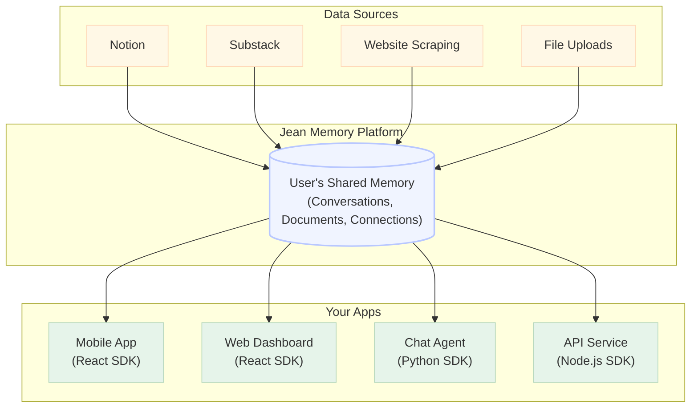

import { SignInWithJean } from 'jeanmemory-react';
import CopyToClipboard from './components/CopyToClipboard.tsx';

<CopyToClipboard />

Computers have no memory of their interactions with users. Every conversation starts from scratch. **Jean Memory solves this by creating a persistent, intelligent memory layer that makes AI truly personal.**

Our goal is to provide developers with the rich, personal context they need to make their AI applications truly intelligent. We are a specialized tool that integrates into your existing stack.

### How It Works

1.  **A User Signs Up:** The moment a user authenticates with your application via the secure `<SignInWithJean />` button, their memory graph is born.
2.  **Jean Starts Learning:** Jean immediately begins to learn from their conversations, automatically curating and saving important details in the background. This context is used to provide better, more relevant AI responses.
3.  **The User Connects More:** The user can optionally connect other data sources (like Notion, Slack, or Google Drive) to build a richer, more comprehensive memory.

 

  <SignInWithJean />

