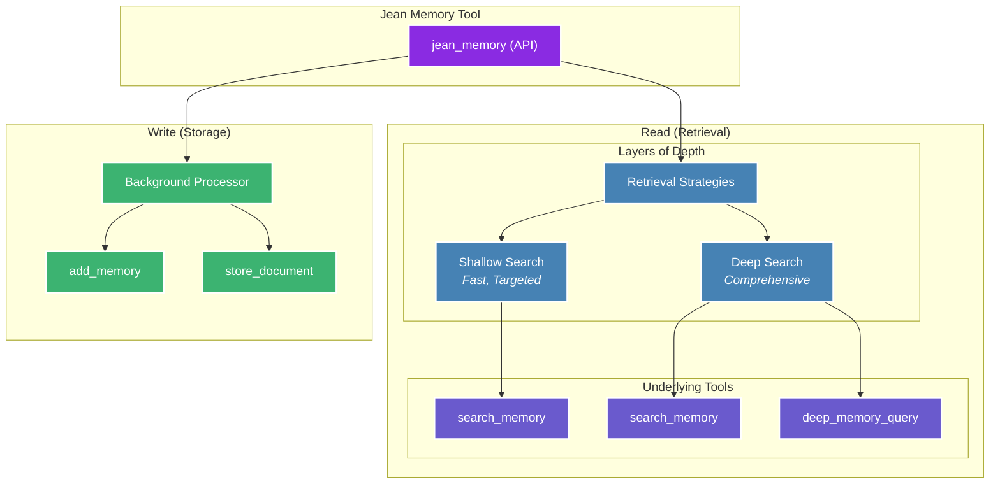

## Context Engineering, Not Information Retrieval

Jean Memory's core philosophy is **Context Engineering**, not just Information Retrieval. This means the system doesn't just store and retrieve memories—it intelligently engineers context for your AI assistant. This is the key to making AI truly personal and useful.

The system is designed to:
-   Select the *right* information at the *right* time.
-   Synthesize insights from disparate memories.
-   Understand relationships between memories.
-   Predict what context will be most useful.

This approach is inspired by Rich Sutton's "The Bitter Lesson," which argues that leveraging AI's intelligence is more effective than hand-coded heuristics. Jean Memory uses AI to decide what to remember, what context is relevant, and how to synthesize new insights.

## The `jean_memory` Tool: A Tool of Tools

The `jean_memory` tool is the heart of the system. It's the primary interface for your AI to interact with the memory layer. It's a "tool of tools" that orchestrates various underlying memory functions to provide the right context at the right depth, with built-in intelligence and long-context awareness.



```python
@mcp.tool(description="🌟 ALWAYS USE THIS TOOL!!!")
async def jean_memory(
    user_message: str, 
    is_new_conversation: bool, 
    needs_context: bool
) -> str:
```

### Execution Flow

The `jean_memory` tool uses a dual-path asynchronous process to provide a fast response while performing deeper analysis in the background.

1.  **Immediate Path (< 3 seconds)**:
    -   If `needs_context=false`, it returns immediately.
    -   If `needs_context=true`, it runs a fast vector search to get the most relevant context instantly.

2.  **Background Path 1 - Smart Triage**:
    -   Triggered for **every** message.
    -   Uses a fast AI model (Gemini Flash) to analyze the message and decide whether to **REMEMBER** or **SKIP** it.
    -   If it decides to **REMEMBER**, it saves the memory in the background.

3.  **Background Path 2 - Deep Analysis**:
    -   Only runs if `needs_context=true`.
    -   Performs a full context engineering pipeline to synthesize insights from multiple memories.
    -   This can take 30-60 seconds and creates high-priority "insight memories."

## Smart Context Orchestrator

The `SmartContextOrchestrator` is the brain behind the `jean_memory` tool. It uses different strategies to create the best possible context for the AI.

### Context Strategies

1.  **`deep_understanding`**: Used for new conversations to provide comprehensive context about the user.
2.  **`relevant_context`**: Used for ongoing conversations to provide targeted, relevant information.
3.  **`comprehensive_analysis`**: Used for deep queries like "tell me everything you know about X" to do a full scan of all available information.

By using these strategies, Jean Memory ensures that the AI has the perfect amount of context to be helpful without being overwhelmed by information.
