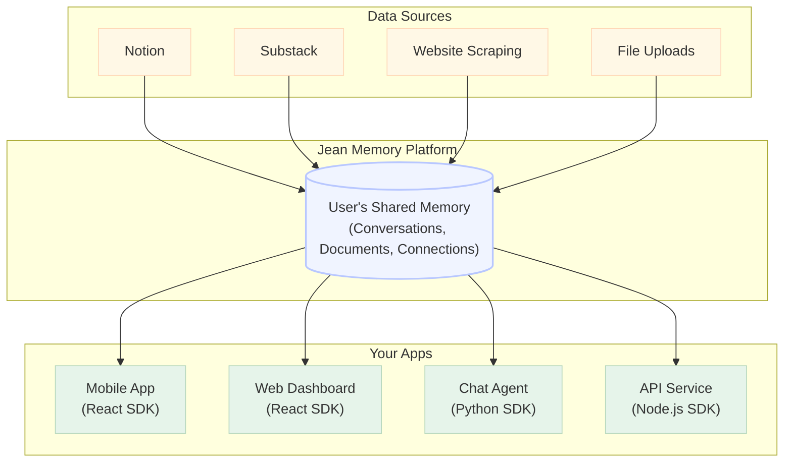
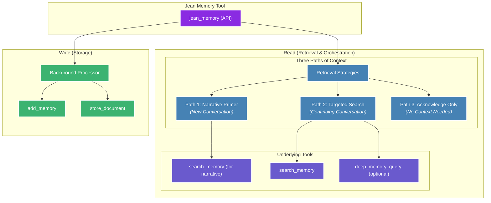

# Jean Memory - Complete Documentation for AI Coding Tools

**Generated on:** 2025-08-22 14:10:39

## What is Jean Memory?

Jean Memory is the universal memory layer for AI applications. It provides persistent, cross-application memory that allows AI agents to remember user preferences, conversation context, and personal information across different applications and sessions.

### Key Capabilities:
- **Universal Memory**: Works across any application or platform
- **5-Line Integration**: Add persistent memory to any React app in under 5 minutes
- **Cross-Application Persistence**: Users' AI agents remember them across different apps
- **Context Engineering**: Intelligent context building for personalized AI experiences
- **Multiple Integration Methods**: REST API, React SDK, Python SDK, Node.js SDK, and MCP

### Quick Integration Examples:

#### React (2 lines):
```tsx
import { JeanProvider, JeanChatComplete } from '@jeanmemory/react';

function MyApp() {
  return (
    <JeanProvider apiKey="your-api-key">
      <JeanChatComplete />
    </JeanProvider>
  );
}
```

#### Python:
```python
from jeanmemory import JeanMemoryClient
jean = JeanMemoryClient(api_key="your-api-key")
context = jean.get_context(user_token="token", message="Hello")
```

#### Node.js:
```javascript
import { JeanMemoryClient } from '@jeanmemory/node';
const jean = new JeanMemoryClient({ apiKey: "your-api-key" });
const context = await jean.getContext({ user_token: "token", message: "Hello" });
```

### NPM Packages:
- React: `npm install @jeanmemory/react`
- Node.js: `npm install @jeanmemory/node`
- Python: `pip install jeanmemory`

---

# Complete Documentation

## Introduction

<CopyToClipboard />

Computers have no memory of their interactions with users. Every conversation starts from scratch. **Jean Memory solves this by creating a persistent, intelligent memory layer that makes AI truly personal.**

Our goal is to provide developers with the rich, personal context they need to make their AI applications truly intelligent. We are a specialized tool that integrates into your existing stack.


### How It Works

1.  **A User Signs Up:** The moment a user authenticates with your application via the secure `<SignInWithJean />` button, their memory graph is born.
2.  **Jean Starts Learning:** Jean immediately begins to learn from their conversations, automatically curating and saving important details in the background. This context is used to provide better, more relevant AI responses.
3.  **The User Connects More:** The user can optionally connect other data sources (like Notion, Slack, or Google Drive) to build a richer, more comprehensive memory.

<br/>

  <SignInWithJean />

---

## Quickstart

Choose your path. Add a complete UI component to your frontend or add a powerful context layer to your backend.

### Drop-in UI Component

The fastest way to get a full-featured chatbot running in your app.

```jsx
// 1. Install the React SDK
// npm install @jeanmemory/react

// 2. Add the provider and complete chat component

function MyPage() {
  return (
    <JeanProvider apiKey="jean_sk_your_key">
      <JeanChatComplete />
    </JeanProvider>
  );
}
```

### Headless Backend

For developers who want to power their existing AI agents with our headless SDK.

```python
# 1. Install the Python SDK
# pip install jeanmemory openai

# 2. Get context before calling your LLM

from jeanmemory import JeanMemoryClient
from openai import OpenAI

jean = JeanMemoryClient(api_key=os.environ["JEAN_API_KEY"])
openai = OpenAI(api_key=os.environ["OPENAI_API_KEY"])

context = jean.get_context(
    user_token="USER_TOKEN_FROM_FRONTEND",
    message="What was our last conversation about?"
).text

prompt = f"Context: {context}\\n\\nUser question: What was our last conversation about?"

# 3. Use the context in your LLM call
completion = openai.chat.completions.create(
    model="gpt-4-turbo",
    messages=[{"role": "user", "content": prompt}]
)
```

<br/>

  Just copy and paste our full documentation into your AI agent (Cursor, Claude, etc.) and tell it what you want to build.

---

## Architecture

## More Than a Database: An Intelligent Memory System

At Jean Memory, our core philosophy is **Context Engineering, not just Information Retrieval**. While many systems can store and retrieve data, our goal is to build an intelligent memory system that mirrors the human brain—understanding, synthesizing, and anticipating what you need to know.

To achieve this, we've built our system on a unique tri-database architecture, where each component is chosen for its specific strengths. This allows us to handle the complex demands of AI memory far more effectively than a single database could.

### The Tri-Database Stack

  **For semantic search and relevance.** We use Qdrant for Retrieval-Augmented Generation (RAG). It's powerful and quick, allowing us to perform lightning-fast semantic searches to find the most contextually similar information.

  **For understanding connections.** We use Neo4j to build a rich knowledge graph of the entities and relationships within a user's memories. Graph databases enable the forming of connections between information, so you see the full picture.

  **For structured data and reliability.** All of the metadata associated with your memories, users, and applications is stored in a robust PostgreSQL database. This ensures data integrity and provides a reliable foundation for the entire system.


### The Future of Intelligent Memory
Our system is designed to intelligently manage memory over time, much like the human brain. This includes:

- **De-duplication:** To prevent your memory from becoming crowded.
- **Self-Organization:** Rearranging and optimizing data during periods of unuse, similar to how the human brain processes information during sleep.
- **Intelligent Orchestration:** Deciding whether, how much, and what context is relevant to respond well to a user, doing all the thinking under the hood.

This combination of a powerful, multi-database backend and a sophisticated intelligence layer is what makes Jean Memory a true context engine.

---

## Sdk: Overview

We provide a suite of specialized SDKs, each designed for a specific part of the modern application stack. This lets you use the right tool for the job, whether you're building a user interface or a backend agent.

## Why Three SDKs?

- **React SDK:** For the **Frontend**. Use this to build user-facing components. It includes the `<JeanChat />` appliance for instant setup and the `useJean` hook for building custom UIs. Its main job is to handle the UI and secure user authentication.

- **Node.js SDK:** For **Javascript Backends**. A headless library for your server. It's built to be used in API routes (like Next.js or Express) and serverless functions to fetch context for your LLM calls. It's the bridge between your application logic and the Jean Memory engine.

- **Python SDK:** For **Python Backends**. Also a headless library, this is the perfect choice for backend agents, data processing pipelines, and any AI/ML workflows written in Python.

---

## Sdk: React

The Jean Memory React SDK provides two powerful ways to integrate: a simple, out-of-the-box UI component for rapid development, and a flexible hook for building completely custom experiences.

## Getting Context: The `getContext` Function

The primary way to retrieve context from Jean Memory is with the `getContext` function. It provides four distinct speed modes, allowing you to choose the right balance of speed and quality for your application.

```typescript
const { getContext } = useJean();

// Fast: Direct memory search (0.5-1s)
const fastContext = await getContext("What was my recent idea about AI?", { mode: 'fast' });

// Balanced: AI synthesis with Gemini 2.5 Flash (3-5s) - Recommended
const balancedContext = await getContext("How should I approach this project?", { mode: 'balanced' });

// Autonomous: Intelligent orchestration with adaptive decision-making (variable latency)
const smartContext = await getContext("Help me plan my week based on my goals", { mode: 'autonomous' });

// Comprehensive: Deep document analysis (20-30s)
const deepContext = await getContext("Analyze my writing style across my recent essays.", { mode: 'comprehensive' });
```

### Speed Modes

-   **`fast`**: Direct memory search returning raw memories. Ideal for real-time applications where speed is critical.
-   **`balanced`**: AI synthesis using Gemini 2.5 Flash for conversational responses. Recommended for most use cases.
-   **`autonomous`**: Intelligent orchestration that adaptively determines context analysis depth. May take longer for complex reasoning.
-   **`comprehensive`**: Deep document analysis with extensive memory search. Best for research and detailed analysis.

[Learn more about speed modes →](/speed-modes)

## Installation

```bash
npm install @jeanmemory/react
```

## Three Integration Approaches

The Jean Memory React SDK provides three levels of integration complexity, allowing you to choose the right approach for your use case.

### Level 1: Complete Drop-in Solution (2 lines)

The fastest way to get a full-featured chatbot with authentication running in your app.

```jsx {{ title: 'pages/index.tsx' }}

  return (
    <JeanProvider apiKey={process.env.NEXT_PUBLIC_JEAN_API_KEY}>
      <JeanChatComplete />
    </JeanProvider>
  );
}
```

The `JeanChatComplete` component includes everything you need out of the box:
- Automatic OAuth 2.1 PKCE authentication flow
- Complete chat interface with professional styling
- Sign-in and sign-out buttons
- Loading states and error handling
- Welcome message and example prompts

**Styling Options:**
```jsx
<JeanChatComplete 
  placeholder="Ask me anything..."
  welcomeMessage="Welcome to your AI assistant"
  examplePrompts={["What's my schedule?", "Remember this meeting"]}
  showSignOut={true}
  showExamples={true}
  chatHeight={500}
  style={{ maxWidth: '600px', margin: '0 auto' }}
  className="my-custom-chat"
  header={<CustomHeader />}
/>
```

**Current Limitations:** `JeanChatComplete` uses inline styles for rapid prototyping. For production applications requiring extensive brand customization, consider Level 2 or Level 3 approaches.

### Level 2: Authentication Guard with Custom UI (5 lines)

When you want your own UI but simplified authentication management.

```jsx {{ title: 'pages/index.tsx' }}

  return (
    <JeanProvider apiKey={process.env.NEXT_PUBLIC_JEAN_API_KEY}>
      <JeanAuthGuard>
        <MyCustomChatApp />
      </JeanAuthGuard>
    </JeanProvider>
  );
}

function MyCustomChatApp() {
  const { sendMessage, messages, user, signOut } = useJean();
  // Your custom UI implementation
  return Your custom chat interface;
}
```

`JeanAuthGuard` automatically handles:
- Loading states while checking authentication
- Sign-in UI when user is not authenticated
- Displaying your custom app when authenticated
- Customizable loading and fallback components

**Customization Options:**
```jsx
<JeanAuthGuard
  loadingComponent={Checking authentication...}
  fallback={<CustomSignInPage />}
  showDefaultSignIn={false}
>
  <MyApp />
</JeanAuthGuard>
```

### Level 3: Full Control (Advanced)

Complete control over authentication flow and UI implementation.

### Authentication: Completely Automated

The React SDK uses a robust **Universal OAuth 2.1 PKCE system** that handles all authentication complexity for you. Users get secure, persistent sessions with zero configuration required from developers.

#### What You Get Automatically:
- **OAuth 2.1 PKCE Flow** - Industry-standard security with Google authentication
- **Universal Identity** - Same user account across all Jean Memory applications  
- **Session Persistence** - Users stay logged in across browser refreshes and tabs
- **Automatic Token Management** - JWT tokens handled invisibly
- **Error Recovery** - Graceful handling of network issues and token expiration

#### Simple Setup for Any API Key:
```jsx
<JeanProvider apiKey="jean_sk_your_api_key">
  <JeanChat /> {/* Automatically handles authentication */}
</JeanProvider>
```

**For Production Apps:**
Users will see a "Sign In with Jean" button that triggers secure OAuth authentication.

**For Development/Testing:**
Test API keys (containing `test`) automatically create isolated test users, so you can start coding immediately without any authentication setup.

```jsx

function App() {
  return (
    <JeanProvider apiKey="jean_sk_your_api_key">
      <AuthenticatedApp />
    </JeanProvider>
  );
}

function AuthenticatedApp() {
  const { sendMessage, isAuthenticated, user, signOut } = useJean();
  
  if (!isAuthenticated) {
    return (
      <SignInWithJean 
        onSuccess={(user) => console.log('Signed in:', user)}
      >
        Custom Sign In Button
      </SignInWithJean>
    );
  }

  // Your completely custom app implementation
  return (
    
      <h1>Welcome, {user?.name}</h1>
      
      {/* Your custom chat interface */}
    
  );
}
```

## Configuration Options (Optional)

For 99% of use cases, the defaults work perfectly. But when you need control:

```typescript
const { sendMessage } = useJean();

// Speed-optimized (faster, less comprehensive)
await sendMessage("What's my schedule?", { speed: "fast" });

// Different tools for specific needs  
await sendMessage("What's my schedule?", { tool: "search_memory" });

// Simple text response instead of full metadata
await sendMessage("What's my schedule?", { format: "simple" });
```

## Advanced Use or Legacy Implementations: Direct Tool Access

<Note>
  **Primary Method:** For most use cases, we strongly recommend using the new `getContext` function to retrieve context. It provides a simpler interface with predictable performance.
</Note>

For advanced use cases where you need fine-grained control over Jean Memory, you can use the `tools` namespace from the `useJean` hook.

```typescript

function AdvancedComponent() {
  const { tools, isAuthenticated } = useJean();
  
  const handleDirectMemoryAdd = async () => {
    if (!isAuthenticated) return;
    
    // Direct tool call
    const result = await tools.add_memory("My dog's name is Max.");
    
    console.log('Memory added:', result);
  };
  
  const handleSearch = async () => {
    if (!isAuthenticated) return;
    
    const results = await tools.search_memory("information about my pets");
    
    console.log('Search results:', results);
  };
  
  // Store documents directly
  const handleStoreDocument = async () => {
    if (!isAuthenticated) return;
    
    await tools.store_document(
      "Meeting Notes",
      "# Team Meeting\n\n- Discussed project timeline\n- Next steps defined",
      "markdown"
    );
  };
  
  // Deep memory queries for complex relationship discovery
  const handleDeepQuery = async () => {
    if (!isAuthenticated) return;
    
    const insights = await tools.deep_memory_query(
      "connections between my preferences and goals"
    );
    
    console.log('Deep insights:', insights);
  };
}
```

### Available Tools

- `tools.add_memory(content)` - Add a specific memory
- `tools.search_memory(query)` - Search existing memories  
- `tools.deep_memory_query(query)` - Complex relationship queries
- `tools.store_document(title, content, type?)` - Store structured documents

**Note**: These tools automatically handle authentication and use your user context. No manual token management required.

---

## Session Management

### Sign Out

User sign-out is handled automatically through the `useJean` hook:

```typescript
function MyComponent() {
  const { signOut, user } = useJean();
  
  const handleSignOut = async () => {
    await signOut();
    // User is automatically signed out and state is cleared
  };

  return (
    
      <span>Welcome, {user?.name}</span>

  );
}
```

The `signOut()` method:
- Clears all authentication tokens and session data
- Resets the authentication state
- Removes locally stored user information
- Prepares the application for a fresh sign-in

**Alternative Manual Approach:**
```typescript

// Direct function call (not recommended for most use cases)
const handleManualSignOut = () => {
  signOutFromJean();
  window.location.reload();
};
```

---

## Sdk: Python

The Jean Memory Python SDK provides a simple, headless interface to our powerful Context API. It's designed to be integrated directly into your backend services, AI agents, or data processing pipelines.

## Installation

```bash
pip install jeanmemory
```

## Usage: Adding Context to an Agent

The primary use case for the Python SDK is to retrieve context that you can then inject into a prompt for your chosen Large Language Model.

The example below shows a typical workflow where we get context from Jean Memory before calling the OpenAI API.

```python

from openai import OpenAI
from jeanmemory import JeanMemoryClient

# 1. Initialize the clients
jean = JeanMemoryClient(api_key=os.environ.get("JEAN_API_KEY"))
openai = OpenAI(api_key=os.environ.get("OPENAI_API_KEY"))

# 2. Get the user token from your frontend (or use auto test user)
# Production: Token from OAuth flow via @jeanmemory/react
# Development: Leave empty for automatic test user
user_token = get_user_token_from_request()  # Or None for test user 

# 3. Get context from Jean Memory
user_message = "What were the key takeaways from our last meeting about Project Phoenix?"
context_response = jean.get_context(
    user_token=user_token,
    message=user_message,
    # All defaults: tool="jean_memory", speed="balanced", format="enhanced"
)

# 4. Engineer your final prompt
final_prompt = f"""
Using the following context, please answer the user's question.
The context is a summary of the user's memories related to their question.

Context:

User Question: {user_message}
"""

# 5. Call your LLM
completion = openai.chat.completions.create(
    model="gpt-4-turbo",
    messages=[
        {"role": "system", "content": "You are a helpful assistant."},
        {"role": "user", "content": final_prompt},
    ],
)

print(completion.choices[0].message.content)

```

This code block demonstrates the complete "golden path" for using the headless Python SDK. Here's a step-by-step breakdown:
1.  **Initialization**: It creates instances of the `JeanMemoryClient` and a large language model client (in this case, `OpenAI`).
2.  **Authentication**: It retrieves a `user_token` that your frontend would have acquired through the OAuth sign-in flow. This token is crucial as it identifies the user whose memory you want to access.
3.  **Context Retrieval**: It calls `jean.get_context()`, sending the user's token and their latest message. This is the core of the integration, where Jean Memory performs its context engineering.
4.  **Prompt Engineering**: It constructs a final prompt for the LLM, strategically placing the retrieved context before the user's actual question. This gives the LLM the necessary background information to provide a relevant, personalized response.
5.  **LLM Call**: It sends the final, context-rich prompt to the LLM to get the answer.

### A Note on Authentication

The `user_token` is the critical piece that connects a request to a specific user's memory. In a production application, your frontend should use our React SDK's `<SignInWithJean />` component (or a manual OAuth 2.1 PKCE flow) to authenticate the user and receive this token. Your frontend then passes this token to your backend, which uses it to make authenticated requests with the Python SDK.

**Headless Authentication (Backend-Only)**

For headless applications without a frontend, you have several options:

```python
# Option 1: Test mode (development)
jean = JeanMemoryClient(api_key="jean_sk_your_key")
context = jean.get_context(
    # user_token=None automatically uses test user
    message="Hello"
)

# Option 2: Manual OAuth flow (production)
jean = JeanMemoryClient(api_key="jean_sk_your_key")

# Generate OAuth URL for manual authentication
auth_url = jean.get_auth_url(callback_url="http://localhost:8000/callback")
print(f"Visit: {auth_url}")

# After user visits URL and you get the code:
user_token = jean.exchange_code_for_token(auth_code)

# Option 3: Service account (enterprise)
jean = JeanMemoryClient(
    api_key="jean_sk_your_key",
    service_account_key="your_service_account_key"
)
```

For information on implementing a secure server-to-server OAuth flow for backend services, see the [Authentication](/authentication) guide.

---

## Configuration Options (Optional)

For 99% of use cases, the defaults work perfectly. But when you need control:

```python
# Speed-optimized (faster, less comprehensive)
context = jean.get_context(
    user_token=user_token,
    message=user_message,
    speed="fast"  # vs "balanced" (default) or "comprehensive"
)

# Different tools for specific needs
context = jean.get_context(
    user_token=user_token,
    message=user_message,
    tool="search_memory"  # vs "jean_memory" (default)
)

# Simple text response instead of full metadata
context = jean.get_context(
    user_token=user_token,
    message=user_message,
    format="simple"  # vs "enhanced" (default)
)
```

## Advanced: Direct Tool Access

For advanced use cases, the `JeanMemoryClient` also provides a `tools` namespace for direct, deterministic access to the core memory functions.

```python
# The intelligent, orchestrated way (recommended):
context = jean.get_context(user_token=..., message="...")

# The deterministic, tool-based way:
jean.tools.add_memory(user_token=..., content="My favorite color is blue.")
search_results = jean.tools.search_memory(user_token=..., query="preferences")

# Advanced tools for complex operations:
deep_results = jean.tools.deep_memory_query(user_token=..., query="complex relationship query")
doc_result = jean.tools.store_document(user_token=..., title="Meeting Notes", content="...", document_type="markdown")
```

---

## Sdk: Nodejs

The Jean Memory Node.js SDK is a headless library for integrating our Context API into your backend services. It's perfect for developers building API routes, serverless functions, or stateful agents in a Node.js environment.

## Installation

```bash
npm install @jeanmemory/node
```

## Usage: Creating a Context-Aware API Route

A common use case is to create an API endpoint that your frontend can call. This endpoint will securely fetch context from Jean Memory and then stream a response from your chosen LLM.

The example below shows how to create a Next.js API route that is compatible with edge runtimes and the Vercel AI SDK.

```typescript {{ title: 'pages/api/chat.ts' }}

// Create the clients
const jean = new JeanClient({ apiKey: process.env.JEAN_API_KEY });
const openai = new OpenAI({ apiKey: process.env.OPENAI_API_KEY });

// Set the runtime to edge for best performance

  // 1. Get the user's message and token from the request body
  const { messages, userToken } = await req.json();
  const currentMessage = messages[messages.length - 1].content;

  // Ensure the user token is present
  if (!userToken) {
    return new Response('Unauthorized', { status: 401 });
  }

  // 2. Get context from Jean Memory with speed control
  const contextResponse = await jean.getContext({
    user_token: userToken,
    message: currentMessage,
    speed: "balanced", // Options: "fast", "balanced", "autonomous", "comprehensive"
    // tool="jean_memory", format="enhanced" (defaults)
  });

  // 3. Engineer your final prompt
  const finalPrompt = `
    Using the following context, please answer the user's question.
    The context is a summary of the user's memories related to their question.

    Context:
    ---
    ${contextResponse.text}
    ---

    User Question: ${currentMessage}
  `;
  
  // 4. Call your LLM and stream the response
  const response = await openai.chat.completions.create({
    model: 'gpt-4-turbo',
    stream: true,
    messages: [
      { role: "system", content: "You are a helpful assistant." },
      { role: "user", content: finalPrompt },
    ],
  });

  const stream = OpenAIStream(response);
  return new StreamingTextResponse(stream);
}
```

This code sets up a Next.js API route that acts as a secure bridge between your frontend and your language model.
1.  **Extract Data**: It pulls the latest user message and, most importantly, the `userToken` from the incoming request. This token, acquired by your frontend via OAuth, authorizes access to the user's memory.
2.  **Fetch Context**: It calls `jean.getContext()`, passing the `userToken` and the user's message to the Jean Memory engine. The engine returns a block of relevant, engineered context.
3.  **Construct Prompt**: It assembles a final prompt, injecting the context from Jean Memory before the user's actual question. This enriches the LLM's understanding.
4.  **Stream Response**: It calls the LLM (in this case, OpenAI) with the context-rich prompt and streams the response back to the frontend using the Vercel AI SDK's `StreamingTextResponse`. This provides a responsive, real-time chat experience.

### Authentication Flow

As with the Python SDK, the `userToken` is obtained by your frontend application through a secure OAuth 2.1 flow using our `@jeanmemory/react` SDK. Your frontend makes an authenticated request to this API route, including the `userToken` in the request body. See the [Authentication](/authentication) guide for more details.

**Test User Support:** The Node.js SDK v2.0.1+ automatically detects when you don't provide a `user_token` and creates isolated test users for each API key:

```typescript
// With user token (production)
const context = await jean.getContext({
  user_token: userToken,  // From OAuth flow
  message: "What's my schedule?"
});

// Without user token (automatic test user)
const context = await jean.getContext({
  // user_token automatically set to test user for this API key
  message: "What's my schedule?"
});
```

This allows you to test core functionality immediately without implementing full authentication during development.

---

## Speed Modes

Jean Memory provides four distinct speed modes to balance response time with context depth:

```typescript
// Fast: Direct memory search (0.5-1s)
const fastContext = await jean.getContext({
  user_token: userToken,
  message: "What's my schedule?",
  speed: "fast"
});

// Balanced: AI synthesis with Gemini 2.5 Flash (3-5s) - Recommended
const balancedContext = await jean.getContext({
  user_token: userToken,
  message: "How should I handle this situation?",
  speed: "balanced"
});

// Autonomous: Intelligent orchestration (variable latency)
const smartContext = await jean.getContext({
  user_token: userToken,
  message: "Help me plan my project timeline",
  speed: "autonomous"
});

// Comprehensive: Deep document analysis (20-30s)
const deepContext = await jean.getContext({
  user_token: userToken,
  message: "Analyze patterns in my communication style",
  speed: "comprehensive"
});
```

**Speed Mode Selection:**
- **fast**: Ideal for real-time applications requiring sub-second responses
- **balanced**: Recommended for most conversational AI use cases with natural language synthesis
- **autonomous**: Best for complex tasks requiring intelligent decision-making
- **comprehensive**: Use for research and detailed analysis tasks

[Learn more about speed modes →](/speed-modes)

## Additional Configuration

For advanced use cases, you can configure additional options:

```typescript
// Different tools for specific needs
const context = await jean.getContext({
  user_token: userToken,
  message: currentMessage,
  tool: "search_memory"  // vs "jean_memory" (default)
});

// Simple text response instead of full metadata
const context = await jean.getContext({
  user_token: userToken,
  message: currentMessage,
  format: "simple"  // vs "enhanced" (default)
});
```

## Advanced: Direct Tool Access

For advanced use cases, the `JeanClient` also provides a `tools` namespace for direct, deterministic access to the core memory functions.

```typescript
// The intelligent, orchestrated way (recommended):
const context = await jean.getContext({ user_token: ..., message: "..." });

// The deterministic, tool-based way:
await jean.tools.add_memory({ user_token: ..., content: "My project's deadline is next Friday." });

const search_results = await jean.tools.search_memory({ user_token: ..., query: "project deadlines" });
// Parse search results - they come as JSON in content[0].text
const searchData = JSON.parse(search_results.content[0].text);
console.log('Found memories:', searchData.memories);

// Advanced tools for complex operations:
try {
  const deep_results = await jean.tools.deep_memory_query({ user_token: ..., query: "complex relationship query" });
  // Deep queries return analysis directly in content[0].text
  const analysis = deep_results.content[0].text;
  console.log('Deep analysis:', analysis);
} catch (error) {
  console.error('Deep query failed:', error);
  // Fallback to regular search
}

const doc_result = await jean.tools.store_document({ 
  user_token: ..., 
  title: "Meeting Notes", 
  content: "...", 
  document_type: "markdown" 
});
```

### Performance Expectations

Different operations have different timing characteristics:

- **`tools.search_memory()`**: 1-2 seconds - Fast semantic search, returns JSON
- **`getContext()` (orchestration)**: 3-10 seconds - Full AI conversation with context  
- **`tools.deep_memory_query()`**: 5-15 seconds - Comprehensive cross-memory analysis
- **`tools.store_document()`**: Immediate response + background processing (30-60 seconds total)

### Response Format

Most tool responses follow this structure:
```javascript
{
  content: [
    {
      type: "text", 
      text: "JSON string or direct text response"
    }
  ]
}
```

---

## Authentication

## Our Philosophy: Secure by Design

Jean Memory handles sensitive personal data, and we take that responsibility seriously. That's why we've built our authentication system on the industry-standard **OAuth 2.1 protocol**. This ensures that user credentials are never shared with third-party applications and that users have full control over who can access their memory.

## Two-Layer Security Architecture

Jean Memory uses a **dual authentication system** for maximum security:

### Layer 1: Application Authentication
- **API Key**: Each application gets a unique API key (`jean_sk_...`)
- **Purpose**: Identifies and authorizes your application to use Jean Memory
- **Scope**: Application-level permissions and billing

### Layer 2: User Authentication  
- **JWT Token**: Each user gets a unique JWT token per session
- **Purpose**: Identifies the specific user and their memories
- **Scope**: User-specific data access and privacy

### How They Work Together:
```http
Authorization: Bearer <user_jwt_token>    # User identity
X-API-Key: jean_sk_your_app_key          # Application identity
```

**The best part? All this security is completely invisible to developers.** Our SDK handles OAuth 2.1 PKCE, JWT tokens, session persistence, and universal identity mapping automatically. You get enterprise-grade security with a 5-line integration.

We provide two clear authentication flows to support different types of applications.

## Flow 2: Backend Services (Authorization Code Grant)

This flow is for trusted backend services that need to access a user's memory on their behalf, even when the user is not actively present (e.g., for a background data sync). It uses the standard **Authorization Code Grant**.

This is a more involved flow that requires server-side handling of secrets.

### High-Level Steps

1.  **User Authorization:** Your application redirects the user to the Jean Memory authorization URL with your `client_id` and a `redirect_uri`.
2.  **Grant Authorization Code:** The user logs in and approves the request. Jean Memory redirects back to your `redirect_uri` with a temporary `code`.
3.  **Exchange Code for Token:** Your backend service makes a secure, server-to-server request to the Jean Memory token endpoint, exchanging the `code` (along with your `client_id` and `client_secret`) for an `access_token` and a `refresh_token`.
4.  **Access API:** Your service can now use the `access_token` to make authenticated requests to the Jean Memory API on the user's behalf.
5.  **Refresh Token:** When the `access_token` expires, use the `refresh_token` to obtain a new one without requiring the user to log in again.

**Info:**
  **Getting Credentials:** The server-to-server flow is intended for trusted partners and high-volume applications. Please contact our team to discuss your use case and receive a `client_id` and `client_secret`.

For detailed instructions on implementing this flow, please consult standard OAuth 2.1 documentation.

---

## Live Demo

Want to see the OAuth 2.1 PKCE flow in action? Check out our **[Jean Authentication Demo Repository](https://github.com/jonathan-politzki/jean-authentication-demo)** - a complete React application that demonstrates the 5-line integration promise.

**[View Live Demo Repository →](https://github.com/jonathan-politzki/jean-authentication-demo)**

This demo shows:
- Complete OAuth 2.1 PKCE authentication flow
- Persistent user sessions with localStorage
- Real-time AI chat with memory persistence
- Universal identity across Jean Memory applications
- Production-ready implementation with comprehensive documentation

The demo includes step-by-step setup instructions and can be running locally in under 5 minutes with just your API key.

---

## Context Engineering

## Context Engineering, Not Information Retrieval

Jean Memory's core philosophy is **Context Engineering**, not just Information Retrieval. This means the system doesn't just store and retrieve memories—it intelligently engineers context for your AI assistant. This is the key to making AI truly personal and useful.

The system is designed to:
-   Select the *right* information at the *right* time.
-   Synthesize insights from disparate memories.
-   Understand relationships between memories.
-   Predict what context will be most useful.

This is a continuous process. Memories are constantly being saved and analyzed in the background. When a query comes in, the system intelligently decides whether new context is required and, if so, what depth of search is necessary to provide the most relevant response.

## The Orchestration Engine

The `jean_memory` API is the heart of the system. It's the primary interface for your AI to interact with the memory layer, orchestrating various underlying functions to provide the right context at the right depth.

### Speed and Depth Control

Jean Memory provides four distinct speed modes that allow you to balance response time with context depth:

- **Fast Mode**: Direct memory search (0.5-1s) for real-time applications
- **Balanced Mode**: AI synthesis with Gemini 2.5 Flash (3-5s) for conversational responses
- **Autonomous Mode**: Intelligent orchestration with variable latency for complex decision-making
- **Comprehensive Mode**: Deep document analysis (20-30s) for research tasks

The autonomous mode is particularly intelligent - it analyzes the conversation context to autonomously determine whether information should be saved, how much context to retrieve, and what depth of analysis is needed. While this may take longer than other modes for complex analysis, it prioritizes intelligent decision-making over consistent response times.

[Learn more about configuring speed modes →](/speed-modes) 



### Context Strategies

The orchestrator uses three primary strategies to provide the right context at the right time:

1.  **Narrative Primer**: For new conversations, the system retrieves a high-level user narrative to provide immediate, foundational context.
2.  **Targeted Search**: For continuing conversations that require context, the system performs a targeted search for the most relevant memories, optionally using a deep query for more complex questions.
3.  **Acknowledge Only**: When a client specifies that no context is needed, the system simply acknowledges the message and processes it in the background, optimizing for speed.

### Opinionated Context Flows

While our primary `jean_memory` tool provides a balanced approach, the underlying tools can be composed into highly specialized, opinionated flows to solve specific problems. Below are a few examples of what's possible.

    This flow is designed for an AI assistant that needs to provide a user with a summary of relevant information *before* they even ask. It's perfect for a morning briefing or preparing for a meeting.               

      ```mermaid
      graph TD;
          A["Event Trigger<br/>(e.g., Calendar Event)"] --> B["List Recent Memories<br/>(list_memories)"];
          B --> C["Vector Search for Related Topics<br/>(search_memory)"];
          C --> D["Deep Dive on Key Entities<br/>(deep_memory_query)"];
          D --> E["Synthesize Briefing<br/>(Send to LLM)"];
          E --> F["Deliver Proactive Summary"];

          classDef trigger fill:#8A2BE2,stroke:#FFF,stroke-width:2px,color:#FFF;
          classDef process fill:#4682B4,stroke:#FFF,stroke-width:2px,color:#FFF;
          classDef output fill:#3CB371,stroke:#FFF,stroke-width:2px,color:#FFF;

          class A trigger;
          class B,C,D process;
          class E,F output;
      ```

    This flow is for tasks that require a comprehensive understanding of a large corpus of information, like a collection of research papers or project documents.                                                      

      ```mermaid
      graph TD;
          A["User Request<br/>'Research topic X'"] --> B["Store All Relevant Documents<br/>(store_document)"];
          B --> C["Iterative Search & Analysis"];
          subgraph C
              direction LR
              C1["Initial Vector Search<br/>(search_memory)"] --> C2["Identify Key Concepts"];
              C2 --> C3["Graph Traversal for Connections<br/>(deep_memory_query)"];
              C3 --> C1;
          end
          C --> D["Synthesize Full Report<br/>(Send to LLM)"];
          D --> E["Present Research Findings"];

          classDef trigger fill:#8A2BE2,stroke:#FFF,stroke-width:2px,color:#FFF;
          classDef process fill:#4682B4,stroke:#FFF,stroke-width:2px,color:#FFF;
          classDef loop fill:#6A5ACD,stroke:#FFF,stroke-width:2px,color:#FFF;
          classDef output fill:#3CB371,stroke:#FFF,stroke-width:2px,color:#FFF;
          
          class A trigger;
          class B,D process;
          class C loop;
          class E output;
      ```

    This flow is for an AI that learns a new skill or topic in real-time based on user interaction, getting progressively smarter with each turn of the conversation.                                                   

      ```mermaid
      graph TD;
          A["User Message"] --> B{"Is this a new topic?"};
          B -- "Yes" --> C["Scrape & Store<br/>Initial Knowledge<br/>(store_document)"];
          B -- "No" --> D["Standard Context Retrieval<br/>(search_memory)"];
          C --> E["Provide Initial Answer"];
          D --> E;
          E --> F["User Feedback"];
          F --> G["Refine & Add to Memory<br/>(add_memories)"];
          G --> A;

          classDef io fill:#3CB371,stroke:#FFF,stroke-width:2px,color:#FFF;
          classDef decision fill:#8A2BE2,stroke:#FFF,stroke-width:2px,color:#FFF;
          classDef process fill:#4682B4,stroke:#FFF,stroke-width:2px,color:#FFF;
          
          class A,E,F io;
          class B decision;
          class C,D,G process;
      ```

### Create Your Own Flow

The true power of Jean Memory is its flexibility. The primitive tools (`store_document`, `search_memory`, `add_memories`, etc.) are the building blocks for you to create your own context engineering flows tailored to your specific use case.

Whether you're building a hyper-personalized tutor, a strategic research agent, or something entirely new, our toolset provides the foundation.

**Want to build a custom flow?** [Reach out to our team](mailto:jonathan@jeantechnologies.com), and we'll be happy to show you how to get started.

---

## Speed Modes

## Overview

Jean Memory provides different approaches to control context depth and response time based on your integration method:

- **SDK Integration**: Uses speed modes (`fast`, `balanced`, `autonomous`, `comprehensive`)
- **MCP Integration**: Uses depth levels (0, 1, 2, 3) for simplified tool calling

This page covers both approaches to help you choose the right configuration for your application.

    Direct memory search with sub-second response times

    AI synthesis with Gemini 2.5 Flash for conversational responses

    Intelligent orchestration with adaptive decision-making

    Deep document analysis with extensive memory search

## MCP Integration (Depth Levels)

For MCP clients (like Claude, cursor, or custom MCP implementations), use the simplified depth parameter:

### Depth Levels

**depth=0 (No Context)**
- **Purpose**: For generic knowledge questions that don't require personal context
- **Performance**: Immediate response (just saves information in background)
- **Examples**: "What is the capital of France?", "Explain quantum physics"

**depth=1 (Fast Search)**
- **Purpose**: Quick personal facts or simple lookups from user memories
- **Performance**: Sub-second response time
- **Examples**: "What's my phone number?", "Where do I work?"

**depth=2 (Balanced Synthesis)** - Recommended Default
- **Purpose**: Conversational responses that benefit from personal context
- **Performance**: 3-5 seconds with AI synthesis
- **Examples**: "How should I handle this work situation?", "What have I been working on?"

**depth=3 (Comprehensive Analysis)**
- **Purpose**: Complex analysis requiring deep document search
- **Performance**: 20-30 seconds for thorough analysis
- **Examples**: "Analyze all my learning patterns", "Compare my productivity strategies"

```json
{
  "tool_name": "jean_memory",
  "tool_params": {
    "user_message": "What have I been working on recently?",
    "is_new_conversation": false,
    "depth": 2
  }
}
```

## SDK Integration (Speed Modes)

For SDK users (React, Node.js, Python), use the traditional speed mode parameter:

### Fast Mode

**Purpose**: Optimized for applications requiring sub-second response times with direct memory retrieval.

**Performance**: 0.5-1 second response time

**Use Cases**:
- Real-time chat applications
- Mobile applications with strict latency requirements
- Quick factual lookups
- Autocomplete and suggestion systems

**Returns**: Raw memory search results with a maximum of 10 relevant memories

```javascript
await jeanMemory({
  user_message: "What are my meeting preferences?",
  is_new_conversation: false,
  needs_context: true,
  speed: "fast"
});
```

### Balanced Mode (Recommended)

**Purpose**: Provides natural language synthesis of memories using Gemini 2.5 Flash for conversational AI interactions.

**Performance**: 3-5 seconds with Gemini 2.5 Flash processing

**Technology**: Powered by Google's Gemini 2.5 Flash model, optimized for adaptive thinking and cost efficiency

**Use Cases**:
- Conversational AI chatbots
- Personal assistant applications
- Customer support systems
- Educational tutoring platforms

**Returns**: AI-synthesized conversational response based on relevant memories

```javascript
await jeanMemory({
  user_message: "How should I approach this work conflict?",
  is_new_conversation: false,
  needs_context: true,
  speed: "balanced"
});
```

**Info:**
Balanced mode is the recommended default for most conversational AI applications, providing the optimal balance between response quality and performance.

### Autonomous Mode

**Purpose**: Intelligent orchestration that adaptively determines the appropriate level of context analysis based on conversation state and content complexity.

**Performance**: Variable latency depending on analysis requirements. Can range from seconds to potentially longer than comprehensive mode for complex multi-step reasoning.

**Intelligence**: The autonomous mode analyzes the context to decide:
- Whether new information should be saved
- How much context to retrieve
- What depth of analysis is needed
- Whether to trigger background processes

**Use Cases**:
- Complex planning and decision-making tasks
- Multi-step reasoning requirements
- Context-aware adaptive responses
- Applications requiring intelligent workflow orchestration

**Returns**: Intelligently orchestrated response with adaptive context analysis

```javascript
await jeanMemory({
  user_message: "Help me plan my week based on my goals and schedule",
  is_new_conversation: false,
  needs_context: true,
  speed: "autonomous"
});
```

**Warning:**
Autonomous mode may take longer than other modes when performing complex analysis, as it prioritizes intelligent decision-making over consistent response times.

### Comprehensive Mode

**Purpose**: Extensive memory analysis with deep document search capabilities for research and detailed information retrieval.

**Performance**: 20-30 seconds for thorough analysis

**Capabilities**:
- Deep document chunk search
- Extensive memory correlation
- Comprehensive context synthesis
- Cross-document relationship analysis

**Use Cases**:
- Research and analysis tasks
- Detailed document exploration
- Comprehensive information synthesis
- Academic and professional research

**Returns**: Extensive memory analysis with document search results

```javascript
await jeanMemory({
  user_message: "Analyze all mentions of productivity strategies in my documents",
  is_new_conversation: false,
  needs_context: true,
  speed: "comprehensive"
});
```

<Note>
Comprehensive mode can also be accessed using `speed: "deep"` for backward compatibility.
</Note>

## Performance Comparison

### MCP Interface (Depth Levels)
| Depth | Response Time | Technology | Best For |
|-------|---------------|------------|----------|
| 0 | Immediate | No context retrieval | Generic knowledge |
| 1 | 0.5-1s | Direct search | Quick personal facts |
| 2 | 3-5s | Gemini 2.5 Flash synthesis | Conversational AI |
| 3 | 20-30s | Deep document analysis | Research tasks |

### SDK Interface (Speed Modes)
| Mode | Response Time | Technology | Best For |
|------|---------------|------------|----------|
| Fast | 0.5-1s | Direct search | Real-time interactions |
| Balanced | 3-5s | Gemini 2.5 Flash synthesis | Conversational AI |
| Autonomous | Variable | Intelligent orchestration | Complex reasoning |
| Comprehensive | 20-30s | Deep document analysis | Research tasks |

## Implementation Examples

### React SDK

```tsx

function ChatComponent() {
  const { getContext } = useJeanMemory();
  
  // Fast mode for quick responses
  const handleQuickQuery = async (query: string) => {
    const response = await getContext(query, { mode: 'fast' });
    return response;
  };
  
  // Balanced mode for conversational responses
  const handleConversation = async (message: string) => {
    const response = await getContext(message, { mode: 'balanced' });
    return response;
  };
  
  // Autonomous mode for complex tasks
  const handleComplexTask = async (task: string) => {
    const response = await getContext(task, { mode: 'autonomous' });
    return response;
  };
}
```

### Node.js SDK

```javascript

const client = new JeanMemoryClient({ apiKey: 'your_api_key' });

// Fast mode for APIs requiring quick responses
const quickResponse = await client.getContext({
  query: "User's last order status",
  speed: "fast"
});

// Balanced mode for natural conversation
const conversationalResponse = await client.getContext({
  query: "How can I improve my productivity?",
  speed: "balanced"
});

// Comprehensive mode for detailed analysis
const detailedAnalysis = await client.getContext({
  query: "Analyze my learning patterns from all documents",
  speed: "comprehensive"
});
```

### Python SDK

```python
from jeanmemory import JeanMemoryClient

client = JeanMemoryClient(api_key="your_api_key")

# Fast mode for quick lookups
quick_result = client.get_context(
    query="Meeting preferences",
    speed="fast"
)

# Balanced mode for conversational AI
conversation = client.get_context(
    query="What's the best way to handle team conflicts?",
    speed="balanced"
)

# Autonomous mode for intelligent decision-making
smart_response = client.get_context(
    query="Create a project timeline based on my goals",
    speed="autonomous"
)
```

## Best Practices

### Mode Selection Guidelines

1. **Default Choice**: Use balanced mode for most conversational interactions
2. **Performance Critical**: Choose fast mode when sub-second response is required
3. **Complex Analysis**: Select autonomous mode for multi-step reasoning and adaptive responses
4. **Research Tasks**: Use comprehensive mode for thorough document analysis

### Optimization Tips

- **Fast Mode**: Ideal for autocomplete, quick facts, and simple queries where raw data is sufficient
- **Balanced Mode**: Perfect for chatbots, personal assistants, and natural conversation flows
- **Autonomous Mode**: Best for planning, analysis, and context-dependent responses requiring intelligence
- **Comprehensive Mode**: Use sparingly due to latency; excellent for detailed research and analysis

### Error Handling

Always implement proper error handling for all modes, especially autonomous and comprehensive modes which may have variable response times:

```javascript
try {
  const response = await getContext(query, { mode: 'autonomous' });
  // Handle successful response
} catch (error) {
  // Handle timeout or processing errors
  console.error('Context retrieval failed:', error);
}
```

## Response Formats

### Fast Mode Response
```json
{
  "status": "success",
  "memories": [
    {
      "id": "mem_123",
      "content": "User prefers morning meetings at 9 AM",
      "score": 0.92,
      "created_at": "2024-01-15T09:00:00Z"
    }
  ],
  "total_found": 5,
  "response_time": 0.8
}
```

### Balanced Mode Response
```json
{
  "status": "success",
  "question": "How do I handle work stress?",
  "answer": "Based on your memories, you typically handle work stress by taking short walks, practicing deep breathing, and scheduling regular breaks. You've mentioned that listening to calm music during breaks is particularly effective for you.",
  "memories_found": 8,
  "total_duration": 3.2
}
```

## Technical Implementation

The speed modes are implemented at the orchestration layer, where the `jean_memory` tool routes requests to different processing pathways based on the specified speed parameter:

- **Fast**: Direct `search_memory` with explicit result limits
- **Balanced**: `ask_memory` with Gemini 2.5 Flash synthesis
- **Autonomous**: Full orchestration with intelligent context analysis
- **Comprehensive**: `deep_memory_query` with document chunk search

This architecture ensures optimal performance for each use case while maintaining consistent API interfaces across all modes.

---

## Tools

These are the primitive, low-level tools that our context engineering flows are built upon. While our primary `jean_memory` tool orchestrates these for you, they are directly callable for advanced use cases where you need precise, deterministic control over the memory layer.

## Primary Tool: jean_memory

The `jean_memory` tool is the main interface for context-aware interactions. The interface varies based on your integration method:

### MCP Integration
For MCP clients (Claude, cursor, custom MCP tools):

```json
{
  "tool_name": "jean_memory",
  "tool_params": {
    "user_message": "Your query here",
    "is_new_conversation": false,
    "depth": 2
  }
}
```

**Depth Levels**:
- **0**: No context (generic knowledge questions)
- **1**: Fast search (quick personal facts, 0.5-1s)
- **2**: Balanced synthesis (conversational AI, 3-5s) - Recommended
- **3**: Comprehensive analysis (research tasks, 20-30s)

### SDK Integration
For SDK users (React, Node.js, Python):

```javascript
await jean_memory({
  user_message: "Your query here",
  is_new_conversation: false,
  needs_context: true,
  speed: "balanced" // Options: "fast", "balanced", "autonomous", "comprehensive"
});
```

**Speed Modes**:
- **fast**: Direct memory search (0.5-1s)
- **balanced**: AI synthesis with Gemini 2.5 Flash (3-5s) - Recommended
- **autonomous**: Intelligent orchestration with variable latency
- **comprehensive**: Deep document analysis (20-30s)

[Learn more about speed modes →](/speed-modes)

### Document and Memory Tools

-   **`store_document(title, content)`**: Store large documents, files, or lengthy content. Perfect for saving meeting notes, documentation, or articles for future reference.
-   **`add_memories(text)`**: Manually stores specific information, bypassing the AI-powered "Smart Triage."
-   **`search_memory(query)`**: Performs a quick keyword search through your memories.
-   **`ask_memory(question)`**: Asks a simple question about your stored memories.
-   **`list_memories()`**: Browses through your stored memories.
-   **`deep_memory_query(query)`**: Performs a complex analysis across all of your memories to synthesize deeper insights.

---

## Mcp Api

## Overview

While our SDKs are the recommended way to integrate Jean Memory for most applications, we also provide a powerful, low-level API endpoint for advanced use cases. The Model Context Protocol (MCP) API is designed for developers who need direct control over the context engineering process or are building autonomous agents that can leverage Jean Memory's tool-calling capabilities.

This is the same endpoint that our enterprise partners, like Claude, use to integrate Jean Memory as a tool for their models.

**Info:**
**When to use the MCP API:**
- You are building an autonomous AI agent.
- You need to integrate Jean Memory as a callable tool for an existing LLM.
- You require streaming responses using Server-Sent Events (SSE).
- You need more control than the SDKs provide.

## Endpoint URL

The primary endpoint for all MCP interactions is a single HTTP POST request:

```bash
https://jean-memory-api-virginia.onrender.com/mcp/v2/{client_name}/{user_id}
```

-   **`client_name`**: A unique identifier for your application (e.g., `my-agent`, `claude`).
-   **`user_id`**: The unique identifier for the end-user.

## Authentication

The MCP API uses the same secure authentication as our SDKs. All requests must include a valid JWT in the `Authorization` header.

```
Authorization: Bearer <your_pkce_jwt>
```

Our SDKs handle the PKCE flow for generating these tokens automatically. If you are building a custom client, you will need to implement a standard PKCE authentication flow to acquire a user-specific JWT.

## Request Body

The request body is a JSON object that specifies the tool you want to call and its parameters.

```json
{
  "jsonrpc": "2.0",
  "method": "tools/call",
  "params": {
    "tool_name": "jean_memory",
    "tool_params": {
      "user_message": "What have I been working on recently?",
      "is_new_conversation": false,
      "depth": 2
    }
  },
  "id": "1"
}
```

### Key Parameters:

-   **`method`**: Should always be `tools/call`.
-   **`tool_name`**: The name of the tool you want to execute. Use `jean_memory` for all interactions.
-   **`tool_params`**: An object containing the parameters for the specified tool.

## The `jean_memory` Tool

This is the primary tool for all MCP interactions. It provides intelligent context engineering with configurable depth levels.

**Tool Parameters:**
- **`user_message`** (string, required): The user's complete message or query.
- **`is_new_conversation`** (boolean, required): Set to `true` only for the very first message in a new conversation.
- **`depth`** (integer, optional, default: `2`): The desired context depth level.
    - `0`: No context retrieval. Use for generic knowledge questions that don't require personal context.
    - `1`: Fast search for quick personal facts or simple lookups (sub-second response time).
    - `2`: Balanced synthesis for conversational responses using AI-powered memory synthesis (3-5 seconds).
    - `3`: Comprehensive analysis with deep document search and extensive memory correlation (20-30 seconds).

## Server-Sent Events (SSE) for Streaming

For clients that support streaming (like many conversational AI applications), the MCP API can stream responses using SSE. This allows you to receive the response as it's generated, improving the user experience.

To enable streaming, include the `Accept: text/event-stream` header in your request.

**Example JavaScript Client:**

```javascript
const clientName = 'your_client_name';
const userId = 'user_123';
const token = 'your_pkce_jwt'; // Acquired via your auth flow

const eventSource = new EventSource(
  `https://jean-memory-api-virginia.onrender.com/mcp/v2/${clientName}/${userId}`,
  {
    method: 'POST',
    headers: {
      'Authorization': `Bearer ${token}`,
      'Content-Type': 'application/json',
      'Accept': 'text/event-stream',
    },
    body: JSON.stringify({
      jsonrpc: '2.0',
      method: 'tools/call',
      params: {
        tool_name: 'jean_memory',
        tool_params: {
          user_message: "What are my current project goals?",
          is_new_conversation: false,
          depth: 2
        },
      },
      id: "1",
    }),
  }
);

eventSource.onmessage = (event) => {
  // Each chunk of the response will arrive here
  console.log('Received chunk:', event.data);
};

eventSource.onerror = (error) => {
  console.error('SSE Error:', error);
  eventSource.close();
};
```

**Warning:**
**Heartbeats:** The API will send colon-prefixed comments (`:heartbeat`) periodically to keep the connection alive, especially through proxies like Cloudflare. Your client should be prepared to ignore these messages.

## Example Response (Non-Streaming)

A standard, non-streaming `POST` request will receive a JSON response like this:

```json
{
    "jsonrpc": "2.0",
    "result": {
        "content": [
            {
                "type": "text",
                "text": "Based on your recent memories, you've been heavily focused on developing 'Jean Memory', an AI memory layer. This includes work on SDKs, comprehensive testing, and preparing for a YC application. You're also exploring machine learning applications in your data analysis work."
            }
        ],
        "tool_name": "jean_memory"
    },
    "id": "1"
}
```

---

## Use Cases

Jean Memory is more than just a chatbot enhancement; it's a foundational layer for building next-generation AI applications. Below are a few examples to inspire you.

    An AI agent's ability to perform complex, multi-step tasks is directly limited by the quality of its context. With Jean Memory, your agent has access to the user's entire project history, enabling it to reason and act with unprecedented intelligence.

    **Example:** An AI project manager that can autonomously draft a full project plan based on a user's scattered notes and previous conversations.

    Imagine an AI tutor that remembers every one of a student's past questions, struggles, and successes. It could adapt its teaching style in real-time and create practice problems that target specific knowledge gaps.
    
    **Example:** An AI language tutor that notices a student consistently makes the same grammatical error and proactively creates a mini-lesson to address it.

    By connecting to a user's calendar, email, and other data sources, a personal assistant powered by Jean Memory can move from being reactive to proactive. It can anticipate needs and offer help before the user even thinks to ask.

    **Example:** An AI assistant that sees an upcoming flight and proactively asks, "I see your flight to London is tomorrow. Would you like me to check for delays?"

---


## Additional Context for AI Development

### Common Integration Patterns:
- **Chat Applications**: Use JeanChat component for instant AI chat with memory
- **Personal Assistants**: Build context with user preferences and history  
- **Customer Support**: Maintain customer context across support sessions
- **Learning Platforms**: Track progress and adapt to learning style
- **Team Collaboration**: Share context across team members

### API Base URL:
- Production: `https://jean-memory-api-virginia.onrender.com`

### Authentication:
- All SDKs handle OAuth 2.1 PKCE flow automatically
- Get API keys at: https://jeanmemory.com

### Key Features to Highlight in Applications:
- Cross-application memory persistence
- Personalized AI experiences
- Context-aware responses
- User preference learning
- Conversation continuity

This documentation contains everything needed to integrate Jean Memory into any application. Focus on the SDK that matches your technology stack and follow the quickstart examples.