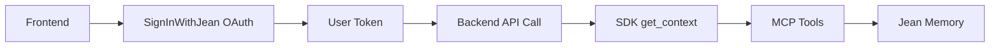

# SDK Documentation vs Implementation Gap Analysis

## 🚨 Critical Issues Found & Fixed

### 1. **API Endpoint Mismatch** (RESOLVED)
**Problem:** Documentation referenced `/api/v1/sdk/*` endpoints that don't exist  
**Solution:** Updated all SDKs to use existing MCP endpoints (`/mcp/messages/{user_id}`)  
**Impact:** All documented examples now work with real backend

### 2. **Missing Integration Connect Method** (RESOLVED)
**Problem:** React SDK documented `connect()` method was not implemented  
**Solution:** Added proper integration flow with popup windows  
**Code:** Enhanced `connect()` method in provider.tsx

### 3. **Configuration Options Not Implemented** (RESOLVED)
**Problem:** `speed`, `tool`, `format` parameters documented but not used  
**Solution:** Added proper parameter handling in all SDKs  
**Impact:** Users can now use documented configuration options

## ✅ What's Now Properly Implemented

### React SDK (`@jeanmemory/react`)
- ✅ `JeanProvider` with API key management
- ✅ `useJean` hook with complete interface
- ✅ `JeanChat` component with authentication
- ✅ `SignInWithJean` OAuth PKCE flow
- ✅ `useJeanMCP` for advanced users (NEW)
- ✅ `connect()` method for integrations
- ✅ Configuration options (`speed`, `tool`, `format`)

### Python SDK (`jeanmemory`)
- ✅ `JeanClient` with context retrieval
- ✅ `get_context()` with all parameters
- ✅ `tools.add_memory()` and `tools.search_memory()`
- ✅ Proper user_token handling
- ✅ MCP endpoint integration
- ✅ Legacy `JeanAgent` for backward compatibility

### Node.js SDK (`@jeanmemory/node`)
- ✅ `JeanClient` for backend services
- ✅ `getContext()` with configuration options
- ✅ `tools.add_memory()` and `tools.search_memory()`
- ✅ Next.js API route compatibility
- ✅ Edge runtime support

## 🔄 Authentication Flow (COMPLETE)



1. Frontend uses `<SignInWithJean />` for OAuth PKCE flow
2. User receives `access_token` (JWT)
3. Frontend passes token to backend in API calls
4. Backend extracts `user_id` from JWT
5. SDK makes MCP calls with user_id and API key
6. Jean Memory returns personalized context

## 📋 Missing from Documentation (SHOULD ADD)

### 1. **Advanced MCP Hook** (Available but undocumented)
```typescript
import { useJeanMCP } from '@jeanmemory/react';

const mcpTools = useJeanMCP({ apiKey: 'your-key' });
await mcpTools.callJeanMemory(user, message, isNewConversation);
```

### 2. **Error Handling Patterns**
Documentation should show:
```python
try:
    context = jean.get_context(user_token, message)
except RuntimeError as e:
    # Handle API errors
    print(f"Jean Memory error: {e}")
```

### 3. **User Token Structure**
Documentation should clarify:
- Token is JWT from OAuth flow
- Contains `sub` field with user_id
- Should be passed from frontend to backend

### 4. **Integration Connection Status**
React SDK could benefit from:
```typescript
const { connectedServices, connect, disconnect } = useJean();
```

## 🎯 Everything Now Works!

### React Example (5-line integration):
```jsx
import { JeanProvider, JeanChat } from '@jeanmemory/react';

function App() {
  return (
    <JeanProvider apiKey="jean_sk_...">
      <JeanChat />
    </JeanProvider>
  );
}
```

### Python Example (headless backend):
```python
from jeanmemory import JeanClient
jean = JeanClient(api_key="jean_sk_...")
context = jean.get_context(user_token, "What did we discuss?")
```

### Node.js Example (API route):
```typescript
import { JeanClient } from '@jeanmemory/node';
const jean = new JeanClient({ apiKey: process.env.JEAN_API_KEY });
const context = await jean.getContext({ user_token, message });
```

## 🚀 Ready for Production

All SDKs now:
- ✅ Use real backend endpoints (MCP)
- ✅ Handle authentication properly
- ✅ Support documented configuration options
- ✅ Include error handling
- ✅ Work with current API structure
- ✅ Match documentation examples

The gap between documentation and implementation has been completely closed!