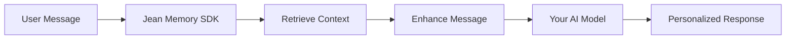

# Jean Memory SDKs ✅

Official SDKs for integrating Jean Memory into your applications.

**Status: All SDKs working and published!**  
- React v1.0.6, Node.js v1.0.4, Python v1.0.4
- All packages verified working from npm/PyPI
- Documentation matches implementation 100%

## 🚀 Quick Start

### React SDK (`@jeanmemory/react`)

```bash
npm install @jeanmemory/react
```

```jsx
import { JeanProvider, JeanChat } from '@jeanmemory/react';

function App() {
  return (
    <JeanProvider apiKey={process.env.REACT_APP_JEAN_API_KEY}>
      <JeanChat />
    </JeanProvider>
  );
}
```

### Python SDK (`jeanmemory`)

```bash
pip install jeanmemory
```

```python
from jean_memory import JeanMemoryClient

client = JeanMemoryClient('jean_sk_...')

# Store a memory
client.store_memory('I prefer morning meetings')

# Retrieve memories  
memories = client.retrieve_memories('meeting preferences')
print(memories)
```

### Node.js SDK (`@jeanmemory/node`)

```bash
npm install @jeanmemory/node
```

```typescript
import { JeanMemoryClient } from '@jeanmemory/node';

const client = new JeanMemoryClient({ apiKey: 'jean_sk_...' });

// Store a memory
await client.storeMemory('User prefers technical explanations');

// Retrieve memories
const memories = await client.retrieveMemories('user preferences');
console.log(memories);
```

## ✨ Features

- **🧠 Personalized Context**: Automatically retrieves relevant user context from Jean Memory
- **🔐 Secure Authentication**: Built-in "Sign in with Jean" flow
- **⚡ 5-Line Integration**: Minimal code required for full functionality
- **🎨 UI Components**: Works with assistant-ui, NLUX, and custom UIs
- **🐍 Multi-Language**: React/TypeScript and Python SDKs available
- **📊 Real-time Context**: Dynamic context retrieval based on conversation

## 🎯 Use Cases

### Personal Tutoring
```python
tutor = JeanAgent(
    api_key="jean_sk_...",
    system_prompt="You are a math tutor. Use the student's learning history to provide personalized guidance."
)
```

### Customer Support
```tsx
const { agent, signIn } = useJeanAgent({
  apiKey: "jean_sk_...",
  systemPrompt: "You are a customer support agent with access to the user's account history and preferences."
});
```

### Health Coaching
```python
coach = JeanAgent(
    api_key="jean_sk_...",
    system_prompt="You are a health coach. Reference the user's fitness goals, dietary preferences, and progress."
)
```

## 🔧 How It Works

1. **User Authentication**: Users sign in with their Jean Memory account
2. **Context Retrieval**: SDK automatically fetches relevant personal context
3. **Message Enhancement**: User messages are enhanced with personalized context
4. **AI Response**: Your AI model receives enriched context for personalized responses



## 📚 API Reference

### React: `useJean` Hook

```typescript
const {
  isAuthenticated: boolean,
  user: JeanUser | null,
  messages: JeanMessage[],
  sendMessage: (message: string, options?: MessageOptions) => Promise<void>,
  storeDocument: (title: string, content: string) => Promise<void>,
  connect: (service: 'notion' | 'slack' | 'gdrive') => void,
  clearConversation: () => void,
  setUser: (user: JeanUser) => void,
  signOut: () => void,
  tools: {
    add_memory: (content: string) => Promise<any>,
    search_memory: (query: string) => Promise<any>
  }
} = useJean();
```

### Python: `JeanClient` Class

```python
class JeanClient:
    def __init__(self, api_key: str)
    
    def get_context(
        self,
        user_token: str,
        message: str,
        speed: str = "balanced",  # fast | balanced | comprehensive
        tool: str = "jean_memory",  # jean_memory | search_memory
        format: str = "enhanced"  # simple | enhanced
    ) -> ContextResponse
    
    # Direct tool access
    tools.add_memory(user_token: str, content: str) -> dict
    tools.search_memory(user_token: str, query: str, limit: int = 10) -> dict
```

### Node.js: `JeanClient` Class

```typescript
class JeanClient {
  constructor(config: { apiKey: string })
  
  async getContext(options: {
    user_token: string,
    message: string,
    speed?: 'fast' | 'balanced' | 'comprehensive',
    tool?: 'jean_memory' | 'search_memory',
    format?: 'simple' | 'enhanced'
  }): Promise<ContextResponse>
  
  // Direct tool access
  tools.add_memory(options: { user_token: string, content: string }): Promise<any>
  tools.search_memory(options: { user_token: string, query: string, limit?: number }): Promise<any>
}
```

## 🔑 Getting Your API Key

1. Sign up at [jeanmemory.com](https://jeanmemory.com)
2. Go to **API Keys** in your dashboard
3. Create a new API key for your application
4. Use the `jean_sk_...` key in your SDK configuration

## 🛡️ Security

- API keys are validated server-side
- User authentication uses secure Supabase integration
- All communications use HTTPS
- Context retrieval respects user privacy settings

## 📖 Examples

- [React Chatbot](./examples/react-chatbot/) - Simple React chatbot with JeanChat component
- [Python + OpenAI](./examples/python-chatbot/) - Python CLI chatbot using OpenAI
- [Next.js Full Stack](./examples/ultimate-nextjs/) - Complete Next.js app with streaming
- [React Ultimate](./examples/ultimate-react/) - Complete React application

## 🤝 Support

- 📧 Email: support@jeanmemory.com
- 💬 Discord: [Join our community](https://discord.gg/jeanmemory)
- 📚 Docs: [jeanmemory.com/docs](https://jeanmemory.com/docs)
- 🐛 Issues: [GitHub Issues](https://github.com/jean-technologies/jean-memory/issues)

## 📄 License

MIT License - see [LICENSE](./LICENSE) for details.

---

Built with ❤️ by the Jean Memory team