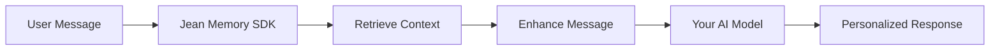

# Jean Memory SDK

Build personalized AI chatbots with **5 lines of code** using Jean Memory's context-aware AI platform.

## 🚀 Quick Start

### React/TypeScript

```bash
npm install @jeanmemory/react @assistant-ui/react
```

```tsx
import { useJeanAgent } from "@jeanmemory/react";
import { Thread, AssistantRuntimeProvider } from "@assistant-ui/react";

function MyApp() {
  const { agent, signIn } = useJeanAgent({
    apiKey: "jean_sk_your_api_key_here",
    systemPrompt: "You are a helpful tutor."
  });

  if (!agent) return <button onClick={signIn}>Sign in with Jean</button>;

  return (
    <AssistantRuntimeProvider runtime={agent.runtime}>
      <Thread />
    </AssistantRuntimeProvider>
  );
}
```

### Python

```bash
pip install jeanmemory
```

```python
from jeanmemory import JeanAgent

agent = JeanAgent(
    api_key="jean_sk_your_api_key_here", 
    system_prompt="You are a helpful tutor.",
    modality="chat"
)
agent.run()
```

## ✨ Features

- **🧠 Personalized Context**: Automatically retrieves relevant user context from Jean Memory
- **🔐 Secure Authentication**: Built-in "Sign in with Jean" flow
- **⚡ 5-Line Integration**: Minimal code required for full functionality
- **🎨 UI Components**: Works with assistant-ui, NLUX, and custom UIs
- **🐍 Multi-Language**: React/TypeScript and Python SDKs available
- **📊 Real-time Context**: Dynamic context retrieval based on conversation

## 🎯 Use Cases

### Personal Tutoring
```python
tutor = JeanAgent(
    api_key="jean_sk_...",
    system_prompt="You are a math tutor. Use the student's learning history to provide personalized guidance."
)
```

### Customer Support
```tsx
const { agent, signIn } = useJeanAgent({
  apiKey: "jean_sk_...",
  systemPrompt: "You are a customer support agent with access to the user's account history and preferences."
});
```

### Health Coaching
```python
coach = JeanAgent(
    api_key="jean_sk_...",
    system_prompt="You are a health coach. Reference the user's fitness goals, dietary preferences, and progress."
)
```

## 🔧 How It Works

1. **User Authentication**: Users sign in with their Jean Memory account
2. **Context Retrieval**: SDK automatically fetches relevant personal context
3. **Message Enhancement**: User messages are enhanced with personalized context
4. **AI Response**: Your AI model receives enriched context for personalized responses



## 📚 API Reference

### React Hook: `useJeanAgent`

```typescript
interface JeanAgentConfig {
  apiKey: string;
  systemPrompt?: string;
  clientName?: string;
}

const {
  agent,           // Assistant-UI compatible agent config
  user,            // Current authenticated user
  messages,        // Conversation history
  isLoading,       // Loading state
  error,           // Error state
  signIn,          // Authentication function
  signOut,         // Sign out function
  sendMessage      // Send message function
} = useJeanAgent(config);
```

### Python Class: `JeanAgent`

```python
class JeanAgent:
    def __init__(
        self,
        api_key: str,
        system_prompt: str = "You are a helpful assistant.",
        modality: str = "chat",
        client_name: str = "Python App"
    )
    
    def authenticate(self, email=None, password=None) -> bool
    def send_message(self, message: str) -> str
    def run(self, auto_auth=True)  # Start interactive chat
    def get_conversation_history(self) -> List[Dict]
    def clear_conversation(self)
```

## 🔑 Getting Your API Key

1. Sign up at [jeanmemory.com](https://jeanmemory.com)
2. Go to **API Keys** in your dashboard
3. Create a new API key for your application
4. Use the `jean_sk_...` key in your SDK configuration

## 🛡️ Security

- API keys are validated server-side
- User authentication uses secure Supabase integration
- All communications use HTTPS
- Context retrieval respects user privacy settings

## 📖 Examples

- [React Chatbot with Assistant-UI](./examples/react-chatbot/)
- [Python CLI Chatbot](./examples/python-chatbot/)
- [Next.js Integration](./examples/nextjs-app/)
- [FastAPI Backend](./examples/fastapi-backend/)

## 🤝 Support

- 📧 Email: support@jeanmemory.com
- 💬 Discord: [Join our community](https://discord.gg/jeanmemory)
- 📚 Docs: [jeanmemory.com/docs](https://jeanmemory.com/docs)
- 🐛 Issues: [GitHub Issues](https://github.com/jean-technologies/jean-memory/issues)

## 📄 License

MIT License - see [LICENSE](./LICENSE) for details.

---

Built with ❤️ by the Jean Memory team